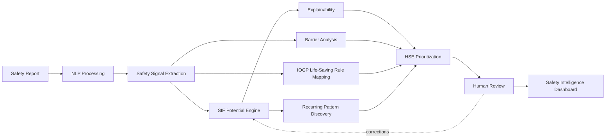

<div align="center">

# OIL Safety Intelligence Platform

**AI/NLP Engine to Detect Serious Injury & Fatality (SIF) Precursors in Unsafe-Act / Unsafe-Condition and Near-Miss Reports**

[](LICENSE)
[](docs/15_ROADMAP.md)
[](https://www.sih.gov.in/)
[](docs/03_PROBLEM_STATEMENT.md)
[](../../actions/workflows/docs-lint.yml)

*Built by **Team Tech Smashers** for Smart India Hackathon 2026*

</div>

---

## ⚠️ Disclaimer

This is a **hackathon prototype concept**, developed independently by Team Tech Smashers for Smart India Hackathon 2026 in response to problem statement **SIH26165**, issued by **Oil India Limited (OIL)**.

- This project is **not** an officially deployed, endorsed, or adopted system of Oil India Limited.
- This project claims **no access to OIL's confidential operational data**. All example reports, metrics, and figures in this repository are synthetic/illustrative unless explicitly cited to a public source — see [`docs/05_DATA_STRATEGY_AND_LABELING.md`](docs/05_DATA_STRATEGY_AND_LABELING.md) and [`docs/01_PROJECT_CONSTITUTION.md`](docs/01_PROJECT_CONSTITUTION.md) §16 (Claims & Evidence Policy).
- References to **IOGP's Life-Saving Rules** describe a publicly published industry safety standard; this project is not affiliated with, certified by, or endorsed by the International Association of Oil & Gas Producers (IOGP).
- "Oil India Limited" and "OIL" are used here solely to identify the hackathon problem statement's issuing organization, per nominative fair use — no trademark or affiliation is claimed. See [`NOTICE`](NOTICE).

## 1. What Is This?

Oil & gas field operations generate a large volume of free-text safety reports — **Unsafe Acts (UA)**, **Unsafe Conditions (UC)**, and **Near-Misses** — that are typically reviewed manually on a periodic (monthly/quarterly) basis. Safety research shows that non-fatal incidents and fatal incidents often share *different* root causes, meaning severity-based review alone can miss the small share of reports that carry genuine **Serious Injury & Fatality (SIF)** potential.

The **OIL Safety Intelligence Platform** is a prototype AI/NLP system that:

1. **Classifies** each free-text report as SIF-potential or not (`YES` / `NO` / `REVIEW`).
2. **Explains** every classification with evidence traceable to the exact source text.
3. **Identifies** which safety barriers/controls were present, missing, incomplete, failed, bypassed, or unknown.
4. **Maps** each report to the relevant IOGP Life-Saving Rule(s).
5. **Discovers** recurring precursor patterns across many reports (by site, activity, hazard, barrier failure).
6. **Prioritizes** HSE attention using a concentration-based ranking, not raw counts.
7. Keeps an **authorized human reviewer** as the final safety authority at every step.

> The system does **not** predict future fatalities. It assesses whether an *existing* report contains SIF-potential indicators, and helps HSE understand what happened, why it matters, and where to look next. See [`docs/01_PROJECT_CONSTITUTION.md`](docs/01_PROJECT_CONSTITUTION.md) §9.

## 2. Project Status

This repository currently contains the **complete product & technical documentation set** (documentation-first development approach). Implementation follows the phased plan in [`docs/15_ROADMAP.md`](docs/15_ROADMAP.md).

| Phase | Scope | Status |
|---|---|---|
| Documentation (`01`–`16`) | Constitution, product blueprint, research, requirements, architecture, security, testing, roadmap | ✅ Complete, internally consistency-audited |
| H0 — Hackathon Prototype | Vertical slice: ingestion → NLP → SIF engine → barrier analysis → LSR mapping → pattern discovery → dashboard → human review | 🔜 Not yet started — see [`docs/15_ROADMAP.md`](docs/15_ROADMAP.md) |
| Production | OIL-authorized data, enterprise integration, hardened deployment | ⛔ Out of scope for this repository |

All 17 documents in [`/docs`](docs) have passed an internal cross-document consistency audit — see [`docs/16_DOCUMENT_CONSISTENCY_AUDIT.md`](docs/16_DOCUMENT_CONSISTENCY_AUDIT.md) for the full, evidence-verified findings and fixes.

## 3. Documentation Map

`01_PROJECT_CONSTITUTION.md` is the **single governing source of truth** for this project. Every other document must remain consistent with it; any conflict is a bug.

| # | Document | Purpose |
|---|---|---|
| 01 | [PROJECT_CONSTITUTION](docs/01_PROJECT_CONSTITUTION.md) | Governing principles, non-negotiables, claims/evidence policy, canonical data taxonomies |
| 02 | [PRODUCT_BLUEPRINT](docs/02_PRODUCT_BLUEPRINT.md) | Product overview, personas, JTBD, modules, MVP definition |
| 03 | [PROBLEM_STATEMENT](docs/03_PROBLEM_STATEMENT.md) | SIH26165 problem breakdown |
| 04 | [MARKET_RESEARCH](docs/04_MARKET_RESEARCH.md) | Landscape, adjacent solutions, differentiation basis |
| 05 | [DATA_STRATEGY_AND_LABELING](docs/05_DATA_STRATEGY_AND_LABELING.md) | Data categories, synthetic/prototype data policy, labeling approach |
| 06 | [TECHNICAL_REQUIREMENTS](docs/06_TECHNICAL_REQUIREMENTS.md) | Authoritative requirement ID register (FR/AI/UX/HIL/DATA/SEC/NFR/OBS) |
| 07 | [SYSTEM_ARCHITECTURE](docs/07_SYSTEM_ARCHITECTURE.md) | Component architecture, prototype vs. production topology |
| 08 | [AI_ARCHITECTURE](docs/08_AI_ARCHITECTURE.md) | NLP/ML pipeline design, SIF engine, edge-case handling |
| 09 | [DATABASE_DESIGN](docs/09_DATABASE_DESIGN.md) | Schema, enums, relationships |
| 10 | [API_SPECIFICATION](docs/10_API_SPECIFICATION.md) | REST contracts, request/response schemas |
| 11 | [SECURITY_ARCHITECTURE](docs/11_SECURITY_ARCHITECTURE.md) | RBAC, PII handling, audit trail, threat model |
| 12 | [UI_UX_DESIGN](docs/12_UI_UX_DESIGN.md) | Screens, components, design tokens |
| 13 | [DEPLOYMENT](docs/13_DEPLOYMENT.md) | Environments, containers, CI/CD |
| 14 | [TESTING_STRATEGY](docs/14_TESTING_STRATEGY.md) | Test types, coverage, AI evaluation methodology |
| 15 | [ROADMAP](docs/15_ROADMAP.md) | Phased delivery plan (H0 → production) |
| 16 | [DOCUMENT_CONSISTENCY_AUDIT](docs/16_DOCUMENT_CONSISTENCY_AUDIT.md) | Evidence-verified cross-document audit & fix log |
| — | [ARCHITECTURE_DIAGRAMS_MERMAID](docs/ARCHITECTURE_DIAGRAMS_MERMAID.md) | Consolidated Mermaid diagrams referenced across the docs above |

## 4. High-Level Architecture



Full diagrams: [`docs/ARCHITECTURE_DIAGRAMS_MERMAID.md`](docs/ARCHITECTURE_DIAGRAMS_MERMAID.md).

## 5. Repository Structure

```
oil-safety-intelligence-platform/
├── docs/                    # Full documentation set (01–16 + diagrams) — READ 01 FIRST
├── backend/                 # Placeholder — API/services (not yet implemented, see docs/15_ROADMAP.md)
├── frontend/                # Placeholder — dashboard UI (not yet implemented)
├── ml/                      # Placeholder — NLP/SIF/barrier/LSR/pattern models (not yet implemented)
├── .github/                 # Issue/PR templates, CODEOWNERS, CI workflows
├── LICENSE                  # Apache License 2.0
├── NOTICE                   # Third-party names/trademark attribution
├── CONTRIBUTING.md          # How to contribute (docs and code)
├── CODE_OF_CONDUCT.md       # Contributor Covenant v2.1
├── SECURITY.md              # Responsible disclosure policy
└── CHANGELOG.md             # Keep a Changelog format
```

`backend/`, `frontend/`, and `ml/` are currently placeholders (see the `.gitkeep`/`README.md` stub inside each) — this repository is documentation-first by design; implementation has not started yet.

## 6. Tech Stack (Planned)

The specific stack is defined in [`docs/07_SYSTEM_ARCHITECTURE.md`](docs/07_SYSTEM_ARCHITECTURE.md) and [`docs/08_AI_ARCHITECTURE.md`](docs/08_AI_ARCHITECTURE.md). No code has been written yet — this section will be updated once implementation begins.

## 7. Getting Started (Documentation)

```bash
git clone https://github.com/shlok926/oil-safety-intelligence-platform.git
cd oil-safety-intelligence-platform
```

Start with [`docs/01_PROJECT_CONSTITUTION.md`](docs/01_PROJECT_CONSTITUTION.md), then [`docs/02_PRODUCT_BLUEPRINT.md`](docs/02_PRODUCT_BLUEPRINT.md), then whichever numbered document matches what you're working on. See [CONTRIBUTING.md](CONTRIBUTING.md) before proposing changes to any document.

## 8. Contributing

Contributions — especially implementation of the H0 prototype per [`docs/15_ROADMAP.md`](docs/15_ROADMAP.md) — are welcome. Please read [CONTRIBUTING.md](CONTRIBUTING.md) and [CODE_OF_CONDUCT.md](CODE_OF_CONDUCT.md) first. All documentation changes must remain consistent with `01_PROJECT_CONSTITUTION.md`; PRs that introduce a contradiction will be asked to update `01` first (see [CONTRIBUTING.md § Documentation Changes](CONTRIBUTING.md#documentation-changes)).

## 9. Security

Please see [SECURITY.md](SECURITY.md) for how to report a security concern. Do not open a public issue for security vulnerabilities.

## 10. License

Licensed under the [Apache License 2.0](LICENSE). See [NOTICE](NOTICE) for third-party name attributions (Oil India Limited, IOGP).

## 11. Team

**Tech Smashers** — Shlok, Tanisha, Krishna Panchal, Yogeshwari, Krishna Ayanele, Rushikesh
Smart India Hackathon 2026 · Problem Statement SIH26165 · Category: Software · Theme: Smart Automation
