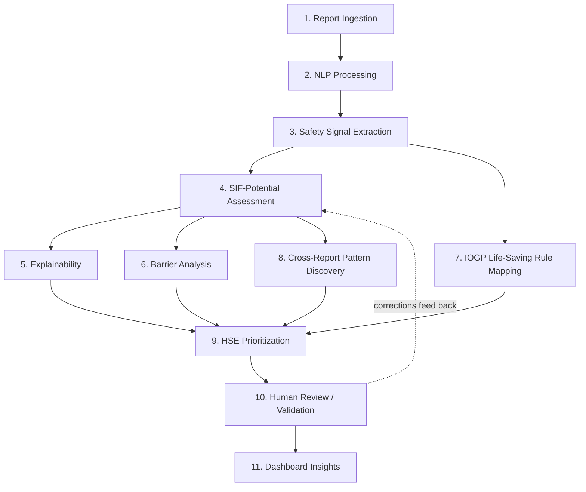

> **Governing-document note (not part of the blueprint itself):** This document was requested to be built on top of `01_PROJECT_CONSTITUTION.md`. That file was not available at the time of writing. This blueprint has instead been built strictly consistent with the explicit rules given in the authoring prompt (no invented OIL data/statistics/workflows/infrastructure, mandatory tagging discipline, human-in-the-loop as non-negotiable, SIF-potential kept separate from fatality prediction, individual-report analysis kept separate from cross-report pattern discovery) and with the team's existing `TechSmashers_SIH26165_Master_Guide.docx`. If a real Constitution file exists, this blueprint should be reconciled against it before being treated as final.

> **Tagging legend used throughout this document:**
> `[OFFICIAL REQUIREMENT]` — stated directly in the SIH26165 problem statement.
> `[PRODUCT DECISION]` — Tech Smashers' own design choice, not mandated by the PS.
> `[PROTOTYPE ASSUMPTION]` — an assumption made specifically to make a hackathon prototype buildable.
> `[FUTURE ENHANCEMENT]` — explicitly out of MVP scope, described for roadmap completeness only.
> `[ILLUSTRATIVE EXAMPLE]` — a representative/synthetic example, never real OIL data.

---

# 02_PRODUCT_BLUEPRINT.md

## 1. Product Overview

| Field | Value |
|---|---|
| **Product name** | OIL Safety Intelligence Platform |
| **Product type** | AI/NLP-powered decision-support platform for industrial HSE (Health, Safety & Environment) teams |
| **Target organization/context** | Designed around the operational context of Oil India Limited (OIL), an oil & gas producer — built as an SIH26165 hackathon prototype, **not** a deployed OIL system `[PROTOTYPE ASSUMPTION]` |
| **One-line description** | An AI-powered safety intelligence platform that converts free-text safety reports into explainable SIF-potential insights, barrier intelligence, Life-Saving Rule mappings, recurring precursor patterns, and HSE priorities. |
| **Product mission** | Help HSE teams find and understand the safety reports that matter most — before a serious injury or fatality occurs — by making hidden risk signals in free text visible, explainable, and actionable. |
| **Product vision** | A future where no organization has to wait for a monthly or quarterly review cycle to discover that a fatal-potential pattern has been quietly recurring across its sites. |
| **Core value proposition** | Turns thousands of unstructured, unevenly-reviewed safety narratives into a small, ranked, evidence-backed set of things HSE should look at first — without replacing HSE judgment. |

**Product statement:**

> "An AI-powered safety intelligence platform that converts free-text safety reports into explainable SIF-potential insights, barrier intelligence, Life-Saving Rule mappings, recurring precursor patterns and HSE priorities."

This document describes a **prototype product concept built for Smart India Hackathon 2026**. It does not claim, imply, or represent official deployment, adoption, evaluation, or endorsement by Oil India Limited. `[PROTOTYPE ASSUMPTION]`

---

## 2. Product Problem → Product Response

| Existing Challenge | Product Response |
|---|---|
| Large volume of free-text reports, reviewed only periodically (monthly/quarterly) | Automated NLP processing that analyzes every report as it becomes available |
| Important safety signals buried inside narrative prose | Safety Signal Extraction that pulls out activity, hazard, exposure, and control information |
| Hidden SIF (Serious Injury & Fatality) potential not visible from stated severity alone | A dedicated SIF Potential Engine that reasons about potential consequence, not just recorded outcome |
| Difficult-to-trust, black-box AI decisions | Explainable evidence shown alongside every classification, traceable to the source text |
| Unknown or missed safety-control/barrier failures | Barrier Analysis that identifies which controls were present, missing, incomplete, failed, or bypassed |
| Difficult, inconsistent mapping of situations to industry safety rules | IOGP Life-Saving Rule mapping, grounded in extracted evidence rather than simple keyword matching |
| Recurring systemic problems difficult to identify across many separate reports | Cross-report Pattern Discovery that surfaces repeating activity + location + barrier-failure combinations |
| Difficult to know where to focus limited HSE attention | An HSE Prioritization Dashboard that ranks sites/activities and highlights recurring precursor hotspots |

---

## 3. Target Users & Personas

Personas below are **generic, realistic HSE role archetypes**, not actual OIL job titles or internal org-chart positions. `[PRODUCT DECISION]`

### HSE Professional / Safety Analyst
**Goals:**
- Identify which reports, among many, carry real SIF potential.
- Understand *why* a report was flagged, using evidence from the actual text.
- Investigate which safety barriers/controls failed, were missing, or were bypassed.
- Identify recurring precursor patterns across multiple reports.
- Prioritize which situations need follow-up first.

### HSE Manager / Decision Maker
**Goals:**
- See which sites and activities carry the highest concentration of SIF-potential risk.
- Understand whether risk is trending up, down, or staying flat.
- Identify recurring precursor "hotspots" that indicate a systemic — not one-off — problem.
- Decide where to allocate limited intervention resources (training, audits, procedure reviews).

### Safety Report Reviewer
**Goals:**
- Review AI-generated SIF classifications, barrier findings, and Life-Saving Rule mappings.
- Verify or correct AI findings against the original report text.
- Inspect the evidence behind a flag before agreeing or disagreeing with it.
- Provide human validation that feeds back into improving the system over time.

No additional persona is introduced, since these three roles cover the full loop the product supports: *analysis → prioritization → validation*.

---

## 4. Product Jobs-to-be-Done

1. "When I receive a large number of safety reports, I want the system to surface reports with potential SIF significance so that I can review the most important ones first."
2. "When I see a high SIF-potential report, I want to know the evidence behind the flag so that I can trust and verify the result."
3. "When a report describes a near-miss with no actual injury, I want the system to still assess its fatal potential so that low-injury-but-high-risk situations are not overlooked."
4. "When I review a flagged report, I want to see which specific safety barriers were missing, incomplete, failed, or bypassed so that I know exactly what needs to be fixed."
5. "When a situation matches a known industry risk category, I want the system to map it to the relevant IOGP Life-Saving Rule so that I can connect it to existing training and procedures."
6. "When several reports contain similar issues, I want to identify recurring precursor patterns so that I can investigate systemic problems rather than treating each report in isolation."
7. "When I'm deciding where to focus HSE attention, I want sites and activities ranked by concentration of SIF-potential risk, not just raw report counts, so that I prioritize correctly."
8. "When the AI's classification seems wrong, I want to be able to correct it and record my reasoning so that the system reflects expert judgment over time."
9. "When I'm investigating a specific site, I want to filter and search reports by hazard, activity, barrier failure, and Life-Saving Rule so that I can build a focused investigation view."
10. "When I open the dashboard, I want an at-a-glance overview of report volume, SIF-potential distribution, and top recurring patterns so that I don't have to read every individual report to understand our current risk picture."

---

## 5. End-to-End Product Journey



### Stage-by-stage detail

**1. Report Ingestion**
- *Enters:* A raw free-text safety report (UA / UC / near-miss), submitted or uploaded/pasted for the prototype.
- *Product does:* Accepts and stores the report, preparing it for analysis.
- *Output:* A report record available to the pipeline.
- *Why it matters:* Nothing downstream can run without a dependable entry point.

**2. NLP Processing**
- *Enters:* Raw report text.
- *Product does:* Cleans, normalizes, and structurally parses the narrative.
- *Output:* A processed text representation ready for signal extraction.
- *Why it matters:* Free text is inconsistent (abbreviations, typos, varied phrasing); this stage makes it analyzable.

**3. Safety Signal Extraction**
- *Enters:* Processed text.
- *Product does:* Identifies activity, hazard, exposure, equipment, location, and control-mention information from the narrative.
- *Output:* A structured set of safety signals.
- *Why it matters:* This is the foundation for every downstream judgment — classification, barrier findings, and rule mapping are all built from these signals, not from the raw text directly.

**4. SIF-Potential Assessment**
- *Enters:* Structured safety signals.
- *Product does:* Assesses whether the report contains Serious Injury & Fatality potential.
- *Output:* SIF Potential result (see Section 9).
- *Why it matters:* This is the product's core analytical judgment — the reason the platform exists.

**5. Explainability**
- *Enters:* Signals + SIF-potential result.
- *Product does:* Assembles evidence, drawn from the original text, that supports the classification.
- *Output:* A human-readable evidence list tied to specific report phrases.
- *Why it matters:* An unsupported classification cannot be trusted or acted on by HSE.

**6. Barrier Analysis**
- *Enters:* Signals + control-mention information.
- *Product does:* Determines the status of each relevant safety control (present, missing, incomplete, failed, bypassed, unknown).
- *Output:* Structured barrier findings.
- *Why it matters:* This is the concrete, fixable operational detail HSE acts on.

**7. IOGP Life-Saving Rule Mapping**
- *Enters:* Hazard, activity, and barrier signals.
- *Product does:* Maps the situation, using contextual evidence, to the relevant IOGP Life-Saving Rule(s).
- *Output:* One or more mapped Life-Saving Rules with supporting evidence.
- *Why it matters:* Connects AI output to a standardized safety vocabulary HSE already understands and trains against.

**8. Cross-Report Pattern Discovery**
- *Enters:* Structured records accumulated across many analyzed reports.
- *Product does:* Aggregates and analyzes recurring combinations of activity, location, hazard, and barrier failure.
- *Output:* A ranked list of recurring precursor patterns.
- *Why it matters:* Individually unremarkable reports can reveal a systemic problem when viewed together — this is the organizational-intelligence layer.

**9. HSE Prioritization**
- *Enters:* SIF-potential results, barrier findings, LSR mappings, and recurring patterns.
- *Product does:* Ranks sites, activities, and patterns by concentration of risk.
- *Output:* A prioritized attention list.
- *Why it matters:* Turns analysis into a starting point for action, not just information.

**10. Human Review / Validation**
- *Enters:* AI-generated classifications, evidence, and prioritization.
- *Product does:* Presents findings to an authorized reviewer for confirmation, correction, or rejection.
- *Output:* A reviewed/validated result, plus feedback captured for future improvement.
- *Why it matters:* Final safety judgment remains with authorized HSE personnel — this is a non-negotiable product principle, not merely a feature. `[PRODUCT DECISION]`

**11. Dashboard Insights**
- *Enters:* All of the above, continuously updated.
- *Product does:* Presents the full picture — overview, rankings, patterns, and drill-downs — in one interface.
- *Output:* An actionable, browsable safety-intelligence view.
- *Why it matters:* This is where the product's value is actually consumed day-to-day.

---

## 6. Product Modules

### Module 1 — Safety Report Intake
- **Objective:** Accept safety reports and make them available for analysis.
- **Input:** Raw free-text UA/UC/near-miss reports (uploaded, pasted, or batch-imported for the prototype).
- **Processing/responsibility:** Basic validation (required fields present), storage, and queuing for analysis.
- **Output:** A stored, analyzable report record.
- **User value:** A single, reliable entry point for all report data.
- **Dependencies:** None (entry point of the pipeline).

### Module 2 — NLP Analysis
- **Objective:** Understand free-text narrative and contextual information.
- **Input:** Raw report text from Module 1.
- **Processing/responsibility:** Cleaning, normalization, and language-level structural processing of the narrative.
- **Output:** A processed text representation.
- **User value:** Makes inconsistent, informal field-written text usable for downstream analysis.
- **Dependencies:** Module 1.

### Module 3 — Safety Signal Extraction
- **Objective:** Convert narrative information into structured safety signals.
- **Input:** Processed text from Module 2.
- **Processing/responsibility:** Identify activity, hazard, exposure, equipment, location, and control-mention entities and their relationships (including negation, e.g. "testing **not** completed").
- **Output:** A structured signal set per report.
- **User value:** Provides the transparent, inspectable foundation all later modules build on.
- **Dependencies:** Module 2.

### Module 4 — SIF Potential Engine
- **Objective:** Assess whether the report contains SIF potential.
- **Input:** Structured safety signals from Module 3.
- **Processing/responsibility:** Combine signals into a SIF-potential judgment (see Section 9 for full behavior definition).
- **Output:** SIF Potential result, priority/risk level, evidence pointers, contributing signals.
- **User value:** Answers the platform's central question — "does this report carry real fatal potential?"
- **Dependencies:** Module 3.

### Module 5 — Explainability
- **Objective:** Show evidence and reasoning behind the SIF flag.
- **Input:** SIF-potential result and contributing signals from Module 4.
- **Processing/responsibility:** Assemble a human-readable, text-traceable evidence list.
- **Output:** Evidence panel content (see Section 10).
- **User value:** Builds trust; enables fast human verification.
- **Dependencies:** Module 4.

### Module 6 — Barrier Analysis
- **Objective:** Identify relevant safety controls/barriers and their status.
- **Input:** Control-mention signals from Module 3.
- **Processing/responsibility:** Classify each relevant control as present/verified, missing, incomplete, failed, bypassed, or unknown (see Section 11).
- **Output:** Structured barrier findings.
- **User value:** Converts abstract risk into concrete, fixable operational detail.
- **Dependencies:** Module 3.

### Module 7 — IOGP Life-Saving Rule Mapping
- **Objective:** Map safety situations to relevant Life-Saving Rules.
- **Input:** Hazard, activity, and barrier signals from Modules 3 and 6.
- **Processing/responsibility:** Contextual, evidence-based mapping to one or more of IOGP's Life-Saving Rules.
- **Output:** Mapped Life-Saving Rule(s) with supporting evidence.
- **User value:** Connects AI output to an industry-standard safety vocabulary HSE already trains and organizes around.
- **Dependencies:** Modules 3 and 6.

### Module 8 — Pattern Discovery
- **Objective:** Identify recurring precursor patterns across multiple reports.
- **Input:** Structured records accumulated across many analyzed reports (Modules 4, 6, 7).
- **Processing/responsibility:** Aggregate and analyze recurring activity + location + hazard + barrier-failure combinations.
- **Output:** A ranked list of recurring precursor patterns.
- **User value:** Surfaces systemic issues invisible at the single-report level.
- **Dependencies:** Modules 4, 6, 7 — and requires **multiple** analyzed reports (see Section 29).

### Module 9 — HSE Prioritization
- **Objective:** Rank attention/intervention priorities based on structured safety intelligence.
- **Input:** Outputs of Modules 4, 6, 7, 8.
- **Processing/responsibility:** Rank sites, activities, and patterns by concentration of SIF-potential risk.
- **Output:** A prioritized attention list.
- **User value:** Tells HSE where to look first, not just what exists.
- **Dependencies:** Modules 4, 6, 7, 8.

### Module 10 — Safety Intelligence Dashboard
- **Objective:** Present actionable insights.
- **Input:** Outputs of all preceding modules.
- **Processing/responsibility:** Visual presentation — overview, rankings, pattern explorer, drill-downs (see Section 15).
- **Output:** The interactive dashboard experience.
- **User value:** The primary interface through which the product's value is consumed.
- **Dependencies:** Modules 1–9.

### Module 11 — Human Review
- **Objective:** Allow authorized reviewers to validate or correct AI-generated findings.
- **Input:** Any AI-generated classification, barrier finding, LSR mapping, or pattern.
- **Processing/responsibility:** Present findings for confirm/correct/reject action; capture feedback (see Section 16).
- **Output:** Reviewed/validated results; structured feedback records.
- **User value:** Keeps authorized HSE personnel as the final safety authority; improves the system over time.
- **Dependencies:** Interacts with Modules 4, 6, 7, 8 outputs; feeds back into Module 4's future behavior conceptually (not a real-time retraining loop at prototype stage — see Section 19).

---

## 7. Core Product Objects / Concepts

| Concept | What It Means | Why It Exists | Relationship to Other Concepts |
|---|---|---|---|
| **Safety Report** | The raw submission — a UA, UC, near-miss, or incident report, as originally written | The unit of input the whole product operates on | Contains one Safety Narrative; produces one SIF Potential Assessment |
| **Safety Narrative** | The free-text description within a Safety Report | The raw material NLP/Signal Extraction works on | Source of all Safety Signals |
| **Safety Signal** | A discrete, extracted piece of meaning from the narrative (an activity, a hazard, an exposure statement, a control mention) | The structured, inspectable building block that all higher-level judgments are built from | Composed from the Safety Narrative; consumed by SIF Potential Assessment, Barrier Analysis, and LSR Mapping |
| **Hazard** | A source of potential harm identified in the report | Central input to both SIF assessment and LSR mapping | A type of Safety Signal |
| **Activity** | The task being performed when the observation was made | Drives both LSR mapping and pattern dimensions | A type of Safety Signal |
| **Worker Exposure** | Whether/how a person was positioned relative to a hazard | Converts a theoretical hazard into person-specific risk | A type of Safety Signal, closely tied to Hazard |
| **Safety Control** | A planned measure meant to prevent or reduce harm from a hazard | The general category of thing Barrier Analysis evaluates | Related to, and often used interchangeably with, Barrier |
| **Barrier** | A specific safeguard between a hazard and a person | The unit Barrier Analysis produces a status for | Produces a Barrier Status |
| **Barrier Status** | The evaluated state of a Barrier: present/verified, missing, incomplete, failed, bypassed, or unknown | The concrete, actionable finding HSE needs | Produced by Barrier Analysis from Safety Signals |
| **SIF Potential Assessment** | The product's judgment of whether a report carries Serious Injury & Fatality potential | The platform's central analytical output | Built from Safety Signals; supported by Evidence; informs Priority |
| **Evidence** | The specific, text-traceable support for a classification or finding | What makes a result trustworthy and auditable | Attached to SIF Potential Assessment, Barrier Status, and Life-Saving Rule Mapping |
| **Life-Saving Rule Mapping** | The association of a report's situation with one or more of IOGP's Life-Saving Rules | Connects AI output to an industry-standard safety vocabulary | Built from Hazard, Activity, and Barrier signals |
| **Recurring Pattern** | A repeating combination of activity, location, hazard, and/or barrier failure observed across multiple reports | Surfaces systemic (not one-off) risk | Built by aggregating many SIF Potential Assessments and Barrier Statuses |
| **Priority** | A ranking of sites, activities, or patterns by concentration of SIF-potential risk | Turns intelligence into an actionable starting point | Derived from SIF Potential Assessments and Recurring Patterns |
| **HSE Review** | The human validation act applied to any AI-generated finding | Keeps final safety judgment with authorized personnel | Applies to SIF Potential Assessment, Barrier Status, and Life-Saving Rule Mapping |

---

## 8. Safety Report Analysis Experience

Expected experience when a user opens/submits a report:

```
User opens or submits a report
        ↓
System processes the narrative (NLP)
        ↓
Extracted safety signals appear (activity, hazard, exposure, controls mentioned)
        ↓
SIF Potential result appears (YES / NO / REVIEW, with priority/risk level)
        ↓
Evidence is highlighted, linked back to specific phrases in the original text
        ↓
Barrier/control findings appear (status per identified control)
        ↓
Relevant IOGP Life-Saving Rule(s) appear, with supporting evidence
        ↓
User can inspect the full reasoning chain (signal → evidence → classification)
        ↓
User can confirm, correct, or reject the result (Human Review)
```

**Expected UX behaviors:**
- The original report text remains visible alongside every derived result — nothing is presented as a bare score disconnected from the source.
- Evidence phrases are visually connected to the specific part of the narrative they came from (e.g. highlighting or inline reference).
- A user should never have to re-read the entire report to understand *why* a classification was made — the evidence panel answers that directly.
- Barrier findings and LSR mapping are shown as first-class results alongside the SIF classification, not buried in a secondary tab.
- Review actions (confirm/correct/reject) are available directly from this same view, without navigating away.

---

## 9. SIF Potential Product Behavior

This is the most important behavioral definition in the product.

### Input
Structured safety signals produced by Module 3 (activity, hazard, exposure, control mentions, barrier-status indicators).

### Assessment
The engine determines whether the report contains SIF (Serious Injury & Fatality) potential — i.e., whether the situation described has a credible pathway to serious injury or death, regardless of what actually happened.

### Output (at minimum)
| Field | Description |
|---|---|
| **SIF Potential** | YES / NO / REVIEW — REVIEW indicates the assessment is uncertain enough to require human judgment before being treated as settled |
| **Priority / Risk Level** | A relative indication of how urgently this report should be looked at |
| **Confidence / Uncertainty** | Where the underlying method can express it, an indication of how confident the assessment is |
| **Evidence** | The specific signals/phrases supporting the assessment |
| **Contributing Signals** | The structured signal set that fed into the assessment |

### Governing behavioral principles `[PRODUCT DECISION]`

- **Actual injury is not equivalent to SIF potential.** A report describing a real but minor injury (e.g., a small cut) does not automatically imply high SIF potential, and a report describing zero injury does not automatically imply low SIF potential.
- **A near-miss can have high SIF potential.** The absence of harm may simply mean the situation was intercepted, not that it was safe.
- **Absence of injury does not automatically mean low SIF potential.** The engine must reason about the hazard, exposure, and barrier-failure structure of the situation — not just whether harm was recorded.
- **The engine must consider contextual evidence**, not isolated keywords — the same term (e.g., "confined space") can describe a well-controlled or a poorly-controlled situation, and the assessment must reflect that difference.
- **The result is decision support, not autonomous safety authority.** SIF Potential = YES/NO/REVIEW is an input to human judgment, never a final safety determination on its own.

This document intentionally does **not** define a scoring formula, weighting scheme, or specific model architecture for this assessment — those belong in later technical/AI architecture documents.

---

## 10. Explainability Experience

Every SIF-flagged report must show, at minimum, the following structure: `[PRODUCT DECISION]`

```
SIF Potential: HIGH

Why flagged:
- Worker exposed to confined-space hazard
- Atmospheric testing incomplete
- Standby attendant absent

Evidence:
[Relevant phrases from the original report, shown verbatim / highlighted in context]

Barrier findings:
- Atmospheric verification → incomplete
- Standby/rescue control → absent

Relevant Life-Saving Rule:
Confined Space
```

**Non-negotiable rule:** every explanation must be connected to actual evidence present in the source report text. The product must **not** display a generic, evidence-free AI-generated explanation — if the system cannot point to specific supporting text, it should not present a confident narrative justification. `[PRODUCT DECISION]`

---

## 11. Barrier Intelligence

### Possible barrier statuses

| Status | Meaning |
|---|---|
| **Present / Verified** | The control is mentioned **and** the report indicates it was actually carried out/confirmed |
| **Missing** | The control was never mentioned as having been provided or performed |
| **Incomplete** | The control was mentioned as started or partially applied, but not finished/confirmed |
| **Failed** | The control was in place but did not function as intended |
| **Bypassed** | The control existed but was deliberately overridden or ignored |
| **Unknown** | The report does not provide enough information to determine the control's status |

### Critical distinction the product must maintain `[PRODUCT DECISION]`

The product treats these as **four different things**, not as one:
1. A control being **mentioned** in the text.
2. A control **actually being performed**, per the narrative.
3. A control being **verified/confirmed**, per the narrative.
4. A control being **missing or failed**.

**The product must not assume that merely mentioning a control means the control was effective.** A report that says "gas testing was discussed" is not the same as a report that says "gas testing was completed and verified." This distinction is what prevents the barrier-analysis layer from collapsing into simple keyword detection.

---

## 12. IOGP Life-Saving Rule Experience

For any mapped Life-Saving Rule, the user should be able to see:
- **The relevant rule** (e.g., Confined Space, Energy Isolation, Hot Work, Line of Fire, Safe Mechanical Lifting, Working at Height, Driving, Work Authorization, Bypassing Safety Controls).
- **Why it was mapped** — a plain-language explanation connecting the report's hazard/activity/barrier signals to that specific rule.
- **Associated safety evidence** — the specific phrases that justify the mapping.

The mapping must be **contextual and evidence-based**, not simple keyword matching — the same reasoning discipline used for SIF classification and barrier analysis applies here. `[PRODUCT DECISION]`

### Explicit non-claims `[PRODUCT DECISION]`

The product must **not** claim, imply, or represent:
- Official IOGP certification or endorsement of the mapping logic.
- Official OIL implementation or adoption of this mapping.
- An official compliance determination (i.e., the product does not declare that OIL has or has not complied with a Life-Saving Rule — it surfaces relevant evidence for human interpretation).

---

## 13. Pattern Discovery Experience

The product maintains a strict conceptual separation between two levels of intelligence:

### Individual Report Intelligence
**Question:** *"Why is this particular report potentially serious?"*
Answered by Modules 4–7 (SIF assessment, explainability, barrier analysis, LSR mapping) operating on a single report.

### Cross-Report Intelligence
**Question:** *"What is repeatedly going wrong across reports?"*
Answered by Module 8 (Pattern Discovery), which requires multiple analyzed reports and looks for recurring combinations along dimensions such as:
- Activity
- Location / site
- Hazard
- Barrier failure type
- Precursor type (combination of the above)
- Time / trend, where sufficient data supports it

**Example pattern:** `[ILLUSTRATIVE EXAMPLE]`
> Pattern: "Confined-space maintenance with incomplete atmospheric verification."
> Dashboard insight: "Repeated barrier failure detected across multiple reports."

### Important behavioral constraint `[PRODUCT DECISION]`

**Frequency alone must not be equated with severity or risk.** A pattern that recurs often but involves low-severity signals is a different kind of finding than a pattern that recurs rarely but involves high-severity signals every time. The product must present both dimensions (how often, how severe) rather than collapsing them into a single number.

---

## 14. HSE Prioritization Experience

### What prioritization means at the product level

Possible prioritization outputs include:
- High SIF-potential reports needing review.
- Recurring precursor patterns needing investigation.
- Barrier-failure hotspots (specific controls failing repeatedly).
- High-priority activities (activity types with concentrated risk).
- Site/location concentrations of risk.
- Trend changes (a site/activity getting better or worse over time), where sufficient data supports it.

### What prioritization is — and is not

Prioritization is **decision support**. The product does **not**, and must never be represented as being able to: `[PRODUCT DECISION]`
- Autonomously stop operations.
- Authorize work.
- Issue disciplinary actions.
- Legally or compliantly declare an incident.
- Replace HSE judgment.

The product's role ends at surfacing a ranked, evidence-backed set of things for a human to act on.

---

## 15. Dashboard Blueprint

### Executive / HSE Overview
- Total analyzed reports.
- SIF-potential distribution (share flagged YES / NO / REVIEW).
- High-priority items needing attention.
- Count of active recurring patterns.
- Barrier-failure hotspot summary.

> Any metrics shown in a demo build must be clearly labeled as prototype/demo data, never presented as real OIL figures. `[PROTOTYPE ASSUMPTION]`

### Site & Activity Risk View
- Site/location ranking by concentration of SIF-potential risk.
- Activity ranking by concentration of SIF-potential risk.
- Raw counts shown alongside concentration, so low-volume sites/activities aren't over- or under-weighted by ranking alone.

### Barrier Failure View
- Most frequently observed barrier-failure types.
- Relationship between barrier failures and specific activities/hazards.
- Trend over time, where sufficient data exists.

### Pattern Explorer
- Browsable list of recurring precursor patterns.
- Supporting reports behind each pattern (drill-down).
- Affected activities/locations per pattern.

### Report Drill-Down
- Original report text.
- Extracted safety signals.
- SIF Potential result.
- Evidence.
- Barrier findings.
- Life-Saving Rule mapping.
- Review status (per Section 16).

---

## 16. Human-in-the-Loop Product Flow

```
AI analysis (SIF result, barrier findings, LSR mapping, pattern membership)
        ↓
HSE review (an authorized reviewer inspects evidence)
        ↓
Confirm  /  Correct  /  Reject
        ↓
Reviewed result (becomes the system-of-record outcome for that report)
```

### Why human review is essential `[PRODUCT DECISION]`

Consequences in this domain are severe and irreversible; the underlying signal-extraction and classification methods are probabilistic, not certain; and final responsibility for safety decisions must remain with accountable, authorized HSE personnel — not with an algorithm. This is treated as a foundational product principle, not an optional feature that could be removed to simplify the MVP.

### What feedback should conceptually capture

- Whether the AI result was correct or incorrect (per reviewer judgment).
- The corrected classification, if the original was wrong.
- The corrected signal or barrier finding, if a specific extracted signal was wrong (not just the final classification).
- Reviewer comments, where useful context should be preserved.

This document defines the feedback **concept**, not its database representation — that belongs in a later technical document.

---

## 17. Search, Filtering & Investigation

Users should be able to filter/search the report corpus along these dimensions:

| Dimension | Investigative Use |
|---|---|
| SIF potential (YES/NO/REVIEW) | Focus on the highest-concern reports first |
| Priority/risk level | Triage by urgency |
| Activity | Investigate a specific task type (e.g., all confined-space entries) |
| Site/location | Investigate a specific facility |
| Hazard | Investigate all reports involving a specific hazard type |
| Barrier/control | Investigate all reports where a specific control failed |
| Life-Saving Rule | Investigate all reports mapped to a specific rule |
| Report type | Distinguish UA / UC / near-miss / incident |
| Date/time (where available) | Investigate trends or a specific period |
| Review status | Separate reviewed from pending items |

These filters directly support the investigative workflows described in Sections 13 and 14 — e.g., "show me every REVIEW-status, high-priority, confined-space report at Site A from the last quarter."

---

## 18. Product Notifications / Alerts

Only alerts with a clear, justified use are included. `[PRODUCT DECISION]`

**Potential alert types:**
- A newly identified high-priority (SIF-potential) report.
- A recurring pattern crossing a meaningful threshold of repetition.
- A significant concentration of a specific barrier-failure type.

**Important scope statement:** `[PROTOTYPE ASSUMPTION]`
The hackathon prototype is expected to operate on a **batch/manual-trigger basis** (reports analyzed on upload/import, dashboard refreshed on demand), not as a guaranteed real-time streaming system. Any notification concept described here should be understood as **conceptual/future-facing** unless the MVP explicitly implements it (see Section 19). This must not be presented as a live, always-on alerting system without further engineering work.

---

## 19. MVP Definition

### MUST HAVE `[OFFICIAL REQUIREMENT / PRODUCT DECISION]`

The prototype must demonstrate:
1. Upload/input of representative safety reports.
2. NLP processing of report text.
3. Safety signal extraction.
4. SIF Potential classification (YES/NO/REVIEW).
5. Evidence/explainability tied to source text.
6. Barrier analysis (status per identified control).
7. IOGP Life-Saving Rule mapping.
8. Pattern discovery across multiple reports.
9. HSE prioritization (ranked sites/activities/patterns).
10. An interactive dashboard presenting the above.
11. Human review capability (confirm/correct/reject).

### SHOULD HAVE

- Filtering and search (Section 17).
- Full report drill-down view.
- Trend visualization (where data supports it).
- Export of results (e.g., for a presentation or offline review).

### NICE TO HAVE

- Advanced analytics (e.g., clustering-based pattern discovery, anomaly detection).
- Richer feedback-loop tooling (e.g., visible model-improvement history).
- Additional visualization types.

### OUT OF SCOPE `[FUTURE ENHANCEMENT]`

- Production integration with OIL's actual HSSE platform or internal systems.
- Live operational control of any kind.
- Autonomous safety decisions or actions.
- Enterprise identity/access-management (IAM) integration.
- Large-scale, production-grade deployment.
- Guaranteed real-time processing.
- Production-grade model validation, which requires authorized, real OIL data not available at prototype stage.

---

## 20. Example Product Scenario

> **Representative/synthetic prototype scenario — not real OIL operational data.** `[ILLUSTRATIVE EXAMPLE]`

**Raw report:**
> "During maintenance of a condensate vessel at Site A, a technician attempted to enter the confined space before atmospheric testing was completed. No standby attendant was present. The supervisor noticed the situation and stopped the work. No injury occurred."

```
RAW REPORT
    ↓
NLP  →  cleaned, normalized, structurally parsed
    ↓
SAFETY SIGNALS
    activity: maintenance
    hazard: confined space (condensate vessel)
    exposure: technician attempted entry
    control mentions: atmospheric testing, standby attendant
    barrier status: atmospheric testing = incomplete; standby attendant = absent
    context: intervention occurred (supervisor stopped work); no injury recorded
    ↓
SIF POTENTIAL  →  HIGH (high-priority review)
    ↓
EXPLAINABILITY
    Evidence:
      - confined-space entry attempted
      - atmospheric testing incomplete
      - standby attendant absent
    ↓
BARRIER ANALYSIS
    - Atmospheric verification → incomplete
    - Standby/rescue control → absent
    ↓
IOGP LSR  →  Confined Space
    ↓
PATTERN DISCOVERY
    Joins the running pattern for {Site A, Confined Space, incomplete atmospheric testing}
    ↓
HSE PRIORITIZATION
    Insight: Review confined-space entry controls at Site A; investigate whether
    similar barrier failures recur across other maintenance reports at this site.
```

**Why this scenario is instructive:** no injury occurred, yet the SIF Potential result is HIGH — directly demonstrating the product's governing principle from Section 9 that absence of injury does not imply low SIF potential.

---

## 21. Product Differentiation

None of the following are claimed as new:
- AI-based SIF detection as a general concept.
- NLP-based safety-text analysis as a general concept.
- Safety dashboards as a general concept.

**Positioning statement:**

> "We are not trying to build another generic SIF detection system. The proposed product focuses on an integrated OIL-oriented safety-intelligence workflow that connects free-text evidence, SIF potential, failed safety barriers, IOGP Life-Saving Rules, recurring precursor patterns and HSE prioritization."

The differentiation is the **integration**, specifically combining:
1. Explainable SIF-potential identification.
2. Barrier-aware analysis.
3. IOGP Life-Saving Rule mapping.
4. Cross-report recurring precursor discovery.
5. HSE prioritization.
6. Human-in-the-loop validation.
7. An OIL-oriented safety-intelligence workflow, rather than a generic industry-agnostic classifier.

No claim of market exclusivity or uniqueness is made without evidence. `[PRODUCT DECISION]`

---

## 22. Product Value Chain

```
UNSTRUCTURED REPORTS
        ↓   (raw narrative captured)
UNDERSTANDING
        ↓   (NLP makes the narrative machine-analyzable)
SAFETY SIGNALS
        ↓   (narrative becomes structured, inspectable facts)
SIF INTELLIGENCE
        ↓   (signals become a fatal-potential judgment)
EXPLANATION
        ↓   (judgment becomes trustworthy, verifiable evidence)
BARRIER / LSR CONTEXT
        ↓   (evidence becomes actionable control-level and rule-level findings)
PATTERNS
        ↓   (many findings become organizational-level insight)
PRIORITY
        ↓   (insight becomes a ranked, actionable list)
HSE ACTION
```

Each stage exists to convert something less usable into something more usable: raw text → readable signals → a trustworthy judgment → an actionable, prioritized worklist for a human decision-maker.

---

## 23. Functional Capability Map

| Capability | User Need | Product Output | MVP? |
|---|---|---|---|
| Report ingestion | Get reports into the system | Stored, analyzable report record | Yes |
| NLP text processing | Make free text analyzable | Cleaned/structured text representation | Yes |
| Safety signal extraction | See what's actually in a report | Structured signal set (activity, hazard, exposure, controls) | Yes |
| SIF Potential classification | Know if a report carries fatal potential | SIF Potential: YES/NO/REVIEW + priority | Yes |
| Explainability / evidence | Trust and verify the AI's judgment | Evidence list tied to source text | Yes |
| Barrier analysis | Know which controls failed | Structured barrier status findings | Yes |
| IOGP Life-Saving Rule mapping | Connect findings to industry vocabulary | Mapped rule(s) + evidence | Yes |
| Cross-report pattern discovery | See systemic, not just isolated, issues | Ranked recurring pattern list | Yes |
| HSE prioritization | Know where to focus attention | Ranked site/activity/pattern priority list | Yes |
| Interactive dashboard | Consume all insights in one place | Overview, rankings, pattern explorer, drill-down | Yes |
| Human review (confirm/correct/reject) | Keep humans as final authority | Reviewed result + captured feedback | Yes |
| Filtering & search | Investigate specific questions | Filtered report views | Should Have |
| Report drill-down | Inspect one report in full | Full single-report view | Should Have |
| Trend visualization | See change over time | Time-based charts | Should Have |
| Export | Share results outside the platform | Exported report/summary | Should Have |
| Advanced clustering/anomaly detection | Deeper pattern insight | Enhanced pattern discovery | Nice to Have |
| Notifications/alerts | Get proactively informed | Alert on new high-priority items | Nice to Have (Section 18 caveats apply) |

This table is intended as the direct basis for capability-to-requirement translation in `06_TECHNICAL_REQUIREMENTS.md`.

---

## 24. User Stories

1. As an HSE analyst, I want to upload a batch of safety reports so that they are automatically prepared for analysis.
2. As an HSE analyst, I want the system to process each report's narrative with NLP so that I don't have to manually parse free text for key details.
3. As an HSE analyst, I want to see the extracted safety signals (activity, hazard, exposure, controls) for a report so that I understand what the AI is reasoning about.
4. As an HSE analyst, I want to see a clear SIF Potential result (YES/NO/REVIEW) for each report so that I can quickly identify which reports matter most.
5. As an HSE analyst, I want to inspect the evidence behind a SIF-potential flag so that I can verify the AI's reasoning against the original text.
6. As an HSE analyst, I want to see the status of each relevant safety barrier (present, missing, incomplete, failed, bypassed) so that I know exactly what control needs attention.
7. As an HSE analyst, I want to see which IOGP Life-Saving Rule a report maps to, with supporting evidence, so that I can connect it to existing training and procedures.
8. As an HSE manager, I want to see recurring precursor patterns across multiple reports so that I can identify systemic problems, not just isolated events.
9. As an HSE analyst, I want to filter reports by site, activity, hazard, barrier, or Life-Saving Rule so that I can conduct a focused investigation.
10. As an HSE manager, I want sites and activities ranked by concentration of SIF-potential risk so that I know where to prioritize intervention.
11. As a safety report reviewer, I want to confirm, correct, or reject an AI-generated finding so that final judgment remains with an authorized human.
12. As a safety report reviewer, I want my corrections captured so that the system reflects expert feedback over time.
13. As an HSE manager, I want a dashboard overview of total reports, SIF-potential distribution, and top patterns so that I get a status check without reading every report.
14. As an HSE analyst, I want to drill down from a dashboard pattern into the individual supporting reports so that I can investigate the specific evidence behind a systemic finding.

---

## 25. Acceptance-Level Product Behaviors

- When a report contains a contextual indication of missing atmospheric testing before confined-space exposure, the product should surface atmospheric testing as a relevant safety-control issue rather than merely detecting the words "confined space."
- When a report contains no injury but demonstrates potentially high-consequence exposure and critical barrier failure, the product should not automatically classify it as low SIF potential.
- When an AI result is displayed as high SIF potential, the interface should provide supporting evidence from the source narrative, not a generic justification.
- When multiple reports share similar precursor and barrier-failure characteristics, the system should be able to surface the recurring pattern, distinct from any single report's individual classification.
- When a control is only mentioned in passing without confirmation of completion, the product should not treat that mention as equivalent to the control being verified.
- When a reviewer corrects a classification, the product should retain both the original AI result and the corrected result as part of the report's review history.
- When a report cannot be confidently classified, the product should surface a REVIEW status rather than forcing a confident-sounding but unsupported YES/NO.
- When ranking sites or activities, the product should make both concentration (rate) and raw volume visible, rather than ranking on one silently.
- When a pattern recurs frequently but with low-severity signals, the product should not present it identically to a pattern that recurs with high-severity signals.
- When a user views a Life-Saving Rule mapping, the product should show the specific evidence that produced the mapping, not just the rule name.

---

## 26. Product Metrics / Success Measures

No numerical targets or benchmark values are defined in this document — actual thresholds require representative, validated data that is not currently available. `[PROTOTYPE ASSUMPTION]`

### Intelligence Quality
- Quality of SIF classification (as judged against a validation set once one exists).
- Quality of signal extraction (are the right activities/hazards/controls being found?).
- Quality of barrier identification (are statuses correctly assigned?).
- Quality of Life-Saving Rule mapping (is the correct rule, with correct evidence, being surfaced?).

### Explainability
- Share of flagged results that include evidence directly traceable to the source report.

### Pattern Discovery
- Ability to surface patterns that a human reviewer independently agrees are meaningful (not spurious/coincidental).

### Usability
- Time/effort required for a reviewer to investigate and act on a flagged report.

### Human Review
- Reviewer agreement rate with AI classifications.
- Reviewer correction rate, and what kinds of corrections are most common (useful for identifying where the system needs improvement).

Actual thresholds and measured performance values require representative, labelled data and formal validation — neither of which exists at this stage of the project.

---

## 27. Data Reality & Prototype Assumptions

| Data Category | Definition | Usage Rule |
|---|---|---|
| **Official OIL Data** | OIL's actual, confidential historical safety-report data | Requires authorized access; **not available** to this project at present |
| **Public Data** | Publicly available safety-incident text/datasets | May be used for experimentation only where licensing/terms permit |
| **Synthetic / Representative Data** | Fictional, team-authored example reports written to resemble realistic UA/UC/near-miss narratives | May be used for prototype demonstration; must always be clearly labelled as synthetic, never presented as real |
| **Manually Labelled Prototype Data** | A small, team-curated set of examples labelled by the team for validation purposes | May be created for experimentation, provided its creation process is documented and its limitations acknowledged |

**Standing rule:** synthetic/representative data must never be presented, in any document, demo, or presentation, as if it were real OIL data. `[PRODUCT DECISION]`

---

## 28. Future Product Evolution

The following are explicitly **FUTURE / NOT MVP**:

- A larger, validated, authorized OIL dataset replacing synthetic prototype data.
- Continuous learning driven by accumulated reviewer-validated labels.
- Richer trend analytics (longer time horizons, more granular breakdowns).
- Multilingual safety-narrative support, if required by OIL's actual reporting population.
- Enterprise system integrations (e.g., with OIL's actual HSSE platform).
- Advanced risk analytics (e.g., predictive resource allocation, anomaly detection at scale).
- Coverage of additional safety standards/frameworks beyond IOGP's Life-Saving Rules, if useful.
- Mobile-friendly or in-field reporting workflows.
- Production-grade deployment with appropriate security, scaling, and governance.

---

## 29. Product Dependency Map

```
Safety Report Intake
        ↓
NLP Analysis
        ↓
Safety Signal Extraction
        ↓
   ┌────────────────┬───────────────────┐
   ↓                ↓                   ↓
SIF Potential    Barrier Analysis   (feeds into LSR Mapping too)
   Engine              ↓
   ↓                   ↓
   └──────→ IOGP Life-Saving Rule Mapping
                        ↓
              Pattern Discovery  ←── requires MULTIPLE analyzed reports
                        ↓
              HSE Prioritization
                        ↓
              Safety Intelligence Dashboard
                        ↓
              Human Review / Validation  ←── applies at every stage's output,
                                              not only at the end
```

**Important distinction:** `[PRODUCT DECISION]`

- **Individual report analysis** (Signal Extraction → SIF Potential → Explainability → Barrier Analysis → LSR Mapping) can operate on **a single report** the moment it is ingested.
- **Pattern Discovery** cannot meaningfully operate on a single report — it **requires multiple analyzed reports** to exist before recurring combinations can be identified. This is why Pattern Discovery is drawn as a distinct, later dependency in the map above, not as a sibling stage that runs identically for every report.

---

## 30. Product North Star

> "Turn unstructured safety narratives into explainable SIF intelligence that helps HSE understand what happened, why it matters, which barriers are involved, which Life-Saving Rule applies, what patterns are recurring, and where intervention should be prioritized."