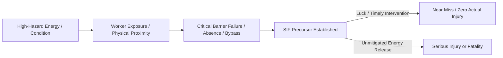
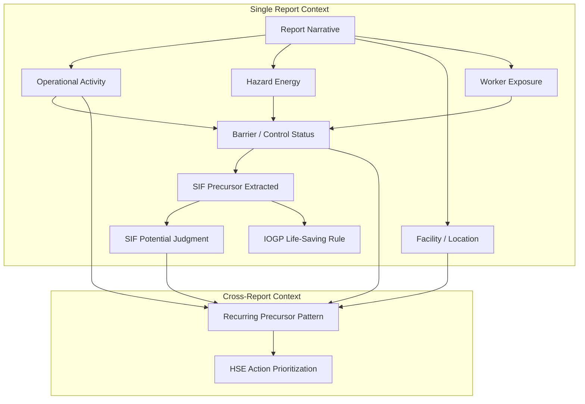

# 03_PROBLEM_STATEMENT

**Document Status:** Authoritative for Official Problem Statement Definition & Domain Problem Boundaries  
**Governing Document:** `01_PROJECT_CONSTITUTION.md`  
**SIH Problem Statement ID:** SIH26165  
**Organization:** Oil India Limited (OIL)  
**Category:** Software  
**Theme:** Smart Automation  
**Team:** Tech Smashers  

---

> **Source Tagging Discipline:**
> - `[OFFICIAL PS REQUIREMENT]` — Explicitly stated or directly supported in the official SIH/OIL problem statement.
> - `[DOMAIN INTERPRETATION]` — Our technical and domain explanation of what the requirement means in operational safety engineering terms.
> - `[PRODUCT RESPONSE]` — How our proposed product intends to address the stated requirement.
> - `[PROTOTYPE ASSUMPTION]` — A temporary assumption made because actual confidential OIL data or internal IT/HSE infrastructure is not accessible to the student team.
> - `[GENERAL DOMAIN KNOWLEDGE]` — Standard industrial safety principles, IOGP frameworks, or safety science concepts used to contextualize the problem.

---

## 1. Problem Statement Identity

| Dimension | Attribute Value | Classification & Evidence Status |
|---|---|---|
| **SIH Problem Statement ID** | SIH26165 | `[OFFICIAL PS REQUIREMENT]` |
| **Sponsoring Organization** | Oil India Limited (OIL) | `[OFFICIAL PS REQUIREMENT]` |
| **Problem Statement Title** | AI/NLP Engine to Detect Serious Injury & Fatality (SIF) Precursors in OIL's Unsafe-Act/Unsafe-Condition and Near-Miss Reports | `[OFFICIAL PS REQUIREMENT]` |
| **Category** | Software | `[OFFICIAL PS REQUIREMENT]` |
| **Theme** | Smart Automation | `[OFFICIAL PS REQUIREMENT]` |
| **Industrial Domain** | Upstream Oil & Gas Operations / Industrial HSE (Health, Safety & Environment) | `[GENERAL DOMAIN KNOWLEDGE]` |
| **Problem Type** | Free-Text Information Extraction, Semantic Safety Classification, Cross-Report Pattern Discovery, and HSE Prioritization Decision Support | `[DOMAIN INTERPRETATION]` |
| **Target User Group** | HSE Officers, Safety Analysts, Field HSE Reviewers, and HSE Leadership | `[DOMAIN INTERPRETATION]` |
| **Core Outcome Required** | An automated intelligence capability to detect SIF precursors in unstructured safety reports, map relevant IOGP Life-Saving Rules, extract recurring precursor patterns across operational dimensions, and support prioritized HSE interventions | `[OFFICIAL PS REQUIREMENT]` |

---

## 2. Official Problem Statement

### 2.1 Supported Meaning and Scope `[OFFICIAL PS REQUIREMENT - FAITHFUL PARAPHRASE]`

> *Note on Source Discipline:* The following statement represents a faithful representation of the official SIH26165 problem statement requirements without fabricating quotations, altering core intent, or introducing unrequested technical mechanisms:
>
> Oil India Limited (OIL) generates a continuous volume of safety observations across its operational installations, including **Unsafe-Act (UA)** reports, **Unsafe-Condition (UC)** reports, and **Near-Miss** narratives. These reports are submitted predominantly as unstructured free-text. Within this narrative data lie critical warning indicators known as **Serious Injury & Fatality (SIF) precursors**—conditions or actions that could have resulted in fatal or permanent, life-altering consequences under slightly different circumstances.
>
> Under conventional periodic or manual review cycles, detecting these precursor signals is labor-intensive and prone to oversight due to report volume and narrative variability. The official problem statement requires:
> 1. Developing an **AI/NLP engine** capable of analyzing free-text safety reports to distinguish **SIF-potential** events from non-SIF-potential events.
> 2. Contextually mapping identified hazards and actions to relevant **IOGP Life-Saving Rules**.
> 3. Surfacing **recurring precursor patterns** across operational activities, installation locations, and barrier failures.
> 4. Providing an intuitive interface or **dashboard to support HSE personnel** in ranking and prioritizing preventative safety interventions.

---

## 3. Problem in Simple Language

### 3.1 For a First-Year Engineering Student
In an oil company, workers and supervisors write thousands of daily reports when they see something unsafe—like someone forgetting safety goggles, an uncovered pit, or a fuel leak. Most of these events cause no injury. However, hidden inside a small fraction of those written descriptions are genuine near-catastrophes (for example, entering a gas-filled vessel before testing the air). Because people describe these events using everyday words, simple computer searches miss the danger. If human engineers must read every single paragraph manually every month, dangerous warning signs get buried under piles of minor complaints.

### 3.2 For a Non-Technical HSE Stakeholder
Frontline reporting captures unsafe acts, unsafe conditions, and near-misses. But raw report volume and narrative variability create an operational bottleneck. Safety personnel are often overwhelmed by paperwork, conducting periodic reviews where critical warning signs—such as repeated breakdowns in critical isolation procedures—can be overlooked until an actual incident occurs. The organization needs an intelligent assistant that flags high-consequence potential immediately, points to the exact missing safeguards, and shows which sites or jobs have repeating hazard patterns.

### 3.3 For a Hackathon Judge
SIH26165 addresses an information extraction and risk-prioritization challenge in safety-critical industrial operations. The challenge is not predicting an arbitrary future accident; it is the semantic extraction of latent high-consequence potential from messy, unstructured text. Manual triage is difficult to scale consistently across hundreds or thousands of narrative entries. The system must convert unstructured paragraphs into structured safety intelligence: isolating worker exposure, determining barrier status, mapping industry safety standards (IOGP), and highlighting recurring systemic weaknesses before they manifest as severe injuries or fatalities.

---

## 4. Safety Terminology

To avoid ambiguity, all project terminology must align with recognized safety science and international petroleum industry standards `[GENERAL DOMAIN KNOWLEDGE]`:

### 4.1 Unsafe Act (UA)
- **Definition:** Any human behavior or deviation from recognized safe operating procedures, standards, or practices that increases the probability of an injury, incident, or system failure.
- **Relevance:** Frontline workers frequently report unsafe acts in informal language (e.g., *"worker unclipped harness while traversing pipe rack"*). The system must extract the underlying behavioral deviation.

### 4.2 Unsafe Condition (UC)
- **Definition:** A physical, environmental, or mechanical hazard or deficiency in the workplace (e.g., defective machinery, missing guardrails, toxic atmospheric conditions, ungrounded electrical circuits).
- **Relevance:** Represents the physical hazard state before a worker is exposed or an energy release occurs.

### 4.3 Near Miss
- **Definition:** An unplanned sequence of events that had the potential to cause injury, illness, or property damage, but did not result in actual harm due to fortuitous timing, physical separation, or timely intervention.
- **Relevance:** Near-miss reports are the primary reservoir of SIF precursors. A near-miss event often possesses identical causal mechanisms to a fatal incident.

### 4.4 Incident
- **Definition:** An unplanned event that resulted in actual harm, occupational injury, health impairment, environmental release, or asset damage.
- **Relevance:** While actual outcome severity is recorded for incidents, the problem requires evaluating whether the scenario carried potential for a much worse consequence.

### 4.5 Serious Injury & Fatality (SIF)
- **Definition:** An occupational event that results in a fatality or a permanent, life-altering injury (e.g., amputations, permanent paralysis, traumatic brain injury, severe disabling burns).
- **Relevance:** SIF represents the specific high-consequence category of harm that the SIH26165 engine is mandated to focus upon, keeping it distinct from minor first-aid or recordable injuries.

### 4.6 SIF Precursor
- **Definition:** An observable situation, condition, action, or failure of a critical barrier where high-consequence hazard energy was present and, if uncontrolled or unmitigated, could reasonably have resulted in a serious injury or fatality.
- **Relevance:** The explicit primary target of extraction required by the SIH26165 problem statement.

### 4.7 SIF Potential
- **Definition:** The qualitative or probabilistic assessment of whether a reported situation possessed a credible causal pathway to a fatal or permanent life-altering outcome, irrespective of whether harm actually occurred.
- **Relevance:** The core analytical label (e.g., YES / NO / REVIEW) to be derived from the narrative text.

### 4.8 Critical Control
- **Definition:** A specific operational check, safeguard, or procedure crucial to preventing a major incident or mitigating the consequences of a hazardous energy release.
- **Relevance:** In the absence of a critical control, hazardous energy directly contacts the worker.

### 4.9 Barrier
- **Definition:** An engineered, procedural, or physical safeguard designed to prevent the release of hazardous energy or protect personnel from exposure to such energy.
- **Relevance:** Precursor analysis requires identifying which barrier was involved and evaluating its operational integrity.

### 4.10 Barrier Failure
- **Definition:** The breakdown, bypass, omission, incompleteness, or functional degradation of a barrier.
- **Relevance:** The causal link converting a routine hazard into an active SIF precursor.

### 4.11 IOGP Life-Saving Rule (LSR)
- **Definition:** A standardized set of nine fundamental, high-impact safety rules established by the International Association of Oil & Gas Producers (IOGP Report 459) to prevent fatalities during high-risk activities (e.g., Confined Space, Energy Isolation, Working at Height).
- **Relevance:** The official problem statement explicitly requires mapping safety report narratives to these recognized rules.

### 4.12 HSE (Health, Safety & Environment)
- **Definition:** The organizational discipline and corporate function responsible for workforce protection, regulatory compliance, environmental stewardship, and operational safety.
- **Relevance:** The ultimate operational consumer, validator, and beneficiary of the proposed solution.

---

## 5. What is an SIF Precursor?

In contemporary industrial safety science (originating from Heinrich's traditional safety pyramid limitations and modernized by research from the Campbell Institute and DEKRA), an established principle is that **reducing minor incidents does not proportionally reduce fatalities**. Minor injuries and fatal incidents frequently stem from fundamentally different causal mechanisms.

An **SIF Precursor** is an observable warning condition, action, exposure, control failure, or combination of factors where high-energy hazards exist in the presence of compromised or missing controls.

### 5.1 The Conceptual Precursor Chain



### 5.2 The Crucial Principle: Actual Outcome ≠ Potential Consequence
A report describing an event where:
- Nobody was hurt,
- A supervisor noticed the issue and shouted a warning,
- A tool fell from height but struck an empty walkway, or
- A worker climbed out of a tank when feeling dizzy,

remains an **SIF Precursor with HIGH SIF Potential**. The absence of blood, bone fracture, or fatality in that specific instance was the result of timing, luck, or fortuitous intervention, not engineered safety integrity.

```
Actual Outcome:        Minor bump / Zero injury / Near-miss
Potential Consequence: Fatal asphyxiation / Fatal impact / Multiple fatalities
Problem Objective:     Detect the Potential Consequence from the Narrative Evidence.
```

---

## 6. The Real Problem Hidden Inside the Text

The primary barrier to automated safety intelligence is that safety reporting relies on frontline natural language. A single free-text narrative contains multiple interdependent semantic dimensions:

```
[Context / Activity]        [Hazard Present]            [Exposure / Action]
"During vessel cleaning,    toxic H2S gas pocket        technician entered manway
      |                            |                           |
[Barrier State]             [Intervention Event]        [Recorded Outcome]
without gas test log        supervisor halted entry     no injury recorded."
```

### 6.1 Why Keyword Searching Invariably Fails
A simple keyword search looking for `"confined space"`, `"gas"`, and `"entry"` cannot understand semantic context or operational sequence:

| Scenario | Narrative Phrasing | Keyword Hit? | Safety Meaning |
|---|---|---|---|
| **Safe Execution** | *"Confined-space entry permit verified, gas test completed at 0.0 ppm, and continuous air monitoring active prior to vessel entry."* | YES (`confined space`, `gas`, `entry`) | Fully controlled; barriers verified present. Low SIF Potential. |
| **Dangerous Precursor** | *"Technician entered confined space before atmospheric gas testing was initiated. No standby person at hatch."* | YES (`confined space`, `gas`, `entry`) | Critical barrier missing, worker directly exposed. High SIF Potential. |

Keyword search treats both cases identically. Contextual NLP is required to distinguish:
1. **Negation & Sequence:** Identifying whether a test happened *before* or *after* an action, and whether it was *completed* or *omitted*.
2. **Control Status:** Determining whether a mentioned procedure was active, bypassed, or failing.
3. **Exposure Reality:** Determining whether a human was positioned in the line of fire or within the danger envelope.

---

## 7. Concrete Representative Example

The following scenario illustrates the core analytical challenge:

> **[REPRESENTATIVE / SYNTHETIC PROTOTYPE EXAMPLE — NOT ACTUAL OIL DATA]**  
> *"During maintenance of a condensate vessel at Site A, a technician attempted to enter the confined space before atmospheric testing was completed. No standby attendant was present at the entry point. The supervisor noticed the situation and stopped the work. No injury occurred."*

### 7.1 Detailed Semantic Breakdown

- **What happened?** A worker attempted entry into an unverified enclosed compartment during maintenance; work was halted by supervisor intervention.
- **What was the hazard?** Hazardous atmosphere (toxic vapor / asphyxiating environment / flammable hydrocarbon vapors) inside a condensate vessel.
- **Who was exposed?** The maintenance technician who initiated physical entry through the manway.
- **Which controls were incomplete/missing?**
  1. Atmospheric gas testing (incomplete prior to entry attempt).
  2. Stationing of a designated standby safety attendant (completely absent).
- **What barriers were involved?**
  - Atmospheric Verification Barrier (`INCOMPLETE`).
  - Standby Attendant & Rescue Readiness Barrier (`MISSING`).
  - Supervisory Administrative Oversight (`SUCCESSFUL INTERVENTION`).
- **What was the actual outcome?** Work stoppage; zero recorded occupational injuries.
- **Why does this carry High SIF Potential?** Because if the supervisor had been delayed by thirty seconds, the worker would have entered an uncharacterized atmosphere, which is a known root cause of fatal industrial asphyxiations and toxic exposures.
- **Which IOGP Life-Saving Rule is relevant?** **Confined Space** (*"Obtain authorization to enter a confined space; verify isolation; test atmosphere; use a standby person"*).
- **What must the system surface?**
  - SIF Potential: `YES / HIGH`
  - Relevant Life-Saving Rule: `Confined Space`
  - Barrier Failures: `Atmospheric Testing: Incomplete`; `Standby Person: Missing`
  - Traceable Text Evidence: Exact phrase links justifying each finding.

---

## 8. The Manual Review Problem

The official problem statement stems from the operational realities of handling high-volume safety reporting `[DOMAIN INTERPRETATION]`:

1. **Volume and Latency:** Large exploration and production enterprises generate thousands of safety observations annually across distributed drilling rigs, production platforms, pipelines, and central processing facilities. Triage is often conducted in monthly or quarterly reviews. A recurring fatal precursor submitted in Week 1 may languish unreviewed until Week 6.
2. **Variability in Frontline Language:** Reports are authored by personnel with diverse linguistic backgrounds, technical proficiencies, and communication styles. Terminology varies wildly (e.g., *"drum"*, *"vessel"*, *"tank"*, *"bullet"*, *"separator"*).
3. **Cognitive Fatigue and Signal Burial:** Because 90% or more of submitted safety observations involve non-SIF items (e.g., untidy housekeeping, missing warning decals, minor slip hazards), safety reviewers experience cognitive fatigue. High-consequence precursors become needles buried in voluminous haystacks.
4. **Cross-Site Blindness:** Reviewer A at Field Site 1 may see an isolated near-miss involving a bypassed pressure relief valve. Reviewer B at Field Site 2 may see another. Neither reviewer reads the other's batch; hence, an enterprise-wide systemic failure of pressure protection procedures remains invisible.

---

## 9. Required Intelligence

The problem statement requires extracting four distinct tiers of safety intelligence from unstructured narrative reports:

| Intelligence Layer | What the System Needs to Understand | Operational Necessity (`[OFFICIAL PS REQUIREMENT]`) |
|---|---|---|
| **A. SIF-Potential Classification** | Whether the reported scenario describes an event, exposure, or barrier failure with a credible pathway to fatal or permanent disabling injury, independent of recorded injury severity. | Separates urgent high-consequence signals from routine minor observations. |
| **B. Life-Saving Rule (LSR) Mapping** | Contextual alignment of the reported narrative to established IOGP Life-Saving Rules (e.g., Confined Space, Energy Isolation, Line of Fire, Working at Height). | Standardizes informal narratives into universally recognized industrial safety compliance categories. |
| **C. Recurring Precursor Pattern Discovery** | Detection of repeated combinations of operational activities, physical locations, hazard mechanisms, and barrier failures across multiple independent reports. | Shifts HSE focus from isolated incident firefighting to proactive, systemic risk elimination. |
| **D. HSE Prioritization** | Aggregating and ranking sites, activities, and barrier deficiencies by concentration of SIF potential. | Directs constrained human engineering, audit, and training resources to areas of highest demonstrable danger. |

---

## 10. Problem Dimensions

To extract actionable intelligence from free-text reports, the problem must be modeled as an interaction of twelve distinct conceptual dimensions `[DOMAIN INTERPRETATION]`:



### Dimension Definitions
1. **Report:** The discrete text narrative logged into the system.
2. **Activity:** The specific industrial work underway (e.g., pipe fitting, hot work, vessel entry, rigging).
3. **Hazard:** The hazardous energy source present (e.g., pressurized gas, electrical charge, suspended load, toxic atmosphere).
4. **Location/Site:** The geographic facility, rig, battery, or well site where the event occurred.
5. **Worker Exposure:** The physical proximity and posture of personnel relative to the hazard envelope.
6. **Safety Control:** The planned procedural or administrative check intended to control the hazard.
7. **Barrier:** The physical, procedural, or engineered safeguard preventing hazard-worker contact.
8. **Barrier Status:** The evaluated condition of the barrier (`PRESENT`, `INCOMPLETE`, `FAILED`, `BYPASSED`, `MISSING`, `UNKNOWN`).
9. **Precursor:** The synthesized condition indicating unmitigated high-energy hazard exposure.
10. **SIF Potential:** The overall classification of whether fatal/disabling harm was credible (`YES`, `NO`, `REVIEW`).
11. **Life-Saving Rule:** The relevant standardized IOGP rule governing the high-risk activity.
12. **Priority:** The relative urgency assigned to a report or site based on precursor severity and recurrence.

---

## 11. Individual Report vs. Cross-Report Problem

A foundational requirement of this project is maintaining a strict conceptual separation between **Single-Report Intelligence** and **Cross-Report Intelligence**. They solve two fundamentally distinct problems and must never be conflated:

```
+-------------------------------------------------------------------------------+
|                       LEVEL 1: INDIVIDUAL REPORT PROBLEM                      |
| Question: "Does this specific report contain SIF potential, and what text     |
|            evidence supports that classification?"                            |
| Focus:    Signal extraction, barrier evaluation, LSR mapping for ONE narrative.|
+-------------------------------------------------------------------------------+
                                       |
                                       v (Accumulation of Analyzed Reports)
+-------------------------------------------------------------------------------+
|                        LEVEL 2: CROSS-REPORT PROBLEM                          |
| Question: "What precursor patterns, barrier failures, and high-risk           |
|            activities are repeatedly occurring across our operations?"        |
| Focus:    Multi-report aggregation, hotspot detection, systemic weakness.     |
+-------------------------------------------------------------------------------+
```

- **Why Level 1 cannot solve the problem alone:** Analyzing single reports in isolation treats every observation as a one-off anomaly, blinding leadership to systemic procedural erosion.
- **Why Level 2 cannot exist without Level 1:** Enterprise patterns are only as trustworthy as the granular text evidence extracted from each underlying narrative.

---

## 12. Why Simple Keyword Search Is Not Enough

To illustrate why modern NLP and semantic safety extraction are mandatory, consider these contrasting operational narratives:

### Contrast Pair A: Sequence and State
- **Narrative 1 (Safe Operation):**  
  *"Hot work permit approved. Flammable gas testing completed at 0.0% LEL. Fire watcher stationed with pressurized extinguisher before grinder was powered on."*  
  → **Analysis:** Keywords present (`hot work`, `gas`, `fire`). Control status: Verified present, executed prior to energy generation. **SIF Potential: NO.**
- **Narrative 2 (Severe Precursor):**  
  *"Grinding work commenced on fuel line before hot work permit was signed and without prior atmospheric gas testing. Fire extinguisher was uninspected and empty."*  
  → **Analysis:** Identical primary keywords. Control status: Bypassed, missing, degraded. Active ignition source next to hydrocarbon line. **SIF Potential: YES.**

### Contrast Pair B: Negation and Attendant Presence
- **Narrative 1:** *"Standby attendant confirmed present at hatch throughout the confined space cleaning operation."*  
  → Barrier intact.
- **Narrative 2:** *"Standby attendant was not present at hatch during the confined space cleaning operation."*  
  → Severe barrier failure. Single-word negation (`not`) inverts the safety integrity of the entire operation.

---

## 13. Expected Outcome from the Problem Statement

The solution must deliver an end-to-end intelligence capability that `[OFFICIAL PS REQUIREMENT]`:
1. **Automates Triage:** Ingests raw safety narratives and reliably flags items carrying SIF potential.
2. **Surfaces Evidence:** Highlights specific phrases and causal elements (hazard, exposure, barrier status) justifying each flag.
3. **Standardizes Classification:** Connects narrative descriptions to established IOGP Life-Saving Rules.
4. **Reveals Systemic Weaknesses:** Discovers recurring combinations of failed controls across sites and work types.
5. **Empowers HSE Decision-Makers:** Provides prioritized dashboard views enabling safety leaders to deploy targeted interventions, audit specific barriers, and revise operating procedures before serious harm occurs.

---

## 14. What Success Means

Success for SIH26165 is defined by rigorous qualitative and operational criteria `[DOMAIN INTERPRETATION]`:

1. **Semantic Narrative Comprehension:** Accurate parsing of frontline industrial prose, handling technical jargon, irregular grammar, and abbreviations.
2. **Outcome-Potential Decoupling:** Flawless conceptual separation between actual injury severity (e.g., zero harm) and potential consequence (e.g., high SIF potential).
3. **Traceable Explainability:** Complete transparency; every AI assessment links directly back to verbatim source text phrases.
4. **Accurate Barrier Integrity Evaluation:** Correct identification of barrier status (`present`, `missing`, `incomplete`, `failed`, `bypassed`).
5. **Contextual Life-Saving Rule Mapping:** Correct association of industrial scenarios to relevant IOGP rules without relying on naïve keyword triggers.
6. **Actionable Pattern Discovery:** Identification of multi-report clusters that represent genuine operational vulnerabilities rather than trivial semantic similarities.
7. **Decision-Support Prioritization:** Generating sensible, ranked priority lists that direct HSE resources to high-risk installations.
8. **Human Validation Support:** An interface that allows authorized safety professionals to confirm, adjust, or override AI outputs seamlessly.
9. **Absence of Hallucinated Claims:** Strict avoidance of invented facts, unsupported risk metrics, or fabricated certainty.
10. **Ethical Framing:** Treating the AI engine strictly as an assistive tool, preserving human accountability for operational safety.

---

## 15. Problem Constraints

```
+-------------------------------------------------------------------------------+
|                              PROBLEM CONSTRAINTS                              |
+-------------------------------------------------------------------------------+
|  1. DATA ACCESS CONSTRAINT: Actual internal OIL safety records are proprietary|
|     and confidential. Student teams cannot assume access to live databases.   |
|                                                                               |
|  2. LABEL SCARCITY CONSTRAINT: Expert-annotated SIF precursor training datasets|
|     are not publicly available in standardized formats.                       |
|                                                                               |
|  3. ASYMMETRIC ERROR COST: In safety, a False Negative (missing a true SIF    |
|     precursor) carries catastrophic real-world risk, whereas a False Positive |
|     merely prompts an unnecessary human review.                               |
|                                                                               |
|  4. HIGH-STAKES EXPLAINABILITY: "Black box" neural predictions cannot be      |
|     audited or trusted by industrial HSE teams or statutory regulators.       |
|                                                                               |
|  5. PROTOTYPE BOUNDARY: The hackathon deliverable must demonstrate functional  |
|     feasibility using representative synthetic data, without claiming live    |
|     operational deployment.                                                   |
+-------------------------------------------------------------------------------+
```

---

## 16. Data Reality

To ensure absolute integrity and compliance with hackathon regulations, data sources are classified as follows:

| Data Category | Accessible to Student Prototype? | Intended Usage in Prototype | Evidentiary Status |
|---|---|---|---|
| **Authorized OIL Internal Safety Data** | **NO** (Not assumed or claimed) | Future production integration under formal enterprise authorization | `[FUTURE ENHANCEMENT]` |
| **Public Industrial Safety Corpora** | **POTENTIALLY** (e.g., OSHA, CSB, public incident repositories) | Informing vocabulary and general taxonomy structure | `[GENERAL DOMAIN KNOWLEDGE]` |
| **Representative Synthetic Narratives** | **YES** (Constructed specifically for prototype demonstration) | End-to-end pipeline demonstration, dashboard walkthrough, scenario testing | `[PROTOTYPE ASSUMPTION]` |
| **Expert-Labelled Benchmarking Samples** | **YES** (Team-annotated against IOGP standards) | Validating signal extraction, barrier detection, and explainability accuracy | `[PROTOTYPE ASSUMPTION]` |

---

## 17. Problem Scope

### 17.1 In-Scope `[OFFICIAL PS REQUIREMENT / PRODUCT RESPONSE]`
- Processing unstructured narratives from Unsafe Act (UA), Unsafe Condition (UC), Near-Miss, and incident reports.
- Extraction of foundational safety signals (activity, hazard, exposure, control mentions).
- Assessment of SIF Potential (`YES / NO / REVIEW`) with explicit confidence indicators.
- Extraction of barrier failures and status determination.
- Evidence-based mapping to IOGP Life-Saving Rules.
- Cross-report discovery of recurring precursor patterns across locations, activities, and barriers.
- Prioritization of high-risk sites and activities for HSE attention.
- Human-in-the-loop review interface (confirm / correct / reject).

### 17.2 Out-of-Scope `[BOUNDARIES & PROHIBITED CLAIMS]`
- **Future Accident Forecasting:** Claiming to predict the exact date, time, well, or person involved in a future incident.
- **Autonomous Field Control:** Directly issuing automated facility shutdown commands or permitting work without human authorization.
- **Disciplinary or Blame Allocation:** Using safety reports to track, punish, or evaluate individual worker performance.
- **Medical or Legal Adjudication:** Making medical diagnoses or formal legal liability determinations.
- **Production Claims:** Claiming the prototype is currently deployed, approved, or operational within Oil India Limited's corporate network.

---

## 18. Problem → User → Need Mapping

| Operational Problem | Affected Stakeholder | Core Operational Need |
|---|---|---|
| Latent SIF precursors buried inside lengthy, unstructured narratives. | **HSE Field Officer / Safety Analyst** | Needs immediate highlighting of high-consequence potential and extracted textual evidence so critical reports are not missed during triage. |
| Time-consuming, manual classification against international safety standards. | **Safety Report Reviewer** | Needs automated, evidence-backed mapping to IOGP Life-Saving Rules to standardize classification and reduce administrative burden. |
| Inability to see repeating control failures across separate installations. | **HSE Manager / Corporate Director** | Needs cross-report pattern aggregation showing which sites and specific barriers suffer recurring breakdowns. |
| Difficulty justifying resource allocation based solely on raw report counts. | **HSE Operations Lead** | Needs risk-weighted prioritization ranking facilities by SIF potential concentration rather than gross observation volume. |
| Distrust of opaque, automated algorithmic outputs. | **Authorized HSE Personnel** | Needs inspectable reasoning chains and a seamless mechanism to validate, correct, or reject AI determinations. |

---

## 19. Problem Requirement → Product Capability Mapping

| Official Problem Requirement | Derived Technical Need | Proposed Product Capability |
|---|---|---|
| Ingest unstructured frontline reports | Natural language text normalization and entity extraction | **NLP & Safety Signal Extraction Engine** |
| Detect SIF precursors in narratives | Semantic evaluation of hazard, exposure, and barrier integrity | **SIF Potential Engine** |
| Provide actionable, auditable outputs | Traceable phrase-level justification | **Explainability & Evidence Panel** |
| Evaluate safety safeguard integrity | Categorization of control status (`missing`, `bypassed`, etc.) | **Barrier Failure Analysis Module** |
| Align with petroleum safety standards | Multi-class contextual matching to IOGP Report 459 | **IOGP Life-Saving Rule Mapper** |
| Identify systemic operational hazards | Multi-dimensional clustering and frequency/severity aggregation | **Cross-Report Pattern Discovery Engine** |
| Guide preventative interventions | Ranking of sites, activities, and recurring vulnerabilities | **HSE Prioritization Dashboard** |
| Ensure human authority and oversight | Interactive verification, correction, and feedback capture | **Human-in-the-Loop Review Console** |

---

## 20. Problem Complexity

Developing an AI engine for SIH26165 is technically non-trivial due to inherent linguistic, domain, and operational complexities:

1. **Extreme Class Imbalance:** In real-world safety data, true SIF precursors represent less than 5% to 10% of total reported observations. Naïve machine learning classifiers trained on unweighted data default to predicting "Non-SIF" for every sample.
2. **Implicit Safety Context:** Critical safety facts are often unstated. A report stating *"Welder touched exposed wire during deck fabrication"* implies an electrical electrocution hazard and a failure of insulation/isolation barriers without those explicit words being typed.
3. **Complex Sentence Structures and Negation:** Industrial prose regularly combines sequential clauses with inversion (e.g., *"Worker did not proceed until permit arrived"* vs. *"Worker proceeded; permit did not arrive"*).
4. **Local Dialect and Industry Terminology:** Technical jargon, informal rig slang (e.g., *"doghouse"*, *"roughneck"*, *"mousehole"*, *"thief hatch"*), and regional phrasing require domain-tuned semantic representations.
5. **Multi-Dimensional Barrier Reasoning:** Determining whether a control was merely mentioned, partially implemented, bypassed, or failed requires relational contextual reasoning, far exceeding bag-of-words capabilities.

---

## 21. Key Questions the Solution Must Answer

The proposed platform must directly answer two tiers of questions:

### Tier 1: For an Individual Safety Report
1. **What activity was taking place?** (e.g., confined-space cleaning, hot work, wireline logging)
2. **What hazardous energy source was present?** (e.g., toxic gas, high pressure, suspended load)
3. **Was a worker physically exposed to that hazard?**
4. **Which critical controls or barriers were compromised, missing, or bypassed?**
5. **Did this situation possess SIF Potential?** (`YES`, `NO`, or `REVIEW`)
6. **What exact narrative evidence proves that SIF Potential exists?**
7. **Which IOGP Life-Saving Rule governs this hazard scenario?**
8. **What immediate corrective action is indicated by the barrier failure?**

### Tier 2: Across the Enterprise Corpus
9. **Which precursor patterns are recurring across multiple reports?**
10. **At which installations or geographic sites are these patterns concentrated?**
11. **Which specific barrier type fails most frequently across all operations?**
12. **Which operational activities generate the highest proportion of SIF-potential events?**
13. **Where should HSE leadership dispatch audit teams and intervention resources first?**

---

## 22. Common Misinterpretations to Avoid

To maintain strict conceptual integrity, the project explicitly rejects six common industry misinterpretations:

### Misinterpretation 1: "SIF means an actual serious injury happened."
- **Correction:** SIF Potential evaluates whether a scenario *could have* resulted in fatal or permanent harm under minor variations. The vast majority of SIF precursors are near-misses or minor events.

### Misinterpretation 2: "Near-misses are inherently low-risk events."
- **Correction:** A near-miss often involves catastrophic energy levels where only luck or a single unverified safeguard prevented disaster. Near-misses are high-value SIF precursor indicators.

### Misinterpretation 3: "Keyword filtering solves the problem."
- **Correction:** Keywords cannot interpret negation, temporal sequence, or barrier efficacy. Contextual NLP is non-negotiable.

### Misinterpretation 4: "AI predicts future accidents like a crystal ball."
- **Correction:** The platform assesses the risk potential of *past reported events* to expose recurring systemic vulnerabilities. It does not forecast future events on specific calendar dates.

### Misinterpretation 5: "High reporting volume equals high risk."
- **Correction:** A site with 500 reports regarding minor housekeeping may have far lower fatal risk than a site with 10 reports describing repeated bypasses of pressure relief valves. Risk concentration, not raw count, dictates priority.

### Misinterpretation 6: "The AI output replaces human HSE decision-making."
- **Correction:** The AI functions solely as an evidence-backed decision-support system. All operational decisions, work stoppages, and policy changes remain under human authority.

---

## 23. Official Requirement vs. Proposed Interpretation Traceability

| Official PS Requirement | Our Domain Interpretation | Product Response Capability | Status |
|---|---|---|---|
| AI/NLP engine for OIL safety reports | Extract structured signals from free-text UA, UC, and near-miss narratives | NLP Preprocessing & Entity Signal Extraction | `[OFFICIAL PS REQUIREMENT]` |
| Detect SIF precursors | Differentiate events with fatal/permanent disabling potential from routine events | SIF Potential Assessment Engine (`YES/NO/REVIEW`) | `[OFFICIAL PS REQUIREMENT]` |
| Traceable, verifiable AI reasoning | Surface exact textual phrases supporting the classification | Explainability & Evidence Panel | `[DOMAIN INTERPRETATION]` |
| Evaluate safety safeguard status | Classify barriers as present, missing, incomplete, failed, or bypassed | Barrier Failure Analysis Module | `[DOMAIN INTERPRETATION]` |
| Map to IOGP Life-Saving Rules | Evidence-based alignment of hazards and activities to IOGP Report 459 | IOGP Rule Classification Engine | `[OFFICIAL PS REQUIREMENT]` |
| Surface recurring precursor patterns | Identify multi-report clusters across location, activity, and barrier failure | Cross-Report Pattern Discovery Engine | `[OFFICIAL PS REQUIREMENT]` |
| Support HSE prioritization | Rank sites and activities by SIF potential concentration | HSE Prioritization Dashboard | `[OFFICIAL PS REQUIREMENT]` |
| Ensure safety governance | Provide human reviewer override and feedback capture | Human-in-the-Loop Review Console | `[PRODUCT RESPONSE]` |
| Demonstration without internal OIL data | Utilize synthetic, domain-realistic safety narratives | Representative Prototype Evaluation Suite | `[PROTOTYPE ASSUMPTION]` |

---

## 24. Relationship with Other Project Documents

```
                         +-----------------------------+
                         | 01_PROJECT_CONSTITUTION.md  |
                         | (Supreme Governance, Claims,|
                         |  Boundaries & Principles)   |
                         +-----------------------------+
                                       |
                   +-------------------+-------------------+
                   |                                       |
                   v                                       v
+------------------------------------+   +------------------------------------+
|     03_PROBLEM_STATEMENT.md        |   |      02_PRODUCT_BLUEPRINT.md       |
| (Authoritative for PS Definition,  |-->| (Translates Problem into Product   |
|  Boundaries, & Core Safety Problem)|   |  Capabilities, Journeys & Modules) |
+------------------------------------+   +------------------------------------+
                   |                                       |
                   +-------------------+-------------------+
                                       |
                                       v
                         +-----------------------------+
                         | 06_TECHNICAL_REQUIREMENTS   |
                         | (System, Functional, & Non- |
                         |  Functional Specs)          |
                         +-----------------------------+
                                       |
             +-------------------------+-------------------------+
             |                                                   |
             v                                                   v
+-----------------------------+                     +-----------------------------+
|  07_SYSTEM_ARCHITECTURE.md  |                     |    08_AI_ARCHITECTURE.md    |
| (Software, Data, & Systems) |                     | (NLP, Embeddings, & Models) |
+-----------------------------+                     +-----------------------------+
                                       |
                                       v
                         +-----------------------------+
                         |   14_TESTING_STRATEGY.md    |
                         | (Validation, Metrics, & QA) |
                         +-----------------------------+
```

- **`01_PROJECT_CONSTITUTION.md`**: Governs this document. If any statement here appears to conflict with the Constitution, the Constitution takes precedence.
- **`02_PRODUCT_BLUEPRINT.md`**: Translates the problem defined here into concrete software modules, product personas, and user workflows.
- **`06_TECHNICAL_REQUIREMENTS.md`**: Translates the capabilities identified here into technical acceptance criteria.
- **`07_SYSTEM_ARCHITECTURE.md` & `08_AI_ARCHITECTURE.md`**: Define the engineering implementation (pipelines, databases, models) that solves this problem.
- **`14_TESTING_STRATEGY.md`**: Formulates quantitative benchmark evaluations to verify that the problem has been solved.

---

## 25. Final Problem Definition

> **Consensus Formulation `[DOMAIN INTERPRETATION]`:**
>
> *"Oil India Limited's extensive operational safety reporting captures vital frontline observations regarding unsafe acts, unsafe conditions, and near-misses. However, critical Serious Injury & Fatality (SIF) precursor signals remain embedded and obscured within free-text natural language narratives. Under conventional manual or periodic review cycles, identifying these high-consequence signals, separating potential consequence from actual injury severity, and synthesizing recurring patterns across distributed installations is time-consuming and difficult to scale consistently.*
>
> *The fundamental problem is to develop an explainable AI/NLP decision-support capability that reliably identifies SIF potential directly from narrative evidence, isolates specific barrier failures, contextually maps events to standardized IOGP Life-Saving Rules, detects systemic precursor patterns across operational dimensions, and presents this intelligence through a prioritized dashboard that empowers HSE professionals to take timely, proactive, and targeted preventative action before a catastrophic incident occurs."*
