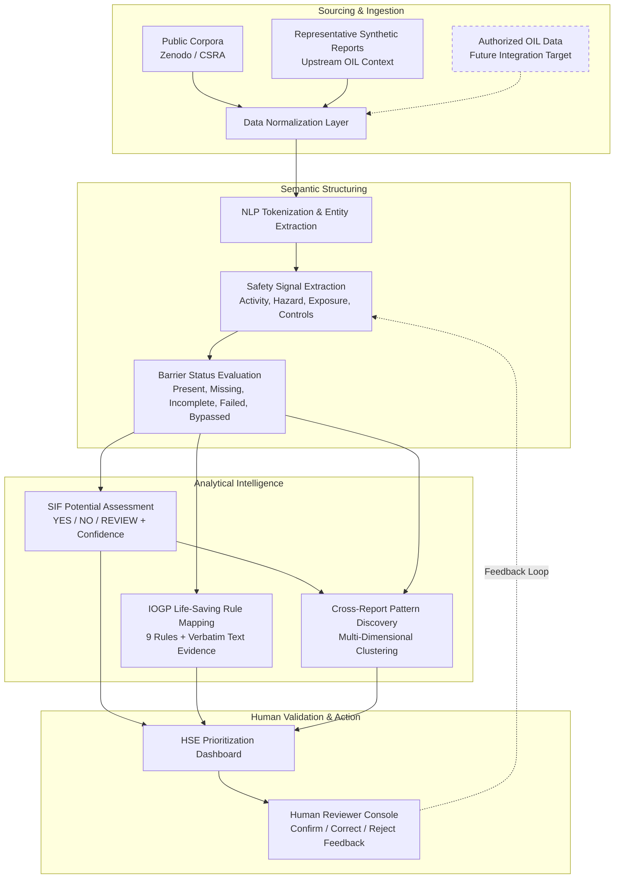
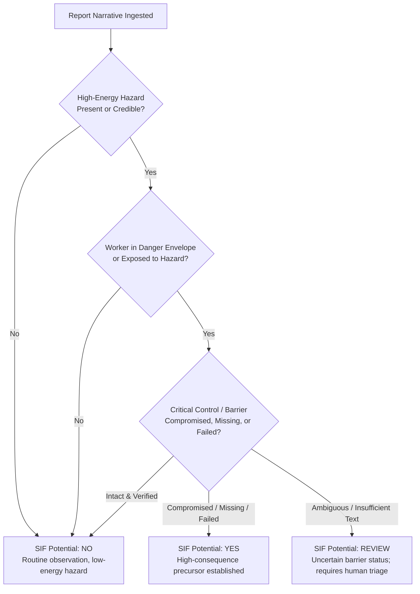
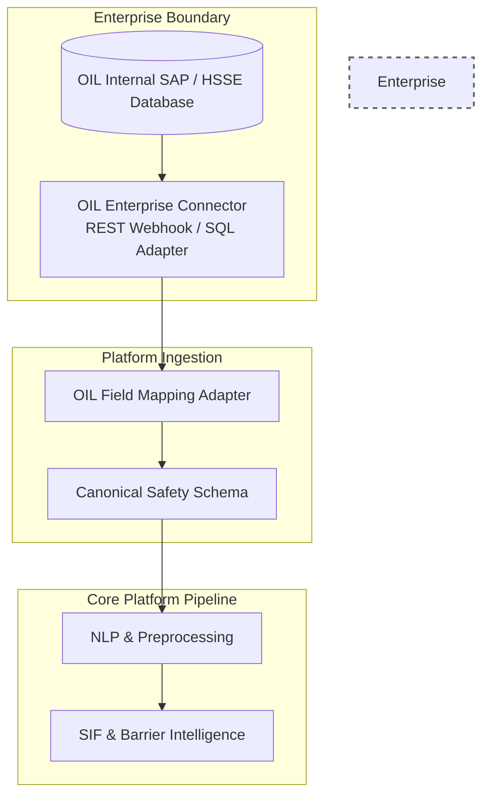

# 05_DATA_STRATEGY_AND_LABELING

**Document Status:** Authoritative for Data Architecture, Labeling Taxonomies, Dataset Engineering & Evaluation Protocols  
**Governing Documents:** `01_PROJECT_CONSTITUTION.md`, `02_PRODUCT_BLUEPRINT.md`, `03_PROBLEM_STATEMENT.md`, `04_MARKET_RESEARCH.md`  
**SIH Problem Statement ID:** SIH26165  
**Organization:** Oil India Limited (OIL)  
**Category:** Software  
**Theme:** Smart Automation  
**Team:** Tech Smashers  

---

> **Source & Data Integrity Tagging Discipline:**
> - `[AUTHORIZED OIL DATA]` — Operational data residing inside Oil India Limited's secure enterprise boundaries; **not assumed accessible or possessed** for the hackathon prototype.
> - `[PUBLIC DATA]` — Open-access, de-identified public safety research datasets utilized under open licensing.
> - `[SYNTHETIC DATA]` — Expert-engineered representative safety narratives created specifically to simulate OIL upstream operational contexts for demonstration.
> - `[MANUALLY LABELLED PROTOTYPE DATA]` — Benchmarking data annotated by our team against established safety engineering standards (IOGP Report 459, Campbell Institute).
> - `[DATA ARCHITECTURE PRINCIPLE]` — Foundational data design rules governing the platform.

---

## 1. Data Strategy Overview

In safety-critical industrial AI, **data strategy precedes model selection** `[DATA ARCHITECTURE PRINCIPLE]`. The goal of the OIL Safety Intelligence Platform is not to achieve academic benchmark scores on arbitrary NLP corpora, but to reliably extract latent high-consequence signals from noisy, unstructured frontline text to drive proactive safety interventions.

### 1.1 The Role of Data in the Intelligence Pipeline
Safety observations are authored by diverse frontline personnel under variable field conditions. A robust data strategy must structure this informal narrative text into verified, explainable, and actionable semantic signals:



### 1.2 Core Data Architecture Principle: Decoupling Source from Semantics
To ensure the prototype is both buildable now and immediately deployable later, the system enforces a strict architectural decoupling `[DATA ARCHITECTURE PRINCIPLE]`:

$$\text{Data Source} \not\equiv \text{Data Format} \not\equiv \text{Data Semantics} \not\equiv \text{Model Output}$$

The core NLP and reasoning pipeline operates exclusively against a **Canonical Conceptual Safety Schema**. Whether a report originates from an open research dataset, a synthetic demonstration file, or a future authorized OIL SAP/HSSE database connection, the internal semantic representations and downstream decision-support modules remain identical.

---

## 2. Data Source Classification & Governance

To maintain absolute ethical compliance, regulatory integrity, and transparency during Smart India Hackathon 2026, all data utilized across the project lifecycle is rigorously classified:

| Data Category | Availability to Prototype | Licensing / Governance | Primary Use Case in Project | Inherent Limitations & Mitigation Strategy |
|---|---|---|---|---|
| **Authorized OIL Internal Data** | **NOT ASSUMED** `[AUTHORIZED OIL DATA]` | Enterprise Confidential / Proprietary to Oil India Limited. | Reserved exclusively for future production deployment upon formal enterprise authorization. | **Limitation:** Inaccessible to student teams.<br>**Mitigation:** Architect a drop-in ingestion schema to ensure immediate compatibility upon future authorization. |
| **Public Safety Research Datasets** | **AVAILABLE** `[PUBLIC DATA]` | Open Access (e.g., Zenodo CC BY 4.0, UK OGL v3.0). | Pre-training language representations, calibrating semantic vector spaces, validating energy hazard NER. | **Limitation:** Lack upstream petroleum terminology.<br>**Mitigation:** Use solely for foundational linguistic grounding, not domain benchmarking. |
| **Representative Synthetic Narratives** | **AVAILABLE** `[SYNTHETIC DATA]` | Proprietary to Tech Smashers (Openly documented for hackathon). | End-to-end prototype demonstration, UI walkthrough, multi-dimensional pattern simulation. | **Limitation:** Risk of artificial simplicity.<br>**Mitigation:** Model narratives directly on complex IOGP case studies and upstream E&P operational activities. |
| **Manually Labelled Benchmark Data** | **AVAILABLE** `[MANUALLY LABELLED PROTOTYPE DATA]` | Team Intellectual Output under Academic Fair Use. | Model evaluation, precision/recall testing, explainability verification. | **Limitation:** Potential annotator subjectivity.<br>**Mitigation:** Dual-annotator agreement protocols calibrated against IOGP Report 459 definitions. |

> **Non-Negotiable Boundary Policy:** Under no circumstances shall synthetic or public data be misrepresented to judges or stakeholders as genuine Oil India Limited historical records `[DATA ARCHITECTURE PRINCIPLE]`.

---

## 3. Required Conceptual Data Types

The system consumes, structures, and emits five distinct conceptual data types:

### 3.1 Safety Report Metadata (Administrative Envelope)
Provides administrative context and operational coordinates:
- `report_id`: Unique persistent identifier.
- `report_type`: Frontline observation category (`UNSAFE_ACT`, `UNSAFE_CONDITION`, `NEAR_MISS`, `INCIDENT`).
- `timestamp`: Date and time of observation (supports trend and recurrence analysis).
- `facility_id` / `location`: Geographic installation, rig, gathering station, or pipeline segment.
- `department` / `operating_unit`: Functional operational group (e.g., Drilling, Production, Maintenance).

### 3.2 Safety Narrative (Primary Unstructured Payload)
The verbatim, natural language description authored by the worker or field supervisor:
- Unstandardized text containing observation details, equipment descriptions, actions taken, immediate mitigations, and contextual outcomes.

### 3.3 Extracted Safety Signals (Structured Semantic Facts)
Discrete entities extracted from the narrative prose via NLP:
- **Activity:** Specific industrial task underway (e.g., *"vessel entry"*, *"hot work"*, *"pipe handling"*).
- **Hazard Energy:** Hazardous energy source present (e.g., *"hydrocarbon gas"*, *"suspended load"*, *"high pressure"*).
- **Worker Exposure:** Direct physical proximity or posture within the hazard envelope.
- **Control Mentions:** Safeguards explicitly referenced in text, along with their linguistic context (negation, sequence).

### 3.4 Evaluated Safety Intelligence (Derived Analytical Findings)
Higher-level safety engineering assessments computed by the platform:
- **Barrier Status:** Evaluated condition of identified safeguards.
- **SIF Potential:** High-consequence classification (`YES`, `NO`, `REVIEW`).
- **Life-Saving Rule Mapping:** Contextual alignment to the 9 IOGP rules.
- **Text-Linked Evidence Spans:** Verbatim character/token offsets justifying all findings.

### 3.5 Governance & Human Feedback Data
Human-in-the-loop validation records:
- `review_status`: Review lifecycle state (`PENDING`, `CONFIRMED`, `CORRECTED`, `REJECTED`).
- `reviewer_id` & `timestamp`: Audit trail of human validation.
- `corrected_fields`: Granular adjustments made by the reviewer (e.g., corrected barrier state or SIF flag).
- `reviewer_notes`: Contextual rationale recorded by the safety professional.

---

## 4. Canonical Conceptual Safety Report Structure

To ensure interoperability across all pipeline stages, every safety observation is transformed into the following canonical conceptual structure:

```text
Canonical Safety Report
├── 1. Report Envelope (Metadata)
│   ├── Report ID (UUID / String)
│   ├── Submission Timestamp (ISO 8601)
│   ├── Report Type (UA | UC | Near-Miss | Incident)
│   └── Operational Context (Installation, Site, Operating Unit)
│
├── 2. Narrative Payload
│   ├── Raw Narrative Text
│   └── Normalized Text (Cleaned, tokenized, de-identified)
│
├── 3. Extracted Safety Signals
│   ├── Primary Activity (Normalized Concept + Source Span)
│   ├── Hazard Energy Types (Energy Wheel classification + Source Span)
│   ├── Equipment Involved (Entity string + Source Span)
│   ├── Worker Exposure Reality (Exposed: Boolean + Source Span)
│   └── Control Observations (List of mentioned safeguards)
│
├── 4. Barrier Intelligence Findings
│   └── Evaluated Barriers (Array)
│       ├── Barrier Name / Type (e.g., Atmospheric Testing)
│       ├── Barrier Function (Preventative | Mitigative)
│       ├── Evaluated Status (PRESENT | MISSING | INCOMPLETE | FAILED | BYPASSED | UNKNOWN)
│       └── Supporting Text Evidence (Verbatim excerpt + offsets)
│
├── 5. SIF Potential Intelligence
│   ├── SIF Potential Assessment (YES | NO | REVIEW)
│   ├── SIF Consequence Category (Fatal | Permanent Disabling | Life-Altering)
│   ├── Model Confidence Score (0.00 – 1.00)
│   ├── Priority Tier (P1-Critical | P2-High | P3-Standard)
│   └── Traceable Reasoning Summary (Human-readable justification chain)
│
├── 6. Industry Alignment
│   └── Mapped IOGP Life-Saving Rules (Array)
│       ├── Rule Identifier (1 of 9 standardized rules)
│       ├── Relevance Confidence (0.00 – 1.00)
│       └── Grounding Evidence (Text phrases triggering alignment)
│
└── 7. Human Governance & Audit
    ├── Review Status (PENDING | CONFIRMED | CORRECTED | REJECTED)
    ├── Authorized Reviewer ID
    ├── Review Timestamp
    └── Feedback Overrides (Captured delta for continuous learning)
```

---

## 5. Labeling Strategy & Domain Taxonomies

Rigorous labeling requires formal taxonomies grounded in recognized petroleum industry safety standards `[DATA ARCHITECTURE PRINCIPLE]`.

### 5.1 SIF Potential Classification Schema
The system classifies every narrative into one of three operational states:



| Label | Operational Definition | Safety Criteria | Prototype Action |
|---|---|---|---|
| **SIF: YES** | **High SIF Potential / Precursor** | High-energy hazard present + worker exposed + critical barrier missing, failed, incomplete, or bypassed. | Escalate immediately; prioritize on HSE dashboard; tag with P1/P2 urgency. |
| **SIF: NO** | **Low SIF Potential / Routine Event** | Low-energy hazard OR high-energy hazard where critical barriers were verified effective and intact with no worker exposure. | Archive for standard reporting; aggregate into general safety statistics. |
| **SIF: REVIEW** | **Ambiguous / High-Uncertainty Event** | High-energy hazard indicated, but narrative text is too ambiguous or incomplete to verify barrier integrity. | Route to Human Reviewer queue with highlighted information gaps. |

### 5.2 Barrier Status Taxonomy
To prevent the collapse of barrier intelligence into simple presence/absence, the platform enforces five mutually exclusive operational states:

| Barrier Status | Semantic Meaning | Linguistic Indicators in Frontline Text | Example Narrative Excerpt |
|---|---|---|---|
| `PRESENT / VERIFIED` | Safeguard was in place, active, and verified effective prior to energy release or exposure. | *"completed"*, *"verified 0.0 ppm"*, *"confirmed locked"*, *"attendant stationed"* | *"Gas test completed and signed off prior to manway opening."* |
| `MISSING` | Safeguard was entirely absent, omitted, or unprovided. | *"without"*, *"no permit"*, *"no harness"*, *"missing guard"*, *"not installed"* | *"Entered tank without atmospheric testing or safety harness."* |
| `INCOMPLETE` | Safeguard was initiated or partially applied, but not fully executed or verified before exposure. | *"attempted before"*, *"partially"*, *"testing in progress"*, *"started early"* | *"Technician stepped onto scaffold while planks were only partially clamped."* |
| `FAILED` | Safeguard was deployed but experienced mechanical, physical, or functional breakdown. | *"failed"*, *"ruptured"*, *"slipped"*, *"tripped off"*, *"cable snapped"* | *"Whip-check parted under pressure release."* |
| `BYPASSED` | Safeguard was intentionally overridden, defeated, disabled, or ignored. | *"bypassed"*, *"overridden"*, *"jumped"*, *"ignored warning"*, *"unclipped"* | *"Operator bypassed safety interlock to expedite valve cycling."* |
| `UNKNOWN` | Narrative mentions the operation but provides zero information regarding safeguards. | (No mention of permits, tests, PPE, or attendants). | *"Found worker cleaning pump casing at Battery 4."* |

### 5.3 IOGP Life-Saving Rules Taxonomy
Every report is mapped against the standardized 9 IOGP Life-Saving Rules (Report 459):

| IOGP Rule | Primary Associated Hazards | Mandatory Critical Controls / Barriers Checked |
|---|---|---|
| **1. Bypassing Safety Controls** | Process overrides, interlock defeats | Management of Change (MOC), formal override authorization |
| **2. Confined Space** | Toxic gas (H2S), asphyxiation, engulfment | Energy isolation, atmospheric testing, designated standby attendant |
| **3. Driving** | Motor vehicle collisions, rollover | Vehicle pre-check, speed compliance, seatbelts, no mobile phone use |
| **4. Energy Isolation** | Hazardous pressure, electrical, mechanical energy | Lockout/Tagout (LOTO), zero-energy verification, bleeder checks |
| **5. Hot Work** | Hydrocarbon ignition, explosion, flash fire | Gas testing (0% LEL), hot work permit, active fire watch |
| **6. Line of Fire** | High pressure, dropped objects, rotating equipment | Physical barricades, exclusion zones, tethered tools, body positioning |
| **7. Safe Mechanical Lifting** | Suspended loads, crane tipping, rigging failure | Lift plan, rigging inspection, clear exclusion zone underneath load |
| **8. Work Authorization** | Uncoordinated simultaneous operations (SIMOPS) | Valid Permit to Work (PTW), toolbox talk, hazard assessment |
| **9. Working at Height** | Falls from elevation (>1.8m) | 100% tie-off harness, inspected scaffolding, anchor point verification |

### 5.4 Safety Signal Extraction Taxonomy (Entity Classes)
The NLP entity extraction layer extracts seven primary entity classes:
1. `EN_ACTIVITY`: Industrial operational task (*welding*, *drilling*, *tank cleaning*, *crane lifting*).
2. `EN_HAZARD`: Physical or chemical energy source (*H2S gas*, *pressurized condensate*, *open pit*).
3. `EN_EQUIPMENT`: Specific machinery or industrial asset (*separator*, *wellhead*, *shale shaker*, *rig floor*).
4. `EN_EXPOSURE`: Human positioning relative to hazard (*inside manway*, *under boom*, *adjacent to flange*).
5. `EN_UNSAFE_ACT`: Specific behavioral deviation (*entered without permit*, *failed to tie off*).
6. `EN_UNSAFE_COND`: Physical environmental defect (*corroded grating*, *missing guardrail*, *oil slick*).
7. `EN_CONTROL`: Safeguard or procedural check (*gas detector*, *LOTO padlock*, *standby person*).

---

## 6. Traceable Explainability & Evidence Labeling Strategy

In safety engineering, an unexplainable classification is unusable `[DATA ARCHITECTURE PRINCIPLE]`. Every derived label must maintain an auditable chain of custody linking back to the source text.

```text
Narrative: "Technician entered separator before gas test was logged. No standby attendant was present."
             │                      │                   │
             ▼                      ▼                   ▼
Signal:   [EXPOSURE]            [BARRIER]           [BARRIER]
Span:     "entered separator"   "before gas test"   "No standby attendant was present"
Finding:  Direct Entry          Atmospheric Test    Rescue Readiness
Status:   Active Exposure       INCOMPLETE          MISSING
             │                      │                   │
             └──────────────────────┼───────────────────┘
                                    ▼
SIF Assessment:           HIGH SIF POTENTIAL
IOGP Rule:                CONFINED SPACE
Evidence Chain:           Span offsets [11-28], [29-44], [61-94] explicitly cited.
```

### Evidence Data Structure
For every evaluated report, the data pipeline outputs a structured `evidence_chain` containing:
- `source_span`: Exact verbatim string from the narrative.
- `character_offsets`: `[start_char, end_char]` relative to the original text.
- `linked_signal`: The specific signal entity it justifies.
- `contributed_to`: The downstream analytical finding (SIF Potential, Barrier Status, or LSR).

---

## 7. Cross-Report Aggregation & Pattern Derivation Strategy

Individual safety reports represent single data points; **recurring precursor patterns represent systemic organizational vulnerabilities** `[DATA ARCHITECTURE PRINCIPLE]`.

### 7.1 Pattern Formulation
A recurring pattern is mathematically and conceptually defined as a multi-dimensional tuple:

$$\text{Precursor Pattern} = \langle \text{Activity}, \text{Hazard Energy}, \text{Location / Installation}, \text{Barrier Failure Mode} \rangle$$

### 7.2 Pattern Clustering Rules
To qualify as an active "Recurring Precursor Pattern" on the executive dashboard, a cluster must satisfy explicit criteria:
1. **Recurrence Threshold:** A minimum of $N \ge 3$ distinct safety reports within an operational review window (e.g., 30 or 90 days) sharing identical Activity and Barrier Failure signatures.
2. **Severity Gating:** At least one report within the cluster must possess evaluated `SIF Potential: YES` or `REVIEW`. (Recurring low-energy housekeeping items do not constitute an SIF precursor hotspot).
3. **Cross-Site Flagging:** If the identical barrier failure occurs across $\ge 2$ geographically separate installations, the pattern is tagged with an **Enterprise Systemic Weakness** modifier.

### 7.3 Pattern Representation Example
- **Cluster ID:** `PAT-UPSTREAM-CS-04`
- **Signature:** `{Activity: Tank Maintenance, Hazard: Toxic/Hydrocarbon Atmosphere, Barrier: Atmospheric Verification Incomplete}`
- **Affected Sites:** Site A (Central Gathering Station), Site C (Well Test Battery).
- **Report Count:** 4 independent observations.
- **HSE Action Directive:** Initiate immediate procedural audit of confined-space atmospheric testing logs across Gathering Stations.

---

## 8. Prototype Dataset Engineering & Synthetic Generation

Because confidential Oil India Limited data is not accessible for the student competition, Tech Smashers engineers a high-fidelity **Representative Upstream Synthetic Dataset (RUSD)** `[SYNTHETIC DATA]`.

### 8.1 Synthetic Narrative Design Methodology
To avoid creating trivially simple or unrealistic samples, synthetic reports are authored using a structured domain permutation framework based on actual E&P operational activities:

```
[Operational Setting]      [Frontline Activity]       [Hazard Energy]           [Barrier Failure Mode]
Drilling Rig 04       x    Casing running         x    High-pressure mud     x   Thread protector missing
Wellhead Battery 02        Well testing                H2S sour gas pocket       Gas detector uncalibrated
Pipeline Pump Station      Valve overhaul              Trapped fluid energy      Bleeder valve bypassed
Gas Compression Plant      Vessel inspection           Confined space air        Standby attendant absent
```

### 8.2 Realism Safeguards
Every synthetic narrative is constructed to reflect authentic frontline reporting conditions:
- **Linguistic Noise:** Incorporates informal oilfield vernacular (*"doghouse"*, *"roughneck"*, *"Christmas tree"*, *"pig launcher"*), common abbreviations (*"PTW"*, *"LOTO"*, *"SCBA"*, *"LEL"*), and minor typos.
- **Outcome Decoupling:** 60% of high SIF-potential synthetic reports explicitly describe **zero injury** or **near-miss outcomes** to validate the model's ability to decouple actual consequence from latent potential.
- **Negation Complexity:** Includes linguistically challenging syntax (*"work did not stop until supervisor arrived"*, *"permit approved but testing not recorded"*).

---

## 9. Public Dataset Integration Strategy

The platform incorporates open-access public datasets to establish pre-training benchmarks and validate general hazard energy classification `[PUBLIC DATA]`:

### 9.1 Zenodo / CSRA Safety Event Reporting Dataset
- **Provenance:** Curated by Dr. Matthew Hallowell et al. (University of Colorado Boulder / Construction Safety Research Alliance). Published on Zenodo (DOI: 10.5281/zenodo.6585141) under CC BY 4.0.
- **Content:** Thousands of de-identified incident narratives with associated Energy Wheel classifications and actual injury outcomes.
- **Application in Project:** Utilized to benchmark the core NLP entity extraction model on identifying high-energy hazards and worker exposure in unstructured prose.

### 9.2 UK Environment Agency Near-Miss & Incident Dataset
- **Provenance:** Curated by the UK Environment Agency; published on Data.gov.uk under the Open Government Licence (OGL v3.0).
- **Content:** Historical employee-submitted near-miss and hazard observations (2011–2016).
- **Application in Project:** Utilized to evaluate linguistic variance, sentence structure parsing, and unsupervised clustering of near-miss text.

---

## 10. Data Provenance, Governance & Privacy

Industrial safety narratives regularly reference individual worker names, specific contractor firms, and facility vulnerabilities. The data strategy enforces strict privacy and governance protocols `[DATA ARCHITECTURE PRINCIPLE]`:


### 10.1 PII Scrubbing Protocols
Prior to any NLP processing, text passes through an automated sanitization filter:
- **Personnel Names:** Replaced with standardized operational tokens (`[WORKER_1]`, `[SUPERVISOR]`, `[TECHNICIAN]`).
- **Identification Numbers:** Employee numbers, vehicle registration plates, and phone numbers are redacted via regular expression filters (`[REDACTED_ID]`).
- **Contractor Entities:** Third-party corporate names are masked to prevent commercial bias (`[CONTRACTOR_A]`).

### 10.2 Cryptographic Data Provenance
Every processed report record contains a SHA-256 hash computed across its normalized text payload and metadata, ensuring an immutable audit trail from raw submission to dashboard insight.

---

## 11. Handling Class Imbalance & Label Scarcity

In industrial operations, true SIF precursors represent less than 5% to 10% of total reported safety observations `[VERIFIED FACT]`. Naive ML classifiers trained on raw distributions default to predicting "Non-SIF" for every input.

### 11.1 The Imbalance Challenge
$$\text{Distribution in Field Data:} \quad \text{Non-SIF Observations: } 90\% - 95\% \quad \Big| \quad \text{True SIF Precursors: } 5\% - 10\%$$

### 11.2 Mitigation Strategies for Prototype & Production
1. **Asymmetric Loss Weighting:** During evaluation and model calibration, the penalty for a False Negative (missing a true SIF precursor) is weighted 5x to 10x higher than a False Positive (prompting an unnecessary human review).
2. **Weak Supervision Heuristics:** Emulating the proven methodology of Parikh et al. (2024), domain rules based on high-energy keywords + compromised barrier mentions are used to bootstrap initial silver-standard training labels from unlabeled text.
3. **Strategic Stratified Sampling:** The prototype benchmarking dataset is deliberately engineered with a balanced 40% SIF-Positive / 40% SIF-Negative / 20% SIF-Review distribution to rigorously test boundary cases.

---

## 12. Data Pipeline & Leakage Prevention

To ensure scientific validity, data splitting must prevent both **temporal leakage** and **installation leakage** `[DATA ARCHITECTURE PRINCIPLE]`:

```
+-------------------------------------------------------------------------------+
|                       DATASET PARTITIONING ARCHITECTURE                       |
+-------------------------------------------------------------------------------+
|  TRAINING & CALIBRATION SET (70%)                                             |
|  - Synthetic upstream narratives + Public corpora                             |
|  - Used for NER fine-tuning, embedding calibration, and heuristic development |
+-------------------------------------------------------------------------------+
                                       |
                                       v
+-------------------------------------------------------------------------------+
|  VALIDATION SET (15%)                                                         |
|  - Independent synthetic scenarios across separate simulated installations    |
|  - Used for threshold tuning, confidence calibration, and rule refinement     |
+-------------------------------------------------------------------------------+
                                       |
                                       v
+-------------------------------------------------------------------------------+
|  BLIND TEST BENCHMARK SET (15%)                                               |
|  - Gold-standard annotated reports never exposed during prompt/rule design    |
|  - Stratified across all 9 IOGP rules and barrier failure modes               |
+-------------------------------------------------------------------------------+
```

- **Cross-Site Split Enforcement:** Reports from a specific simulated facility are assigned entirely to either Training or Testing, never split across both, preventing the model from memorizing site-specific equipment names.
- **Leakage Prohibition:** Metadata columns (e.g., actual outcome or future investigation notes) are strictly excluded from the feature set provided to the SIF Potential Engine.

---

## 13. Evaluation Protocol Without Production Ground Truth

Because confidential OIL ground truth is unavailable, model accuracy and reliability are evaluated through a three-tier scientific benchmarking framework `[PROTOTYPE BOUNDARY]`:

### 13.1 Dual-Annotator Consensus Benchmark
A dedicated test set of 60 synthetic and public reports is independently annotated by two team reviewers trained on IOGP Report 459 guidelines:
- **Inter-Annotator Agreement:** Measured via **Cohen’s Kappa ($\kappa$)** across SIF Potential (`YES/NO/REVIEW`) and IOGP Life-Saving Rule assignment. Discrepancies are resolved by a consensus panel to establish the final "Gold Standard."

### 13.2 Asymmetric Evaluation Metrics
Standard accuracy is discarded in favor of safety-relevant metrics:
- **SIF Precursor Recall:** Must prioritize minimizing False Negatives (target $>90\%$ on benchmark set).
- **Barrier Status Macro-F1:** Evaluates classification accuracy across all 5 operational barrier states.
- **Evidence Span Precision:** Evaluates whether cited text phrases genuinely contain the asserted causal signal.

### 13.3 Stress-Testing / Adversarial Test Suite
The evaluation set includes deliberate adversarial contrast pairs (e.g., identical keywords with inverted negation or sequence) to verify that the pipeline does not degrade into a naive keyword search engine.

---

## 14. Architecture for Transition to Authorized OIL Data

When the platform transitions from hackathon prototype to enterprise evaluation under authorized OIL deployment, the data ingestion architecture requires **zero core code changes** `[DATA ARCHITECTURE PRINCIPLE]`:



### 14.1 Drop-In Adapter Specification
The transition requires only writing a site-specific field mapping adapter:
- Maps OIL source database columns (e.g., `INC_DESC`, `LOC_CD`, `EVT_TYP`) to the canonical schema fields (`narrative_text`, `facility_id`, `report_type`).
- Once normalized into the Canonical Safety Schema, all downstream NLP, SIF assessment, explainability, and dashboard modules execute unchanged.

---

## 15. Minimum Viable Dataset (MVD) Specification

To fully validate and demonstrate the platform during Smart India Hackathon 2026, the prototype requires an exact, calibrated dataset:

### 15.1 MVD Composition Breakdown
- **Total Prototype Corpus:** **60 Curated Safety Reports**
- **Report Type Distribution:**
  - Unsafe Condition (UC): 20 reports
  - Unsafe Act (UA): 20 reports
  - Near-Miss: 15 reports
  - Minor Incident / Investigation: 5 reports
- **SIF Potential Distribution:**
  - SIF Potential YES: 25 reports (41.7%)
  - SIF Potential NO: 25 reports (41.7%)
  - SIF Potential REVIEW: 10 reports (16.6%)
- **IOGP Life-Saving Rule Coverage:**
  - All 9 IOGP rules represented by at least 3 distinct reports.
- **Embedded Recurring Pattern Clusters:**
  - Minimum of **3 distinct multi-report precursor clusters** (e.g., *Confined Space Atmospheric Testing Omissions at Gathering Stations*; *Working at Height Tie-Off Failures on Rig Scaffolding*; *Pressure Isolation Bypasses during Well Testing*).

This dataset volume is compact enough to run in real-time during live judging demonstrations, while sufficiently dense and complex to prove multi-dimensional pattern discovery, explainability, and prioritization.
