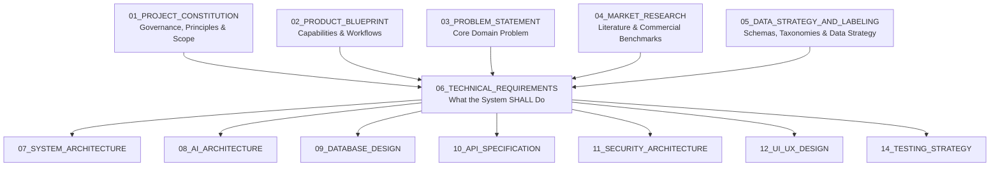
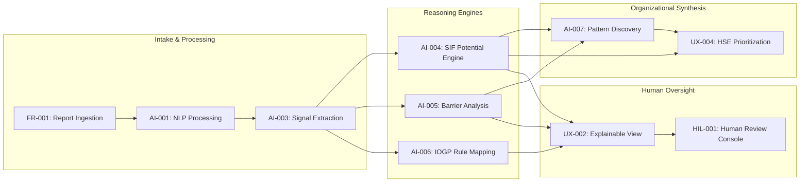
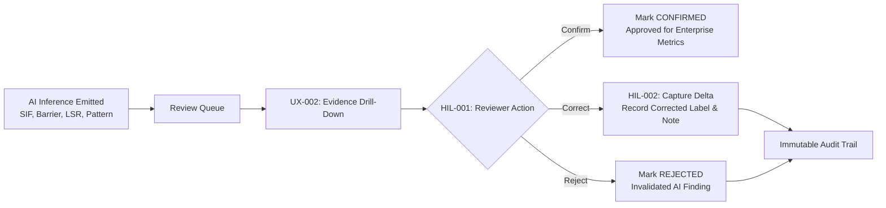

# 06_TECHNICAL_REQUIREMENTS

**Document Status:** Authoritative for Technical System Specifications, Functional Requirements & Acceptance Criteria  
**Governing Documents:** `01_PROJECT_CONSTITUTION.md`, `02_PRODUCT_BLUEPRINT.md`, `03_PROBLEM_STATEMENT.md`, `04_MARKET_RESEARCH.md`, `05_DATA_STRATEGY_AND_LABELING.md`  
**SIH Problem Statement ID:** SIH26165  
**Organization:** Oil India Limited (OIL)  
**Category:** Software  
**Theme:** Smart Automation  
**Team:** Tech Smashers  

---

> **Requirement Conventions & Safety Guardrails:**
> - **Normative Language:** The keywords **SHALL** (mandatory), **SHOULD** (recommended), and **MAY** (optional) are used in accordance with IEEE 830 / ISO/IEC/IEEE 29148 standards.
> - **Priority Levels:**
>   - `P0` — Mandatory for working hackathon prototype (MVP vertical slice).
>   - `P1` — Important for demo completeness and operational depth (Should-Have).
>   - `P2` — Future enterprise capability / post-hackathon production roadmap.
> - **Core Safety Guardrail:** The system assesses **latent SIF potential** within reported events; it **SHALL NOT** claim, state, or be designed as a future-fatality prediction system.

---

## 1. Document Purpose

This document establishes the formal, implementation-ready technical requirements for the **OIL Safety Intelligence Platform**. It translates the business mission defined in the Project Constitution (`01`), the capabilities designed in the Product Blueprint (`02`), the domain problem articulated in the Problem Statement (`03`), the evidence discovered in Market Research (`04`), and the schemas formalized in Data Strategy (`05`) into unambiguous, testable engineering requirements.



This document explicitly defines **what** the software system must do, leaving **how** it is implemented to the downstream architectural and design specifications.

---

## 2. System Scope

### 2.1 In-Scope Capabilities
- Ingestion and normalization of free-text Unsafe Act (UA), Unsafe Condition (UC), Near-Miss, and incident narratives.
- Natural language parsing, syntax handling, negation detection, and temporal sequence extraction.
- Extraction of discrete safety signals: operational activity, hazard energy, worker exposure, and control mentions.
- Assessment of SIF Potential (`YES`, `NO`, `REVIEW`) with explicit confidence indicators.
- Extraction of fine-grained barrier degradation states (`PRESENT/VERIFIED`, `MISSING`, `INCOMPLETE`, `FAILED`, `BYPASSED`, `UNKNOWN`).
- Contextual mapping of narrative evidence to the 9 IOGP Life-Saving Rules (Report 459).
- Multi-dimensional cross-report pattern discovery across activity, installation location, hazard, and barrier failure.
- Decision-support prioritization of high-consequence reports, systemic patterns, and installation hotspots for HSE teams.
- Interactive safety dashboard providing executive overview, pattern explorer, drill-downs, and search/filtering.
- Human-in-the-loop validation console enabling authorized reviewers to confirm, correct, or reject AI determinations.
- Graceful handling of linguistic ambiguity, missing fields, and unrepresented hazard categories.

### 2.2 Out-of-Scope (Strict Non-Requirements)
- Forecasting future accidents, injuries, or fatalities on specific calendar dates or well locations.
- Autonomous field control, automated facility shutdown execution, or automated work stoppage commands.
- Automated work permitting or Permit-to-Work (PTW) issuance without human sign-off.
- Employee disciplinary action tracking, fault allocation, or individual performance evaluation.
- Medical diagnosis or legal liability determinations.
- Direct live production integration with Oil India Limited enterprise IT/SCADA systems during the hackathon.
- Claims of official OIL deployment, endorsement, or formal IOGP compliance certification.

---

## 3. Requirement Classification Matrix

| Requirement ID | Type | Priority | Requirement Title | Source / Origin |
|---|---|---|---|---|
| **FR-001** | Functional | P0 | Safety Report Ingestion | Official PS / Product Blueprint |
| **FR-002** | Functional | P0 | Batch & Sample Dataset Import | Data Strategy / MVP Spec |
| **FR-003** | Functional | P0 | Input Validation & Error Handling | Product Blueprint |
| **AI-001** | AI/NLP | P0 | Free-Text Narrative Preprocessing | Official PS / Data Strategy |
| **AI-002** | AI/NLP | P0 | Negation & Temporal Sequence Handling | Problem Statement / Research |
| **AI-003** | AI/NLP | P0 | Safety Signal Entity Extraction | Official PS / Blueprint |
| **AI-004** | AI/NLP | P0 | SIF Potential Assessment Engine | Official PS / Constitution |
| **AI-005** | AI/NLP | P0 | Fine-Grained Barrier Status Analysis | Constitution / Blueprint |
| **AI-006** | AI/NLP | P0 | Contextual IOGP Life-Saving Rule Mapping | Official PS / IOGP Report 459 |
| **AI-007** | AI/NLP | P0 | Multi-Dimensional Pattern Discovery | Official PS / Blueprint |
| **AI-008** | AI/NLP | P0 | Traceable Phrase Evidence Binding | Constitution / Blueprint |
| **UX-001** | Dashboard | P0 | Executive Safety Intelligence Overview | Official PS / Blueprint |
| **UX-002** | Dashboard | P0 | Single-Report Explainable Drill-Down | Blueprint / Constitution |
| **UX-003** | Dashboard | P0 | Recurring Precursor Pattern Explorer | Official PS / Blueprint |
| **UX-004** | Dashboard | P0 | HSE Intervention Prioritization View | Official PS / Blueprint |
| **UX-005** | Dashboard | P1 | Multi-Dimensional Filtering & Search | Blueprint / User Need |
| **FR-004** | Functional | P1 | Exportable Audit Dossier (PDF) | Roadmap (`15_ROADMAP`) `[registered during consistency remediation]` |
| **FR-006** | Functional | P2 | Email / Alert Notification Engine (post-H0) | Roadmap (`15_ROADMAP`) `[registered during consistency remediation]` |
| **HIL-001** | Governance | P0 | Human Reviewer Verification Console | Constitution / Safety Principle |
| **HIL-002** | Governance | P1 | Structured Feedback Delta Capture | Blueprint / Architecture |
| **DATA-001** | Data | P0 | Canonical Conceptual Safety Schema Enforcement | Data Strategy |
| **DATA-002** | Data | P0 | Strict Decoupling of Data Sources | Constitution / Data Strategy |
| **DATA-003** | Data | P0 | Prevention of Machine Learning Data Leakage | Data Strategy |
| **SEC-001** | Security | P0 | Automated PII Scrubbing on Ingestion | Constitution / Data Strategy |
| **SEC-002** | Security | P0 | Immutability of Audit Trails & Evidence | Constitution / Blueprint |
| **NFR-001** | Performance | P0 | Single-Report Interactive Latency | Prototype Requirement |
| **NFR-002** | Reliability | P0 | Graceful Degradation on Malformed Text | System Architecture |
| **NFR-003** | AI Quality | P0 | Prohibition of Hallucinated Claims | Constitution / Core Principle |
| **OBS-001** | Observability| P0 | Pipeline Processing State Tracking | Blueprint / Systems Spec |

---

## 4. Functional Requirements



### FR-001: Safety Report Ingestion
- **Priority:** `P0`
- **Requirement:** The system SHALL provide an interface to ingest individual safety observations comprising free-text narratives and optional operational metadata (Report Type, Date, Installation/Location, Activity).
- **Rationale:** Ground-level reports originate as unstructured submissions from frontline workers and field supervisors.
- **Inputs:** Free-text narrative string (minimum 10 characters), report classification (`UNSAFE_ACT`, `UNSAFE_CONDITION`, `NEAR_MISS`, `INCIDENT`), optional metadata fields.
- **Outputs:** Normalized, persistent report record assigned a unique UUID and cryptographic hash, queued for semantic processing.
- **Dependencies:** None (System Entry Point).
- **Acceptance Criteria:** Given a raw text narrative with or without complete metadata, the system ingests the record, creates a standardized envelope, and transitions status to `INGESTED` without throwing unhandled exceptions.

### FR-002: Batch & Representative Dataset Import
- **Priority:** `P0`
- **Requirement:** The system SHALL support batch loading of representative synthetic safety reports and public research corpora via structured file upload (JSON or CSV).
- **Rationale:** Necessary to demonstrate cross-report pattern discovery and multi-facility risk prioritization during live evaluation.
- **Inputs:** JSON/CSV file containing an array of safety observation records matching the Canonical Safety Schema.
- **Outputs:** Batch ingestion status report indicating total processed records, validation successes, and syntax rejections.
- **Dependencies:** FR-001, DATA-001.
- **Acceptance Criteria:** Ingests a pre-packaged benchmark batch of 60 representative reports within 15 seconds, creating analyzable database records.

### FR-003: Input Validation & Sanitization
- **Priority:** `P0`
- **Requirement:** The system SHALL validate all incoming narratives, rejecting submissions that contain zero text, exceed size boundaries (>10,000 characters), or consist purely of unprintable characters, returning a descriptive validation error.
- **Rationale:** Prevents denial-of-service, memory leaks, and pipeline crashes caused by corrupted data.
- **Inputs:** Raw input payload.
- **Outputs:** Validation boolean result + localized error message where validation fails.
- **Dependencies:** FR-001.
- **Acceptance Criteria:** Submitting an empty string or whitespace-only narrative yields an immediate HTTP 400 / validation failure stating *"Narrative text cannot be empty."*

---

## 5. AI & NLP Processing Requirements

### AI-001: Free-Text Narrative Preprocessing
- **Priority:** `P0`
- **Requirement:** The system SHALL clean, normalize, and tokenize unstructured field narratives, resolving common oilfield abbreviations (`PTW`, `LOTO`, `BOP`, `SCBA`, `LEL`, `H2S`) and correcting minor spelling errors without modifying the original immutable raw narrative.
- **Rationale:** Frontline industrial text is noisy, colloquial, and heavily abbreviated.
- **Inputs:** Raw narrative string.
- **Outputs:** Normalized token stream and normalized narrative representation preserving original character offset mappings.
- **Dependencies:** FR-001.
- **Acceptance Criteria:** The phrase *"worker entered tank w/o gas test or ptw"* is normalized such that downstream models recognize *"without"*, *"gas test"*, and *"permit to work"*, while maintaining exact pointers to original text indices.

### AI-002: Negation & Temporal Sequence Handling
- **Priority:** `P0`
- **Requirement:** The NLP pipeline SHALL explicitly evaluate linguistic negation (e.g., *"not"*, *"never"*, *"without"*, *"failed to"*) and temporal prepositions (e.g., *"before"*, *"after"*, *"prior to"*) associated with safety safeguards and actions.
- **Rationale:** Keyword matching fails because *"tested before entry"* is safe, whereas *"entered before testing"* is a fatal precursor.
- **Inputs:** Normalized token stream and dependency parse tree.
- **Outputs:** Scope-bound negation flags and directional temporal relationships attached to action-barrier pairs.
- **Dependencies:** AI-001.
- **Acceptance Criteria:** Contrast Pair A (*"Entry commenced after atmosphere verified safe"*) evaluates as `Barrier: PRESENT`; Contrast Pair B (*"Entry commenced before atmosphere verified safe"*) evaluates as `Barrier: INCOMPLETE / BYPASSED`.

### AI-003: Safety Signal Entity Extraction
- **Priority:** `P0`
- **Requirement:** The system SHALL extract seven foundational safety signal classes from the narrative: (1) Operational Activity, (2) Hazard Energy Type, (3) Equipment Involved, (4) Worker Exposure Reality, (5) Unsafe Act, (6) Unsafe Condition, and (7) Safety Controls Mentioned.
- **Rationale:** Structural reasoning requires decomposing prose into inspectable physical facts.
- **Inputs:** Preprocessed text and dependency relationships.
- **Outputs:** Array of structured `SafetySignal` objects containing entity type, canonical normalized value, confidence score, and verbatim text span.
- **Dependencies:** AI-001, AI-002.
- **Acceptance Criteria:** Given *"Welder unclipped harness while grinding pipe at 15m elevation on Rig 4"*, the system extracts:
  - Activity: `Grinding / Hot Work`
  - Hazard: `Working at Height (15m)`
  - Exposure: `True (Elevation without tie-off)`
  - Unsafe Act: `Harness unclipped`
  - Equipment: `Rig 4 Scaffolding / Pipe`

---

## 6. SIF Potential Engine Requirements

### AI-004: SIF Potential Assessment
- **Priority:** `P0`
- **Requirement:** The system SHALL evaluate whether the reported scenario carries Serious Injury & Fatality (SIF) potential, outputting a discrete assessment label: `YES`, `NO`, or `REVIEW`, accompanied by an explicit model confidence score (0.00 – 1.00) and priority level (`P1-Critical`, `P2-High`, `P3-Standard`).
- **Rationale:** SIF triage separates high-consequence precursor events from routine minor observations.
- **Inputs:** Extracted Safety Signals (Activity, Hazard, Exposure, Barrier Status).
- **Outputs:** `SIFPotentialAssessment` object containing assessment label, priority tier, confidence score, and contributing signal identifiers.
- **Dependencies:** AI-003, AI-005.
- **Mandatory Behavioral Rules:**
  1. **Outcome Decoupling:** A report stating *"no injury occurred"* or classified as a Near-Miss SHALL NOT default to `SIF: NO`. If high-energy hazards exist with compromised critical barriers, the system SHALL classify `SIF: YES`.
  2. **Uncertainty Routing:** When critical energy is detected but narrative ambiguity prevents determining barrier integrity, the system SHALL output `SIF: REVIEW` rather than forcing a low-confidence binary classification.
  3. **No Fatality Prediction:** The output SHALL indicate situational potential in past reported events, NEVER forecasting future fatal events.
- **Acceptance Criteria:** A near-miss report describing a suspended 2-ton drill pipe slipping from a hoist over an active walkway with zero injuries yields `SIF Potential: YES`, `Priority: P1-Critical`.

---

## 7. Barrier & Control Analysis Requirements

### AI-005: Fine-Grained Barrier Status Evaluation
- **Priority:** `P0`
- **Requirement:** The system SHALL identify critical safety barriers mentioned or implied in the narrative and evaluate their operational integrity across five discrete states: `PRESENT/VERIFIED`, `MISSING`, `INCOMPLETE`, `FAILED`, `BYPASSED`, or `UNKNOWN`.
- **Rationale:** HSE teams need to know exactly which safeguard broke down to initiate corrective engineering or procedural repairs.
- **Inputs:** Extracted control mentions, negation flags, and action-verb relationships.
- **Outputs:** Array of `BarrierFinding` objects detailing Barrier Name, Function (Preventative / Mitigative), Evaluated Status, and Verbatim Justifying Span.
- **Dependencies:** AI-002, AI-003.
- **Mandatory Distinctions:**
  - The system SHALL NOT equate a control being *mentioned* with a control being *verified effective* (e.g., *"gas tester was present on site"* does not prove *"gas test was completed"*).
- **Acceptance Criteria:** Given *"Operator bypassed pressure relief interlock during compressor startup"*, the system outputs: `Barrier: Pressure Relief Interlock`, `Status: BYPASSED`.

---

## 8. IOGP Life-Saving Rule Mapping Requirements

### AI-006: Contextual Life-Saving Rule Mapping
- **Priority:** `P0`
- **Requirement:** The system SHALL contextually map the reported scenario to one or more of the 9 standardized IOGP Life-Saving Rules (Report 459), citing supporting text evidence.
- **Rationale:** Standardizes informal worker observations into the universally recognized safety vocabulary of the international oil and gas industry.
- **Inputs:** Extracted Activity, Hazard Energy, and Barrier Findings.
- **Outputs:** Array of mapped rules containing Rule Name (e.g., `Confined Space`, `Energy Isolation`, `Line of Fire`), mapping confidence, and triggering evidence span.
- **Dependencies:** AI-003, AI-005.
- **Acceptance Criteria:** Given a report describing unisolated valve maintenance with residual hydraulic pressure, the system maps `IOGP Rule: Energy Isolation` with evidence span *"without bleeding pressure line"*.

---

## 9. Cross-Report Pattern Discovery Requirements

```
+-------------------------------------------------------------------------------+
|             INDIVIDUAL REPORT REQUIREMENT vs. PATTERN REQUIREMENT             |
+-------------------------------------------------------------------------------+
|  LEVEL 1: SINGLE-REPORT REQUIREMENT (AI-004, AI-005, AI-006)                  |
|  "Analyze Report #104: Extract signals, determine barrier failure, assess     |
|   SIF potential, and bind text evidence."                                     |
+-------------------------------------------------------------------------------+
                                       │
                                       ▼ (Cross-Report Pipeline Aggregation)
+-------------------------------------------------------------------------------+
|  LEVEL 2: CROSS-REPORT RECURRING PATTERN REQUIREMENT (AI-007)                 |
|  "Cluster all analyzed reports across {Activity + Site + Hazard + Barrier}.   |
|   Identify if an identical barrier failure has recurred >= 3 times in 90 days|
|   and flag systemic enterprise hotspots."                                     |
+-------------------------------------------------------------------------------+
```

### AI-007: Multi-Dimensional Precursor Pattern Discovery
- **Priority:** `P0`
- **Requirement:** The system SHALL aggregate analyzed records across the database to discover and surface recurring precursor patterns matching the multi-dimensional signature: $\langle \text{Activity}, \text{Hazard Energy}, \text{Installation}, \text{Barrier Failure Mode} \rangle$.
- **Rationale:** Individual reports appear isolated; recurring patterns expose systemic operational drift and procedural breakdown across facilities.
- **Inputs:** Corpus of analyzed safety report records.
- **Outputs:** Ranked list of `RecurringPattern` objects containing Pattern ID, Component Dimensions, Recurrence Count, Associated Report UUIDs, Severity Weight, and First/Last Observed Dates.
- **Dependencies:** AI-004, AI-005, AI-006.
- **Trigger Conditions:**
  - A pattern SHALL be declared active if recurrence count $N \ge 3$ within a 90-day window and at least one contributing report has `SIF Potential: YES` or `REVIEW`.
- **Acceptance Criteria:** Given 4 independent reports from Drilling Rig 02 describing workers unhooking safety harnesses while working on monkey boards, the system groups them into `Pattern: Working at Height - Fall Protection Bypass on Rig 02 (Count: 4)`.

---

## 10. Explainability & Evidence Requirements

### AI-008: Verbatim Text-Traceable Evidence Binding
- **Priority:** `P0`
- **Requirement:** Every SIF assessment, barrier status finding, and IOGP Life-Saving Rule mapping emitted by the platform SHALL include exact character-level offsets and verbatim text spans from the original narrative justifying the output.
- **Rationale:** Safety professionals reject "black-box" predictions; auditability is non-negotiable in safety engineering.
- **Inputs:** Model reasoning graph / extraction spans.
- **Outputs:** `EvidenceChain` structure containing `verbatim_phrase`, `start_char`, `end_char`, and `target_signal`.
- **Dependencies:** AI-001, AI-003, AI-004.
- **Acceptance Criteria:** The UI displays interactive highlights directly over the narrative text corresponding exactly to the phrases that triggered the SIF flag and barrier findings.

---

## 11. HSE Prioritization Requirements

### UX-004: Decision-Support Prioritization Engine
- **Priority:** `P0`
- **Requirement:** The system SHALL rank safety reports, operational installations, and recurring patterns by concentration of SIF potential, surfacing a prioritized action queue for HSE personnel.
- **Rationale:** Manual monthly review cycles fail because safety teams drown in low-consequence housekeeping reports; prioritization directs scarce engineering and audit resources to areas of acute risk.
- **Inputs:** Aggregated SIF assessments, recurring pattern weights, facility IDs.
- **Outputs:** Prioritized queue of reports, top recurring pattern hotspots, and ranked facility risk index.
- **Dependencies:** AI-004, AI-007.
- **Non-Autonomous Guardrail:** The system SHALL present prioritized rankings solely as decision support; it SHALL NOT issue automated facility shutdown orders, work authorization permits, or disciplinary sanctions.
- **Acceptance Criteria:** A facility with 5 reports involving recurring gas testing bypasses ranks higher in the HSE attention queue than a facility with 50 reports involving slip/trip hazards and missing safety posters.

---

## 12. Human-in-the-Loop & Governance Requirements



### HIL-001: Human Reviewer Verification Console
- **Priority:** `P0`
- **Requirement:** The system SHALL provide an authorized reviewer interface enabling safety officers to inspect evidence, and explicitly `CONFIRM`, `CORRECT`, or `REJECT` any AI-generated finding.
- **Rationale:** High-consequence safety decisions require human accountability; algorithmic outputs are advisory.
- **Inputs:** User review action, optional field override values, optional reviewer comment string.
- **Outputs:** Updated report governance record (`review_status`, `reviewer_id`, `review_timestamp`, `audit_delta`).
- **Dependencies:** UX-002.
- **Acceptance Criteria:** A safety officer changes a false-positive `SIF: YES` to `SIF: NO`; the database records the reviewer's ID, updates the authoritative report status, and preserves the original AI inference for model auditability.

### HIL-002: Structured Feedback Delta Capture
- **Priority:** `P1`
- **Requirement:** When a reviewer corrects an AI output, the system SHALL store the exact delta (original AI prediction vs. human ground-truth correction) to support future model evaluation and calibration.
- **Rationale:** Captures domain expert knowledge to benchmark and refine future system releases.
- **Inputs:** Human override payload.
- **Outputs:** Stored feedback record in the governance schema.
- **Dependencies:** HIL-001.
- **Acceptance Criteria:** Correcting a barrier status from `MISSING` to `FAILED` logs a structured delta record `{field: "barrier_status", ai_val: "MISSING", human_val: "FAILED"}`.

---

## 13. Dashboard & User Interface Requirements

### UX-001: Executive Safety Intelligence Overview
- **Priority:** `P0`
- **Requirement:** The dashboard SHALL display real-time aggregate statistics: Total Ingested Reports, SIF Potential Distribution (count and percentage YES / NO / REVIEW), Active Recurring Precursor Patterns, and Top Barrier Failure Hotspots.
- **Rationale:** Provides HSE directors with immediate situational awareness across enterprise operations.
- **Acceptance Criteria:** Ingesting a new batch updates overview statistics immediately without requiring full browser reload.

### UX-002: Single-Report Explainable Drill-Down
- **Priority:** `P0`
- **Requirement:** The UI SHALL provide a comprehensive single-report view displaying: verbatim narrative with interactive evidence highlights, extracted safety signals, barrier integrity findings, mapped IOGP Life-Saving Rules, and human review controls.
- **Rationale:** Enables reviewers to audit and verify AI reasoning in under 30 seconds per report.
- **Acceptance Criteria:** Clicking an evidence phrase in the explanation panel highlights the identical phrase in the original narrative text block.

### UX-003: Recurring Precursor Pattern Explorer
- **Priority:** `P0`
- **Requirement:** The UI SHALL provide a dedicated Pattern Explorer view listing all active multi-report clusters, displaying their operational dimensions, recurrence frequency, and an expandable list of contributing reports.
- **Rationale:** Enables safety managers to investigate systemic facility issues rather than treating incidents in isolation.
- **Acceptance Criteria:** Expanding a pattern row shows the list of contributing report summaries and allows one-click navigation to their drill-down views.

### UX-005: Multi-Dimensional Search & Filtering
- **Priority:** `P1`
- **Requirement:** The system SHALL allow users to filter reports simultaneously by SIF Potential (`YES/NO/REVIEW`), IOGP Life-Saving Rule, Barrier Status, Installation/Site, Activity, and Review Status.
- **Rationale:** Supports focused incident investigations (e.g., *"Show all unreviewed Confined Space reports at Gathering Station 01"*).
- **Acceptance Criteria:** Applying filters returns updated result counts and report cards within 500ms for a 1,000-report database.

---

## 14. Data Integrity, Schema & Provenance Requirements

### DATA-001: Canonical Safety Schema Enforcement
- **Priority:** `P0`
- **Requirement:** All ingested reports, regardless of external source format, SHALL be converted into and validated against the Canonical Conceptual Safety Schema defined in `05_DATA_STRATEGY_AND_LABELING.md`.
- **Rationale:** Ensures complete architectural separation between variable external data formats and internal reasoning models.
- **Acceptance Criteria:** Ingesting CSV, JSON, or direct UI text produces structurally identical internal records.

### DATA-002: Strict Data Source Provenance Tagging
- **Priority:** `P0`
- **Requirement:** Every safety report record SHALL carry an immutable `data_source_type` tag (`PUBLIC_DATA`, `SYNTHETIC_DATA`, `MANUALLY_LABELLED`, `AUTHORIZED_OIL_DATA`).
- **Rationale:** Prevents synthetic demonstration data from ever being confused with or represented as actual confidential Oil India Limited records.
- **Acceptance Criteria:** The UI visibly displays a provenance badge (`SYNTHETIC / DEMO` or `PUBLIC BENCHMARK`) on every displayed report card.

### DATA-003: Machine Learning Data Leakage Prevention
- **Priority:** `P0`
- **Requirement:** The system data pipeline SHALL enforce strict separation between training/calibration sets and blind evaluation benchmark sets, partitioning records by simulated installation rather than random row-level splitting.
- **Rationale:** Prevents models from memorizing installation-specific terminology or leaking temporal outcomes.
- **Acceptance Criteria:** Evaluation reports are sourced from simulated sites completely withheld during rule calibration.

---

## 15. Security & Privacy Requirements

### SEC-001: Automated PII Scrubbing on Ingestion
- **Priority:** `P0`
- **Requirement:** The ingestion pipeline SHALL scan raw narrative text and redact Personally Identifiable Information (worker names, employee ID numbers, telephone numbers, license plates) before passing text to downstream models.
- **Rationale:** Protects worker privacy and complies with data minimization principles.
- **Acceptance Criteria:** The text *"Worker John Doe (Emp #48102) entered vessel"* is stored and processed as *"Worker [REDACTED_NAME] (Emp [REDACTED_ID]) entered vessel"*.

### SEC-002: Immutable Audit Trail Logging
- **Priority:** `P0`
- **Requirement:** The system SHALL maintain an append-only audit trail logging all human review overrides, user logins, and batch data ingestions, cryptographically secured via SHA-256 record hashes.
- **Rationale:** Ensures legal defensibility and regulatory audit compliance.
- **Acceptance Criteria:** Overriding an AI classification generates a persistent log record containing previous value, new value, reviewer timestamp, and user ID.

---

## 16. Non-Functional Requirements (NFR)

### NFR-001: Processing Latency
- **Priority:** `P0`
- **Requirement:** The system SHALL process an individual safety report (NLP, Signal Extraction, Barrier Evaluation, SIF Classification, LSR Mapping) and render results in the UI within $\le 3.0$ seconds on standard prototype hardware.
- **Rationale:** Ensures responsive, interactive demonstrations and fast operational triage.
- **Acceptance Criteria:** Submitting a 100-word narrative via the UI displays the complete analysis panel within 3 seconds.

### NFR-002: Reliability & Graceful Degradation
- **Priority:** `P0`
- **Requirement:** If the NLP engine encounters unparseable text or internal extraction failure, the system SHALL NOT crash; it SHALL log the failure, mark the report `Status: PROCESSING_FAILED`, set `SIF Potential: REVIEW`, and present an informative error notification in the UI.
- **Rationale:** Safety software must never fail silently or drop reports from the review queue.
- **Acceptance Criteria:** Ingesting a corrupted byte string yields a handled error state with zero unhandled server exceptions.

### NFR-003: Absolute Prohibition of Fabricated Intelligence
- **Priority:** `P0`
- **Requirement:** The system SHALL NOT generate fabricated safety signals, hallucinated evidence spans, invented OIL incident statistics, or ungrounded certainty scores. Where information is missing or ambiguous, the system SHALL explicitly output `UNKNOWN`, `REVIEW`, or `INSUFFICIENT_EVIDENCE`.
- **Rationale:** In safety-critical systems, false certainty can lead directly to fatal real-world oversights.
- **Acceptance Criteria:** Submitting a narrative that describes only weather conditions with zero operational details outputs `Hazard: UNKNOWN`, `SIF Potential: NO`, with zero invented barrier failures.

### NFR-004: Reproducibility
- **Priority:** `P0`
- **Requirement:** Given identical narrative text, model versions, and configuration rules, the system SHALL produce identical structured safety signals, barrier states, and SIF assessments across repeated executions.
- **Rationale:** Non-deterministic safety evaluations undermine user trust and regulatory compliance.
- **Acceptance Criteria:** Re-analyzing the same report 10 consecutive times yields identical classification labels and evidence spans.

---

## 17. Observability Requirements (OBS)

| Requirement ID | Priority | Metric / Event Monitored | Target / Operational Threshold |
|---|---|---|---|
| **OBS-001** | P0 | Pipeline Ingestion State | Track state (`INGESTED`, `PARSED`, `EVALUATED`, `REVIEWED`, `FAILED`). |
| **OBS-002** | P0 | SIF Assessment Distribution | Monitor ratio of YES / NO / REVIEW to detect model drift or pipeline bias. |
| **OBS-003** | P0 | Model & Pipeline Versioning | Display active NLP model ID, taxonomy version, and ruleset version in UI footer. |
| **OBS-004** | P1 | End-to-End Processing Latency | Log execution time per pipeline stage (Preprocessing, Extraction, Reasoning). |
| **OBS-005** | P1 | Human Review Override Rate | Monitor frequency of human corrections to identify low-performing rulesets. |

---

## 18. Prototype vs. Production Requirements Comparison

| Dimension | Prototype Requirement (`P0` Hackathon Scope) | Production Requirement (`P2` Enterprise Scope) |
|---|---|---|
| **Data Sourcing** | Curated synthetic upstream reports (60 samples) + open public corpora (Zenodo, UK EA). | Direct read-only database connectors to OIL SAP / HSSE enterprise data warehouses. |
| **Deployment Target** | Local development / demonstration environment (Single-instance web server + embedded database). | Multi-zone Kubernetes cluster behind OIL corporate enterprise firewall. |
| **Identity & Access** | Simplified role simulation (`HSE Analyst`, `HSE Manager`, `Reviewer`). | Enterprise Single Sign-On (SSO) via SAML 2.0 / OAuth2 with Active Directory RBAC. |
| **Model Calibration** | Rule-calibrated semantic embeddings + domain safety heuristic engine. | Fine-tuned domain models trained on authorized, historical enterprise datasets. |
| **Processing Cadence** | On-demand single report analysis + manual batch file uploads. | Continuous streaming ingestion via enterprise webhooks and scheduled background ETL. |
| **Regulatory Validation**| Academic benchmark evaluation against team consensus gold standard ($\kappa \ge 0.80$). | Formal statutory safety audit, OSHA/DGMS compliance sign-off, and legal review. |

---

## 19. Requirement Traceability Matrix

| Requirement ID | Problem Statement Mandate | Product Blueprint Capability | Data Strategy Dependency | Downstream Architectural Document |
|---|---|---|---|---|
| **FR-001 / FR-002** | Ingest free-text safety reports | Module 1: Safety Report Intake | Canonical Safety Schema | `07_SYSTEM_ARCHITECTURE`, `10_API_SPECIFICATION` |
| **AI-001 / AI-002** | NLP narrative comprehension | Module 2: NLP Analysis | Preprocessed Token Stream | `08_AI_ARCHITECTURE` |
| **AI-003** | Understand safety signals in text | Module 3: Safety Signal Extraction | Entity Taxonomies | `08_AI_ARCHITECTURE` |
| **AI-004** | Detect SIF potential vs. outcome | Module 4: SIF Potential Engine | SIF Label Schema (`YES/NO/REV`) | `08_AI_ARCHITECTURE` |
| **AI-005** | Identify failed/missing safeguards | Module 6: Barrier Analysis | 5 Barrier Status States | `08_AI_ARCHITECTURE` |
| **AI-006** | Map to IOGP Life-Saving Rules | Module 7: IOGP Rule Mapping | IOGP 9 Rule Taxonomy | `08_AI_ARCHITECTURE` |
| **AI-007** | Surface recurring precursor patterns| Module 8: Pattern Discovery | Multi-Dimensional Tuples | `07_SYSTEM_ARCHITECTURE` |
| **AI-008** | Traceable, trustworthy reasoning | Module 5: Explainability | Text Evidence Spans | `08_AI_ARCHITECTURE`, `09_DATABASE_DESIGN` |
| **UX-001 / UX-004** | Prioritize HSE attention | Module 9 & 10: Prioritization Dashboard | Risk Concentration Index | `12_UI_UX_DESIGN` |
| **HIL-001 / HIL-002** | Ensure human safety governance | Module 11: Human Review | Reviewer Delta Schema | `09_DATABASE_DESIGN`, `12_UI_UX_DESIGN` |
| **SEC-001** | Protect sensitive personnel data | Security Architecture | PII Redaction Filter | `11_SECURITY_ARCHITECTURE` |

---

## 20. Prototype Acceptance Scenarios (Given / When / Then)

### Scenario 1: Confined Space Precursor Near-Miss (SIF Positive)
- **Given:** A representative report text: *"Technician entered the condensate separator before atmospheric testing was logged. No standby attendant was present at the manway. Supervisor stopped work immediately. No injuries."*
- **When:** The system analyzes the report.
- **Then:** The system SHALL output:
  - SIF Potential: `YES` (Priority: `P1-Critical`)
  - IOGP Rule: `Confined Space`
  - Barrier Findings: `Atmospheric Testing: INCOMPLETE`; `Standby Attendant: MISSING`
  - Evidence Spans: Linked to *"before atmospheric testing was logged"* and *"No standby attendant was present"*.

### Scenario 2: Routine Housekeeping Event (SIF Negative)
- **Given:** A representative report text: *"Found empty wooden pallets stacked unevenly near the walkway behind warehouse 3. Pallets were restacked properly. No injuries."*
- **When:** The system analyzes the report.
- **Then:** The system SHALL output:
  - SIF Potential: `NO` (Priority: `P3-Standard`)
  - Hazard: `Housekeeping / Slip, Trip, Fall on same level`
  - Barrier Findings: None critical failed
  - Mapped IOGP Rule: `None`

### Scenario 3: Ambiguous High-Energy Exposure (SIF Review Routing)
- **Given:** A representative report text: *"Worker smelled strong sulfur odor while gauging tank battery 2. Left the tank area immediately."*
- **When:** The system analyzes the report.
- **Then:** The system SHALL output:
  - SIF Potential: `REVIEW`
  - Hazard: `Toxic Gas (H2S)`
  - Rationale: High-energy hazard indicated, but narrative provides insufficient detail to confirm gas detector presence or breathing apparatus status.
  - Review Queue: Routed to Human Review queue with badge *"Information Incomplete"*.

### Scenario 4: Negation Sensitivity Contrast
- **Given:** Report A (*"LOTO lock verified on main circuit breaker before electrical cabinet opened"*) and Report B (*"Electrical cabinet opened before LOTO lock was verified on main circuit breaker"*).
- **When:** Both reports are processed by the system.
- **Then:** Report A SHALL evaluate to `Barrier: LOTO (PRESENT)`, `SIF Potential: NO`; Report B SHALL evaluate to `Barrier: LOTO (INCOMPLETE/BYPASSED)`, `SIF Potential: YES`.

### Scenario 5: Multi-Report Pattern Clustering
- **Given:** Three independent reports submitted across 30 days from Well Test Station 04, each describing high-pressure bleed-off valves opened without barricading the discharge line.
- **When:** The Cross-Report Pattern Discovery Engine runs.
- **Then:** The system SHALL group these reports into an active recurring pattern: `{Activity: Well Testing, Hazard: High Pressure, Barrier: Line of Fire Barricade Missing}`, displaying `Recurrence Count: 3` on the dashboard.

### Scenario 6: Human Reviewer Override
- **Given:** A report evaluated by the AI as `SIF: YES`.
- **When:** An authorized HSE reviewer inspects the evidence, determines the situation had secondary physical containment, and clicks `CORRECT` to set `SIF: NO`.
- **Then:** The system SHALL update the displayed status to `SIF: NO (Human Overridden)`, record the reviewer's ID and timestamp, and retain the original AI classification in the audit delta log.

### Scenario 7: Malformed & Empty Narrative Handling
- **Given:** A user attempts to submit a report containing only whitespace or `"N/A"`.
- **When:** Ingestion validation executes.
- **Then:** The system SHALL reject the submission with an explicit error message: *"Narrative must contain substantive description of observation (>10 characters)"*.

### Scenario 8: PII Redaction
- **Given:** Raw narrative text: *"Driller Ramesh Sharma (ID: 99421) bypassed mud pump sensor"*.
- **When:** Ingestion preprocessing runs.
- **Then:** Stored and displayed text SHALL read: *"Driller [REDACTED_NAME] (ID: [REDACTED_ID]) bypassed mud pump sensor"*.

### Scenario 9: Multi-Dimensional Filter Execution
- **Given:** A database of 60 analyzed reports.
- **When:** A user filters by `IOGP Rule: Confined Space` AND `SIF Potential: YES`.
- **Then:** The dashboard view updates within 500ms, displaying exclusively the subset of reports meeting both criteria.

### Scenario 10: Zero-Hallucination Guardrail Execution
- **Given:** A report describing: *"Completed routine morning handover meeting in the main office."*
- **When:** The AI pipeline executes.
- **Then:** The system SHALL output `Activity: Meeting`, `Hazard: None`, `SIF Potential: NO`, and SHALL NOT invent dropped object or chemical exposure flags.

---

## 21. MVP (P0) Technical Checklist & Definition of Done

The hackathon prototype is declared **Technically Done** when all P0 requirements are verified working end-to-end:

- [ ] **P0-1: Ingestion Pipeline:** Successfully accepts single text submissions via UI and imports pre-packaged batch JSON files.
- [ ] **P0-2: NLP Preprocessing:** Tokenizes, cleans, and resolves oilfield abbreviations while preserving verbatim character indices.
- [ ] **P0-3: Signal Extraction:** Correctly extracts Activity, Hazard Energy, Exposure, and Control entities.
- [ ] **P0-4: SIF Potential Classification:** Decouples outcome from potential, outputting `YES`, `NO`, or `REVIEW` with confidence.
- [ ] **P0-5: Barrier Status Analysis:** Evaluates barriers across `PRESENT`, `MISSING`, `INCOMPLETE`, `FAILED`, and `BYPASSED`.
- [ ] **P0-6: IOGP Rule Mapping:** Maps narrative scenarios to the 9 IOGP Life-Saving Rules with supporting evidence.
- [ ] **P0-7: Verbatim Explainability:** Highlights exact justifying phrase spans directly in the UI report viewer.
- [ ] **P0-8: Pattern Discovery:** Identifies and displays at least 3 distinct multi-report recurring precursor clusters from the dataset.
- [ ] **P0-9: HSE Prioritization:** Ranks reports, patterns, and installations by SIF concentration.
- [ ] **P0-10: Human Review Console:** Allows reviewers to Confirm, Correct, or Reject findings and records audit trails.
- [ ] **P0-11: Data Provenance Transparency:** Displays visible badges distinguishing synthetic demonstration data from public benchmarks.
- [ ] **P0-12: Error Handling & Guardrails:** Demonstrates graceful handling of empty inputs, negation contrast pairs, and ambiguous narratives without crashing or hallucinating.
- [ ] **P0-13: Execution Latency:** Single report analysis finishes within $\le 3.0$ seconds on test hardware.

---

## 22. Future Requirements (P2 Post-Hackathon Roadmap)

The following enterprise capabilities are strictly classified as `P2` and reserved for future enterprise production integration:
- **FR-P2-01: Direct SAP / HSSE Ingestion Adapter:** Real-time bi-directional database connector to Oil India Limited's enterprise incident tracking platforms.
- **FR-P2-02: Multi-Lingual Regional Translation:** Automated translation supporting Assamese, Bengali, and Hindi frontline voice/text inputs.
- **FR-P2-03: Multi-Modal Computer Vision:** Automated analysis of attached inspection photos to verify PPE and physical barrier status.
- **FR-P2-04: Automated CAPA Workflow Dispatch:** Automatic generation and assignment of Corrective and Preventive Action tickets in external enterprise ERP systems.
- **FR-P2-05: Enterprise SSO & RBAC Integration:** Integration with corporate Active Directory / Okta identity providers.
