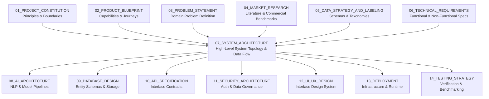
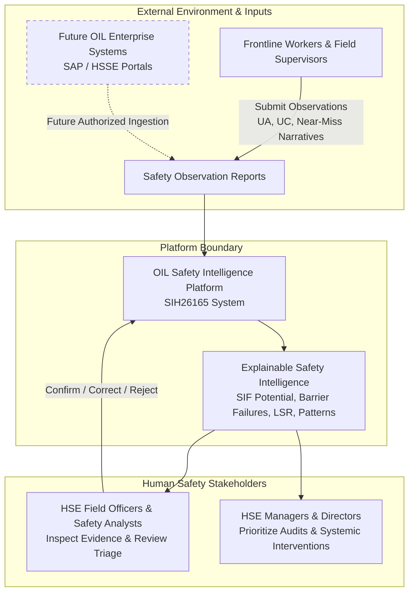
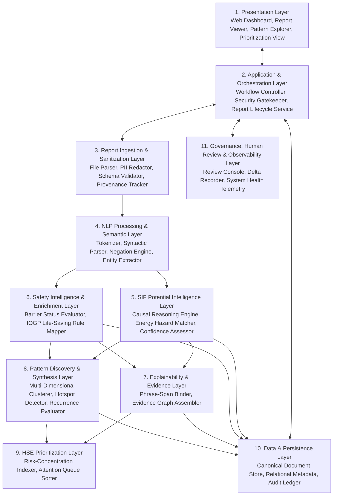
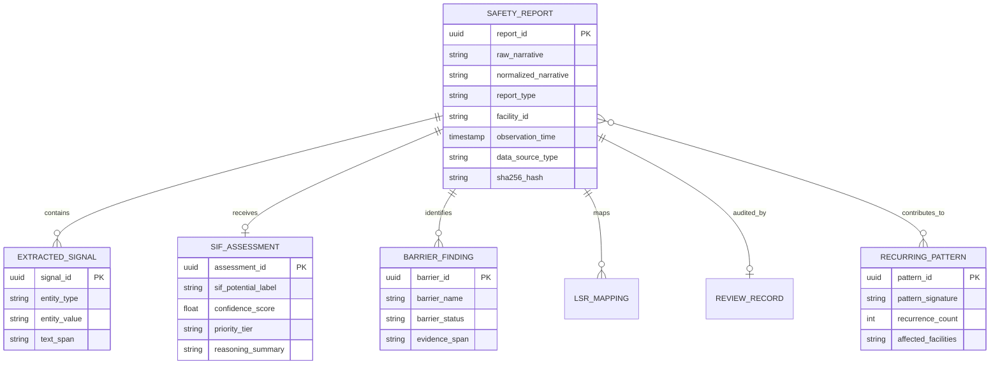
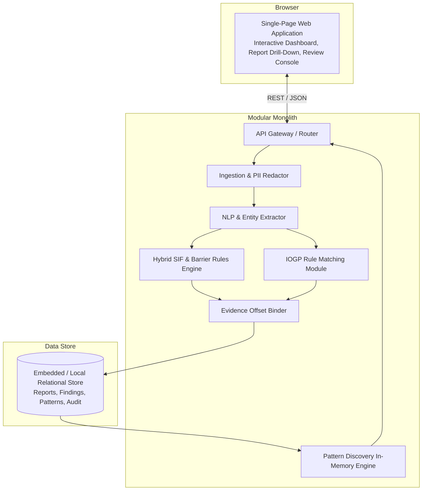

# 07_SYSTEM_ARCHITECTURE

**Document Status:** Authoritative for High-Level System Design, Component Topologies, Data Flows & Architectural Boundaries  
**Governing Documents:** `01_PROJECT_CONSTITUTION.md`, `02_PRODUCT_BLUEPRINT.md`, `03_PROBLEM_STATEMENT.md`, `04_MARKET_RESEARCH.md`, `05_DATA_STRATEGY_AND_LABELING.md`, `06_TECHNICAL_REQUIREMENTS.md`  
**SIH Problem Statement ID:** SIH26165  
**Organization:** Oil India Limited (OIL)  
**Category:** Software  
**Theme:** Smart Automation  
**Team:** Tech Smashers  

---

> **Architectural Tagging Discipline:**
> - `[PROPOSED ARCHITECTURE]` — System design topologies and boundaries developed by Tech Smashers for SIH26165.
> - `[RECOMMENDED IMPLEMENTATION]` — Pragmatic implementation pattern selected for prototype viability without constraining future enterprise architecture.
> - `[PROTOTYPE ASSUMPTION]` — Design choice made specifically to enable rapid hackathon demonstration without access to live corporate infrastructure.
> - `[FUTURE ENHANCEMENT]` — Architectural evolution path planned for full-scale production deployment following formal enterprise authorization.

---

## 1. Purpose of this Document

This document establishes the high-level **System Architecture** of the **OIL Safety Intelligence Platform**. It provides the authoritative blueprint for how software components, data pipelines, reasoning services, and user interfaces interconnect into a unified, reliable safety intelligence system.



This document explicitly answers:
- What are the major functional and computational components?
- How does safety data transition from raw text to explainable organizational intelligence?
- How are single-report analyses decoupled from cross-report pattern discovery?
- Where are human safety professionals positioned to audit and govern AI recommendations?
- What information crosses each logical and physical service boundary?
- How does the prototype provide a direct vertical slice while maintaining a clean evolution path toward enterprise production?

---

## 2. Architectural Principles & Conceptual Boundaries

The architecture is governed by fourteen non-negotiable principles `[PROPOSED ARCHITECTURE]`:

1. **Safety-First Decision Support:** The system functions as an assistive decision-support platform for qualified HSE personnel; it does not possess autonomous authority to halt or permit industrial operations.
2. **Human-in-the-Loop Governance:** No algorithmic inference is treated as authoritative until confirmed or audited by an authorized safety professional.
3. **Explainability by Design:** A classification output without verbatim text attribution is an incomplete system output. Evidence binding is a first-class citizen of the data flow.
4. **Decoupling of Potential from Actual Outcome:** Safety potential must be evaluated on hazard energy and barrier degradation, independent of whether injuries were recorded.
5. **Context-Aware Semantic NLP:** Architecture must reject naive keyword filters in favor of language parsing sensitive to negation, syntax, and temporal sequence.
6. **Modular Service Boundaries:** Functional units (NLP, Barrier Analysis, SIF Engine, Pattern Discovery) must maintain clean interfaces to allow independent algorithmic evolution.
7. **Traceability and Immutability:** An immutable audit chain must link every derived finding back to raw narrative text and subsequent human overrides.
8. **Data Provenance Preservation:** Data sources must be cryptographically hashed and tagged (`SYNTHETIC`, `PUBLIC`, `AUTHORIZED_OIL`) to prevent data misrepresentation.
9. **Zero Fabricated Intelligence:** If narrative text lacks substantive detail, the architecture must emit `UNKNOWN` or `REVIEW` rather than hallucinatory certainty.
10. **Dual-Track Processing:** Single-report real-time analysis must remain logically and computationally separate from multi-report pattern discovery.
11. **Pragmatic Prototype Simplicity:** The MVP must operate as a clean, cohesive application avoiding premature microservice complexity.
12. **Enterprise Evolution Readiness:** Data contracts and service layers must be architected so that enterprise database connectors can replace prototype mocks with zero pipeline redesign.
13. **Privacy and Data Minimization:** Narrative processing pipelines must automatically redact PII on ingestion prior to reasoning.
14. **Asymmetric Error Cost Awareness:** The architecture must bias pipeline tuning to minimize False Negatives (missed precursors) over False Positives.

> **Foundational Conceptual Distinctions Enforced by the Architecture:**
> - `SIF Potential ≠ Future Fatality Prediction` (Evaluates past situational potential, not future calendar forecasts).
> - `Actual Outcome ≠ SIF Potential` (Near-misses with zero harm can possess maximum SIF potential).
> - `Keyword Detection ≠ Contextual Understanding` (Syntactic state and negation govern barrier integrity).
> - `Frequency ≠ Risk` (A rare, unmitigated high-energy event outweighs repeated low-energy housekeeping events).
> - `Mentioned Control ≠ Verified Effective Control` (Mentioning a gas detector does not prove gas was tested).

---

## 3. System Context

The system operates within the operational context of industrial Health, Safety & Environment (HSE) management in upstream petroleum operations:



### Context Boundary Interactions
- **Inputs:** Raw free-text narratives from Unsafe Act (UA), Unsafe Condition (UC), Near-Miss, and Incident logs, accompanied by available operational coordinates (Site, Date, Activity).
- **Processing Engine:** The proposed platform normalizes prose, extracts semantic signals, evaluates barrier degradation, maps IOGP rules, and discovers cross-facility clusters.
- **Outputs & Stakeholder Value:** Delivers prioritized queues and interactive evidence panels to HSE Analysts for triage validation, and multi-dimensional risk concentration maps to HSE Managers for targeted preventative action.

---

## 4. High-Level Architecture (Logical Layers)

The platform is structured into eleven cohesive logical layers `[PROPOSED ARCHITECTURE]`:



### Layer Responsibilities & Boundaries

| Layer | Primary Responsibilities | Inputs | Outputs | Scope |
|---|---|---|---|---|
| **1. Presentation** | Renders dashboard views, evidence overlays, pattern graphs, and review action consoles. | User actions, API payloads | Rendered UI state | `P0 (MVP)` |
| **2. Application / Orchestration**| Manages workflow execution, dispatches jobs, routes API requests, enforces role access. | Client requests, pipeline events | Structured API responses | `P0 (MVP)` |
| **3. Ingestion & Sanitization** | Ingests JSON/CSV/Text, redacts PII, generates SHA-256 hashes, normalizes to Canonical Schema. | Raw reports | Normalized, sanitized report envelopes | `P0 (MVP)` |
| **4. NLP & Semantic** | Tokenizes text, resolves abbreviations, parses negation and temporal syntax, extracts entities. | Normalized narrative string | Structured `SafetySignals` (Activity, Hazard, Exposure, Controls) | `P0 (MVP)` |
| **5. SIF Potential Intelligence** | Assesses latent fatal/permanent disabling potential independently of actual harm. | `SafetySignals`, Barrier findings | `SIF: YES/NO/REVIEW`, Priority tier, Confidence | `P0 (MVP)` |
| **6. Safety Enrichment** | Evaluates 5 barrier states; maps hazards and activities to 9 IOGP Life-Saving Rules. | `SafetySignals`, Action verbs | `BarrierFindings`, Mapped `IOGP_LSR` | `P0 (MVP)` |
| **7. Explainability & Evidence** | Maps derived labels to verbatim narrative phrase offsets; builds inspectable justification chains. | Derived findings, Token spans | `EvidenceChain` (character spans + links) | `P0 (MVP)` |
| **8. Pattern Discovery** | Aggregates multi-report data to identify recurring operational failure clusters ($\ge 3$ reports). | Analyzed report corpus | `RecurringPattern` objects | `P0 (MVP)` |
| **9. HSE Prioritization** | Computes facility and activity risk concentrations; sorts attention queues. | SIF assessments, Pattern weights | Ranked attention queues, Site Risk Index | `P0 (MVP)` |
| **10. Data & Persistence** | Persists canonical envelopes, signals, findings, patterns, audit logs, and provenance. | Structured entities | Persisted records, Query result sets | `P0 (MVP)` |
| **11. Governance & Audit** | Captures human confirm/correct/reject overrides; logs immutable audit deltas. | Reviewer inputs, System events | Audit log records, Model feedback deltas | `P0 (MVP)` |

---

## 5. Component Architecture

```mermaid
flowchart TD
    subgraph Frontend Subsystem [Presentation Tier]
        UI_DASH[Dashboard Overview Component]
        UI_DRILL[Single-Report Drill-Down & Evidence Viewer]
        UI_PAT[Pattern Explorer Component]
        UI_PRIO[Prioritization Queue Component]
        UI_REV[Human Review Console Component]
    end

    subgraph Backend Subsystem [Application Tier]
        API_GATE[API Gateway / Router]
        ORCH[Pipeline Orchestrator Service]
        REV_SVC[Review & Governance Service]
        AGG_SVC[Aggregation & Analytics Service]
    end

    subgraph Intelligence Subsystem [Inference Tier]
        ING_MOD[Report Ingestion & Sanitization Module]
        NLP_SVC[Contextual NLP & Entity Extraction Service]
        BAR_MOD[Barrier Intelligence Module]
        SIF_ENG[SIF Potential Assessment Engine]
        LSR_MOD[IOGP Life-Saving Rule Mapper]
        EXP_SVC[Traceable Explainability Service]
        PAT_ENG[Cross-Report Pattern Discovery Engine]
    end

    subgraph Storage Subsystem [Persistence Tier]
        STORE[(Safety Intelligence Repository\nCanonical Reports, Findings, Patterns, Audit)]
    end

    Frontend Subsystem <-->|HTTP/REST / JSON| Backend Subsystem
    Backend Subsystem <--> Ingestion & Intelligence Pipelines
    ORCH --> ING_MOD --> NLP_SVC
    NLP_SVC --> BAR_MOD & SIF_ENG & LSR_MOD
    SIF_ENG & BAR_MOD & LSR_MOD --> EXP_SVC
    EXP_SVC --> STORE
    STORE --> PAT_ENG --> AGG_SVC
    REV_SVC <--> UI_REV
    REV_SVC --> STORE
```

### 5.1 Component Descriptions & Functional Interfaces

#### A. Web Dashboard (Frontend Subsystem)
- **Role:** Interactive browser-based client application.
- **Responsibilities:** Renders real-time aggregate statistics, displays single-report narratives with interactive visual evidence highlighting, visualizes multi-dimensional pattern clusters, and renders review controls.
- **Architectural Boundary:** Interacts exclusively with the Backend Subsystem via authenticated REST APIs `[RECOMMENDED IMPLEMENTATION]`.

#### B. Application & Orchestration Service (Backend Subsystem)
- **Role:** Core business logic coordinator and workflow manager.
- **Responsibilities:** Manages report lifecycle (`INGESTED` $\rightarrow$ `ANALYZED` $\rightarrow$ `REVIEWED`), orchestrates intelligence pipeline execution, handles human review overrides, and serves aggregated query endpoints.

#### C. Report Ingestion Module
- **Role:** Data gatekeeper and format normalizer.
- **Responsibilities:** Validates incoming payloads (rejects empty/malformed text), executes automated regex-based PII scrubbing (masking worker names and ID numbers), assigns persistent UUIDs and SHA-256 hashes, tags data provenance (`SYNTHETIC`, `PUBLIC`), and maps input into the Canonical Safety Schema (`FR-001`, `DATA-001`, `SEC-001`).

#### D. NLP Processing Service
- **Role:** Linguistic parser and syntax handler.
- **Responsibilities:** Normalizes energy-sector abbreviations, tokenizes text, analyzes dependency syntax, and evaluates negation boundaries (`"not"`, `"without"`) and temporal directional relationships (`"before"`, `"after"`) (`AI-001`, `AI-002`).
- **Conceptual Definition:** Answers *"What operational actions, hazards, and states are described in the text?"*

#### E. Safety Signal Extraction Service
- **Role:** Physical domain entity extractor.
- **Responsibilities:** Extracts typed signals from parsed prose: Operational Activity, Hazard Energy Type, Equipment, Worker Exposure Reality, Unsafe Act, Unsafe Condition, and Control Mentions (`AI-003`).

#### F. SIF Potential Engine
- **Role:** High-consequence causal evaluation engine.
- **Responsibilities:** Evaluates extracted signals using hybrid causal heuristics and semantic models to assess latent fatal/disabling potential (`YES`, `NO`, `REVIEW`), assigning confidence and priority tiers (`P1-Critical`, `P2-High`, `P3-Standard`) (`AI-004`).
- **Core Guardrail:** Strictly decouples actual recorded injury outcome from evaluated potential consequence.

#### G. Explainability & Evidence Service
- **Role:** Transparency and auditability builder.
- **Responsibilities:** Captures exact character-level offsets `[start_char, end_char]` from the raw narrative for all facts justifying SIF classifications, barrier failures, and rule mappings (`AI-008`).

#### H. Barrier Intelligence Module
- **Role:** Safeguard integrity evaluator.
- **Responsibilities:** Evaluates mentioned safety controls across five discrete operational states: `PRESENT/VERIFIED`, `MISSING`, `INCOMPLETE`, `FAILED`, `BYPASSED`, or `UNKNOWN` (`AI-005`). Enforces the architectural rule that mentioning a safeguard does not prove it was verified effective.

#### I. IOGP Life-Saving Rule Mapping Module
- **Role:** Industry standardizer.
- **Responsibilities:** Aligns extracted operational activities and hazard energies to the 9 standardized IOGP Life-Saving Rules (Report 459), attaching text-linked justifying evidence (`AI-006`).

#### J. Cross-Report Pattern Discovery Engine
- **Role:** Multi-report systemic risk synthesizer.
- **Responsibilities:** Executes cross-report clustering across multi-dimensional tuples $\langle \text{Activity}, \text{Hazard}, \text{Installation}, \text{Barrier Failure} \rangle$, surfacing recurring precursor hotspots ($\ge 3$ reports in 90 days) (`AI-007`). Operates on the persistent corpus, not on isolated reports.

#### K. HSE Prioritization Engine
- **Role:** Decision-support ranking calculator.
- **Responsibilities:** Computes risk concentration metrics across facilities and operational tasks, ranking attention queues to direct human resources to high-consequence hotspots (`UX-004`). Does not execute autonomous work stoppages.

#### L. Human Review & Governance Service
- **Role:** Human-in-the-loop audit authority.
- **Responsibilities:** Captures authorized safety professional actions (`CONFIRM`, `CORRECT`, `REJECT`), persists immutable audit records, and records correction deltas for model evaluation (`HIL-001`, `HIL-002`).

---

## 6. End-to-End Data Flow

The lifecycle of safety intelligence proceeds through seventeen distinct stages:

```
 1. INTAKE:           Raw safety narrative + metadata submitted via UI or batch file.
 2. VALIDATION:       Payload checked for non-empty text, length bounds, and valid type (FR-003).
 3. PROVENANCE:       Cryptographic hash (SHA-256) and source badge assigned (DATA-002).
 4. SANITIZATION:     Automated PII scrubbing redacts worker names and IDs (SEC-001).
 5. NORMALIZATION:    Mapped into Canonical Conceptual Safety Schema (DATA-001).
 6. NLP PARSING:      Tokenized; abbreviations resolved; negation and temporal syntax bound (AI-001, AI-002).
 7. SIGNAL EXTRACT:   Entities extracted: Activity, Hazard Energy, Exposure, Controls (AI-003).
 8. BARRIER EVAL:     Safeguard states classified: Missing, Incomplete, Failed, Bypassed (AI-005).
 9. SIF EVALUATION:   SIF Potential Engine assesses latent severity: YES / NO / REVIEW (AI-004).
10. LSR MAPPING:      Scenario mapped to relevant IOGP Life-Saving Rules (AI-006).
11. EVIDENCE BIND:    Verbatim character offsets linked to all extracted findings (AI-008).
12. PERSISTENCE:      Single-report structured record committed to Safety Intelligence Store.
13. AGGREGATION:      Cross-report aggregator polls recently analyzed corpus records.
14. PATTERN CLUSTER:  Multi-dimensional pattern engine identifies recurring precursor hotspots (AI-007).
15. PRIORITIZATION:   HSE Prioritization engine ranks facilities and attention queues (UX-004).
16. PRESENTATION:     Dashboard updates executive stats, drill-downs, and pattern views (UX-001-004).
17. HUMAN AUDIT:      Authorized HSE professional confirms, corrects, or rejects findings (HIL-001).
```

---

## 7. Architecture Data Flow Diagram

```mermaid
flowchart LR
    subgraph Sourcing & Ingestion
        A[Raw Safety Reports] --> B[Report Ingestion Module]
        B --> C[PII Sanitization & Provenance Tagging]
        C --> D[Canonical Normalization]
    end

    subgraph NLP & Signal Extraction
        D --> E[NLP Syntactic & Negation Engine]
        E --> F[Safety Signal Extraction Service]
    end

    subgraph Single-Report Reasoning
        F --> G[Barrier Intelligence Module]
        F --> H[SIF Potential Engine]
        F --> I[IOGP Life-Saving Rule Mapper]
        G & H & I --> J[Explainability & Evidence Service]
        J --> K[Single-Report Safety Intelligence Record]
    end

    subgraph Persistence & Cross-Report Intelligence
        K --> L[(Safety Intelligence Store)]
        L --> M[Cross-Report Pattern Discovery Engine]
        L & M --> N[HSE Prioritization Engine]
    end

    subgraph Presentation & Governance
        K --> O[Single-Report Drill-Down UI]
        M --> P[Pattern Explorer UI]
        N --> Q[Executive Dashboard UI]
        O --> R{HSE Reviewer Action}
        R -->|Confirm / Correct / Reject| S[Review Governance Service]
        S -->|Persist Audit Delta| L
    end
```



---

## 8. Individual Report vs. Cross-Report Architecture

A fundamental architectural mandate is maintaining strict separation between **Single-Report Inference** and **Cross-Report Synthesis**:

```
+-------------------------------------------------------------------------------+
|                       TRACK 1: SINGLE-REPORT PIPELINE                         |
| Execution:   Synchronous, real-time per submission.                           |
| Focus:       "What is the latent SIF potential of Report #104?"               |
| Input:       One raw narrative text string.                                   |
| Operations:  Tokenization -> Signal Extraction -> Barrier Analysis ->         |
|              SIF Classification -> LSR Mapping -> Evidence Span Binding.      |
| Output:      One structured report record with phrase-level attribution.      |
+-------------------------------------------------------------------------------+
                                       │
                                       ▼ (Commits to Store)
+-------------------------------------------------------------------------------+
|                        TRACK 2: CROSS-REPORT PIPELINE                         |
| Execution:   Asynchronous / Batched across corpus.                            |
| Focus:       "What systemic failure signatures are repeating across sites?"   |
| Input:       Corpus of hundreds of analyzed Track 1 records.                  |
| Operations:  Multi-dimensional grouping -> Recurrence threshold checking      |
|              (N >= 3 in 90 days) -> Cross-site hotspot correlation.           |
| Output:      Ranked recurring precursor patterns and facility risk rankings.  |
+-------------------------------------------------------------------------------+
```

- **Why Separation Matters:** Conflating these tracks creates catastrophic algorithmic confusion. Individual reports evaluate physical hazard exposure and safeguard efficacy; cross-report analytics evaluate organizational governance, procedural erosion, and enterprise maintenance drift.

---

## 9. Storage Architecture (High-Level Conceptual)

Detailed database schemas are defined in `09_DATABASE_DESIGN.md`. Architecturally, the system requires persisting six logical data categories `[PROPOSED ARCHITECTURE]`:



---

## 10. Service Boundaries & Modularity

The system enforces three primary service boundaries `[PROPOSED ARCHITECTURE]`:

1. **Boundary A: Presentation $\leftrightarrow$ Application Service:** Transports user intent, filtering queries, and review actions; isolates client browser rendering from core orchestration logic.
2. **Boundary B: Application Service $\leftrightarrow$ Intelligence Pipeline:** Exposes unified inference endpoints; decouples business workflows from the underlying NLP models and rule engines.
3. **Boundary C: Intelligence Pipeline $\leftrightarrow$ Safety Intelligence Store:** Decouples inference engines from physical database engines; enables swapping embedded stores for enterprise relational warehouses without code changes.

> **Modularity Rule for Prototype:** Logical service separation **does not require physical microservices** in the hackathon prototype. Implementing these modules as cleanly separated packages within a modular monolithic backend is the `[RECOMMENDED IMPLEMENTATION]`, avoiding distributed network latency and operational complexity while preserving clean architectural boundaries.

---

## 11. Synchronous vs. Asynchronous Processing Strategy

| Processing Cadence | Pipeline Operations Covered | Architectural Rationale | Prototype vs. Production |
|---|---|---|---|
| **Synchronous (Request-Response)** | - Report Ingestion & Validation<br>- Narrative Preprocessing<br>- Single-Report Signal Extraction<br>- SIF Potential Assessment<br>- Evidence Span Binding | Immediate feedback during interactive single-report triage; UI renders full analysis in $\le 3.0$ seconds. | Standard in Prototype (`P0`) and interactive production portals. |
| **Asynchronous / Scheduled Batch** | - Cross-Report Pattern Clustering<br>- Enterprise Facility Risk Indexing<br>- Batch Dataset Ingestion (60+ reports)<br>- Model Feedback Calibration Log Processing | Multi-document clustering across thousands of records is computationally expensive and does not need millisecond-level responsiveness. | Executed as in-memory background routines in Prototype; evolved to Celery/Redis queues in Production. |

---

## 12. MVP Architecture (Hackathon Prototype)

The MVP architecture is strictly bounded to the minimal vertical slice required to fulfill all `P0` requirements of SIH26165:



### Scope Boundary Breakdown
- **MUST HAVE (`P0`):** Free-text narrative entry; synthetic batch loader; abbreviation/syntax normalizer; entity signal extractor; SIF classifier (`YES/NO/REV`); 6-state barrier evaluator; 9 IOGP rule mapper; phrase-level evidence binding; in-memory cross-report pattern clusterer; prioritization queue; human review override console.
- **SHOULD HAVE (`P1`):** Multi-dimensional search filters; CSV export of prioritized findings; review delta capture.
- **OUT OF SCOPE (`P2`):** Distributed microservices; Kubernetes orchestration; real-time Kafka event streaming; enterprise Active Directory SSO; live production SCADA/SAP database links.

---

## 13. Recommended Technology-Agnostic Implementation Stack

While exact software packages belong in downstream architecture documents, the `[RECOMMENDED IMPLEMENTATION]` for the student prototype is:
- **Presentation Layer:** Modern Single Page Application (HTML5 / Vanilla JavaScript / CSS design system) providing dynamic reactivity without bulky enterprise framework overhead.
- **Application & Inference Layer:** Python 3.10+ application backend utilizing FastAPI / Uvicorn, enabling seamless bridging of REST routing with high-performance NLP libraries.
- **Storage Layer:** Local ACID-compliant database (e.g., SQLite / PostgreSQL) executing schema-validated queries and maintaining immutable audit logs.
- **Execution Environment:** Self-contained, multi-platform runnable deployment operating locally without external cloud API dependencies.

---

## 14. Production Evolution Roadmap

The platform is designed to scale gracefully from student prototype to enterprise-grade deployment:

```
[STAGE 1: SIH PROTOTYPE]
Modular Monolith (Python/FastAPI) + Local Storage + Synthetic Dataset
├── Synchronous single-report triage
└── In-memory cross-report pattern discovery
       │
       ▼ (Post-Hackathon Pilot Phase)
[STAGE 2: ENTERPRISE PILOT]
Containerized Services + Dedicated Database (PostgreSQL) + Enterprise Connector
├── Read-only SQL/REST connector to OIL staging database
├── Background worker queue (Redis / Celery) for pattern aggregation
└── Role-Based Access Control (RBAC) integrated with HSE roles
       │
       ▼ (Full Enterprise Production)
[STAGE 3: OIL PRODUCTION DEPLOYMENT]
High-Availability Cluster + Enterprise SSO + Enterprise HSSE Data Warehouse
├── Multi-zone deployment behind Oil India Limited corporate firewall
├── Real-time webhook ingestion from enterprise SAP / HSSE logging platforms
├── Model governance & continuous drift monitoring pipelines
└── Multi-lingual translation supporting regional field dialects (Assamese, Hindi)
```

---

## 15. Security Boundaries (High-Level Architecture)

Detailed controls are documented in `11_SECURITY_ARCHITECTURE.md`. The system enforces four fundamental architectural security boundaries:
1. **Network Boundary:** All client-server communications occur over encrypted HTTPS/TLS 1.3 transport.
2. **Sanitization Boundary:** Untrusted raw text narratives pass through automated PII redaction prior to model exposure (`SEC-001`).
3. **Authorization Boundary:** Non-repudiation role checks: anonymous users cannot confirm/override AI findings; only authenticated `HSE_REVIEWER` tokens can sign review records.
4. **Data Isolation Boundary:** Strict isolation of synthetic demonstration data from any potential future enterprise confidential data pipelines (`DATA-002`).

---

## 16. Observability & Audit Architecture

The platform embeds continuous operational traceability (`OBS-001` to `OBS-005`):


- **Execution Traceability:** Every analyzed report maintains an execution trace recording the active model version, taxonomy ruleset version, execution latency, and reviewer sign-off.
- **Audit Ledger:** Human overrides are written to an append-only delta log (`HIL-002`, `SEC-002`), ensuring full transparency for subsequent corporate safety audits.

---

## 17. Failure & Degradation Behavior

The architecture enforces graceful degradation over catastrophic failure across all operational scenarios:

| Failure Mode | Root Cause | System Failure Behavior | User-Facing Indication |
|---|---|---|---|
| **Malformed Narrative** | Text contains pure symbols, whitespace, or gibberish. | Ingestion validator rejects record (`FR-003`); pipeline aborts gracefully. | Returns HTTP 400: *"Narrative lacks substantive operational description."* |
| **Ambiguous Context** | High hazard mentioned, but zero control details provided. | SIF Engine assigns `SIF: REVIEW`; sets confidence to low; routes to triage. | Flags report as `SIF: REVIEW (Ambiguous Context / Controls Unknown)`. |
| **NLP Extraction Failure** | Unparseable syntax or internal model timeout. | Marks report `Status: FAILED`; preserves raw text; triggers alert. | Displays *"Automated analysis incomplete — assigned to manual review queue."* |
| **Database Unavailability** | Local storage disk full or lock contention. | Rejects write gracefully; logs error to standard error stream. | Displays system alert: *"Storage unavailable; please re-try submission."* |

---

## 18. Data Provenance Architecture

To comply with the strict non-fabrication mandates of the Project Constitution (`01`):
- Every record carries an immutable `provenance_badge` rendered prominently in the UI (`DATA-002`).
- The system prevents any scenario where synthetic mock records can be confused with or presented to evaluators as genuine Oil India Limited confidential data.

---

## 19. System Versioning Architecture

To support auditability and model governance, the architecture versions four independent layers:
1. **Taxonomy Version:** Governs the definitions of entities, energy types, and barrier states (e.g., `TAXONOMY_V1.0`).
2. **Ruleset Version:** Governs the deterministic barrier evaluation and IOGP mapping rules (e.g., `RULES_V1.2`).
3. **Model Version:** Governs semantic embedding checkpoints and entity extractors (e.g., `MODEL_V1.0`).
4. **Schema Version:** Governs the Canonical Safety Schema format (e.g., `SCHEMA_V1.0`).

All four version hashes are stamped onto every generated `SafetyReport` record.

---

## 20. Requirements Traceability Matrix

| Problem Statement & Requirement ID | Product Capability (`02`) | Technical Requirement (`06`) | Architecture Component |
|---|---|---|---|
| **AI/NLP on Free Text** | Module 2: NLP Analysis | `AI-001`, `AI-002` | `NLP Processing Service` |
| **Safety Signal Extraction** | Module 3: Signal Extraction | `AI-003` | `Safety Signal Extraction Service` |
| **SIF Precursor Detection** | Module 4: SIF Potential Engine | `AI-004` | `SIF Potential Assessment Engine` |
| **Barrier Failure Extraction** | Module 6: Barrier Analysis | `AI-005` | `Barrier Intelligence Module` |
| **IOGP Life-Saving Rules** | Module 7: LSR Mapping | `AI-006` | `IOGP LSR Mapping Module` |
| **Traceable Explainability** | Module 5: Explainability | `AI-008` | `Explainability & Evidence Service` |
| **Recurring Pattern Discovery** | Module 8: Pattern Discovery | `AI-007` | `Cross-Report Pattern Discovery Engine` |
| **HSE Prioritization** | Module 9 & 10: Dashboard | `UX-001`, `UX-004` | `HSE Prioritization Engine` |
| **Human Review Governance** | Module 11: Human Review | `HIL-001`, `HIL-002` | `Human Review & Governance Service` |
| **Data Provenance & Privacy** | Security & Governance | `DATA-002`, `SEC-001` | `Report Ingestion & Sanitization Module`|

---

## 21. Architectural Decision Records (ADR)

### ADR-001: Modular Monolithic Architecture for Hackathon MVP
- **Status:** `PROPOSED`
- **Decision:** Implement the MVP as a modular monolith in a single unified backend service rather than a distributed microservice mesh.
- **Rationale:** Minimizes deployment complexity, eliminates distributed transaction failures and network latency during live judging, while maintaining strict package boundaries that enable microservice decomposition later.
- **Trade-Off:** Limits independent horizontal scaling of individual components in prototype stage (acceptable under hackathon constraints).

### ADR-002: Hybrid Safety Reasoning Engine (Embeddings + Deterministic Domain Rules)
- **Status:** `PROPOSED`
- **Decision:** Combine statistical semantic embeddings for narrative parsing with deterministic expert heuristic rules for barrier state validation and SIF classification.
- **Rationale:** Pure machine learning is vulnerable to black-box opacity and safety-critical hallucinations; pure rules are too brittle for frontline natural language. A hybrid architecture delivers language flexibility with safety-critical auditability.
- **Trade-Off:** Requires maintaining domain rulesets alongside ML embedding components.

### ADR-003: Mandatory Human-in-the-Loop Architectural Gate
- **Status:** `PROPOSED`
- **Decision:** Position human safety review as an explicit architectural stage between automated inference and authoritative enterprise risk metrics.
- **Rationale:** Industrial safety standards and legal governance mandate that automated algorithms cannot make unilateral, unaccountable safety determinations.
- **Trade-Off:** Introduces human latency into the authoritative sign-off cycle.

### ADR-004: Verbatim Phrase Evidence Binding as a Mandatory Pipeline Stage
- **Status:** `PROPOSED`
- **Decision:** Mandate that all SIF assessments, barrier statuses, and LSR tags carry character-offset pointers to raw narrative text.
- **Rationale:** Builds immediate user trust with HSE field professionals and allows instant verification of flags in under 30 seconds.
- **Trade-Off:** Requires downstream models to output precise span offsets alongside classification labels.

### ADR-005: Decoupling Single-Report Analysis from Pattern Discovery
- **Status:** `PROPOSED`
- **Decision:** Execute single-report triage synchronously on ingestion, and multi-report pattern clustering asynchronously across the persisted corpus.
- **Rationale:** Prevents multi-document aggregation overhead from slowing down single-report ingestion latency.
- **Trade-Off:** Newly ingested reports appear in recurring pattern clusters after a short aggregation cycle rather than instantaneously.

---

## 22. Key Architectural Trade-Offs

| Architecture Decision | Options Considered | Selected Approach | Trade-Off & Justification |
|---|---|---|---|
| **System Topology** | Microservices vs. Monolith | **Modular Monolith** | Microservices introduce excessive devops overhead for a 60-report prototype; modular monolith provides rapid implementation with clean separation. |
| **AI Reasoning Model** | Pure LLM vs. Pure Rules vs. Hybrid | **Hybrid Architecture** | Pure LLMs hallucinate; pure rules fail on text variance; hybrid achieves flexible extraction + audited deterministic logic. |
| **Data Ingestion** | Kafka Streaming vs. REST Webhooks | **REST Batch/Single API** | Kafka adds heavy infrastructure burden; REST endpoints easily handle prototype volumes and provide simple enterprise integration paths. |
| **UI State Management** | Complex Flux/Redux vs. Reactive State | **Lightweight Reactive Store** | Avoids thousands of lines of state boilerplate while maintaining fast UI reactivity for evidence drill-downs. |

---

## 23. Architectural Risks & Mitigations

1. **Risk: False Negatives in SIF Precursor Detection.**
   - *Mitigation:* Calibrate the reasoning engine with asymmetric loss favoring recall; route ambiguous high-energy cases to `SIF: REVIEW` rather than defaulting to `SIF: NO`.
2. **Risk: Frontline Text Dialect & Terminology Drift.**
   - *Mitigation:* Implement an oilfield abbreviation normalizer and domain vocabulary mapping layer in the NLP preprocessing stage (`AI-001`).
3. **Risk: Human Reviewer Fatigue Causing Rubber-Stamping.**
   - *Mitigation:* Prominently highlight the exact justifying phrase span in the UI, enabling reviewers to verify findings in seconds without re-reading the entire report (`UX-002`).
4. **Risk: Mistaking High Frequency for High Risk in Patterns.**
   - *Mitigation:* The Pattern Discovery Engine gates pattern severity by requiring at least one member report to possess `SIF: YES` or `REVIEW`, filtering out trivial housekeeping clusters (`AI-007`).

---

## 24. Scalability Considerations

The system's modular architecture supports seamless scaling across three growth tiers:
- **Prototype Scale (0 – 100 reports):** Synchronous execution in-memory; local relational store; sub-second query rendering.
- **Pilot Scale (1,000 – 10,000 reports):** Asynchronous background job workers (Redis/Celery) handle pattern discovery; relational PostgreSQL storage; partitioned facility queries.
- **Enterprise Production Scale (100,000+ reports):** Horizontally scaled worker nodes process streaming report ingestion; read-replica databases serve dashboard queries; vector indices accelerate semantic pattern clustering.

---

## 25. Technology-Agnostic Architectural Boundary

To preserve long-term architectural integrity, this document remains strictly **technology-agnostic**:
- It does not mandate specific machine learning frameworks (e.g., PyTorch, TensorFlow, HuggingFace), which are specified in `08_AI_ARCHITECTURE.md`.
- It does not prescribe SQL DDL table schemas, which are specified in `09_DATABASE_DESIGN.md`.
- It does not define HTTP endpoint URI strings, which are specified in `10_API_SPECIFICATION.md`.
- It specifies the **components, contracts, responsibilities, and information flows** necessary to satisfy all requirements of SIH26165.

---

## 26. Component Responsibility Matrix

| Component Name | Architectural Subsystem | Primary Responsibility | Consumed Inputs | Emitted Outputs | Prototype Scope |
|---|---|---|---|---|---|
| **Web Dashboard** | Presentation | Interactive visualizations & user controls | REST JSON data | DOM view state | `P0 (MVP)` |
| **API Gateway / Router** | Application | Request dispatching & security checks | Client HTTP requests | Internal service calls | `P0 (MVP)` |
| **Orchestration Service** | Application | Pipeline lifecycle coordination | Incoming report payloads | Unified pipeline results | `P0 (MVP)` |
| **Ingestion & PII Module** | Application / Data | Validation, PII masking, provenance | Raw text + metadata | Canonical report envelope | `P0 (MVP)` |
| **NLP Processing Service** | Intelligence | Tokenization, negation, syntax parsing | Normalized narrative | Parsed token/syntax graph | `P0 (MVP)` |
| **Signal Extraction Service**| Intelligence | Physical domain entity extraction | Syntax graph | Structured `SafetySignals` | `P0 (MVP)` |
| **Barrier Intelligence Module**| Intelligence | Evaluates 5 safeguard states | Control mentions + syntax | `BarrierFindings` | `P0 (MVP)` |
| **SIF Potential Engine** | Intelligence | Assesses latent fatal potential | Signals + Barrier findings | `SIF: YES/NO/REV` + Conf | `P0 (MVP)` |
| **IOGP LSR Mapping Module**| Intelligence | Standardizes against IOGP 9 rules | Activities + Hazards | Mapped IOGP Rules | `P0 (MVP)` |
| **Explainability Service** | Intelligence | Binds verbatim text spans to findings | Finding objects + text | `EvidenceChain` (offsets) | `P0 (MVP)` |
| **Pattern Discovery Engine**| Intelligence | Discovers cross-report clusters | Analyzed report corpus | `RecurringPattern` objects | `P0 (MVP)` |
| **HSE Prioritization Engine**| Intelligence | Computes risk concentrations | SIF records + Patterns | Ranked Attention Queues | `P0 (MVP)` |
| **Governance Service** | Application / Audit | Captures human review overrides | Reviewer actions | Audit logs + Deltas | `P0 (MVP)` |
| **Intelligence Store** | Persistence | ACID storage of canonical records | Structured domain objects| Query result sets | `P0 (MVP)` |

---

## 27. Interface Responsibility Matrix

| Interface Boundary | Producer Component | Consumer Component | Information Exchanged | Detailed Specification |
|---|---|---|---|---|
| **IF-01: Client $\leftrightarrow$ Server** | Web Dashboard | Application Gateway | REST JSON: Report submission payloads, filter queries, review override actions | `10_API_SPECIFICATION.md` |
| **IF-02: Ingestion $\leftrightarrow$ NLP** | Ingestion Module | NLP Service | Canonical report envelope containing PII-scrubbed text string | `08_AI_ARCHITECTURE.md` |
| **IF-03: NLP $\leftrightarrow$ Extraction** | NLP Service | Signal Extraction | Token stream, dependency trees, negation scopes | `08_AI_ARCHITECTURE.md` |
| **IF-04: Signals $\leftrightarrow$ SIF/Barrier**| Signal Extraction | SIF Engine & Barrier Module | Typed `SafetySignals` (Activity, Hazard, Exposure, Controls) | `08_AI_ARCHITECTURE.md` |
| **IF-05: Findings $\leftrightarrow$ Evidence** | SIF / Barrier / LSR | Explainability Service | Preliminary classifications + triggering token indices | `08_AI_ARCHITECTURE.md` |
| **IF-06: Intelligence $\leftrightarrow$ Storage** | Orchestration Service | Intelligence Store | Canonical Safety Report record with complete findings & evidence | `09_DATABASE_DESIGN.md` |
| **IF-07: Store $\leftrightarrow$ Pattern Engine**| Intelligence Store | Pattern Engine | Corpus query result set of analyzed reports within time window | `08_AI_ARCHITECTURE.md` |
| **IF-08: Review $\leftrightarrow$ Governance** | Web Dashboard | Governance Service | Review payload: `{report_id, action, reviewer_id, overrides, notes}` | `10_API_SPECIFICATION.md` |

---

## 28. MVP vs. Future Production Architecture Comparison

| Architectural Dimension | Prototype Architecture (`P0` Hackathon MVP) | Future Production Architecture (`P2` Enterprise OIL) |
|---|---|---|
| **System Packaging** | Modular Monolith (Single backend process) | Containerized Microservices on Kubernetes (EKS / OpenShift) |
| **External Data Intake** | Single text UI entry + Pre-packaged JSON batch loader | Real-time webhook & ETL connectors to OIL SAP / HSSE databases |
| **Data Sourcing** | Representative synthetic upstream dataset + Public corpora | Live corporate operational safety databases (under authorization) |
| **Authentication & Auth**| Simplified role simulation (`Analyst`, `Manager`, `Reviewer`) | Enterprise OAuth2 / SAML 2.0 Single Sign-On with Active Directory |
| **Task Execution** | Synchronous requests + in-memory background routines | Distributed message broker (RabbitMQ / Apache Kafka) + Celery workers |
| **Database Topology** | Local ACID relational store (SQLite / PostgreSQL) | High-availability PostgreSQL cluster with Read Replicas & Hot Standby |
| **Model Serving** | In-process embedding models & rule execution engines | Dedicated GPU model-serving endpoints (Triton / TorchServe) |
| **Audit Ledger** | Relational append-only table with SHA-256 record hashes | Enterprise immutable compliance ledger / WORM storage |

---

## 29. Architecture Definition of Done

The System Architecture is declared complete and authoritative when the following criteria are met:
- [x] All thirteen core components are fully identified with explicit inputs, outputs, and functional responsibilities.
- [x] Clear topological separation is established between Single-Report Inference and Cross-Report Pattern Discovery.
- [x] The complete 17-stage end-to-end data lifecycle is mapped from raw narrative ingestion to human review audit logging.
- [x] Human-in-the-loop governance is embedded as a mandatory architectural stage, not an optional secondary feature.
- [x] Verbatim text explainability is established as a required pipeline phase with character-level span bindings.
- [x] Data provenance tagging (`SYNTHETIC`, `PUBLIC`, `AUTHORIZED_OIL`) is enforced at the ingestion boundary.
- [x] Graceful degradation and failure behaviors are documented for all primary component failure modes.
- [x] Full backward traceability is established to `01_PROJECT_CONSTITUTION.md` and `06_TECHNICAL_REQUIREMENTS.md`.
- [x] The architecture strictly avoids premature microservice complexity for the prototype while mapping an enterprise evolution path.
- [x] Zero confidential OIL internal infrastructure, unverified performance statistics, or future fatality prediction mechanisms are assumed.

---

## 30. Relationship with Other Documents

```
                     +----------------------------------+
                     | 01_PROJECT_CONSTITUTION.md       |
                     | 02_PRODUCT_BLUEPRINT.md          |
                     | 03_PROBLEM_STATEMENT.md          |
                     | 04_MARKET_RESEARCH.md            |
                     | 05_DATA_STRATEGY_AND_LABELING.md |
                     | 06_TECHNICAL_REQUIREMENTS.md     |
                     +----------------------------------+
                                       |
                                       v
                     +----------------------------------+
                     |    07_SYSTEM_ARCHITECTURE.md     |
                     | (High-Level Structure & Flows)   |
                     +----------------------------------+
                                       |
        +------------------------------+------------------------------+
        |                              |                              |
        v                              v                              v
+-----------------------+    +--------------------+    +-----------------------+
| 08_AI_ARCHITECTURE.md |    | 09_DATABASE_DESIGN |    | 10_API_SPECIFICATION  |
| (NLP, Models, Rules)  |    | (SQL DDL & Schema) |    | (REST API Endpoints)  |
+-----------------------+    +--------------------+    +-----------------------+
```

- **Upstream Documents (`01–06`):** Establish the governing principles, product capabilities, domain problem, market benchmarks, data schemas, and technical requirements. This document (`07`) directly synthesizes those requirements into a cohesive system topology.
- **Downstream Documents (`08–16`):** Inherit the boundaries established here. `08_AI_ARCHITECTURE` details the NLP models; `09_DATABASE_DESIGN` establishes the relational schema; `10_API_SPECIFICATION` defines the exact REST contracts; and `12_UI_UX_DESIGN` establishes visual components.

---

## 31. Final Architecture Summary

The **OIL Safety Intelligence Platform** transforms unstandardized, noisy frontline safety reporting into structured, actionable organizational intelligence through an unbroken, explainable architectural pipeline:

$$\text{Safety Reports} \longrightarrow \text{Contextual NLP} \longrightarrow \text{Safety Signals} \longrightarrow \text{Barrier Evaluation} \longrightarrow \text{SIF Engine} \longrightarrow \text{IOGP LSR Mapping} \longrightarrow \text{Pattern Discovery} \longrightarrow \text{HSE Prioritization} \longrightarrow \text{Dashboard} \longleftrightarrow \text{Human Review}$$

By anchoring every SIF assessment in physical hazard energy and barrier degradation, binding findings to verbatim text evidence, discovering recurring cross-facility precursor clusters, and keeping final safety authority firmly in the hands of human HSE professionals, the architecture solves the core operational bottleneck of SIH26165 with technical rigor, safety-critical integrity, and practical hackathon viability.
