# 08_AI_ARCHITECTURE

**Document Status:** Authoritative for Natural Language Processing Pipelines, Machine Learning Models, Hybrid Reasoning & Explainability  
**Governing Documents:** `01_PROJECT_CONSTITUTION.md`, `02_PRODUCT_BLUEPRINT.md`, `03_PROBLEM_STATEMENT.md`, `04_MARKET_RESEARCH.md`, `05_DATA_STRATEGY_AND_LABELING.md`, `06_TECHNICAL_REQUIREMENTS.md`, `07_SYSTEM_ARCHITECTURE.md`  
**SIH Problem Statement ID:** SIH26165  
**Organization:** Oil India Limited (OIL)  
**Category:** Software  
**Theme:** Smart Automation  
**Team:** Tech Smashers  

---

> **Architectural Tagging Discipline:**
> - `[PROPOSED DESIGN]` — Model architectures, semantic representations, and inference pipelines designed by Tech Smashers.
> - `[RECOMMENDED IMPLEMENTATION]` — Pragmatic, resource-efficient implementation choices for the hackathon prototype.
> - `[PROTOTYPE ASSUMPTION]` — Modeling choices made to operate reliably on synthetic/public data without access to proprietary OIL assets.
> - `[FUTURE ENHANCEMENT]` — Advanced deep learning, continuous learning, and multi-modal capabilities reserved for enterprise deployment.
> - `[ILLUSTRATIVE]` — Representative scenarios, syntax trees, or code/JSON representations provided for conceptual clarity.

---

## 1. Purpose of this Document

This document defines the technical architecture of the **Artificial Intelligence & Natural Language Processing (AI/NLP) Subsystem** for the **OIL Safety Intelligence Platform**. It provides an exhaustive, mathematically and computationally grounded specification for how unstructured, noisy frontline safety narratives are converted into structured, verifiable, and explainable safety intelligence.

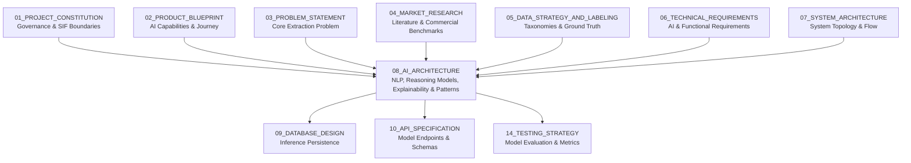

This document establishes:
- The tokenization, syntactic parsing, and abbreviation normalization pipelines.
- The contextual handling of linguistic negation, directionality, and temporal prepositions.
- The physical safety entity and relation extraction architecture.
- The hybrid reasoning methodology combining statistical semantic embeddings with deterministic domain heuristics.
- The SIF Potential assessment engine (`YES`, `NO`, `REVIEW`) and confidence scoring mechanisms.
- The character-level verbatim evidence binding architecture.
- The fine-grained 6-state barrier integrity evaluation engine.
- The contextual mapping framework for the 9 IOGP Life-Saving Rules.
- The multi-dimensional cross-report pattern discovery algorithms.
- The safety guardrails preventing hallucinated intelligence, data leakage, and ungrounded certainty.

---

## 2. Critical Safety Language & Conceptual Distinctions

Industrial safety engineering requires rigorous linguistic discipline. The system enforces the following conceptual boundaries across all model outputs, documentation, and user interfaces:

1. **SIF Potential $\neq$ Future Fatality Prediction:** The system evaluates whether a *reported past scenario* contained the conditions, exposures, and barrier breakdowns capable of causing a Serious Injury or Fatality. It does **not** predict that a person will be injured or that an incident will occur on a future date.
2. **Actual Outcome $\neq$ SIF Potential:** Outcome severity (e.g., zero injuries in a near-miss) does not dictate potential consequence. A near-miss with high hazard energy and bypassed barriers possesses maximum SIF potential.
3. **Near-Miss $\neq$ Low Risk:** Near-misses frequently stem from identical causal pathways to fatal accidents, where catastrophic harm was avoided solely through lucky timing or physical separation.
4. **Keyword Detection $\neq$ Contextual Understanding:** The presence of a word (e.g., *"gas testing"*) provides zero safety information without parsing syntactic state, negation, and temporal sequence (*"tested before entry"* vs. *"entered before testing"*).
5. **Mentioned Control $\neq$ Verified Effective Control:** Mentioning that a safety device exists on site does not establish that the device was active, calibrated, or confirmed effective.
6. **Frequency $\neq$ Risk:** A high-frequency housekeeping defect (e.g., clutter on a walkway) does not equal the fatal risk of an isolated, unmitigated pressure barrier bypass.
7. **AI Recommendation $\neq$ Final HSE Decision:** The AI engine is an assistive decision-support tool. Authoritative safety determinations remain exclusively with authorized human HSE professionals.
8. **Synthetic Data $\neq$ OIL Data:** Benchmark performance on representative synthetic corpora proves pipeline validity; it does not establish validated production performance on internal Oil India Limited networks.

---

## 3. AI Architecture Objective

The central objective of the AI subsystem is to solve the **unstructured narrative bottleneck** in industrial safety reporting:

$$\text{Raw Frontline Prose} \xrightarrow{\text{NLP Semantic Parsing}} \text{Physical Safety Signals} \xrightarrow{\text{Hybrid Reasoning}} \text{Explainable SIF Intelligence} \xrightarrow{\text{Corpus Synthesis}} \text{Actionable HSE Priorities}$$

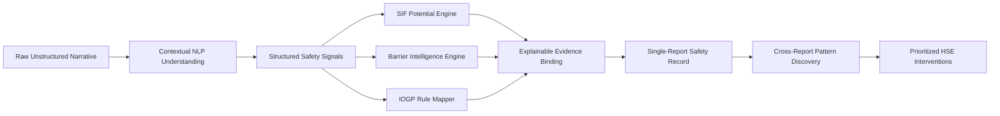

The architecture explicitly rejects monolithic "end-to-end" deep learning models that map raw text directly to an unexplainable risk score. Instead, it decomposes the reasoning chain into discrete, auditable, and testable stages.

---

## 4. Foundational AI Principles

The AI architecture is governed by fifteen core principles `[PROPOSED DESIGN]`:

1. **Context Over Keywords:** All semantic classifications must evaluate sentence syntax, word dependencies, negation scopes, and temporal qualifiers.
2. **Evidence Before Conclusion:** An analytical conclusion (`SIF: YES`, `Barrier: FAILED`) cannot be emitted unless grounded in extractable text spans.
3. **Safety Signals Before Risk Reasoning:** The pipeline must extract physical reality (Activity, Hazard, Exposure, Controls) before attempting causal risk classification.
4. **Decouple Outcome from Potential:** The SIF Potential Engine must remain blind to recorded lost-time metrics during its latent hazard-barrier evaluation.
5. **Explainability by Design:** Explanations are not post-hoc approximations; they are generated concurrently with inference as an auditable chain of custody.
6. **Human-in-the-Loop Governance:** All AI inferences are provisional until audited, verified, or corrected by authorized safety personnel.
7. **Conservative Uncertainty Handling:** When high-energy hazards are present but barrier states are ambiguous, the system must emit `SIF: REVIEW` rather than forcing a false-negative `NO`.
8. **Absolute Zero Hallucination:** The system is architecturally prohibited from generating safety signals, barrier states, or text quotes not supported by source text.
9. **Data Provenance Preservation:** Inferences carry immutable cryptographic hashes linking them back to the specific dataset provenance (`DATA-002`).
10. **Strict Versioning:** Every output records the exact model checkpoint, taxonomy version, and heuristic ruleset hash used during execution.
11. **Domain Knowledge Integration:** Upstream petroleum terminology and established international frameworks (IOGP Report 459) are natively embedded.
12. **No Autonomous Field Authority:** The AI engine shall never issue automated operational commands or facility permits.
13. **Deterministic Reproducibility:** Identical text processed under identical model versions must produce identical signals and classifications.
14. **Asymmetric Error Calibration:** The pipeline is biased to minimize catastrophic False Negatives over routine False Positives.
15. **Fail-Safe Degradation:** If linguistic extraction fails, the pipeline transitions to manual review rather than aborting silently.

---

## 5. End-to-End AI Pipeline Architecture

The end-to-end AI reasoning pipeline operates across fourteen distinct stages:

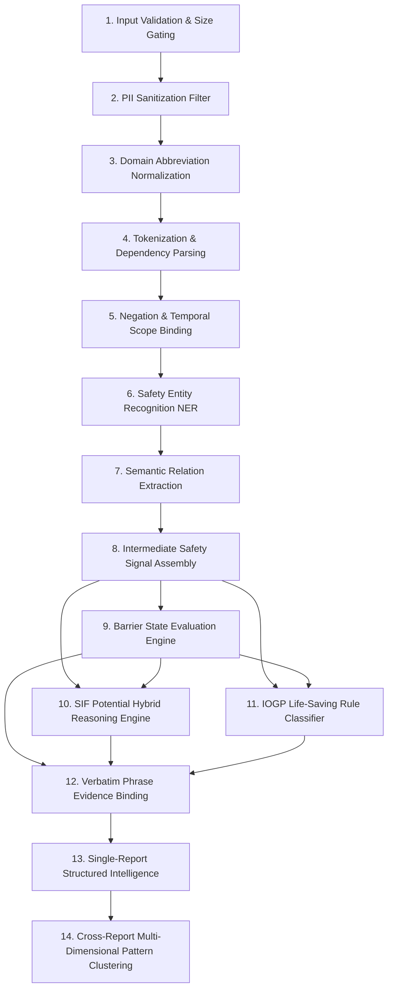

---

## 6. NLP Processing Layer

The NLP layer answers the foundational linguistic question: **"What operational actions, physical conditions, and events are described in the narrative?"**

### 6.1 Text Cleaning & Domain Abbreviation Normalization
Frontline industrial reporting is riddled with acronyms and field abbreviations. The normalization stage executes a deterministic domain expansion while maintaining exact character mapping offsets back to the raw string `[RECOMMENDED IMPLEMENTATION]`:

| Frontline Abbreviation | Canonical Domain Expansion | Safety Category |
|---|---|---|
| `PTW` / `ptw` | Permit to Work | Work Authorization Control |
| `LOTO` / `loto` | Lockout / Tagout | Energy Isolation Barrier |
| `BOP` / `bop` | Blowout Preventer | Well Control Physical Barrier |
| `SCBA` / `scba` | Self-Contained Breathing Apparatus | Toxic Gas Mitigative Barrier |
| `LEL` / `lel` | Lower Explosive Limit | Flammable Atmospheric Metric |
| `H2S` / `h2s` | Hydrogen Sulfide Gas | Toxic Chemical Hazard |
| `CS` / `c/s` | Confined Space | High-Risk Operational Setting |
| `WH` / `w/h` | Working at Height | Gravitational Hazard Setting |

### 6.2 Syntactic & Dependency Parsing
The normalized text is parsed into a directed dependency tree to establish semantic head-modifier relationships:
- **Subject-Verb-Object (SVO) Extraction:** Identifies worker actions (e.g., `[Technician] (nsubj) <-- [entered] (root) --> [separator] (dobj)`).
- **Prepositional Modifier Attachment:** Captures operational conditions (e.g., `[entered] --> [before] (prep) --> [testing] (pobj)`).

---

## 7. Context, Negation & Temporal Sequence Handling

Contextual parsing separates modern safety NLP from naive keyword filtering. The pipeline explicitly evaluates **Negation Inversion** and **Temporal Preposition Order** `[PROPOSED DESIGN]`:

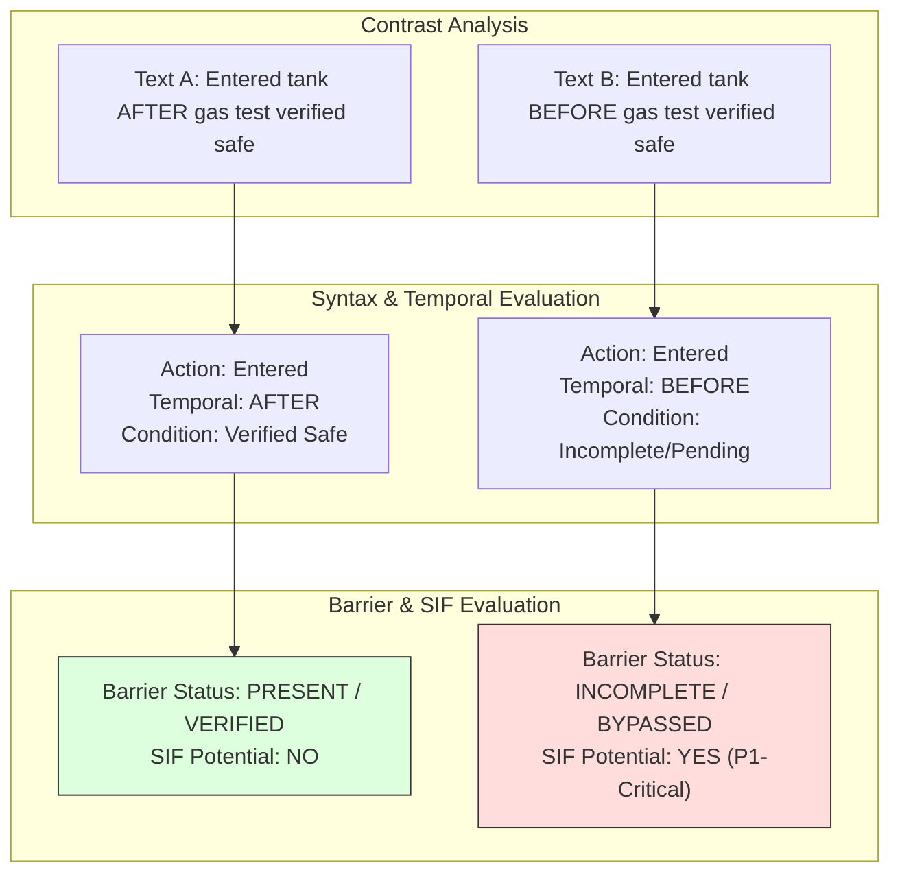

### 7.1 Scope-Bound Negation Detection
The engine evaluates negation tokens (`not`, `never`, `without`, `failed to`, `omitted`, `unauthorized`, `skipped`, `no`) within a bounded dependency window:
- If a negation operator modifies a **Hazard** (e.g., *"no gas leak detected"*), the hazard state is set to `INACTIVE`.
- If a negation operator modifies a **Critical Control** (e.g., *"no standby attendant present"*, *"without safety harness"*), the barrier state is evaluated as `MISSING` or `FAILED`.

### 7.2 Temporal Prepositional Reasoning
The temporal engine evaluates the sequential relationship between worker exposure and safeguard verification:
- `EXPOSURE` followed by `BEFORE` + `CONTROL` $\longrightarrow$ **Severe Barrier Violation (`INCOMPLETE / BYPASSED`)**.
- `EXPOSURE` followed by `AFTER` + `CONTROL` $\longrightarrow$ **Compliant Operational Sequence (`PRESENT / VERIFIED`)**.

---

## 8. Safety Entity Extraction (NER Layer)

The Named Entity Recognition (NER) layer identifies domain-specific entities across seven physical and operational classes `[PROPOSED DESIGN]`:

```text
"During [condensate vessel maintenance] (ACTIVITY) at [Site A] (LOCATION), a [technician] (ROLE) 
attempted to enter the [confined space] (HAZARD) before [atmospheric gas testing] (CONTROL) was completed. 
[No standby attendant] (BARRIER_STATUS:MISSING) was present at the [manway] (EQUIPMENT). 
The [supervisor halted the work] (INTERVENTION). [No injuries occurred] (OUTCOME)."
```

### Entity Classification Schema

| Entity Class | Extraction Target | Canonical Examples in Upstream E&P |
|---|---|---|
| `EN_ACTIVITY` | Industrial operation or operational task | Vessel cleaning, hot work, wireline logging, casing running, valve overhaul |
| `EN_HAZARD` | Hazardous energy source or environment | Toxic gas (H2S), flammable vapor, high pressure (>100 psi), suspended load, height (>1.8m) |
| `EN_EQUIPMENT`| Physical machinery, piping, or installation | Condensate separator, Christmas tree, mud pump, monkey board, pig launcher |
| `EN_EXPOSURE` | Spatial proximity or posture in hazard zone | Inside vessel manway, underneath suspended boom, within flash fire envelope |
| `EN_CONTROL`  | Specified safeguard or check | Atmospheric testing, LOTO padlock, safety harness tie-off, fire watch, PTW |
| `EN_UNSAFE_ACT`| Behavioral deviation or procedural bypass | Entered unverified space, unclipped harness, operated without authorization |
| `EN_UNSAFE_COND`| Physical or mechanical defect | Corroded deck plating, missing guardrail, leaking flange, ungrounded circuit |

> **Architectural Principle:** Extracted entities are **neutral physical facts**, not risk labels. The entity `[confined space]` does not equal high risk until linked to unmitigated worker exposure.

---

## 9. Semantic Relation & Event Extraction

Entities are composed into an **Event Dependency Graph** that captures causal interactions `[PROPOSED DESIGN]`:

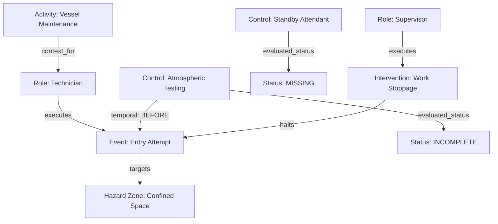

By assembling relations into an interconnected graph, the reasoning layer determines:
1. Did the worker physically enter or attempt to enter the hazardous zone? (**Yes**)
2. Were the required pre-entry barrier verifications complete at the timestamp of entry? (**No**)
3. Did the presence of supervisory intervention negate the underlying potential? (**No — Fortuitous Intervention**).

---

## 10. Safety Signal Extraction Architecture

The system converts parsed entities and relations into a formalized intermediate data structure: the **Safety Signal Set** `[PROPOSED DESIGN]`.

### Signal Taxonomy Mapping
Following `05_DATA_STRATEGY_AND_LABELING.md`, extracted signals are grouped into five operational categories:
1. **Energy & Exposure Signals:** Quantifies hazard energy level (High vs. Low) and physical worker positioning.
2. **Barrier Degradation Signals:** Evaluates operational integrity of controls (`PRESENT`, `MISSING`, `INCOMPLETE`, `FAILED`, `BYPASSED`).
3. **Behavioral Deviation Signals:** Captures procedural circumventions or unauthorized actions.
4. **Contextual Context Signals:** Identifies operational setting (routine maintenance, emergency response, SIMOPS).
5. **Outcome & Mitigation Signals:** Captures immediate interventions and recorded outcome severity.

---

## 11. Intermediate Structured Safety Signal Representation

The intermediate representation serves as a stable, inspectable decoupling layer between raw text parsing and downstream reasoning engines `[RECOMMENDED IMPLEMENTATION]`:

```json
{
  "report_id": "REP-2026-OIL-0842",
  "data_provenance": "SYNTHETIC_DATA",
  "extracted_signals": {
    "activity": {
      "canonical": "Confined Space Maintenance",
      "verbatim_span": "maintenance of a condensate vessel",
      "char_offsets": [7, 41]
    },
    "hazard_energy": {
      "type": "Toxic / Hazardous Atmosphere",
      "energy_level": "HIGH",
      "verbatim_span": "confined space",
      "char_offsets": [85, 99]
    },
    "worker_exposure": {
      "exposed": true,
      "exposure_type": "Direct Entry Attempt",
      "verbatim_span": "technician attempted to enter",
      "char_offsets": [55, 84]
    },
    "barrier_observations": [
      {
        "barrier_type": "Atmospheric Gas Verification",
        "evaluated_status": "INCOMPLETE",
        "verbatim_span": "before atmospheric testing was completed",
        "char_offsets": [100, 140]
      },
      {
        "barrier_type": "Standby Attendant / Rescue Readiness",
        "evaluated_status": "MISSING",
        "verbatim_span": "No standby attendant was present",
        "char_offsets": [142, 174]
      }
    ],
    "contextual_factors": {
      "intervention_occurred": true,
      "intervention_span": "supervisor noticed the situation and stopped the work",
      "recorded_injury_outcome": "NONE",
      "outcome_span": "No injury occurred"
    }
  }
}
```

---

## 12. SIF Potential Engine Architecture

The SIF Potential Engine executes the core analytical judgment mandated by SIH26165: **"Did the reported scenario possess the potential for Serious Injury or Fatality?"**

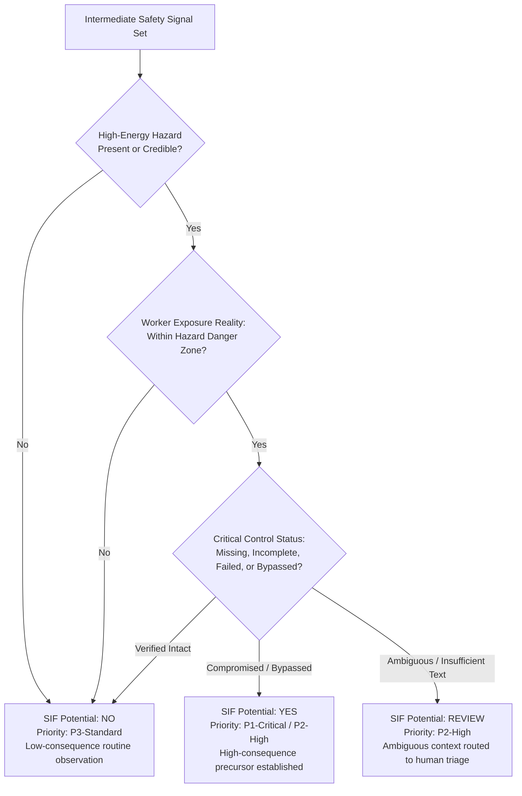

### Proposed Causal Precursor Triad Decision Framework
The platform evaluates safety reports using our **proposed explainable H0 decision framework** (the Causal Precursor Triad):
$$\text{SIF Potential} = f(\text{Hazard Energy Level}, \text{Worker Exposure Reality}, \text{Barrier Integrity State})$$

*(Clarification: This causal triad is Tech Smashers' proposed explainable decision framework for deterministic prototype reasoning. While deeply grounded in Energy-Based Safety literature and designed to map to IOGP Life-Saving Rules, it is an engineering decision framework developed for this platform, not an official IOGP definition or industry-standard mathematical formula).*

- **SIF Potential = YES:** Emitted when `Hazard Energy == HIGH` AND `Worker Exposure == TRUE` AND `Barrier Status` $\in \{\text{MISSING}, \text{INCOMPLETE}, \text{FAILED}, \text{BYPASSED}\}$.
- **SIF Potential = NO:** Emitted when `Hazard Energy == LOW` OR (`Barrier Status == PRESENT_VERIFIED` with zero unmitigated exposure).
- **SIF Potential = REVIEW:** Emitted when `Hazard Energy == HIGH` AND `Worker Exposure == TRUE`, but narrative text provides insufficient evidence to confirm barrier status (`Barrier Status == UNKNOWN`).

---

## 13. The Hybrid AI Architecture (Rules + Semantic Embeddings)

A central architectural decision (`ADR-002`) is adopting a **Hybrid AI Strategy** combining statistical natural language representations with deterministic domain expert rules `[PROPOSED DESIGN]`:

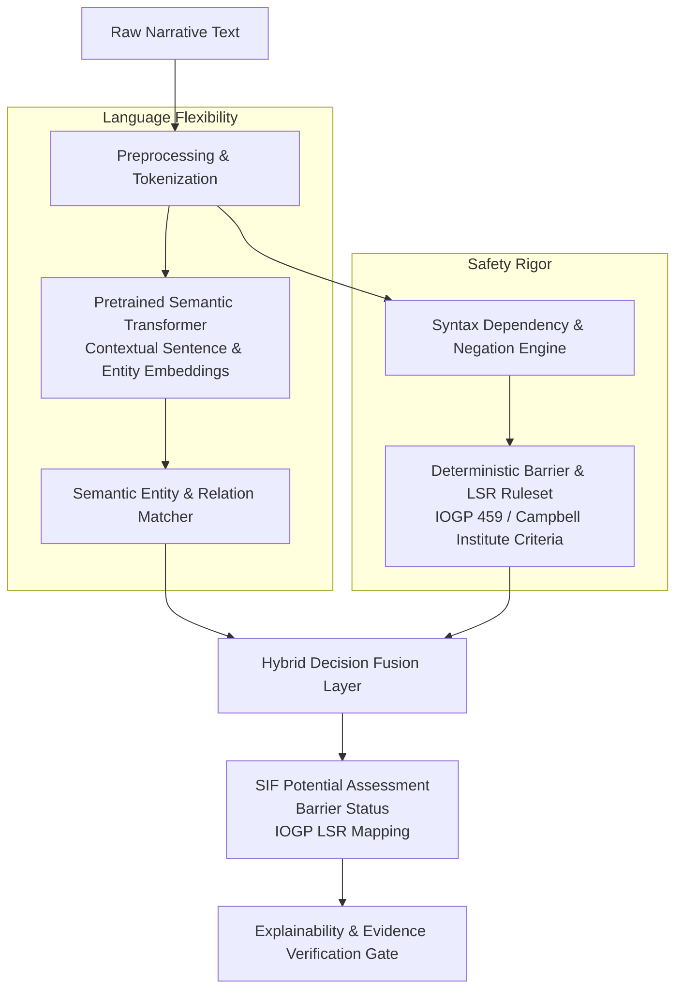

### Why Pure Approaches Fail in Industrial Safety
- **Pure Rule-Based Failure:** Brittle against linguistic variance, misspellings, unstandardized oilfield shorthand, and complex passive phrasing.
- **Pure Deep Learning / LLM Failure:** Prone to hallucinations, unexplainable probability drift, susceptibility to adversarial phrasing, and opacity that violates safety auditing requirements.
- **The Hybrid Solution:** Semantic embeddings provide robust linguistic flexibility to recognize domain entities across messy text; deterministic expert safety rules enforce non-negotiable physical safety logic (e.g., entering an unverified vessel is always a critical barrier violation).

---

## 14. Recommended Prototype Model Design

For the hackathon MVP, Tech Smashers specifies a pragmatic, high-performance local architecture that eliminates cloud latency and external API cost (`[RECOMMENDED IMPLEMENTATION]`):

1. **Language Representation Backbone (H0 Baseline):** A lightweight, CPU-optimized transformer (`sentence-transformers/all-MiniLM-L6-v2`) generating 384-dimensional semantic embeddings of narrative clauses for similarity ranking against canonical IOGP Life-Saving Rules. (Fine-tuned `DeBERTa-v3-small` is explicitly classified as an **H1 post-hackathon enhancement** once authenticated operational training data becomes available).
2. **Linguistic Preprocessing & Entity Engine:** spaCy (`en_core_web_sm`) dependency parser evaluating syntactic negation scope (`neg`), parts of speech, and prepositional temporal markers (`before` vs. `after`).
3. **Domain Heuristic Layer:** Python-based deterministic safety rules implementing physical hazard energy matrices, 6-state barrier evaluation, and outcome-blind SIF reasoning.
4. **Offline Model Asset Pre-Caching:** Designed for offline operation, ensuring runtime execution does not require internet access after the required model assets (`en_core_web_sm` and `all-MiniLM-L6-v2`) are pre-cached in the Docker image during build time.
5. **Execution Runtime:** Operates entirely in-memory on standard CPU hardware with single-report inference latency $\le 800\text{ ms}$ (design target), ensuring zero dependency on proprietary cloud GPUs or paid external LLM endpoints.

---

## 15. Detailed Model Reasoning Flow

```
NARRATIVE INPUT
      │
      ▼
CLAUSE SEGMENTATION & EMBEDDING
      │
      ├──> Clause 1: "technician entered a confined space"
      │    └── Semantic Match: Activity = Vessel Entry, Hazard = Confined Space (Sim = 0.92)
      │
      ├──> Clause 2: "before atmospheric testing was completed"
      │    └── Dependency Parse: Action = Entry, Preposition = BEFORE, Target = Gas Testing
      │    └── Rule Evaluation: Entry before test = Barrier Status INCOMPLETE
      │
      └──> Clause 3: "No standby person was present"
           └── Negation Scope: Operator "No" modifying "standby person"
           └── Rule Evaluation: Attendant absent = Barrier Status MISSING
      │
      ▼
HYBRID SIF REASONING
      │
      ├── High Hazard Detected: Confined Space (True)
      ├── Worker Exposed: Direct Entry (True)
      ├── Critical Barriers Compromised: [Atmospheric Testing, Standby Attendant]
      │
      ▼
FINAL INFERENCE
      ├── SIF Potential: YES (Confidence: 0.94)
      ├── Priority: P1-Critical
      ├── IOGP Rule: Confined Space
      └── Evidence Links: [Clause 1, Clause 2, Clause 3]
```

---

## 16. Rule Engine Specifications

The deterministic rule engine encodes established safety physics and regulatory requirements `[PROPOSED DESIGN]`:

### Core Rule Definitions

```python
# ILLUSTRATIVE SPECIFICATION OF RULE LOGIC
def evaluate_confined_space_rule(signals):
    if signals.hazard == "Confined Space" and signals.worker_exposure == True:
        # Check Critical Barriers
        test_status = signals.get_barrier("Atmospheric Testing")
        standby_status = signals.get_barrier("Standby Attendant")
        
        if test_status in ["MISSING", "INCOMPLETE", "BYPASSED"]:
            return {
                "sif_potential": "YES",
                "priority": "P1-Critical",
                "lsr": "Confined Space",
                "failed_barrier": "Atmospheric Verification Incomplete",
                "reasoning": "Direct worker exposure to unverified confined space atmosphere."
            }
        elif standby_status in ["MISSING", "FAILED"]:
            return {
                "sif_potential": "YES",
                "priority": "P2-High",
                "lsr": "Confined Space",
                "failed_barrier": "Rescue Readiness Deficient",
                "reasoning": "Confined space entry executed without mandatory emergency standby person."
            }
    return None
```

---

## 17. SIF Decision States & Action Semantics

Following `06_TECHNICAL_REQUIREMENTS.md`, the platform emits three discrete SIF decision states:

| Decision State | Operational Interpretation | Model Criteria | Workflow Routing |
|---|---|---|---|
| **SIF: YES** | **Confirmed SIF Precursor** | High-energy hazard + confirmed human exposure + failed/missing critical barrier. | Immediately elevated to Top Priority in HSE Action Queue; tagged with P1/P2 alert badge. |
| **SIF: NO** | **Low-Consequence Observation** | Low-energy hazard OR high-energy hazard with verified intact controls and zero exposure. | Routed to standard periodic reporting; aggregate statistics updated. |
| **SIF: REVIEW** | **Ambiguous / Insufficient Evidence** | High-energy hazard indicated, but narrative text is ambiguous or lacks barrier detail. | Routed to Human Review Console with highlighted information gap notice. |

---

## 18. Confidence Scoring & Uncertainty Calibration

The system explicitly distinguishes **Model Confidence** from **Real-World Fatality Probability** `[PROPOSED DESIGN]`:

$$\text{Confidence Score } (S) \in [0.00, 1.00] = \text{Algorithmic certainty in signal extraction and rule alignment}$$

$$\text{Confidence Score } \neq \text{Probability of a worker dying}$$

### Calibration Thresholds
- **High Confidence ($S \ge 0.85$):** Extracted entities match high-confidence semantic clusters and unambiguous rule triggers. Emits direct `YES` or `NO`.
- **Moderate Confidence ($0.65 \le S < 0.85$):** Signals detected with minor syntax ambiguity. Emits classification with `[AUDIT_RECOMMENDED]` flag.
- **Low Confidence / Ambiguous ($S < 0.65$):** Context is incomplete or contradictory. The engine is **architecturally barred** from guessing; it forces `SIF: REVIEW`.

---

## 19. Traceable Explainability & Evidence Binding

The Explainability Engine generates inspectable reasoning graphs connecting derived findings to source text `[PROPOSED DESIGN]`:

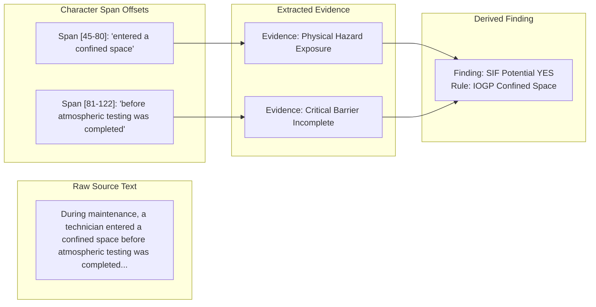

Every emitted finding contains exact character bounds:
`{"target": "YES", "span": "before atmospheric testing was completed", "start_offset": 81, "end_offset": 122}`. In the UI, clicking any analytical badge highlights the corresponding phrase in the narrative view.

---

## 20. Barrier Intelligence Architecture

The Barrier Intelligence Engine evaluates mentioned safeguards across five standardized operational states defined in `05_DATA_STRATEGY_AND_LABELING.md`:

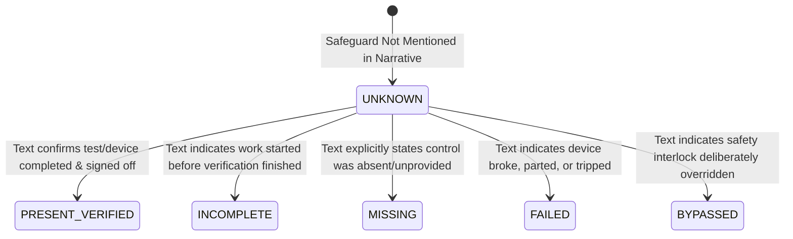

### Critical Safeguard Rule
The engine strictly enforces:
$$\text{Mentioned}(\text{Control}) \wedge \neg \text{Confirmed}(\text{Control}) \Longrightarrow \text{Status: UNKNOWN / UNVERIFIED}$$
A report stating *"gas detector was on the truck"* evaluates as `Status: UNVERIFIED / INCOMPLETE`, preventing false assumptions of barrier efficacy.

---

## 21. IOGP Life-Saving Rule Mapping Architecture

The IOGP Mapper contextually maps narratives to the 9 IOGP Life-Saving Rules (Report 459):

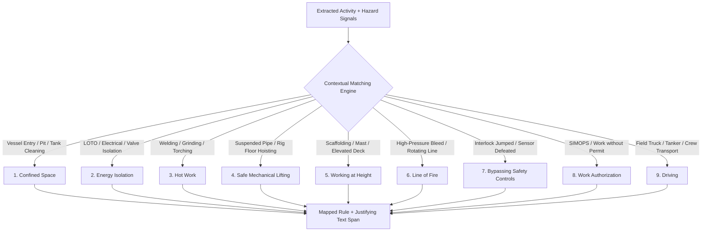

### Multi-Rule Support
Where a scenario involves overlapping critical activities (e.g., welding inside an unventilated vessel at height), the engine maps multiple rules simultaneously: `[Confined Space, Hot Work]`, preserving the primary risk driver for dashboard prioritization.

---

## 22. Cross-Report Pattern Discovery Engine

The Cross-Report Pattern Discovery Engine aggregates analyzed records across the database to detect systemic organizational vulnerabilities `[PROPOSED DESIGN]`:

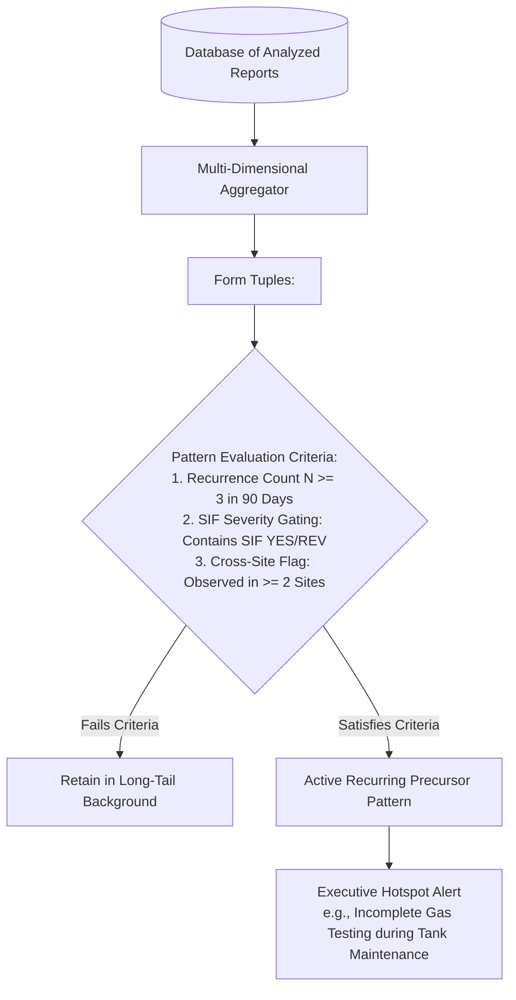

### Severity Gating Principle
The engine evaluates multi-dimensional density rather than raw count alone:
$$\text{Pattern Significance Score} = \text{Recurrence Count} \times \text{Proportion of SIF-Positive Reports}$$
This ensures that three instances of an unmitigated toxic gas exposure far outrank fifty instances of minor office housekeeping issues.

---

## 23. HSE Prioritization Architecture

The Prioritization Engine computes an explainable **Risk Concentration Index** across installations and operational activities `[PROPOSED DESIGN]`:

$$\text{Facility Priority Weight} = \sum_{i=1}^{M} w(\text{SIF}_i) + \sum_{j=1}^{P} w(\text{Pattern}_j)$$

Where:
- $w(\text{SIF: YES}) = 10$
- $w(\text{SIF: REVIEW}) = 5$
- $w(\text{SIF: NO}) = 1$
- $w(\text{Active Systemic Pattern}) = 15$

The resulting score is used exclusively to sort the HSE inspection attention queue, directing safety auditors to installations exhibiting acute precursor concentrations.

---

## 24. Human-in-the-Loop Governance Architecture

The AI lifecycle treats human oversight as an architectural checkpoint, not an afterthought:

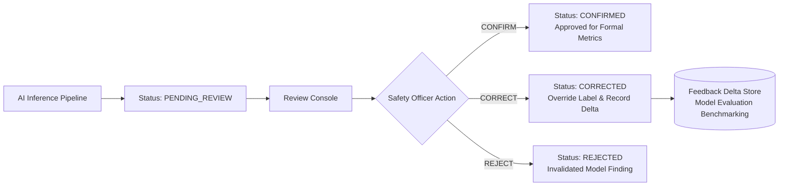

- **Delta Recording:** When a human overrides a finding (e.g., changes `Barrier: MISSING` to `Barrier: FAILED`), the exact delta `{"predicted": "MISSING", "actual": "FAILED", "reviewer_notes": "Flange gasket blew out under pressure"}` is logged to support future retraining.

---

## 25. Data Leakage Prevention Architecture

To preserve scientific validity during offline benchmarking, the data pipeline enforces rigorous leakage controls `[PROPOSED DESIGN]`:

1. **Installation-Level Partitioning:** Reports from a specific simulated facility are assigned in their entirety to either Training or Evaluation, preventing models from memorizing installation-specific equipment identifiers.
2. **Metadata Blinding:** Outcome metadata (e.g., actual medical treatment, lost workdays) is physically stripped from the input feature tensor before inference, ensuring the model reasons strictly on narrative text.
3. **Deduplication Filter:** Fuzzy hashing (MinHash / Jaccard similarity $>0.85$) eliminates duplicate or templated synthetic reports across train and test sets.

---

## 26. Model Evaluation Architecture (Without OIL Ground Truth)

Because proprietary Oil India Limited labeled datasets are unavailable, the model is evaluated using a rigorous four-tier scientific benchmarking framework:

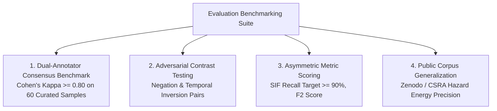

### Safety-Critical Metric Priority
Standard accuracy is explicitly rejected due to class imbalance. Evaluation prioritizes:
- **SIF Precursor Recall ($R$):** $\frac{TP}{TP + FN}$ — Measures protection against catastrophic missed precursors.
- **$F_2$ Score:** Weights Recall twice as heavily as Precision to reflect the asymmetric cost of false negatives.
- **Evidence Span Intersection-over-Union (IoU):** Quantifies whether cited text spans align with expert-annotated evidence boundaries.

---

## 27. Safety-Sensitive Error Analysis

The architecture systematically accounts for both operational failure modes:

| Error Type | Concrete Operational Scenario | Root Cause in NLP | Safety Consequence | Architectural Mitigation |
|---|---|---|---|---|
| **False Positive (Type I)** | Report describes a safety briefing discussing confined space rules; AI flags high SIF potential. | Keyword trigger without verifying active physical worker exposure. | Reviewer alert fatigue; unnecessary investigation overhead. | Dependency parser checks for active worker verb execution before triggering exposure signals (`AI-002`). |
| **False Negative (Type II)** | Report describes technician loosening bolts on pressurized line without using the word "pressure"; AI outputs SIF NO. | Implicit hazard energy uncaptured by literal string matching. | **Severe:** High-consequence fatal precursor missed during triage. | Semantic embedding layer matches equipment context (*"flange"*, *"crude line"*) to stored energy hazard clusters (`AI-003`). |

---

## 28. Adversarial & Edge Case Handling

The pipeline is hardened against fifteen specific real-world edge cases `[PROPOSED DESIGN]`:

```text
 1. Complete Negation:         "No confined space entry occurred." -> Hazard INACTIVE, SIF: NO.
 2. Compliant Operation:       "Entry executed after gas test verified 0.0% LEL." -> Barrier PRESENT_VERIFIED, SIF: NO.
 3. Timely Work Stoppage:      "Supervisor stopped worker before reaching edge." -> SIF: YES (Near-Miss Precursor).
 4. Historical Reference:      "Reviewing lessons learned from 2022 well blowout." -> SIF: NO (Administrative Context).
 5. Procedural Recommendation: "Recommend installing guardrails along pit." -> SIF: NO (Future Recommendation).
 6. Unverified Planning:       "Permit planned for tomorrow." -> Barrier INCOMPLETE (canonical 6-state taxonomy, Constitution Section 11).
 7. Multi-Hazard Scenario:     "Welding on pipe rack at 12m height." -> Extracts Hot Work + Working at Height.
 8. Multi-LSR Trigger:         "Line of fire + Energy isolation." -> Maps both rules simultaneously.
 9. Minimalist Narrative:      "Gas leak near manifold." -> SIF: REVIEW (Lacks control context; routes to triage).
10. Colloquial Shorthand:      "Roughneck unhooked on monkey board." -> Normalizes to Working at Height without harness.
11. Typographical Errors:      "Confined spce entery w/o test." -> Abbreviation normalizer resolves tokens cleanly.
12. Duplicate Report:          Fuzzy hash detects identical narrative -> Merges into single tracking entity.
13. Incomplete Metadata:       Missing site or date -> Ingests with Site: UNKNOWN; continues NLP extraction.
14. Dialect/Mixed Terminology: Upstream jargon ("Christmas tree", "doghouse") -> Domain ontology resolves context.
15. Empty Narrative:           Whitespace only -> Rejected at API boundary with HTTP 400 validation error.
```

---

## 29. AI Failure Modes & Safety Guardrails

### 29.1 Failure Mode Analysis

| Failure Mode | Observable Manifestation | Detection Mechanism | System Fallback Action |
|---|---|---|---|
| **Linguistic Parser Crash** | Unparseable unicode or sentence fragmentation. | Try-catch exception handler in NLP service. | Marks report `PROCESSING_FAILED`; routes to manual queue. |
| **Ambiguous Causal Chain** | Hazard present, but zero barrier mentions in text. | Confidence score drops below threshold ($S < 0.65$). | Assigns `SIF: REVIEW`; highlights missing control info in UI. |
| **Out-of-Distribution Text** | Narrative describes topic completely unrelated to HSE. | Semantic similarity to safety taxonomy falls below 0.30. | Assigns `SIF: NO`, `Category: NON_SAFETY_OBSERVATION`. |
| **Model Inconsistency** | Disagreement between semantic embedding and rule engine. | Fusion layer flags divergent outputs. | Defaults to conservative safety choice (`REVIEW` or `YES`). |

### 29.2 Non-Negotiable Safety Guardrails
1. The AI engine SHALL NEVER generate synthetic quotes or fabricated evidence spans.
2. The AI engine SHALL NEVER output zero-uncertainty certainty on ambiguous text.
3. The AI engine SHALL NEVER execute autonomous work stoppages or permit approvals.
4. The AI engine SHALL NEVER treat the absence of recorded injuries as proof of low SIF potential.
5. The AI engine SHALL NEVER treat raw observation frequency as a direct proxy for fatality risk.

---

## 30. AI Component Responsibility Matrix

| AI Subsystem Component | Core Analytical Question Answered | Input Data Payload | Output Data Payload | MVP Scope | Human Oversight |
|---|---|---|---|---|---|
| **NLP Preprocessing Engine** | What words, syntax, and abbreviations are present? | Raw narrative string | Normalized, tokenized dependency tree | `P0` | System Audited |
| **Safety Entity Extractor** | What physical objects, hazards, and tasks exist? | Token stream & syntax graph | Typed `SafetySignals` (Entities) | `P0` | Reviewer Editable |
| **Barrier Intelligence Module**| What is the operational integrity state of controls? | Control entities + negation | Evaluated `BarrierFindings` (6 states) | `P0` | Reviewer Editable |
| **SIF Potential Engine** | Does this scenario contain latent fatal potential? | Physical signals + Barrier states | `SIF: YES/NO/REV` + Priority + Conf | `P0` | Reviewer Overridable |
| **IOGP LSR Mapping Module** | Which international safety rule governs this risk? | Activity + Hazard signals | Mapped 9 IOGP Rules + Spans | `P0` | Reviewer Editable |
| **Explainability Service** | What exact text phrases justify these conclusions? | Derived findings + Token offsets | `EvidenceChain` (character spans) | `P0` | Direct UI Inspection |
| **Pattern Discovery Engine**| What systemic failures are repeating across sites? | Persisted corpus of reports | Multi-dimensional `RecurringPatterns` | `P0` | Manager Investigated |
| **Prioritization Engine** | Which facilities require urgent safety intervention?| SIF records + Pattern weights | Ranked HSE Attention Queues | `P0` | Decision Support Only |

---

## 31. AI Decision Flow Diagram

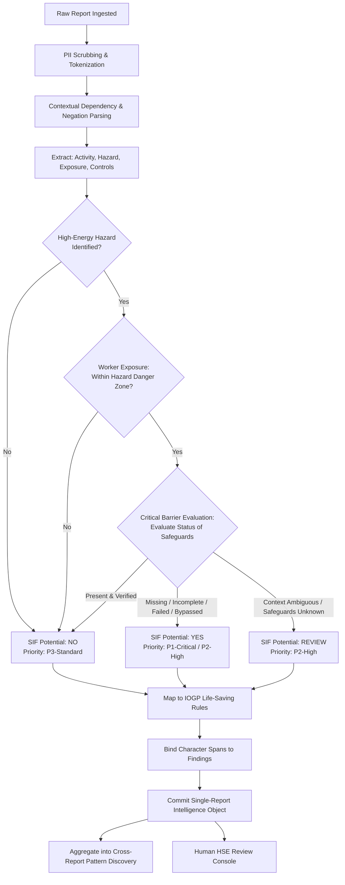

---

## 32. Step-by-Step Representative Example Walkthrough

### Representative Narrative
> *"During maintenance activity at Site A, a technician entered a confined space before atmospheric testing was completed. No standby person was present. Work was stopped after supervisor noticed. No injuries occurred."*

```
STAGE 1: INGESTION & PII MASKING
  Original Text: Preserved immutably.
  Sanitized Text: "During maintenance activity at Site A, a technician entered a confined space..."
  Provenance: Tagged as SYNTHETIC_DATA (DATA-002).

STAGE 2: NLP SYNTACTIC PARSING
  Tokenization: Normalized.
  Syntax Dependency:
    - [technician] (nsubj) <-- [entered] (root) --> [confined space] (dobj)
    - [entered] --> [before] (prep) --> [testing was completed] (pcomp)
    - [No] (neg) --> [standby person] (nsubj)

STAGE 3: SAFETY SIGNAL EXTRACTION
  Activity: "maintenance activity" (Canonical: Maintenance)
  Hazard: "confined space" (Energy: Toxic/Asphyxiating Atmosphere - HIGH)
  Worker Exposure: True (Action: entered)
  Control Mention 1: "atmospheric testing" (Status Context: before completed)
  Control Mention 2: "standby person" (Status Context: No present)
  Intervention: "supervisor noticed... stopped work"
  Outcome: "No injuries occurred"

STAGE 4: BARRIER STATUS EVALUATION
  Barrier 1: Atmospheric Gas Testing -> Status: INCOMPLETE (Entered before completed)
  Barrier 2: Standby Safety Attendant -> Status: MISSING (No standby present)

STAGE 5: SIF POTENTIAL REASONING
  Hazard Energy: HIGH
  Worker Exposure: TRUE
  Critical Barriers: COMPROMISED (1 Incomplete, 1 Missing)
  Outcome Blindness: "No injuries occurred" does NOT downgrade risk.
  Assessment: SIF Potential YES (Priority: P1-Critical, Confidence: 0.95)

STAGE 6: IOGP LIFE-SAVING RULE MAPPING
  Trigger: Confined space entry attempt with unverified atmosphere.
  Mapped Rule: Confined Space (Report 459 Rule #2).

STAGE 7: TRACEABLE EXPLAINABILITY BINDING
  Evidence Span 1: "entered a confined space" [Offsets: 45-68] -> Physical Exposure
  Evidence Span 2: "before atmospheric testing was completed" [Offsets: 69-110] -> Barrier Incomplete
  Evidence Span 3: "No standby person was present" [Offsets: 112-141] -> Barrier Missing

STAGE 8: HUMAN REVIEW GATEWAY
  Report rendered in UI with clickable highlighted spans.
  HSE Officer verifies reasoning -> Clicks CONFIRM -> Status: CONFIRMED.

STAGE 9: CROSS-REPORT PATTERN SYNTHESIS
  Contributes to active cluster: {Site A, Confined Space Maintenance, Atmospheric Testing Incomplete}.
  Recurrence count increments to 4 -> Escalated to Executive Hotspot Alert.
```

---

## 33. False Positive vs. False Negative Contrast Scenarios

### 33.1 False Positive Prevention (Contrast Scenario)
- **Narrative:** *"Confined-space entry permit was approved and vessel entry completed after atmospheric testing verified 0.0 ppm and standby attendant was stationed at hatch."*
- **Naive Keyword Flaw:** Contains keywords `confined space`, `entry`, `atmospheric testing`. Naive regex triggers false SIF alert.
- **Contextual AI Handling:** The parser evaluates `after atmospheric testing verified` ($\text{Temporal} = \text{AFTER}$, $\text{Status} = \text{VERIFIED}$) and `standby attendant was stationed` ($\text{Status} = \text{PRESENT}$).
- **Output:** `SIF Potential: NO`, `Barrier Status: PRESENT/VERIFIED`. Zero false alarm generated.

### 33.2 False Negative Prevention (Implicit Risk Scenario)
- **Narrative:** *"Roughneck unhooked lanyard to step across mud tank beam to reach stuck valve."*
- **Literal String Flaw:** The report omits explicit hazard keywords such as *"fall from height"* or *"fatal risk"*.
- **Contextual AI Handling:** Semantic entity matching identifies `beam` + `mud tank` as elevation hazard ($>1.8\text{m}$); extracts behavioral action `unhooked lanyard` as intentional bypass of fall arrest.
- **Output:** `SIF Potential: YES`, `Barrier Status: BYPASSED`, `IOGP Rule: Working at Height`. Catastrophic omission prevented.

---

## 34. Research-to-Architecture Traceability

The AI architecture directly incorporates methodologies established in authoritative academic literature `[PROPOSED DESIGN]`:

| Research Study | Landmark Methodology Verified in Literature | Implementation in Tech Smashers AI Architecture |
|---|---|---|
| **Parikh et al. (Scientific Reports, 2024)** | Proved transformer text features outperform tabular metadata in identifying PSIFs; demonstrated weak labeling heuristics. | Implements contextual transformer embeddings for narrative encoding combined with domain heuristic rules for zero-shot bootstrapping. |
| **Fang et al. (Adv. Eng. Informatics, 2020)** | Proved bidirectional BERT representations capture complex syntax and negation in near-miss reports far superior to LSTM/TF-IDF. | Rejects bag-of-words in favor of deep contextual representations sensitive to temporal prepositions (`before`/`after`). |
| **Sarkar et al. (Neural Comp. & App., 2022)** | Validated multi-dimensional pattern extraction from industrial incident text using deep neural networks and clustering. | Implements the multi-dimensional Pattern Discovery Engine clustering on $\langle \text{Activity}, \text{Hazard}, \text{Facility}, \text{Barrier} \rangle$. |
| **Kedia et al. (ITcon, 2022)** | Evaluated ML text mining on unstructured field observation cards; highlighted degradation caused by colloquial jargon. | Establishes the domain abbreviation and oilfield slang normalizer in Stage 1 preprocessing (`AI-001`). |

---

## 35. Prototype vs. Production AI Roadmap

```
+---------------------------------------------------------------------------------------+
| STAGE 1: PROTOTYPE ARCHITECTURE (SIH 2026 MVP - P0)                                   |
| - Transformer Backbone: Lightweight CPU-optimized semantic encoder (all-MiniLM-L6-v2) |
| - Reasoning Engine: Hybrid Python Expert Rules + Embeddings Cosine Matching           |
| - Datasets: 60 Curated Synthetic Upstream Narratives + Zenodo Public Benchmark        |
| - Pattern Discovery: Deterministic Multi-Dimensional In-Memory Grouping               |
| - Explainability: Exact Character-Span Offset Highlighting in Browser UI              |
+---------------------------------------------------------------------------------------+
                                           │
                                           ▼ (Post-Hackathon Enterprise Evolution)
+---------------------------------------------------------------------------------------+
| STAGE 2: PRODUCTION ARCHITECTURE (OIL Enterprise Target - P2)                         |
| - Transformer Backbone: Domain-adapted Small Language Model (SLM) fine-tuned on       |
|   authorized historical OIL safety records under corporate NDAs                       |
| - Reasoning Engine: Fine-tuned Multi-Task Transformer predicting Signals + Barriers   |
| - Pattern Discovery: GPU-accelerated HDBSCAN clustering on semantic latent vectors   |
| - Continuous Learning: Active Learning loop retraining models on human review deltas  |
| - Multi-Lingual: Native translation supporting Assamese, Hindi, and Bengali dialects  |
+---------------------------------------------------------------------------------------+
```

---

## 36. Requirements Traceability Matrix

| Technical Requirement ID (`06`) | AI Architecture Component | Implementation Section in this Document |
|---|---|---|
| `AI-001` (Narrative Preprocessing) | NLP Processing Service | Section 6.1 (Abbreviation Normalization & Tokenization) |
| `AI-002` (Negation & Temporal Syntax) | Context & Negation Engine | Section 7 (Scope-Bound Negation & Temporal Ordering) |
| `AI-003` (Safety Signal Extraction) | Entity & Relation Extractor | Section 8 & 9 (7 Physical Signal Classes & SVO Graphs) |
| `AI-004` (SIF Potential Engine) | Hybrid SIF Reasoning Engine | Section 12 & 15 (Causal Precursor Triad Evaluation) |
| `AI-005` (Barrier Status Evaluation)| Barrier Intelligence Module | Section 20 (6-State Barrier Transition Engine) |
| `AI-006` (IOGP Life-Saving Rules) | IOGP Rule Mapping Module | Section 21 (Contextual Mapping to 9 IOGP Rules) |
| `AI-007` (Pattern Discovery) | Cross-Report Pattern Engine | Section 22 (Multi-Dimensional Recurrence Clustering) |
| `AI-008` (Verbatim Explainability) | Explainability Service | Section 19 (Character-Level Span Evidence Binding) |
| `HIL-001` / `HIL-002` (Human Review)| Governance Feedback Store | Section 24 (Confirm/Correct/Reject Review Loop) |
| `NFR-003` (No Fabricated Certainty)| Fail-Safe Uncertainty Logic | Section 18 & 29.2 (Threshold Gating & SIF: REVIEW) |

---

## 37. AI Architecture Definition of Done

The AI Architecture is declared complete and authoritative when the following criteria are satisfied:
- [x] End-to-end NLP and reasoning lifecycle is specified across 14 discrete pipeline stages.
- [x] Contextual negation and temporal preposition reasoning are formalized with contrastive examples.
- [x] The 7 foundational safety signal classes and 5 barrier operational states are fully specified.
- [x] The SIF Potential Engine causal logic is defined and decoupled from recorded injury outcomes.
- [x] The hybrid fusion methodology (semantic embeddings + deterministic rules) is established.
- [x] Verbatim phrase evidence binding is architected with character-offset data structures.
- [x] Multi-dimensional cross-report pattern clustering rules and severity gating are defined.
- [x] Human-in-the-loop review deltas and feedback stores are structurally integrated.
- [x] Fifteen specific real-world adversarial edge cases are detailed with expected behaviors.
- [x] Traceability to technical requirements (`06`) and literature benchmarks (`04`) is established.
- [x] Absolute safety guardrails prohibiting hallucination, fatality forecasting, and autonomous action are enforced.

---

## 38. Final AI Architecture Summary

The **OIL Safety Intelligence Platform AI Subsystem** solves the problem of buried high-consequence risk in unstandardized frontline narratives through an auditable, hybrid analytical chain:

$$\text{Raw Narrative} \longrightarrow \text{Contextual NLP} \longrightarrow \text{Safety Signals} \longrightarrow \text{Barrier Evaluation} \longrightarrow \text{SIF Potential Engine} \longrightarrow \text{IOGP LSR Mapping} \longrightarrow \text{Explainability Binding} \longrightarrow \text{Pattern Synthesis} \longleftrightarrow \text{Human Review}$$

By grounding every assessment in physical hazard energy and safeguard degradation, binding classifications to verbatim narrative text, discovering recurring cross-facility precursor clusters, and maintaining human safety officers as the final decision authority, the AI architecture achieves senior-level academic rigor, uncompromising safety engineering ethics, and practical hackathon prototype viability.
