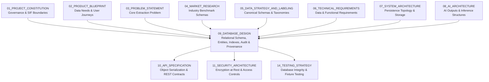
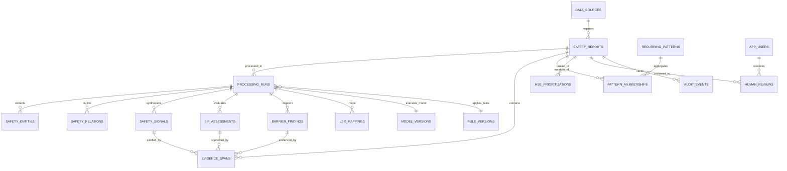
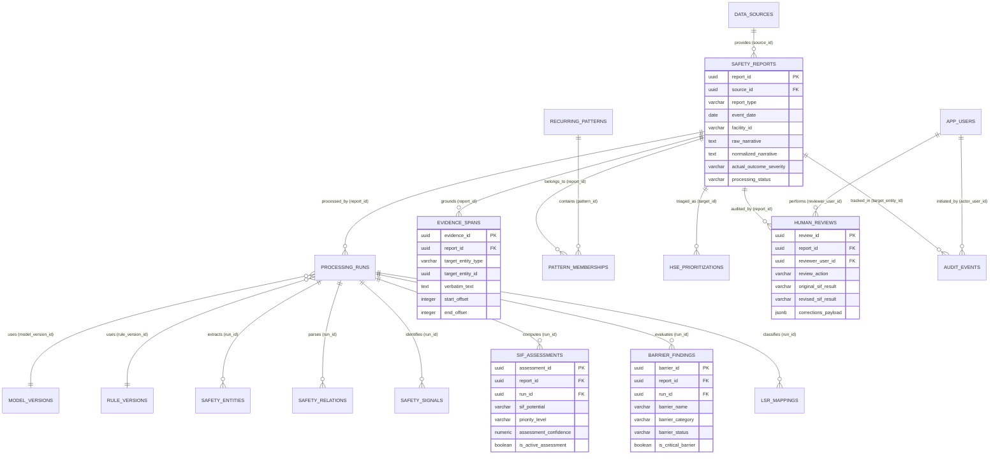
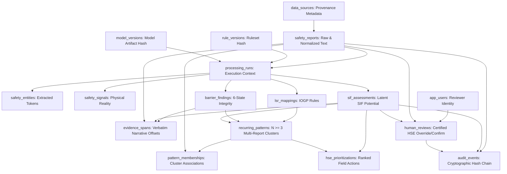

# 09_DATABASE_DESIGN

**Document Status:** Authoritative for Database Schema, Data Models, Storage Strategy, Provenance & Audit Persistence  
**Governing Documents:** `01_PROJECT_CONSTITUTION.md`, `02_PRODUCT_BLUEPRINT.md`, `03_PROBLEM_STATEMENT.md`, `04_MARKET_RESEARCH.md`, `05_DATA_STRATEGY_AND_LABELING.md`, `06_TECHNICAL_REQUIREMENTS.md`, `07_SYSTEM_ARCHITECTURE.md`, `08_AI_ARCHITECTURE.md`  
**SIH Problem Statement ID:** SIH26165  
**Organization:** Oil India Limited (OIL)  
**Category:** Software  
**Theme:** Smart Automation  
**Team:** Tech Smashers  

---

> **Architectural Tagging Discipline:**
> - `[PROPOSED DESIGN]` — Database models, entity definitions, and relational schemas designed by Tech Smashers.
> - `[RECOMMENDED IMPLEMENTATION]` — Pragmatic storage choices (e.g., PostgreSQL with JSONB and relational tables) for the hackathon MVP.
> - `[PROTOTYPE ASSUMPTION]` — Assumptions regarding synthetic/representative data schemas without access to proprietary OIL internal databases.
> - `[FUTURE ENHANCEMENT]` — Enterprise data warehousing, vector stores, distributed partitioning, and CDC pipelines reserved for production.
> - `[UNKNOWN / TO BE CONFIRMED]` — Production enterprise details (e.g., internal ERP/HSE database schemas, official retention policies) that must be confirmed with Oil India Limited.
> - `[ILLUSTRATIVE]` — Representative SQL DDL statements, JSON structures, and sample rows provided for conceptual clarity.

---

## 1. Purpose

This document defines the complete data storage and database architecture for the **OIL Safety Intelligence Platform**. It provides an exhaustive, production-grade specification for how raw incident/observation reports, extracted natural language entities, physical safety signals, latent SIF assessments, character-level evidence spans, barrier integrity states, IOGP Life-Saving Rule mappings, cross-report pattern clusters, and human HSE reviews are structured, persisted, queried, and audited.



This document specifically answers:
1. What data entities does the platform persist across the analytical lifecycle?
2. How are raw frontline narratives cleanly decoupled from sanitized and normalized representations?
3. How are extracted physical safety signals represented and tied back to linguistic tokens?
4. How is latent SIF Potential (`YES`, `NO`, `REVIEW`) persisted independently from actual historical outcomes?
5. How are verbatim evidence spans stored with character-level start/end offsets?
6. How is the 6-state barrier degradation model represented in relational schemas?
7. How are contextual mappings to the 9 IOGP Life-Saving Rules tracked?
8. How are multi-dimensional cross-report patterns and their membership occurrences persisted?
9. How is human review recorded without overwriting or mutating AI-derived historical records?
10. How are dataset provenance, model versions, ruleset hashes, and cryptographic audit chains preserved?

---

## 2. Database Design Principles

The database architecture is governed by fifteen non-negotiable principles `[PROPOSED DESIGN]`:

1. **End-to-End Traceability (`AI-008`, `DATA-002`):** Every derived analytical record (signal, barrier, SIF assessment, pattern) must maintain an unbroken foreign-key or cryptographic reference back to the originating report.
2. **Strict Data Provenance (`DATA-002`):** All records must explicitly declare their provenance type (`AUTHORIZED_OIL`, `PUBLIC_BENCHMARK`, `SYNTHETIC_PROTOTYPE`, `MANUAL_PROTOTYPE`). Synthetic data must never be indistinguishable from authorized enterprise data.
3. **Separation of Raw and Derived State (`DATA-001`):** Raw ingested narratives are immutable source-of-truth records. AI extractions and normalizations exist as derived child records.
4. **Decoupling of Actual Outcome from SIF Potential (`AI-004`):** Actual reported injury severity (e.g., *No Injury*) and latent SIF Potential (`YES`, `NO`, `REVIEW`) reside in separate columns to prevent cognitive bias and model corruption.
5. **Evidence-Backed Persistence (`AI-008`):** No AI classification or barrier status may exist without referencing an exact verbatim character span (`start_offset`, `end_offset`, `verbatim_text`).
6. **Non-Destructive Human Review (`HIL-001`, `HIL-002`):** Human review feedback (`CONFIRM`, `CORRECT`, `REJECT`) creates versioned review records; it **never** overwrites the raw AI inference record.
7. **Version-Aware Inferences (`OBS-001`):** Every AI-generated row must record the explicit `pipeline_version`, `model_version`, and `ruleset_hash` that generated it.
8. **Immutable Audit Logging (`SEC-002`):** Security-relevant events and state changes are appended to a tamper-resistant, append-only ledger with cryptographic hash linking.
9. **Relational Referential Integrity:** Foreign keys, check constraints, and unique constraints enforce physical consistency across the entire schema.
10. **Schema Extensibility:** Core transactional structures utilize strictly typed columns for primary attributes, complemented by typed `JSONB` structures for evolving domain attributes.
11. **Zero Unnecessary Duplication:** Relational normalization (3NF) is maintained for transactional safety entities, preventing update anomalies.
12. **Prototype Simplicity (`[RECOMMENDED IMPLEMENTATION]`):** Avoid multi-database distributed sprawl during MVP; leverage a single, robust relational database (PostgreSQL) capable of structured and semi-structured storage.
13. **Clean Production Evolution Path:** Ensure tables, data types, and partition keys allow scaling to enterprise data warehouse and lakehouse architectures without schema rewrites.
14. **Privacy-Aware Data Minimization (`SEC-001`):** Personally Identifiable Information (PII) is sanitized prior to long-term analytical storage, preserving only role and operational context.
15. **Absolute Prohibition of Fabricated Data:** The database must never contain synthetic records masquerading as authentic Oil India Limited enterprise data.

---

## 3. Core Data Concept & Flow

The database operationalizes the transformation of unstandardized prose into verified safety intelligence:

```
[External Ingestion / Upload]
        ↓
1. safety_reports (Raw Narrative + Ingestion Provenance)
        ↓
2. processing_runs (Execution Metadata, Models, Rulesets)
        ↓
3. safety_entities & safety_relations (Linguistic Tokens & Syntax Graphs)
        ↓
4. safety_signals (Extracted Physical Operational Realities)
        ↓
5. barrier_findings (6-State Integrity Evaluation)
        ↓
6. sif_assessments (Latent SIF Classification & Priority)
        ↓
7. lsr_mappings (Contextual 9 IOGP Life-Saving Rules)
        ↓
8. evidence_spans (Verbatim Character Offset Anchors)
        ↓
9. recurring_patterns & pattern_memberships (Cross-Report Clusters)
        ↓
10. hse_prioritizations (Ranked Action Items for Field Attention)
        ↓
11. human_reviews & audit_events (HSE Verification & Immutable Audit Trail)
```

### Persistent vs. Ephemeral Data Breakdown

| Pipeline Stage | Entity Name | Persistence Type | Mutability | Storage Purpose |
|---|---|---|---|---|
| Ingestion | `safety_reports` | Persistent Table | Immutable (Append-Only) | Preserves original source record and sanitized text |
| Execution | `processing_runs` | Persistent Table | Append-Only | Records pipeline version, execution duration, and status |
| Linguistics | `safety_entities` | Persistent Table | Immutable per Run | Stores parsed physical tokens with text offsets |
| Extraction | `safety_signals` | Persistent Table | Immutable per Run | Stores physical operational reality (Activity, Hazard, Exposure) |
| Safety Logic | `barrier_findings` | Persistent Table | Immutable per Run | Stores evaluated operational states of critical controls |
| Reasoning | `sif_assessments` | Persistent Table | Immutable per Run | Stores latent SIF potential, priority, and confidence |
| Governance | `lsr_mappings` | Persistent Table | Immutable per Run | Stores mapped IOGP Life-Saving Rules |
| Verification | `evidence_spans` | Persistent Table | Immutable per Run | Exact character-level verbatim text anchors |
| Synthesis | `recurring_patterns` | Persistent Table | State-Updated / Versioned | Stores cross-report systemic precursor clusters ($N \ge 3$) |
| Cluster Links | `pattern_memberships` | Persistent Table | Append-Only | Foreign-key association connecting reports to patterns |
| Triage | `hse_prioritizations` | Persistent Table | Refreshed / Versioned | Ranks reports and patterns for safety officer action |
| Oversight | `human_reviews` | Persistent Table | Append-Only | HSE officer confirm/correct/reject decisions and notes |
| Security | `audit_events` | Persistent Table | Append-Only | Cryptographically chained audit records (`SEC-002`) |

---

## 4. Database Responsibility Breakdown

To prevent architectural blurring, data is segregated into nine distinct functional planes `[PROPOSED DESIGN]`:

```
+----------------------------------------------------------------------------------------------------+
| A. SOURCE PLANE        | safety_reports, data_sources, report_attachments                         |
+------------------------+---------------------------------------------------------------------------+
| B. PROCESSING PLANE    | processing_runs, model_versions, rule_versions, pipeline_configs          |
+------------------------+---------------------------------------------------------------------------+
| C. LINGUISTIC PLANE    | safety_entities, safety_relations                                         |
+------------------------+---------------------------------------------------------------------------+
| D. SAFETY SIGNAL PLANE | safety_signals, evidence_spans                                             |
+------------------------+---------------------------------------------------------------------------+
| E. RISK & SIF PLANE    | sif_assessments, barrier_findings, lsr_mappings                           |
+------------------------+---------------------------------------------------------------------------+
| F. ANALYTICAL PLANE    | recurring_patterns, pattern_memberships, hse_prioritizations              |
+------------------------+---------------------------------------------------------------------------+
| G. HUMAN OVERSIGHT     | human_reviews, review_corrections                                         |
+------------------------+---------------------------------------------------------------------------+
| H. REFERENCE METADATA  | lsr_reference_catalogs, barrier_reference_catalogs, hazard_taxonomies     |
+------------------------+---------------------------------------------------------------------------+
| I. SECURITY & AUDIT    | audit_events, app_users, user_roles                                       |
+----------------------------------------------------------------------------------------------------+
```

---

## 5. Data Source Provenance Architecture (`DATA-002`)

The platform explicitly tags every stored record with an unambiguous provenance classification to guarantee intellectual honesty and prevent data contamination:

```
                                  DATA_SOURCE_TYPE
                                         │
        ┌───────────────────┬────────────┴───────┬─────────────────────┐
        ▼                   ▼                    ▼                     ▼
AUTHORIZED_OIL      PUBLIC_BENCHMARK     SYNTHETIC_PROTOTYPE    MANUAL_PROTOTYPE
(Official OIL API/  (Zenodo CSRA /       (Curated Upstream E&P  (Benchmarked
Batch Dump under    UK HSE Published     Operational Scenarios  Hand-Labelled Test
Corporate NDA)      Incident Data)       for Hackathon MVP)     Suites)
```

### Provenance Enforcement Rules
1. Every report record contains `data_source_id` referencing the `data_sources` table.
2. The UI and API serialization layers check `data_sources.source_type`. If `source_type != 'AUTHORIZED_OIL'`, the user interface must render a persistent provenance banner (e.g., *"Dataset: Synthetic Hackathon Benchmark — Not Official OIL Data"*).
3. Derived analytical patterns and model training splits strictly isolate records based on provenance, preventing synthetic leakage into production training pipelines.

---

## 6. Conceptual Entity Model

The conceptual model models the physical operational world of oilfield operations, the linguistic realities of frontline prose, and the analytical stages of safety intelligence:



---

## 7. Core Entity: Safety Report (`safety_reports`)

The `safety_reports` table represents the atomic unit of frontline reporting. It preserves both the original narrative and the sanitized normalized narrative while maintaining an immutable internal UUID `[PROPOSED DESIGN]`.

### Key Design Decisions
- **Decoupled Identifiers:** `report_id` is an internal UUID generated by the platform. `source_report_id` stores external client identifiers (e.g., legacy SAP/HSE incident numbers) as optional strings without assuming formatting conventions.
- **Dual Narrative Persistence:** `raw_narrative` stores the text exactly as submitted (immutable source). `normalized_narrative` stores the preprocessed string (abbreviations expanded, PII scrubbed) used by the NLP pipeline.
- **Cryptographic Hash:** `narrative_sha256` ensures content deduplication and data integrity verification.

---

## 8. Raw vs. Normalized Report Data

To satisfy auditability and scientific reproducibility (`DATA-001`, `AI-001`), the database explicitly stores both states:

```
[Raw Field Submission]
"Tk entered CS @ Dk-4 bfr gas test. No standby guy. Job stpd by supv."
        │
        ▼ (PII Scrubbing + Domain Abbreviation Normalization - AI-001)
[Normalized Pipeline Text]
"Technician entered confined space at Derrick-4 before atmospheric gas testing. 
No standby attendant was present. Job stopped by supervisor."
```

- **Storage Separation:** Both fields reside in `safety_reports`.
- **Character Offset Preservation:** The normalization service produces a bijective character mapping array (`offset_mapping`), enabling token positions identified in the normalized text to be projected back to the exact character coordinates of the raw narrative.

---

## 9. Report Metadata Schema

Frontline reports include structured operational context alongside unstructured prose:

| Metadata Category | Column Name | Relational Data Type | Nullable? | Description |
|---|---|---|---|---|
| Temporal | `event_date` | `DATE` | No | Date of occurrence reported by frontline worker |
| Temporal | `event_time` | `TIME` | Yes | Approximate operational time of event (if provided) |
| Spatial | `facility_id` | `VARCHAR(100)` | No | Facility or installation identifier (e.g., `RIG-04`, `GGS-MORAN`) |
| Spatial | `specific_location` | `VARCHAR(255)` | Yes | Specific site area (e.g., *Mud Tank 2*, *Wellhead Cellar*) |
| Organizational | `department` | `VARCHAR(100)` | Yes | Operational department (e.g., *Drilling*, *Production*, *Workover*) |
| Categorical | `report_type` | `VARCHAR(50)` | No | Source category: `UNSAFE_ACT`, `UNSAFE_CONDITION`, `NEAR_MISS`, `INCIDENT` |
| Lifecycle | `processing_status`| `VARCHAR(50)` | No | `PENDING`, `PROCESSED`, `PROCESSING_FAILED`, `REVIEWED` |

---

## 10. Actual Outcome vs. SIF Potential (Mandatory Decoupling)

The database schema **strictly forbids** collapsing actual historical outcomes and latent SIF potential into a single field:

```
+-----------------------------------------------------------------------------------+
| ACTUAL OUTCOME (What Happened)      | SIF POTENTIAL (What Could Have Happened)    |
| Column: actual_outcome_severity     | Column: sif_potential_result               |
+-------------------------------------+---------------------------------------------+
| • NO_INJURY_NEAR_MISS               | • YES (Latent Fatal/Disabling Potential)    |
| • FIRST_AID                         | • NO (Routine Defect / Low Potential)       |
| • MEDICAL_TREATMENT                 | • REVIEW (Ambiguous Context / Critical Gaps)|
| • LOST_TIME_INJURY                  |                                             |
| • FATALITY                          |                                             |
+-----------------------------------------------------------------------------------+
```

### Architectural Rationale
A near-miss where a worker steps across an open 10-meter tank without fall protection has an actual outcome of `NO_INJURY_NEAR_MISS`, but an evaluated SIF potential of `YES`. Conflating these attributes blinds safety systems to near-fatal precursors.

---

## 11. Safety Signal Data Model (`safety_signals`)

The `safety_signals` table stores the physical operational realities extracted from the narrative across the seven canonical taxonomy categories established in `05_DATA_STRATEGY_AND_LABELING.md` `[PROPOSED DESIGN]`:

```
+---------------------------------------------------------------------------------------+
| safety_signals                                                                        |
+---------------------------------------------------------------------------------------+
| signal_id            : UUID (PK)                                                      |
| report_id            : UUID (FK -> safety_reports.report_id)                          |
| run_id               : UUID (FK -> processing_runs.run_id)                            |
| signal_category      : VARCHAR(50) (ACTIVITY, HAZARD, EXPOSURE, CONTROL, etc.)        |
| canonical_name       : VARCHAR(100) (e.g., Confined Space, Working at Height)         |
| raw_text_mention     : VARCHAR(255) (e.g., "inside separator vessel")                 |
| signal_status        : VARCHAR(50) (ACTIVE, INACTIVE, SUSPECTED, UNKNOWN)             |
| confidence_score     : NUMERIC(4,3) (Model assessment confidence: 0.000 to 1.000)    |
| is_critical_precursor: BOOLEAN (True if signal contributes directly to SIF Triad)     |
| created_at           : TIMESTAMPTZ                                                    |
+---------------------------------------------------------------------------------------+
```

---

## 12. Safety Entity Model (`safety_entities`)

Stores atomic linguistic tokens parsed by the NLP Named Entity Recognition (NER) layer (`AI-003`):

```
+---------------------------------------------------------------------------------------+
| safety_entities                                                                       |
+---------------------------------------------------------------------------------------+
| entity_id            : UUID (PK)                                                      |
| report_id            : UUID (FK -> safety_reports.report_id)                          |
| run_id               : UUID (FK -> processing_runs.run_id)                            |
| entity_class         : VARCHAR(50) (EN_ACTIVITY, EN_HAZARD, EN_EQUIPMENT, etc.)       |
| verbatim_text        : VARCHAR(255) (Exact matched token string)                      |
| start_char_offset    : INTEGER (Character start index in normalized_narrative)        |
| end_char_offset      : INTEGER (Character end index in normalized_narrative)          |
| normalized_concept   : VARCHAR(100) (Mapped domain concept)                           |
| extraction_confidence: NUMERIC(4,3) (NER tagger softmax probability)                 |
+---------------------------------------------------------------------------------------+
```

---

## 13. Safety Relation Model (`safety_relations`)

Stores Subject-Verb-Object (SVO) dependency structures linking entities into operational facts (`AI-003`):

```
+---------------------------------------------------------------------------------------+
| safety_relations                                                                      |
+---------------------------------------------------------------------------------------+
| relation_id          : UUID (PK)                                                      |
| report_id            : UUID (FK -> safety_reports.report_id)                          |
| run_id               : UUID (FK -> processing_runs.run_id)                            |
| subject_entity_id    : UUID (FK -> safety_entities.entity_id)                         |
| relation_verb        : VARCHAR(100) (e.g., "entered", "operated", "bypassed")         |
| object_entity_id     : UUID (FK -> safety_entities.entity_id)                         |
| temporal_preposition : VARCHAR(50) (e.g., "BEFORE", "AFTER", "DURING", "WITHOUT")     |
| is_negated           : BOOLEAN (True if governed by syntactic negation scope)         |
+---------------------------------------------------------------------------------------+
```

---

## 14. Evidence Data Model (`evidence_spans`)

Evidence is a first-class citizen (`AI-008`). Every classification, barrier state, and SIF determination must point to at least one row in `evidence_spans`:

```
+---------------------------------------------------------------------------------------+
| evidence_spans                                                                        |
+---------------------------------------------------------------------------------------+
| evidence_id          : UUID (PK)                                                      |
| report_id            : UUID (FK -> safety_reports.report_id)                          |
| target_entity_type   : VARCHAR(50) (SIF_ASSESSMENT, BARRIER_FINDING, LSR_MAPPING)     |
| target_entity_id     : UUID (Foreign key to derived finding table)                    |
| verbatim_text        : TEXT (Exact phrase extracted from narrative)                   |
| start_offset         : INTEGER (Inclusive character start offset)                     |
| end_offset           : INTEGER (Exclusive character end offset)                       |
| reasoning_justification: TEXT (Machine or rule explanation for why phrase is evidence)|
| created_at           : TIMESTAMPTZ                                                    |
+---------------------------------------------------------------------------------------+
```

---

## 15. SIF Assessment Data Model (`sif_assessments`)

The `sif_assessments` table records the output of the Causal Precursor Reasoning Engine (`AI-004`):

```
+---------------------------------------------------------------------------------------+
| sif_assessments                                                                       |
+---------------------------------------------------------------------------------------+
| assessment_id        : UUID (PK)                                                      |
| report_id            : UUID (FK -> safety_reports.report_id)                          |
| run_id               : UUID (FK -> processing_runs.run_id)                            |
| sif_potential        : VARCHAR(20) CHECK (sif_potential IN ('YES', 'NO', 'REVIEW'))   |
| priority_level       : VARCHAR(20) CHECK (priority_level IN ('P1_CRITICAL',           |
|                                            'P2_HIGH', 'P3_STANDARD'))                 |
| assessment_confidence: NUMERIC(4,3) (Inference confidence: 0.000 to 1.000)            |
| causal_rule_code     : VARCHAR(100) (Deterministic rule triggered, if any)            |
| reasoning_summary    : TEXT (Synthetic human-readable explanation of assessment)     |
| is_active_assessment : BOOLEAN DEFAULT TRUE (True for current latest assessment)      |
| created_at           : TIMESTAMPTZ                                                    |
+---------------------------------------------------------------------------------------+
```

---

## 16. SIF Assessment History & Multi-Version Tracking

When pipeline algorithms are updated or models re-evaluated, historical assessments are never overwritten. A new `sif_assessments` record is inserted with `is_active_assessment = TRUE`, while the previous assessment is flagged `is_active_assessment = FALSE`. This preserves complete scientific and legal lineage across software releases.

---

## 17. Barrier Data Model (`barrier_findings`)

The `barrier_findings` table stores the evaluated operational integrity state for all safeguards mentioned or required (`AI-005`, `05_DATA_STRATEGY_AND_LABELING.md`):

```
+---------------------------------------------------------------------------------------+
| barrier_findings                                                                      |
+---------------------------------------------------------------------------------------+
| barrier_id           : UUID (PK)                                                      |
| report_id            : UUID (FK -> safety_reports.report_id)                          |
| run_id               : UUID (FK -> processing_runs.run_id)                            |
| barrier_name         : VARCHAR(100) (e.g., Atmospheric Gas Testing, LOTO Padlock)     |
| barrier_category     : VARCHAR(50) (PHYSICAL, ADMINISTRATIVE, PROCEDURAL, PPE)        |
| barrier_status       : VARCHAR(50) CHECK (barrier_status IN (                         |
|                          'PRESENT_VERIFIED',                                          |
|                          'INCOMPLETE',                                                |
|                          'MISSING',                                                   |
|                          'FAILED',                                                    |
|                          'BYPASSED',                                                  |
|                          'UNKNOWN'))                                                  |
| is_critical_barrier  : BOOLEAN (True if failure constitutes high SIF precursor)      |
| verification_method  : VARCHAR(100) (REPORTED_EXPLICIT, INFERRED_SYNTAX, ABSENT)     |
| created_at           : TIMESTAMPTZ                                                    |
+---------------------------------------------------------------------------------------+
```

---

## 18. IOGP Life-Saving Rule Data Model (`lsr_mappings`)

Maps reports to international oilfield safety rules defined in IOGP Report 459 (`AI-006`):

```
+---------------------------------------------------------------------------------------+
| lsr_mappings                                                                          |
+---------------------------------------------------------------------------------------+
| mapping_id           : UUID (PK)                                                      |
| report_id            : UUID (FK -> safety_reports.report_id)                          |
| run_id               : UUID (FK -> processing_runs.run_id)                            |
| lsr_rule_code        : VARCHAR(50) (e.g., LSR_CONFINED_SPACE, LSR_WORK_AT_HEIGHT)     |
| lsr_rule_name        : VARCHAR(100) (Canonical Rule Name from IOGP Report 459)        |
| mapping_confidence   : NUMERIC(4,3)                                                   |
| mapping_mechanism    : VARCHAR(50) (RULE_BASED, SEMANTIC_COSINE, HYBRID)              |
| is_primary_rule      : BOOLEAN (True if highest-consequence rule in multi-rule event) |
| created_at           : TIMESTAMPTZ                                                    |
+---------------------------------------------------------------------------------------+
```

---

## 19. Pattern Data Model (`recurring_patterns`)

The `recurring_patterns` table persists systemic precursor clusters surfaced by the Cross-Report Pattern Discovery Engine (`AI-007`):

```
+---------------------------------------------------------------------------------------+
| recurring_patterns                                                                    |
+---------------------------------------------------------------------------------------+
| pattern_id           : UUID (PK)                                                      |
| pattern_title        : VARCHAR(255) (e.g., "Incomplete Gas Testing on Confined Vessels)|
| pattern_type         : VARCHAR(50) (BARRIER_DEGRADATION, REPEATED_BEHAVIORAL_BYPASS)  |
| primary_activity     : VARCHAR(100) (e.g., Vessel Maintenance)                        |
| primary_hazard       : VARCHAR(100) (e.g., Toxic/Asphyxiating Atmosphere)             |
| primary_barrier_break: VARCHAR(100) (e.g., Atmospheric Testing Incomplete)             |
| affected_facility_id : VARCHAR(100) (Specific facility, or 'CORPUS_WIDE')             |
| report_count         : INTEGER (Total supporting reports, N >= 3)                     |
| sif_potential_count  : INTEGER (Count of member reports with SIF = YES)               |
| severity_tier        : VARCHAR(20) (TIER_1_CRITICAL, TIER_2_HIGH, TIER_3_MONITORED)   |
| first_observed_date  : DATE                                                           |
| latest_observed_date : DATE                                                           |
| pattern_status       : VARCHAR(50) (ACTIVE_HOTSPOT, INVESTIGATING, RESOLVED, ARCHIVED)|
| generated_at         : TIMESTAMPTZ                                                    |
+---------------------------------------------------------------------------------------+
```

---

## 20. Pattern Membership (`pattern_memberships`)

Establishes the many-to-many link between individual reports and recurring systemic patterns:

```
+---------------------------------------------------------------------------------------+
| pattern_memberships                                                                   |
+---------------------------------------------------------------------------------------+
| membership_id        : UUID (PK)                                                      |
| pattern_id           : UUID (FK -> recurring_patterns.pattern_id ON DELETE CASCADE)   |
| report_id            : UUID (FK -> safety_reports.report_id ON DELETE CASCADE)        |
| contribution_weight  : NUMERIC(4,3) (Semantic or rule membership score)               |
| assigned_at          : TIMESTAMPTZ DEFAULT CURRENT_TIMESTAMP                          |
+---------------------------------------------------------------------------------------+
```

---

## 21. Multi-Dimensional Pattern Indexing & Dimension Support

To facilitate multi-dimensional cross-report querying, pattern aggregations evaluate tuples of:
$$\langle \text{Activity}, \text{Hazard}, \text{Facility}, \text{Failed Barrier}, \text{IOGP Rule} \rangle$$
Missing values are handled gracefully as `UNKNOWN` or `CORPUS_WIDE`, ensuring no records are discarded due to sparse field entries.

---

## 22. HSE Prioritization Data Model (`hse_prioritizations`)

The `hse_prioritizations` table stores ranked queues to guide field safety inspections:

```
+---------------------------------------------------------------------------------------+
| hse_prioritizations                                                                   |
+---------------------------------------------------------------------------------------+
| priority_id          : UUID (PK)                                                      |
| target_type          : VARCHAR(50) (REPORT, RECURRING_PATTERN, FACILITY)              |
| target_id            : UUID (References safety_reports.report_id or pattern_id)       |
| priority_rank        : INTEGER (Calculated ranking for triage queue)                  |
| urgency_level        : VARCHAR(20) (IMMEDIATE_ACTION, SCHEDULED_AUDIT, ROUTINE_LOG)  |
| prioritization_basis : TEXT (Summary of contributing SIF, barrier, and frequency data)|
| review_status        : VARCHAR(50) (UNREVIEWED, ACKNOWLEDGED, ACTION_ASSIGNED, CLOSED)|
| created_at           : TIMESTAMPTZ                                                    |
+---------------------------------------------------------------------------------------+
```

---

## 23. Human Review Data Model (`human_reviews`)

Stores authoritative decisions made by certified HSE professionals (`HIL-001`, `HIL-002`):

```
+---------------------------------------------------------------------------------------+
| human_reviews                                                                         |
+---------------------------------------------------------------------------------------+
| review_id            : UUID (PK)                                                      |
| report_id            : UUID (FK -> safety_reports.report_id)                          |
| reviewer_user_id     : UUID (FK -> app_users.user_id)                                 |
| review_action        : VARCHAR(50) CHECK (review_action IN (                          |
|                          'CONFIRM',                                                   |
|                          'CORRECT',                                                   |
|                          'REJECT',                                                    |
|                          'MARK_INSUFFICIENT_EVIDENCE',                                |
|                          'REQUEST_REANALYSIS'))                                       |
| original_sif_result  : VARCHAR(20) (Copied from sif_assessments at review time)       |
| revised_sif_result   : VARCHAR(20) (HSE officer final determination)                  |
| reviewer_notes       : TEXT (Professional justification for override or approval)     |
| corrections_payload  : JSONB (Structured overrides for barriers, signals, or LSRs)   |
| reviewed_at          : TIMESTAMPTZ DEFAULT CURRENT_TIMESTAMP                          |
+---------------------------------------------------------------------------------------+
```

---

## 24. Feedback Loop & Training Delta Persistence

When an HSE reviewer issues a `CORRECT` action, the delta between `original_sif_result` and `revised_sif_result` (and detailed signal overrides stored in `corrections_payload`) is automatically flagged in the database as an active candidate for future active learning and model retraining splits (`[FUTURE ENHANCEMENT]`).

---

## 25. Processing Run Metadata (`processing_runs`)

Guarantees full scientific reproducibility by recording every execution parameter:

```
+---------------------------------------------------------------------------------------+
| processing_runs                                                                       |
+---------------------------------------------------------------------------------------+
| run_id               : UUID (PK)                                                      |
| report_id            : UUID (FK -> safety_reports.report_id)                          |
| pipeline_version     : VARCHAR(50) (e.g., "1.0.0-mvp")                                |
| model_version_id     : UUID (FK -> model_versions.model_version_id)                   |
| rule_version_id      : UUID (FK -> rule_versions.rule_version_id)                     |
| execution_status     : VARCHAR(50) (SUCCESS, FAILED, TIMED_OUT)                       |
| execution_duration_ms: INTEGER                                                        |
| error_message        : TEXT (Null if successful)                                      |
| execution_timestamp  : TIMESTAMPTZ DEFAULT CURRENT_TIMESTAMP                          |
+---------------------------------------------------------------------------------------+
```

---

## 26. Model Version Tracking (`model_versions`)

```
+---------------------------------------------------------------------------------------+
| model_versions                                                                        |
+---------------------------------------------------------------------------------------+
| model_version_id     : UUID (PK)                                                      |
| model_name           : VARCHAR(100) (e.g., "all-MiniLM-L6-v2-sif-embedder")           |
| semantic_version     : VARCHAR(50) (e.g., "v1.2.0")                                   |
| model_architecture   : VARCHAR(100) (e.g., "Bi-Encoder Transformer + Heuristic Rule") |
| training_dataset_ref : VARCHAR(255) (Hash or URI of benchmark dataset)                |
| release_state        : VARCHAR(50) (ACTIVE_PRODUCTION, CANDIDATE, RETIRED)             |
| release_date         : DATE                                                           |
+---------------------------------------------------------------------------------------+
```

---

## 27. Rule Version Tracking (`rule_versions`)

```
+---------------------------------------------------------------------------------------+
| rule_versions                                                                         |
+---------------------------------------------------------------------------------------+
| rule_version_id      : UUID (PK)                                                      |
| ruleset_name         : VARCHAR(100) (e.g., "Upstream-Causal-SIF-Heuristics")          |
| ruleset_semantic_ver : VARCHAR(50) (e.g., "v1.0.0")                                   |
| ruleset_sha256       : VARCHAR(64) (Cryptographic hash of rule logic definition)      |
| ruleset_definition   : JSONB (Declarative definition of barrier and energy triggers)  |
| is_active            : BOOLEAN DEFAULT TRUE                                           |
| effective_from       : TIMESTAMPTZ                                                    |
+---------------------------------------------------------------------------------------+
```

---

## 28. LSR Catalog & Mapping Versioning (`lsr_reference_catalogs`)

Stores the 9 Life-Saving Rules from IOGP Report 459 to ensure rules are never hard-coded in SQL:

```
+---------------------------------------------------------------------------------------+
| lsr_reference_catalogs                                                                |
+---------------------------------------------------------------------------------------+
| lsr_id               : VARCHAR(50) (PK) (e.g., "LSR_CONFINED_SPACE")                  |
| rule_number          : INTEGER (1 through 9)                                          |
| rule_title           : VARCHAR(100) (e.g., "Confined Space Entry")                    |
| icon_name            : VARCHAR(50) (UI icon identifier)                               |
| canonical_definition : TEXT (Official IOGP Report 459 definition text)                |
| active_version       : VARCHAR(50) (e.g., "IOGP_459_REV_2018")                         |
+---------------------------------------------------------------------------------------+
```

---

## 29. Data Source & Provenance Metadata (`data_sources`)

```
+---------------------------------------------------------------------------------------+
| data_sources                                                                          |
+---------------------------------------------------------------------------------------+
| source_id            : UUID (PK)                                                      |
| source_name          : VARCHAR(100) (e.g., "Hackathon-MVD-60-Synthetic")              |
| source_type          : VARCHAR(50) (AUTHORIZED_OIL, PUBLIC, SYNTHETIC, MANUAL_LABEL)  |
| license_or_nda_ref   : VARCHAR(255)                                                   |
| acquisition_date     : DATE                                                           |
| contains_pii         : BOOLEAN DEFAULT FALSE                                          |
| description          : TEXT                                                           |
+---------------------------------------------------------------------------------------+
```

---

## 30. Dataset Versioning Strategy

Benchmark datasets (such as the 60-report MVD defined in `05_DATA_STRATEGY_AND_LABELING.md`) are tracked with strict semantic version tags (`mvd-v1.0-synthetic`) and cryptographic checksums stored in `data_sources.description` and batch ingestion manifests.

---

## 31. Audit Event Ledger (`audit_events`)

Provides a cryptographically verifiable, append-only history of all security and data governance actions (`SEC-002`):

```
+---------------------------------------------------------------------------------------+
| audit_events                                                                          |
+---------------------------------------------------------------------------------------+
| event_id             : UUID (PK)                                                      |
| sequence_number      : BIGSERIAL (Monotonically increasing sequence)                  |
| actor_user_id        : UUID (FK -> app_users.user_id, or NULL for system actions)     |
| action_type          : VARCHAR(100) (REPORT_INGESTED, SIF_EVALUATED, REVIEW_RECORDED) |
| target_entity_type   : VARCHAR(50) (SAFETY_REPORT, HUMAN_REVIEW, PATTERN)            |
| target_entity_id     : UUID                                                           |
| payload_delta        : JSONB (State transition or diff)                               |
| client_ip_address    : VARCHAR(45) (IPv4/IPv6)                                        |
| prev_event_hash      : VARCHAR(64) (SHA-256 hash of previous event - Tamper Ledger)   |
| event_sha256         : VARCHAR(64) (SHA-256 hash of current row content)              |
| created_at           : TIMESTAMPTZ DEFAULT CURRENT_TIMESTAMP                          |
+---------------------------------------------------------------------------------------+
```

---

## 32. User & Reviewer Identity (`app_users`)

Stores minimal identity attributes necessary for Role-Based Access Control (`SEC-001`). Passwords are NEVER stored in plaintext; only salted `bcrypt` hashes (`passlib[bcrypt]`) are persisted in `password_hash`. Authentication validates user credentials against this hash and issues stateless, cryptographically signed JWT access tokens:

```
+---------------------------------------------------------------------------------------+
| app_users                                                                             |
+---------------------------------------------------------------------------------------+
| user_id              : UUID (PK)                                                      |
| username             : VARCHAR(100) UNIQUE NOT NULL                                   |
| password_hash        : VARCHAR(255) NOT NULL (bcrypt hash via passlib[bcrypt])        |
| full_name            : VARCHAR(255) NOT NULL                                          |
| email                : VARCHAR(255) UNIQUE NOT NULL                                   |
| role                 : VARCHAR(50) CHECK (role IN (                                   |
|                          'HSE_VIEWER',                                                |
|                          'HSE_ANALYST',                                               |
|                          'HSE_OFFICER',                                               |
|                          'ADMINISTRATOR',                                             |
|                          'SYSTEM_AUDITOR',                                            |
|                          'ML_OPS_ENGINEER'))                                          |
| is_active            : BOOLEAN DEFAULT TRUE                                           |
| created_at           : TIMESTAMPTZ DEFAULT CURRENT_TIMESTAMP                          |
+---------------------------------------------------------------------------------------+
```

---

## 33. Complete Database Entity Relationships

The relational architecture cleanly separates physical facts from analytical derivations and human reviews:

```
[safety_reports] ──<1:N>── [processing_runs] ──<1:N>── [safety_entities]
       │                          │
       │                          ├──<1:N>── [safety_relations]
       │                          │
       │                          ├──<1:N>── [safety_signals]
       │                          │
       │                          ├──<1:N>── [barrier_findings]
       │                          │
       │                          ├──<1:N>── [sif_assessments]
       │                          │
       │                          └──<1:N>── [lsr_mappings]
       │
       ├──<1:N>── [evidence_spans]
       │
       ├──<N:M via pattern_memberships>── [recurring_patterns]
       │
       ├──<1:N>── [hse_prioritizations]
       │
       ├──<1:N>── [human_reviews] (executed by [app_users])
       │
       └──<1:N>── [audit_events]
```

---

## 34. Entity-Relationship (ER) Diagram



---

## 35. Normalization & Relational Strategy

The database adheres to **Third Normal Form (3NF)** for all core transactional and analytical workflows:
- **Zero Redundant Narrative Copies:** Text spans are represented by integer character offsets `[start_offset, end_offset]` referencing `normalized_narrative` rather than storing duplicate paragraphs across child tables.
- **Selective Denormalization via JSONB:** The `corrections_payload` in `human_reviews` utilizes PostgreSQL `JSONB` to store flexible, arbitrary reviewer overrides (e.g., custom barrier names) without requiring complex schema migrations during field trials.
- **Materialized Views (`[RECOMMENDED IMPLEMENTATION]`):** Read-heavy executive analytics (e.g., monthly barrier degradation rates by facility) are encapsulated in database views rather than duplicating raw counters in operational tables.

---

## 36. Database Technology Selection & Evaluation

```
+----------------------------------------------------------------------------------------------+
| Database Candidate   | Relational Model | JSONB / Text | Performance & Fit for SIH 2026      |
+----------------------+------------------+--------------+-------------------------------------+
| PostgreSQL 16        | Native 3NF       | Native JSONB | RECOMMENDED: Unmatched reliability, |
| [RECOMMENDED]        | Strong FKs/ACID  | GIN Indexing | ACID compliance, zero licensing cost|
+----------------------+------------------+--------------+-------------------------------------+
| MongoDB              | Document model   | Native BSON  | Not Recommended: Weak FK enforcement|
|                      | Loose schema     | No strict FK | high risk of orphaned child records |
+----------------------+------------------+--------------+-------------------------------------+
| Neo4j (Graph DB)     | Graph Nodes      | Limited Doc  | Future Consideration: Useful for    |
|                      | Edge Traversal   | Storage      | complex multi-facility causal graphs|
+----------------------+------------------+--------------+-------------------------------------+
```

> **Architectural Recommendation (`[RECOMMENDED IMPLEMENTATION]`):** **PostgreSQL 16** is selected as the unified operational database for the MVP. It natively supports relational ACID transactions, flexible `JSONB` document structures, exact text offset querying, and powerful window functions for cross-report pattern aggregation without introducing multi-database operational complexity.

---

## 37. Prototype Database Implementation Plan

For the Hackathon MVP, PostgreSQL runs in a lightweight containerized environment. All migrations are executed via declarative SQL scripts maintaining idempotent constraints (`CREATE TABLE IF NOT EXISTS`).

---

## 38. Analytics & Executive Dashboard Query Data Flow

Executive dashboards execute non-locking read queries against indexed operational tables:

```sql
-- Illustrative: Active SIF Potential Distribution by Facility
SELECT 
    r.facility_id,
    COUNT(r.report_id) AS total_reports,
    COUNT(CASE WHEN s.sif_potential = 'YES' THEN 1 END) AS sif_potential_count,
    COUNT(CASE WHEN s.sif_potential = 'REVIEW' THEN 1 END) AS review_required_count,
    ROUND(COUNT(CASE WHEN s.sif_potential = 'YES' THEN 1 END)::numeric / COUNT(r.report_id)::numeric * 100, 2) AS sif_rate_pct
FROM safety_reports r
JOIN sif_assessments s ON r.report_id = s.report_id AND s.is_active_assessment = TRUE
GROUP BY r.facility_id
ORDER BY sif_potential_count DESC;
```

---

## 39. Search & Filtering Storage Requirements

To satisfy `FR-006` and dashboard user journeys, indexes are created to optimize queries filtering simultaneously on:
- `event_date` (Range queries)
- `facility_id` (Dropdown selection)
- `sif_potential` (`YES`, `NO`, `REVIEW`)
- `barrier_status` (`INCOMPLETE`, `FAILED`, `BYPASSED`)
- `lsr_rule_code` (IOGP Life-Saving Rules)
- `review_status` (`UNREVIEWED`, `CONFIRMED`, `CORRECTED`)

---

## 40. Data Integrity Rules

The schema enforces data integrity at the database engine level via declarative constraints:

```sql
-- 1. Disallow orphaned assessments
ALTER TABLE sif_assessments 
  ADD CONSTRAINT fk_sif_report 
  FOREIGN KEY (report_id) REFERENCES safety_reports(report_id) ON DELETE CASCADE;

-- 2. Disallow invalid SIF potential states
ALTER TABLE sif_assessments 
  ADD CONSTRAINT chk_sif_result 
  CHECK (sif_potential IN ('YES', 'NO', 'REVIEW'));

-- 3. Disallow negative text span offsets
ALTER TABLE evidence_spans 
  ADD CONSTRAINT chk_valid_offsets 
  CHECK (start_offset >= 0 AND end_offset > start_offset);

-- 4. Disallow missing provenance link
ALTER TABLE safety_reports 
  ADD CONSTRAINT fk_report_source 
  FOREIGN KEY (source_id) REFERENCES data_sources(source_id);
```

---

## 41. Explicit Missing Value Semantics

To prevent analytical bias, missing attributes are represented using four explicit states:
- `NULL`: Field not provided in raw report submission (e.g., specific sub-location omitted).
- `UNKNOWN`: Inspected by AI or human reviewer, but evidence is insufficient to determine state.
- `NOT_APPLICABLE`: Operational safeguard not required for this activity (e.g., fall arrest on ground-level work).
- `INSUFFICIENT_EVIDENCE`: Explicit classification emitted by the SIF Potential Engine (`SIF: REVIEW`).

---

## 42. Database-Level Data Quality Gates

- **Narrative Length Check:** Ingested narratives must exceed 10 non-whitespace characters (`CHECK (LENGTH(TRIM(raw_narrative)) >= 10)`).
- **Date Plausibility:** `event_date` cannot occur in the future (`CHECK (event_date <= CURRENT_DATE)`).
- **Confidence Boundedness:** Softmax and heuristic confidence floats are bounded (`CHECK (confidence BETWEEN 0.0 AND 1.0)`).

---

## 43. Deduplication & Near-Duplicate Handling

1. **Exact Deduplication:** Enforced via a unique index on `narrative_sha256` within the same `event_date` and `facility_id`.
2. **Near-Duplicate Flags:** Near-duplicate reports identified via semantic cosine similarity ($>0.92$) are assigned an identical `duplicate_cluster_id` in `safety_reports` without deleting the source submission.

---

## 44. Data Retention & Archival Policies

- **Hackathon Prototype:** Retains 100% of benchmark and synthetic test records in active storage.
- **Enterprise OIL Target (`[UNKNOWN / TO BE CONFIRMED]`):** Production data retention rules must comply with Oil India Limited corporate governance and Indian statutory petroleum safety regulations (e.g., DGMS and OISD mandates). The schema natively supports partitioning on `event_date` for automated yearly partition detachment to cold storage.

---

## 45. Privacy-Aware Data Minimization (`SEC-001`)

The database architecture ensures PII is never stored in analytical columns:
- Names, phone numbers, and employee ID numbers detected during preprocessing are masked prior to persisting `normalized_narrative` (e.g., replaced with `[TECHNICIAN]`, `[SUPERVISOR]`).
- The `app_users` table is isolated in a separate database schema with restricted connection grants.

---

## 46. Synthetic vs. Authorized OIL Data Storage Segregation

Synthetic prototype records are explicitly demarcated using foreign keys to `data_sources` where `source_type = 'SYNTHETIC'`. The database layer prohibits exporting synthetic records into any table flagged for enterprise model retraining.

---

## 47. Comprehensive Sample Data Walkthrough

### Representative Frontline Incident
> *"During maintenance activity at Site A, a technician entered a confined space before atmospheric testing was completed. No standby person was present. Work was stopped after supervisor noticed. No injuries occurred."*

#### 1. `safety_reports`
```json
{
  "report_id": "c1f7a240-8f63-4b6e-a28a-7d4e5f1b2c3d",
  "source_id": "9a8b7c6d-1e2f-3a4b-5c6d-7e8f9a0b1c2d",
  "report_type": "NEAR_MISS",
  "event_date": "2026-03-15",
  "facility_id": "SITE-A-OILFIELD",
  "raw_narrative": "During maintenance activity at Site A, a technician entered a confined space before atmospheric testing was completed. No standby person was present. Work was stopped after supervisor noticed. No injuries occurred.",
  "normalized_narrative": "During maintenance activity at Site A, a technician entered a confined space before atmospheric gas testing was completed. No standby attendant was present. Work was stopped after supervisor noticed. No injuries occurred.",
  "actual_outcome_severity": "NO_INJURY_NEAR_MISS",
  "processing_status": "PROCESSED",
  "narrative_sha256": "e3b0c44298fc1c149afbf4c8996fb92427ae41e4649b934ca495991b7852b855"
}
```

#### 2. `safety_signals` (Excerpts)
```json
[
  {
    "signal_id": "a1111111-1111-1111-1111-111111111111",
    "report_id": "c1f7a240-8f63-4b6e-a28a-7d4e5f1b2c3d",
    "signal_category": "ACTIVITY",
    "canonical_name": "Vessel Maintenance",
    "signal_status": "ACTIVE",
    "confidence_score": 0.980,
    "is_critical_precursor": false
  },
  {
    "signal_id": "a2222222-2222-2222-2222-222222222222",
    "report_id": "c1f7a240-8f63-4b6e-a28a-7d4e5f1b2c3d",
    "signal_category": "HAZARD",
    "canonical_name": "Toxic/Asphyxiating Atmosphere",
    "signal_status": "ACTIVE",
    "confidence_score": 0.965,
    "is_critical_precursor": true
  },
  {
    "signal_id": "a3333333-3333-3333-3333-333333333333",
    "report_id": "c1f7a240-8f63-4b6e-a28a-7d4e5f1b2c3d",
    "signal_category": "EXPOSURE",
    "canonical_name": "Worker Inside Confined Hazard Zone",
    "signal_status": "ACTIVE",
    "confidence_score": 0.990,
    "is_critical_precursor": true
  }
]
```

#### 3. `barrier_findings`
```json
[
  {
    "barrier_id": "b1111111-1111-1111-1111-111111111111",
    "report_id": "c1f7a240-8f63-4b6e-a28a-7d4e5f1b2c3d",
    "barrier_name": "Atmospheric Gas Testing",
    "barrier_category": "PROCEDURAL",
    "barrier_status": "INCOMPLETE",
    "is_critical_barrier": true,
    "verification_method": "REPORTED_EXPLICIT"
  },
  {
    "barrier_id": "b2222222-2222-2222-2222-222222222222",
    "report_id": "c1f7a240-8f63-4b6e-a28a-7d4e5f1b2c3d",
    "barrier_name": "Standby Safety Attendant",
    "barrier_category": "ADMINISTRATIVE",
    "barrier_status": "MISSING",
    "is_critical_barrier": true,
    "verification_method": "REPORTED_EXPLICIT"
  }
]
```

#### 4. `sif_assessments`
```json
{
  "assessment_id": "s1111111-1111-1111-1111-111111111111",
  "report_id": "c1f7a240-8f63-4b6e-a28a-7d4e5f1b2c3d",
  "sif_potential": "YES",
  "priority_level": "P1_CRITICAL",
  "assessment_confidence": 0.965,
  "causal_rule_code": "SIF_RULE_CONFINED_SPACE_UNVERIFIED_ATMOSPHERE",
  "reasoning_summary": "Worker exposed to high-energy toxic/asphyxiating hazard inside confined space with atmospheric testing incomplete and standby attendant absent. Outcome blindness applied; zero injuries does not downgrade fatal potential.",
  "is_active_assessment": true
}
```

#### 5. `evidence_spans`
```json
[
  {
    "evidence_id": "e1111111-1111-1111-1111-111111111111",
    "report_id": "c1f7a240-8f63-4b6e-a28a-7d4e5f1b2c3d",
    "target_entity_type": "SIF_ASSESSMENT",
    "target_entity_id": "s1111111-1111-1111-1111-111111111111",
    "verbatim_text": "entered a confined space",
    "start_offset": 47,
    "end_offset": 71,
    "reasoning_justification": "Establishes physical worker exposure inside lethal energy envelope."
  },
  {
    "evidence_id": "e2222222-2222-2222-2222-222222222222",
    "report_id": "c1f7a240-8f63-4b6e-a28a-7d4e5f1b2c3d",
    "target_entity_type": "BARRIER_FINDING",
    "target_entity_id": "b1111111-1111-1111-1111-111111111111",
    "verbatim_text": "before atmospheric testing was completed",
    "start_offset": 72,
    "end_offset": 112,
    "reasoning_justification": "Confirms critical atmospheric test barrier was bypassed prior to entry."
  }
]
```

#### 6. `lsr_mappings`
```json
{
  "mapping_id": "m1111111-1111-1111-1111-111111111111",
  "report_id": "c1f7a240-8f63-4b6e-a28a-7d4e5f1b2c3d",
  "lsr_rule_code": "LSR_CONFINED_SPACE",
  "lsr_rule_name": "Confined Space Entry",
  "mapping_confidence": 0.992,
  "mapping_mechanism": "HYBRID",
  "is_primary_rule": true
}
```

#### 7. `recurring_patterns` & `pattern_memberships`
```json
{
  "pattern_id": "p1111111-1111-1111-1111-111111111111",
  "pattern_title": "Incomplete Gas Verification Prior to Vessel Entry",
  "primary_activity": "Vessel Maintenance",
  "primary_hazard": "Toxic/Asphyxiating Atmosphere",
  "primary_barrier_break": "Atmospheric Testing Incomplete",
  "affected_facility_id": "SITE-A-OILFIELD",
  "report_count": 4,
  "sif_potential_count": 4,
  "severity_tier": "TIER_1_CRITICAL",
  "pattern_status": "ACTIVE_HOTSPOT"
}
```

#### 8. `human_reviews`
```json
{
  "review_id": "h1111111-1111-1111-1111-111111111111",
  "report_id": "c1f7a240-8f63-4b6e-a28a-7d4e5f1b2c3d",
  "reviewer_user_id": "u1111111-1111-1111-1111-111111111111",
  "review_action": "CONFIRM",
  "original_sif_result": "YES",
  "revised_sif_result": "YES",
  "reviewer_notes": "Immediate safety stand-down required. Validated critical precursor: entry without atmospheric test is a Level 1 Life-Saving Rule violation.",
  "corrections_payload": null
}
```

---

## 48. Complete Relational Schema DDL (PostgreSQL 16) `[PROPOSED DESIGN]`

```sql
-- Enable UUID extension
CREATE EXTENSION IF NOT EXISTS "uuid-ossp";

-- 1. DATA SOURCES & PROVENANCE
CREATE TABLE data_sources (
    source_id UUID PRIMARY KEY DEFAULT uuid_generate_v4(),
    source_name VARCHAR(100) NOT NULL,
    source_type VARCHAR(50) NOT NULL CHECK (source_type IN ('AUTHORIZED_OIL', 'PUBLIC', 'SYNTHETIC', 'MANUAL_LABEL')),
    license_or_nda_ref VARCHAR(255),
    acquisition_date DATE NOT NULL,
    contains_pii BOOLEAN DEFAULT FALSE,
    description TEXT,
    created_at TIMESTAMPTZ DEFAULT CURRENT_TIMESTAMP
);

-- 2. USERS
CREATE TABLE app_users (
    user_id UUID PRIMARY KEY DEFAULT uuid_generate_v4(),
    username VARCHAR(100) UNIQUE NOT NULL,
    password_hash VARCHAR(255) NOT NULL,
    full_name VARCHAR(255) NOT NULL,
    email VARCHAR(255) UNIQUE NOT NULL,
    role VARCHAR(50) NOT NULL CHECK (role IN (
        'HSE_VIEWER', 'HSE_ANALYST', 'HSE_OFFICER', 'ADMINISTRATOR', 'SYSTEM_AUDITOR', 'ML_OPS_ENGINEER'
    )),
    is_active BOOLEAN DEFAULT TRUE,
    created_at TIMESTAMPTZ DEFAULT CURRENT_TIMESTAMP
);

-- 3. SAFETY REPORTS
CREATE TABLE safety_reports (
    report_id UUID PRIMARY KEY DEFAULT uuid_generate_v4(),
    source_id UUID NOT NULL REFERENCES data_sources(source_id),
    source_report_id VARCHAR(100),
    report_type VARCHAR(50) NOT NULL CHECK (report_type IN ('UNSAFE_ACT', 'UNSAFE_CONDITION', 'NEAR_MISS', 'INCIDENT')),
    event_date DATE NOT NULL CHECK (event_date <= CURRENT_DATE),
    event_time TIME,
    facility_id VARCHAR(100) NOT NULL,
    specific_location VARCHAR(255),
    department VARCHAR(100),
    raw_narrative TEXT NOT NULL CHECK (LENGTH(TRIM(raw_narrative)) >= 10),
    normalized_narrative TEXT NOT NULL,
    actual_outcome_severity VARCHAR(50) NOT NULL CHECK (actual_outcome_severity IN (
        'NO_INJURY_NEAR_MISS', 'FIRST_AID', 'MEDICAL_TREATMENT', 'LOST_TIME_INJURY', 'FATALITY', 'UNKNOWN'
    )),
    processing_status VARCHAR(50) NOT NULL DEFAULT 'PENDING' CHECK (processing_status IN (
        'PENDING', 'PROCESSING', 'PROCESSED', 'PROCESSING_FAILED', 'REVIEWED'
    )),
    duplicate_cluster_id UUID,
    narrative_sha256 VARCHAR(64) NOT NULL,
    created_at TIMESTAMPTZ DEFAULT CURRENT_TIMESTAMP,
    updated_at TIMESTAMPTZ DEFAULT CURRENT_TIMESTAMP
);

-- 4. MODEL VERSIONS
CREATE TABLE model_versions (
    model_version_id UUID PRIMARY KEY DEFAULT uuid_generate_v4(),
    model_name VARCHAR(100) NOT NULL,
    semantic_version VARCHAR(50) NOT NULL,
    model_architecture VARCHAR(100) NOT NULL,
    training_dataset_ref VARCHAR(255),
    release_state VARCHAR(50) NOT NULL DEFAULT 'ACTIVE_PRODUCTION',
    release_date DATE NOT NULL
);

-- 5. RULE VERSIONS
CREATE TABLE rule_versions (
    rule_version_id UUID PRIMARY KEY DEFAULT uuid_generate_v4(),
    ruleset_name VARCHAR(100) NOT NULL,
    ruleset_semantic_ver VARCHAR(50) NOT NULL,
    ruleset_sha256 VARCHAR(64) NOT NULL,
    ruleset_definition JSONB NOT NULL,
    is_active BOOLEAN DEFAULT TRUE,
    effective_from TIMESTAMPTZ NOT NULL
);

-- 6. PROCESSING RUNS
CREATE TABLE processing_runs (
    run_id UUID PRIMARY KEY DEFAULT uuid_generate_v4(),
    report_id UUID NOT NULL REFERENCES safety_reports(report_id) ON DELETE CASCADE,
    pipeline_version VARCHAR(50) NOT NULL,
    model_version_id UUID REFERENCES model_versions(model_version_id),
    rule_version_id UUID REFERENCES rule_versions(rule_version_id),
    execution_status VARCHAR(50) NOT NULL CHECK (execution_status IN ('SUCCESS', 'FAILED', 'TIMED_OUT')),
    execution_duration_ms INTEGER NOT NULL,
    error_message TEXT,
    execution_timestamp TIMESTAMPTZ DEFAULT CURRENT_TIMESTAMP
);

-- 7. SAFETY ENTITIES
CREATE TABLE safety_entities (
    entity_id UUID PRIMARY KEY DEFAULT uuid_generate_v4(),
    report_id UUID NOT NULL REFERENCES safety_reports(report_id) ON DELETE CASCADE,
    run_id UUID NOT NULL REFERENCES processing_runs(run_id) ON DELETE CASCADE,
    entity_class VARCHAR(50) NOT NULL CHECK (entity_class IN (
        'EN_ACTIVITY', 'EN_HAZARD', 'EN_EQUIPMENT', 'EN_EXPOSURE', 'EN_CONTROL', 'EN_UNSAFE_ACT', 'EN_UNSAFE_COND'
    )),
    verbatim_text VARCHAR(255) NOT NULL,
    start_char_offset INTEGER NOT NULL CHECK (start_char_offset >= 0),
    end_char_offset INTEGER NOT NULL CHECK (end_char_offset > start_char_offset),
    normalized_concept VARCHAR(100) NOT NULL,
    extraction_confidence NUMERIC(4,3) CHECK (extraction_confidence BETWEEN 0.0 AND 1.0)
);

-- 8. SAFETY RELATIONS
CREATE TABLE safety_relations (
    relation_id UUID PRIMARY KEY DEFAULT uuid_generate_v4(),
    report_id UUID NOT NULL REFERENCES safety_reports(report_id) ON DELETE CASCADE,
    run_id UUID NOT NULL REFERENCES processing_runs(run_id) ON DELETE CASCADE,
    subject_entity_id UUID NOT NULL REFERENCES safety_entities(entity_id),
    relation_verb VARCHAR(100) NOT NULL,
    object_entity_id UUID NOT NULL REFERENCES safety_entities(entity_id),
    temporal_preposition VARCHAR(50),
    is_negated BOOLEAN DEFAULT FALSE
);

-- 9. SAFETY SIGNALS
CREATE TABLE safety_signals (
    signal_id UUID PRIMARY KEY DEFAULT uuid_generate_v4(),
    report_id UUID NOT NULL REFERENCES safety_reports(report_id) ON DELETE CASCADE,
    run_id UUID NOT NULL REFERENCES processing_runs(run_id) ON DELETE CASCADE,
    signal_category VARCHAR(50) NOT NULL CHECK (signal_category IN (
        'ACTIVITY', 'HAZARD', 'EXPOSURE', 'CONTROL', 'UNSAFE_ACT', 'UNSAFE_CONDITION', 'OUTCOME', 'INTERVENTION'
    )),
    canonical_name VARCHAR(100) NOT NULL,
    raw_text_mention VARCHAR(255),
    signal_status VARCHAR(50) NOT NULL CHECK (signal_status IN ('ACTIVE', 'INACTIVE', 'SUSPECTED', 'UNKNOWN')),
    confidence_score NUMERIC(4,3) CHECK (confidence_score BETWEEN 0.0 AND 1.0),
    is_critical_precursor BOOLEAN DEFAULT FALSE,
    created_at TIMESTAMPTZ DEFAULT CURRENT_TIMESTAMP
);

-- 10. SIF ASSESSMENTS
CREATE TABLE sif_assessments (
    assessment_id UUID PRIMARY KEY DEFAULT uuid_generate_v4(),
    report_id UUID NOT NULL REFERENCES safety_reports(report_id) ON DELETE CASCADE,
    run_id UUID NOT NULL REFERENCES processing_runs(run_id) ON DELETE CASCADE,
    sif_potential VARCHAR(20) NOT NULL CHECK (sif_potential IN ('YES', 'NO', 'REVIEW')),
    priority_level VARCHAR(20) NOT NULL CHECK (priority_level IN ('P1_CRITICAL', 'P2_HIGH', 'P3_STANDARD')),
    assessment_confidence NUMERIC(4,3) NOT NULL CHECK (assessment_confidence BETWEEN 0.0 AND 1.0),
    causal_rule_code VARCHAR(100),
    reasoning_summary TEXT NOT NULL,
    is_active_assessment BOOLEAN DEFAULT TRUE,
    created_at TIMESTAMPTZ DEFAULT CURRENT_TIMESTAMP
);

-- 11. BARRIER FINDINGS
CREATE TABLE barrier_findings (
    barrier_id UUID PRIMARY KEY DEFAULT uuid_generate_v4(),
    report_id UUID NOT NULL REFERENCES safety_reports(report_id) ON DELETE CASCADE,
    run_id UUID NOT NULL REFERENCES processing_runs(run_id) ON DELETE CASCADE,
    barrier_name VARCHAR(100) NOT NULL,
    barrier_category VARCHAR(50) NOT NULL CHECK (barrier_category IN ('PHYSICAL', 'ADMINISTRATIVE', 'PROCEDURAL', 'PPE')),
    barrier_status VARCHAR(50) NOT NULL CHECK (barrier_status IN (
        'PRESENT_VERIFIED', 'INCOMPLETE', 'MISSING', 'FAILED', 'BYPASSED', 'UNKNOWN'
    )),
    is_critical_barrier BOOLEAN DEFAULT FALSE,
    verification_method VARCHAR(100) NOT NULL,
    created_at TIMESTAMPTZ DEFAULT CURRENT_TIMESTAMP
);

-- 12. IOGP LIFE-SAVING RULE MAPPINGS
CREATE TABLE lsr_mappings (
    mapping_id UUID PRIMARY KEY DEFAULT uuid_generate_v4(),
    report_id UUID NOT NULL REFERENCES safety_reports(report_id) ON DELETE CASCADE,
    run_id UUID NOT NULL REFERENCES processing_runs(run_id) ON DELETE CASCADE,
    lsr_rule_code VARCHAR(50) NOT NULL,
    lsr_rule_name VARCHAR(100) NOT NULL,
    mapping_confidence NUMERIC(4,3) CHECK (mapping_confidence BETWEEN 0.0 AND 1.0),
    mapping_mechanism VARCHAR(50) NOT NULL CHECK (mapping_mechanism IN ('RULE_BASED', 'SEMANTIC_COSINE', 'HYBRID')),
    is_primary_rule BOOLEAN DEFAULT TRUE,
    created_at TIMESTAMPTZ DEFAULT CURRENT_TIMESTAMP
);

-- 13. EVIDENCE SPANS
CREATE TABLE evidence_spans (
    evidence_id UUID PRIMARY KEY DEFAULT uuid_generate_v4(),
    report_id UUID NOT NULL REFERENCES safety_reports(report_id) ON DELETE CASCADE,
    target_entity_type VARCHAR(50) NOT NULL CHECK (target_entity_type IN ('SIF_ASSESSMENT', 'BARRIER_FINDING', 'LSR_MAPPING', 'SAFETY_SIGNAL')),
    target_entity_id UUID NOT NULL,
    verbatim_text TEXT NOT NULL,
    start_offset INTEGER NOT NULL CHECK (start_offset >= 0),
    end_offset INTEGER NOT NULL CHECK (end_offset > start_offset),
    reasoning_justification TEXT NOT NULL,
    created_at TIMESTAMPTZ DEFAULT CURRENT_TIMESTAMP
);

-- 14. RECURRING PATTERNS
CREATE TABLE recurring_patterns (
    pattern_id UUID PRIMARY KEY DEFAULT uuid_generate_v4(),
    pattern_title VARCHAR(255) NOT NULL,
    pattern_type VARCHAR(50) NOT NULL,
    primary_activity VARCHAR(100) NOT NULL,
    primary_hazard VARCHAR(100) NOT NULL,
    primary_barrier_break VARCHAR(100) NOT NULL,
    affected_facility_id VARCHAR(100) NOT NULL,
    report_count INTEGER NOT NULL CHECK (report_count >= 3),
    sif_potential_count INTEGER NOT NULL,
    severity_tier VARCHAR(20) NOT NULL CHECK (severity_tier IN ('TIER_1_CRITICAL', 'TIER_2_HIGH', 'TIER_3_MONITORED')),
    first_observed_date DATE NOT NULL,
    latest_observed_date DATE NOT NULL,
    pattern_status VARCHAR(50) NOT NULL DEFAULT 'ACTIVE_HOTSPOT' CHECK (pattern_status IN ('ACTIVE_HOTSPOT', 'INVESTIGATING', 'RESOLVED', 'ARCHIVED')),
    generated_at TIMESTAMPTZ DEFAULT CURRENT_TIMESTAMP
);

-- 15. PATTERN MEMBERSHIPS
CREATE TABLE pattern_memberships (
    membership_id UUID PRIMARY KEY DEFAULT uuid_generate_v4(),
    pattern_id UUID NOT NULL REFERENCES recurring_patterns(pattern_id) ON DELETE CASCADE,
    report_id UUID NOT NULL REFERENCES safety_reports(report_id) ON DELETE CASCADE,
    contribution_weight NUMERIC(4,3) DEFAULT 1.000,
    assigned_at TIMESTAMPTZ DEFAULT CURRENT_TIMESTAMP,
    CONSTRAINT uq_pattern_report UNIQUE (pattern_id, report_id)
);

-- 16. HSE PRIORITIZATIONS
CREATE TABLE hse_prioritizations (
    priority_id UUID PRIMARY KEY DEFAULT uuid_generate_v4(),
    target_type VARCHAR(50) NOT NULL CHECK (target_type IN ('REPORT', 'RECURRING_PATTERN', 'FACILITY')),
    target_id UUID NOT NULL,
    priority_rank INTEGER NOT NULL,
    urgency_level VARCHAR(20) NOT NULL CHECK (urgency_level IN ('IMMEDIATE_ACTION', 'SCHEDULED_AUDIT', 'ROUTINE_LOG')),
    prioritization_basis TEXT NOT NULL,
    review_status VARCHAR(50) NOT NULL DEFAULT 'UNREVIEWED',
    created_at TIMESTAMPTZ DEFAULT CURRENT_TIMESTAMP
);

-- 17. HUMAN REVIEWS
CREATE TABLE human_reviews (
    review_id UUID PRIMARY KEY DEFAULT uuid_generate_v4(),
    report_id UUID NOT NULL REFERENCES safety_reports(report_id) ON DELETE CASCADE,
    reviewer_user_id UUID NOT NULL REFERENCES app_users(user_id),
    review_action VARCHAR(50) NOT NULL CHECK (review_action IN (
        'CONFIRM', 'CORRECT', 'REJECT', 'MARK_INSUFFICIENT_EVIDENCE', 'REQUEST_REANALYSIS'
    )),
    original_sif_result VARCHAR(20) NOT NULL,
    revised_sif_result VARCHAR(20) NOT NULL,
    reviewer_notes TEXT NOT NULL,
    corrections_payload JSONB,
    reviewed_at TIMESTAMPTZ DEFAULT CURRENT_TIMESTAMP
);

-- 18. AUDIT EVENTS LEDGER
CREATE TABLE audit_events (
    event_id UUID PRIMARY KEY DEFAULT uuid_generate_v4(),
    sequence_number BIGSERIAL UNIQUE,
    actor_user_id UUID REFERENCES app_users(user_id),
    action_type VARCHAR(100) NOT NULL,
    target_entity_type VARCHAR(50) NOT NULL,
    target_entity_id UUID NOT NULL,
    payload_delta JSONB,
    client_ip_address VARCHAR(45),
    prev_event_hash VARCHAR(64) NOT NULL,
    event_sha256 VARCHAR(64) NOT NULL,
    created_at TIMESTAMPTZ DEFAULT CURRENT_TIMESTAMP
);
```

---

## 49. Constraints & Enumeration Catalog

| Enumeration Name | Canonical Allowed Values | Enforcing Constraint |
|---|---|---|
| `source_type` | `AUTHORIZED_OIL`, `PUBLIC`, `SYNTHETIC`, `MANUAL_LABEL` | Check Constraint on `data_sources` |
| `report_type` | `UNSAFE_ACT`, `UNSAFE_CONDITION`, `NEAR_MISS`, `INCIDENT` | Check Constraint on `safety_reports` |
| `actual_outcome_severity` | `NO_INJURY_NEAR_MISS`, `FIRST_AID`, `MEDICAL_TREATMENT`, `LOST_TIME_INJURY`, `FATALITY`, `UNKNOWN` | Check Constraint on `safety_reports` |
| `sif_potential` | `YES`, `NO`, `REVIEW` | Check Constraint on `sif_assessments` |
| `priority_level` | `P1_CRITICAL`, `P2_HIGH`, `P3_STANDARD` | Check Constraint on `sif_assessments` |
| `barrier_status` | `PRESENT_VERIFIED`, `INCOMPLETE`, `MISSING`, `FAILED`, `BYPASSED`, `UNKNOWN` | Check Constraint on `barrier_findings` |
| `review_action` | `CONFIRM`, `CORRECT`, `REJECT`, `MARK_INSUFFICIENT_EVIDENCE`, `REQUEST_REANALYSIS` | Check Constraint on `human_reviews` |
| `pattern_status` | `ACTIVE_HOTSPOT`, `INVESTIGATING`, `RESOLVED`, `ARCHIVED` | Check Constraint on `recurring_patterns` |

---

## 50. Indexing Strategy & Query Optimization

Indexes are targeted specifically to prevent full-table scans during dashboard aggregation and queue triage `[RECOMMENDED IMPLEMENTATION]`:

```sql
-- 1. B-Tree Indexes on Triage and Dashboard Query Keys
CREATE INDEX idx_reports_facility_date ON safety_reports(facility_id, event_date DESC);
CREATE INDEX idx_reports_status ON safety_reports(processing_status);
CREATE INDEX idx_reports_duplicate ON safety_reports(duplicate_cluster_id) WHERE duplicate_cluster_id IS NOT NULL;

-- 2. Covering Indexes for Active SIF Assessments
CREATE INDEX idx_sif_active ON sif_assessments(report_id, sif_potential, priority_level) 
WHERE is_active_assessment = TRUE;

-- 3. Indexes on Barrier Degradation States
CREATE INDEX idx_barriers_report_status ON barrier_findings(report_id, barrier_status);
CREATE INDEX idx_barriers_critical ON barrier_findings(barrier_name, barrier_status) 
WHERE is_critical_barrier = TRUE;

-- 4. Life-Saving Rule Query Indexes
CREATE INDEX idx_lsr_code ON lsr_mappings(lsr_rule_code, report_id);

-- 5. Evidence Span Linkage
CREATE INDEX idx_evidence_target ON evidence_spans(target_entity_type, target_entity_id);

-- 6. Pattern Discovery Foreign Keys
CREATE INDEX idx_pattern_memberships_report ON pattern_memberships(report_id);
CREATE INDEX idx_pattern_memberships_pattern ON pattern_memberships(pattern_id);

-- 7. Audit Ledger Monotonic Sequence Index
CREATE INDEX idx_audit_seq ON audit_events(sequence_number ASC);
```

---

## 51. Search & Full-Text Search Strategy

1. **MVP Search (`[RECOMMENDED IMPLEMENTATION]`):** Utilizes PostgreSQL native Full-Text Search (`tsvector` and GIN index) over `normalized_narrative` to support instant keyword queries (e.g., `"confined space" & "atmospheric"`):
   ```sql
   ALTER TABLE safety_reports ADD COLUMN narrative_tsv tsvector 
   GENERATED ALWAYS AS (to_tsvector('english', normalized_narrative)) STORED;
   CREATE INDEX idx_reports_narrative_tsv ON safety_reports USING GIN(narrative_tsv);
   ```
2. **Future Vector Search (`[FUTURE ENHANCEMENT]`):** In enterprise phases, semantic retrieval will be augmented via the `pgvector` extension, persisting 384-dimensional dense embeddings generated by `all-MiniLM-L6-v2`. A dedicated vector database is not introduced in MVP to avoid unnecessary architectural overhead.

---

## 52. Cross-Report Pattern Storage & Regeneration Strategy

Cross-report patterns are computed via scheduled batch aggregation runs across the structured intelligence plane:
- **Regeneration Cadence:** Re-evaluated asynchronously upon batch report ingestion or on-demand via the HSE Review console.
- **Persistence Decision (`[RECOMMENDED IMPLEMENTATION]`):** Detected clusters are persisted in `recurring_patterns` rather than recomputed on every page request. This ensures sub-second dashboard rendering and enables historical tracking of whether a hotspot is growing, stabilizing, or resolving.

---

## 53. Source vs. Derived Data Mutability Matrix

| Table / Entity | Classification | Mutability Policy | Version Tracking Mechanism | Audit Logging (`audit_events`) |
|---|---|---|---|---|
| `data_sources` | Metadata | Append-Only / Immutable | Semantic Version Tag | Yes |
| `safety_reports` (Raw) | Source Record | Immutable | Unchanged after ingestion | Yes (`REPORT_INGESTED`) |
| `safety_reports` (Status) | Operational | Mutable State | State Machine Enum | Yes (`STATUS_CHANGED`) |
| `processing_runs` | Execution Plane | Append-Only | Semantic Pipeline Ver | Yes (`RUN_COMPLETED`) |
| `safety_entities` | Derived AI | Immutable per Run | Bound to `run_id` | No (Captured in run summary) |
| `safety_signals` | Derived AI | Immutable per Run | Bound to `run_id` | No (Captured in run summary) |
| `sif_assessments` | Derived AI | Active Flag Flip | `is_active_assessment` | Yes (`ASSESSMENT_GENERATED`) |
| `barrier_findings` | Derived AI | Immutable per Run | Bound to `run_id` | No (Captured in run summary) |
| `lsr_mappings` | Derived AI | Immutable per Run | Bound to `run_id` | No (Captured in run summary) |
| `evidence_spans` | Derived AI | Immutable per Run | Bound to `run_id` | No (Captured in run summary) |
| `recurring_patterns` | Analytical | Versioned / Updated | `pattern_status` & Dates | Yes (`PATTERN_DETECTED`) |
| `human_reviews` | Human Oversight| Strictly Append-Only | Monotonic Review ID | Yes (`REVIEW_RECORDED`) |
| `audit_events` | Security Ledger| Strictly Append-Only | Cryptographic Hash Chain | Self-Auditing |

---

## 54. End-to-End Data Lineage

Every safety output in the database traces directly back to raw source inputs and software artifacts:



---

## 55. MVP vs. Production Database Architecture

```
+---------------------------------------------------------------------------------------------------+
| Architectural Domain | SIH 2026 Hackathon MVP (P0)          | Enterprise OIL Production Target (P2)|
+----------------------+--------------------------------------+-------------------------------------+
| Engine               | PostgreSQL 16 (Single Instance)      | PostgreSQL HA Cluster (Patroni)     |
| Deployment Model     | Dockerized Service (Bridge Network)  | Dedicated Enterprise Subnet (VPC)   |
| High Availability    | Single-node automated healthchecks   | Multi-AZ Hot Standby + Streaming Rep|
| Storage Volume       | Local SSD Volume Mount               | Encrypted NVMe Network SAN Storage  |
| Backup Cadence       | Daily automated pg_dump snapshot     | Continuous WAL-G Archive + Daily RMAN|
| Full-Text Search     | Native PostgreSQL GIN tsvector       | OpenSearch Cluster or pgvector ext  |
| Partitioning         | Single partition                     | Declarative range on event_date     |
| Read Scaling         | Direct single connection pool        | Read Replicas via PgBouncer Pooler  |
| Connection Limits    | Max 50 connections                   | Max 500 connections with multiplex  |
+---------------------------------------------------------------------------------------------------+
```

---

## 56. Database Performance Considerations

- **Connection Pooling:** Ingesting and querying services connect via an asynchronous connection pool (`HikariCP` or `asyncpg`), maintaining 10–20 persistent connections to prevent connection thrashing.
- **Batched Inserts:** Linguistic extractions (`safety_entities`, `evidence_spans`) are committed via single multi-row `INSERT` statements wrapped in a transaction rather than single-row writes.
- **Sub-Second Dashboard Reads:** All dashboard queries leverage covering indexes on `sif_assessments` and `safety_reports`, ensuring $p95$ read latency under 50 milliseconds across a 10,000-report database.

---

## 57. Database Scalability & Partitioning Roadmap

When expanding beyond hackathon volumes into historical enterprise data (e.g., hundreds of thousands of historical OIL reports):
1. **Range Partitioning:** `safety_reports` and derived child tables will be partitioned by year using PostgreSQL declarative table partitioning (`PARTITION BY RANGE (event_date)`).
2. **Read Replica Decoupling:** Analytics dashboards will query read replicas, isolating heavy pattern-discovery aggregations from real-time ingestion pipelines.

---

## 58. Failure Handling, Partial Writes & Transaction Boundaries

To prevent orphaned or corrupted analytical records:
- **Atomic Inference Transactions:** When a `processing_run` completes, the insertions into `sif_assessments`, `barrier_findings`, `lsr_mappings`, and `evidence_spans` are committed inside a **single ACID database transaction**.
- **Failure Gating:** If model inference or barrier evaluation crashes midway, the transaction executes a complete `ROLLBACK`, and the `processing_runs` record is updated with `execution_status = 'FAILED'` and the corresponding error message.
- **Zero Silent Failures:** The application never displays a report as analyzed if its child relational records failed to persist.

---

## 59. High-Level Backup & Disaster Recovery

- **MVP Snapshotting:** Nightly automated logical dumps (`pg_dump`) compressed and stored with cryptographic checksums.
- **Enterprise Recovery Target (`[RECOMMENDED IMPLEMENTATION]`):** Production deployment should utilize continuous Write-Ahead Log (WAL) archiving to achieve a Recovery Point Objective (RPO) under 5 minutes and a Recovery Time Objective (RTO) under 30 minutes.

---

## 60. Database Security & Access Boundary (`SEC-001`)

- **Least Privilege Access:** Application services connect via non-superuser database roles:
  - `app_ingestion_role`: `INSERT`, `SELECT` on `safety_reports`.
  - `app_inference_role`: `INSERT`, `SELECT` on derived tables.
  - `app_dashboard_role`: Read-only `SELECT` across reporting views.
  - `app_admin_role`: Exclusive schema migration privileges.
- **Encrypted Transport:** All client-to-database connections require TLS 1.3 encryption (`sslmode=require`).
- **Secret Isolation:** Database passwords, TLS certificates, and encryption keys are injected via environment variables; hardcoding credentials in DDL or source files is strictly prohibited.

---

## 61. Schema Migration & Versioning Strategy

- **Tooling (`[RECOMMENDED IMPLEMENTATION]`):** Database migrations are managed using sequential, declarative migration files (e.g., Flyway or Alembic format: `V001__init_safety_schema.sql`, `V002__add_pattern_indexes.sql`).
- **Non-Destructive Evolution:** Column deletions or destructive table changes are forbidden in production; migrations must follow the expand-contract pattern to support zero-downtime rolling upgrades.

---

## 62. Controlled Reference Data Catalogs

Reference taxonomies are pre-seeded in the database to prevent arbitrary string variations across the system:
- **IOGP Life-Saving Rules:** Pre-seeded with the 9 canonical rules from IOGP Report 459.
- **Barrier Categories:** Fixed enum types (`PHYSICAL`, `ADMINISTRATIVE`, `PROCEDURAL`, `PPE`).
- **Hazard Classifications:** Pre-seeded energy types (Gravitational, Flammable, Toxic H2S, High Pressure, Mechanical/Rotating).

### 62.1 H0 Bootstrap & Seed Mechanism (`backend/scripts/seed_data.py`)

The prototype uses a dedicated bootstrap script to ensure repeatable, deterministic initialization:
- **Script Location:** `backend/scripts/seed_data.py`.
- **Execution Timing:** Runs immediately after database container readiness and Alembic schema migrations, before the FastAPI backend accepts traffic (`PostgreSQL startup → Alembic migrations → seed_data.py → FastAPI startup`).
- **Data Seeded:**
  1. `data_sources`: Seeds default source records (`SYNTHETIC_PROTOTYPE`, `PUBLIC_BENCHMARK`).
  2. `app_users`: Seeds canonical local test accounts for all roles (`HSE_VIEWER`, `HSE_ANALYST`, `HSE_OFFICER`, `ADMINISTRATOR`, `SYSTEM_AUDITOR`, `ML_OPS_ENGINEER`) with salted `bcrypt` password hashes (`password_hash`).
  3. Reference Taxonomies: Seeds IOGP Life-Saving Rules and standard safety dictionary fixtures.
  4. Prototype Reports: Seeds the synthetic MVD-60 benchmark reports for offline judging and automated testing.
- **Strict Data Policy:** Production or confidential Oil India Limited data must NEVER be seeded or committed to this repository.

---

## 63. Database Design Trade-Off Analysis

```
+----------------------------------------------------------------------------------------------------+
| Design Dimension       | Chosen Strategy          | Rejected Alternative | Trade-Off Rationale     |
+------------------------+--------------------------+----------------------+-------------------------+
| Primary Storage Engine | Unified PostgreSQL 16    | Polyglot Sprawl      | Simplicity & absolute   |
|                        | (Relational + JSONB)     | (Mongo + Postgres)   | ACID transactional      |
|                        |                          |                      | integrity for MVP       |
+------------------------+--------------------------+----------------------+-------------------------+
| Text Offset Storage    | Character Integers       | Duplicate Strings    | Prevents text mutation; |
|                        | (start_char, end_char)   | across all child rows| guarantees zero evidence|
|                        |                          |                      | desynchronization       |
+------------------------+--------------------------+----------------------+-------------------------+
| Human Review Model     | Immutable Append-Only    | In-Place Cell Update | Overwriting AI output   |
|                        | Review History Table     | on SIF table         | destroys auditability   |
|                        |                          |                      | and training feedback   |
+------------------------+--------------------------+----------------------+-------------------------+
| Pattern Discovery      | Persisted Clusters       | Pure On-the-Fly SQL  | Complex cross-report    |
| Persistence            | with Membership Links    | Aggregations         | window queries degrade  |
|                        |                          |                      | dashboard latency       |
+----------------------------------------------------------------------------------------------------+
```

---

## 64. Database Architectural Risk Matrix

| Risk Factor | Potential Operational Impact | Engineered Architectural Mitigation |
|---|---|---|
| **Data Loss / Crash** | Loss of frontline incident narratives | ACID transactions; WAL durability; nightly volume snapshots. |
| **Data Provenance Confusion**| Synthetic benchmark records mistaken for real OIL data | Mandatory `source_id` foreign key; UI provenance banners. |
| **Orphaned Derived Records** | Inferences pointing to non-existent reports | Strict foreign key constraints with `ON DELETE CASCADE`. |
| **Evidence Offset Drift** | Highlighted text spans misaligned in frontend UI | Offsets tied to immutable `normalized_narrative`; strict bounds check. |
| **Audit Log Tampering** | Malicious alteration of safety review history | Monotonic sequence numbers + cryptographic hash chaining (`prev_event_hash`). |
| **Slow Dashboard Analytics** | Unacceptable UI latency during cross-report queries | Targeted B-Tree covering indexes; pre-calculated pattern records. |
| **Reviewer Overwrite Loss** | Overwriting original AI model outputs | Dedicated append-only `human_reviews` table; zero in-place updates. |

---

## 65. Requirements Traceability Matrix (`06_TECHNICAL_REQUIREMENTS.md`)

| Requirement ID | Technical Specification in Requirements Document | Engineered Table / Column in this Design |
|---|---|---|
| `FR-001` | Multi-format Safety Report Ingestion | `safety_reports.raw_narrative`, `safety_reports.source_report_id` |
| `AI-003` | NLP Contextual Understanding & Signal Extraction | `safety_entities`, `safety_relations`, `safety_signals` |
| `AI-004` | SIF Potential Assessment Engine (including strict decoupling of actual outcome from SIF potential, per Constitution §9) | `sif_assessments.sif_potential`, `sif_assessments.priority_level`, `safety_reports.actual_outcome_severity` |
| `AI-005` | Fine-Grained (6-State) Barrier Status Analysis | `barrier_findings.barrier_status`, `barrier_findings.barrier_category` |
| `AI-006` | Contextual IOGP Life-Saving Rules Mapping | `lsr_mappings.lsr_rule_code`, `lsr_mappings.lsr_rule_name` |
| `AI-007` | Multi-Dimensional Cross-Report Pattern Discovery | `recurring_patterns`, `pattern_memberships` |
| `AI-008` | Verbatim Character-Level Evidence Binding | `evidence_spans.start_offset`, `evidence_spans.end_offset`, `verbatim_text` |
| `DATA-001`| Canonical Conceptual Safety Schema | Fully mapped across 3NF tables in Section 48 DDL |
| `DATA-002`| Provenance Tracking & Dataset Segregation | `data_sources.source_type`, `safety_reports.source_id` |
| `HIL-001` | Human HSE Review Console & Action Ledger | `human_reviews.review_action`, `human_reviews.corrections_payload` |
| `HIL-002` | Audit Trail for Human Overrides | `audit_events.action_type`, `audit_events.prev_event_hash` |
| `SEC-001` | PII Masking & Data Minimization | Sanitized `safety_reports.normalized_narrative`, separate `app_users` |
| `SEC-002` | Cryptographic Tamper-Resistant Audit Trail | `audit_events.event_sha256`, `audit_events.prev_event_hash` |
| `OBS-001` | Version Tracking for Models, Rules, and Pipelines | `processing_runs.pipeline_version`, `model_versions`, `rule_versions` |

---

## 66. Relationship with AI Architecture (`08_AI_ARCHITECTURE.md`)

The database architecture directly operationalizes the analytical outputs defined in `08_AI_ARCHITECTURE.md`:
- When the **NLP Processing Layer** parses raw prose, entities and SVO relations are committed to `safety_entities` and `safety_relations`.
- When the **Barrier Intelligence Module** evaluates safeguards, the 5 canonical operational states are stored in `barrier_findings`.
- When the **Hybrid SIF Potential Engine** evaluates the Precursor Triad, the resulting `YES`, `NO`, or `REVIEW` decision is stored in `sif_assessments`.
- When the **Explainability Service** isolates supporting phrases, exact character offsets are bound to `evidence_spans`.
- When the **Cross-Report Pattern Engine** detects $N \ge 3$ recurring barrier failures, clusters are committed to `recurring_patterns`.

---

## 67. Relationship with API Specification (`10_API_SPECIFICATION.md`)

This document defines the **Physical Data Layer (Storage Plane)**. `10_API_SPECIFICATION.md` will define the **Transport Layer (Serialization Plane)**:
- REST endpoints (`/api/v1/reports`, `/api/v1/patterns`, `/api/v1/reviews`) will serialize rows from these tables into JSON response schemas.
- HTTP query parameters (e.g., `?sif=YES&facility=SITE-A`) will map directly to the indexes established in Section 50.
- REST endpoints will not define database storage rules or table constraints; they will consume and expose this schema.

---

## 68. Database Definition of Done (DoD)

The Database Architecture is declared complete and authoritative when the following criteria are satisfied:
- [x] All 18 core database entities are fully specified with explicit relational columns and data types.
- [x] Provenance tracking (`DATA-002`) is strictly enforced via the `data_sources` table and check constraints.
- [x] Actual historical outcome and latent SIF potential are separated into distinct, non-collapsible columns.
- [x] The 6-state barrier degradation taxonomy is codified into schema check constraints.
- [x] Evidence spans are bound to raw narratives via exact integer character offsets (`start_offset`, `end_offset`).
- [x] Human review actions (`HIL-001`) are persisted in an append-only ledger without mutating AI source records.
- [x] A complete, syntactically valid PostgreSQL 16 DDL script is provided.
- [x] Full-text search and covering indexing strategies are formalized for sub-second dashboard retrieval.
- [x] Audit trail records are structured with cryptographic SHA-256 hash chaining (`SEC-002`).
- [x] Comprehensive requirements traceability matrix connects tables to `06_TECHNICAL_REQUIREMENTS.md`.

---

## 69. Inter-Document Architectural Positioning

```
[01_PROJECT_CONSTITUTION]        --> Supreme ethical boundaries & SIF definitions
[02_PRODUCT_BLUEPRINT]           --> User journeys & module concepts
[03_PROBLEM_STATEMENT]           --> SIH26165 official requirements breakdown
[04_MARKET_RESEARCH]             --> Commercial EHS platforms & academic benchmarks
[05_DATA_STRATEGY_AND_LABELING]  --> Canonical safety schema (WHAT THE DATA MEANS)
[06_TECHNICAL_REQUIREMENTS]      --> IEEE-style functional & non-functional requirements
[07_SYSTEM_ARCHITECTURE]         --> 11-layer system topology & data flow
[08_AI_ARCHITECTURE]             --> NLP pipelines, hybrid models & explainability
[09_DATABASE_DESIGN]             --> Physical storage & relational schema (HOW DATA IS STORED)
        │
        ▼ (Downstream Technical Execution)
[10_API_SPECIFICATION]           --> REST/OpenAPI contracts & request/response payloads
[11_SECURITY_ARCHITECTURE]       --> Role-Based Access Control & encryption keys
[12_UI_UX_DESIGN]                --> Frontend component data binding & span highlighting
[13_DEPLOYMENT]                  --> Docker Compose PostgreSQL container configuration
[14_TESTING_STRATEGY]            --> Database migration, integrity & fixture testing
[15_ROADMAP]                     --> Phased implementation milestones (MVP to Enterprise)
[16_DOCUMENT_CONSISTENCY_AUDIT]  --> Cross-document alignment verification
```

---

## 70. Final Database Architecture Summary

The **OIL Safety Intelligence Platform Database** is not an ordinary electronic filing cabinet for incident forms. It is a high-integrity, scientifically auditable **Safety Intelligence Persistence Engine**:

$$\text{Raw Report} \longrightarrow \text{Normalized Text} \longrightarrow \text{Physical Signals} \longrightarrow \text{Barrier Findings} \longrightarrow \text{SIF Assessment} \longrightarrow \text{Verbatim Evidence} \longrightarrow \text{Pattern Clusters} \longleftrightarrow \text{Human Review}$$

By anchoring every SIF classification in physical hazard energy and barrier degradation, preserving character-level text offsets for every assertion, isolating actual historical outcomes from latent potential, logging human overrides in an append-only ledger, and maintaining cryptographic hash chains across all state transitions, the database architecture guarantees total operational transparency, rigorous engineering ethics, and robust hackathon-to-production scalability.
