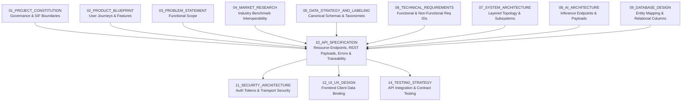
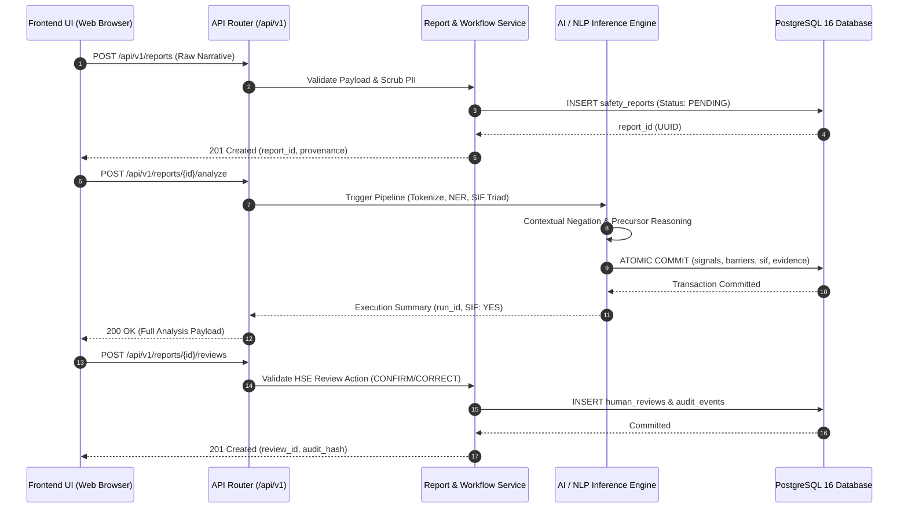

# 10_API_SPECIFICATION

**Document Status:** Authoritative for REST API Contracts, Request/Response Schemas, Serialization Protocols & Client-Server Integration  
**Governing Documents:** `01_PROJECT_CONSTITUTION.md`, `02_PRODUCT_BLUEPRINT.md`, `03_PROBLEM_STATEMENT.md`, `04_MARKET_RESEARCH.md`, `05_DATA_STRATEGY_AND_LABELING.md`, `06_TECHNICAL_REQUIREMENTS.md`, `07_SYSTEM_ARCHITECTURE.md`, `08_AI_ARCHITECTURE.md`, `09_DATABASE_DESIGN.md`  
**SIH Problem Statement ID:** SIH26165  
**Organization:** Oil India Limited (OIL)  
**Category:** Software  
**Theme:** Smart Automation  
**Team:** Tech Smashers  

---

> **Architectural Tagging Discipline:**
> - `[PROPOSED API DESIGN]` — Interface contracts, resource paths, and payloads designed by Tech Smashers.
> - `[RECOMMENDED IMPLEMENTATION]` — Pragmatic backend implementation choices (e.g., FastAPI / Node.js Express with Pydantic validation) for the hackathon MVP.
> - `[PROTOTYPE ASSUMPTION]` — Modeling choices made to operate reliably on synthetic/public data without access to proprietary OIL enterprise gateways.
> - `[FUTURE ENHANCEMENT]` — Advanced enterprise protocols (e.g., gRPC, webhook streaming, Kafka CDC ingestion, SAML2/OIDC SSO) reserved for production.
> - `[TO BE CONFIRMED]` — Enterprise integration parameters that must be officially confirmed with Oil India Limited IT/HSE teams.
> - `[ILLUSTRATIVE]` — Representative HTTP requests, JSON payloads, and response headers provided for conceptual clarity.

---

## 1. Purpose

This document defines the complete **Application Programming Interface (API) Specification** for the **OIL Safety Intelligence Platform**. It provides an exhaustive, developer-ready contract governing all data exchange between the frontend client, backend application services, AI/NLP reasoning pipelines, persistent PostgreSQL database, and human-in-the-loop review workflows.



This document establishes:
- The resource-oriented REST conventions, URI paths, and HTTP verb mappings.
- The standard JSON envelope structure encapsulating data, error states, and execution metadata.
- Request-level end-to-end traceability using cryptographically generated `request_id` headers.
- Contracts for single-report ingestion, validation, and idempotent submission.
- Real-time and asynchronous triggers for AI NLP parsing, barrier evaluation, and SIF reasoning.
- Transparent serialization of verbatim character-offset evidence chains.
- Dedicated endpoints for multi-dimensional cross-report pattern clusters and ranked HSE prioritization queues.
- Append-only human review submission workflows and training feedback capture.
- Canonical HTTP status code standards and machine-readable error taxonomies.

---

## 2. API Design Principles

The API layer is governed by eighteen core engineering principles `[PROPOSED API DESIGN]`:

1. **Resource-Oriented RESTful Architecture:** URIs represent nouns and business entities (`/reports`, `/patterns`, `/reviews`), while standard HTTP verbs (`GET`, `POST`, `PATCH`, `DELETE`) define operational semantics.
2. **Unified Envelope Contract:** Every response is wrapped in an immutable JSON envelope containing `success`, `data`, `error`, and `meta`.
3. **Strict Input Validation (`DATA-001`):** All incoming request payloads are validated against declarative schemas (Pydantic / JSON Schema) before hitting application logic.
4. **Machine-Readable Error Structures:** Error responses provide standardized application error codes (`ERROR_CODE`) and field-level validation dictionaries rather than generic text strings.
5. **Deterministic URI Versioning:** The primary namespace is versioned at the path level (`/api/v1/`), ensuring backward compatibility as the platform evolves.
6. **End-to-End Distributed Traceability (`OBS-001`):** Every HTTP request receives or inherits an `X-Request-ID` header propagated across database transactions and AI pipeline logs.
7. **Explicit Provenance Attribution (`DATA-002`):** Every report response explicitly returns its provenance classification (`source_type`), guaranteeing that synthetic benchmark data is never confused with official OIL data.
8. **Decoupled Outcome vs. SIF Potential (`AI-004`):** The API response guarantees that `actual_outcome_severity` and `sif_potential` occupy separate JSON attributes.
9. **Zero Fabricated Evidence (`AI-008`):** AI analytical responses must provide exact character integer offsets (`start_offset`, `end_offset`) pointing to raw narrative substrings.
10. **Non-Destructive Human Review (`HIL-001`):** Review endpoints append new review records; they never execute destructive SQL `UPDATE` operations on raw AI inference objects.
11. **Fail-Safe Uncertainty States (`NFR-003`):** When narrative context is ambiguous, the API emits `sif_potential: "REVIEW"` with an explanation; it never forces a false `NO`.
12. **Idempotency Guarantees:** Critical write operations support `Idempotency-Key` headers to prevent duplicate ingestion or double-review creation during network hiccups.
13. **Predictable Pagination Standards:** Collection endpoints enforce `page` and `page_size` query bounds to guarantee sub-second latency and prevent memory exhaustion.
14. **Controlled Filtering and Sorting:** Query parameters support explicit domain dimensions (`facility_id`, `sif_potential`, `barrier_status`) without allowing arbitrary SQL injection.
15. **Prototype Simplicity (`[RECOMMENDED IMPLEMENTATION]`):** Focuses on clean JSON REST APIs over HTTP/1.1 for MVP, avoiding multi-protocol gateway complexity.
16. **Production Extensibility (`[FUTURE ENHANCEMENT]`):** Designed to transition smoothly into enterprise API gateways (e.g., Kong, Apigee) without breaking frontend contracts.
17. **Data Minimization & PII Sanitization (`SEC-001`):** Normalization endpoints strip personal identifiers prior to returning serialized narrative objects.
18. **Stateless Operations:** API application servers maintain zero session state, delegating authentication verification to stateless cryptographically signed bearer tokens.

---

## 3. High-Level API Architecture & Data Flow

The API layer acts as the strict contract boundary between the user-facing web client, backend orchestration services, AI inference workers, and the persistent PostgreSQL database:



---

## 4. API Versioning Strategy

- **Namespace Convention:** All endpoints are anchored under the path `/api/v1/`.
- **Breaking Changes:** Any modification that removes fields, changes field types, or alters URL paths mandates a major version increment (e.g., `/api/v2/`).
- **Non-Breaking Enhancements:** Adding optional request fields or new non-null attributes to response objects is handled within the active `/v1` namespace without breaking existing clients.
- **Deprecation Policy (`[FUTURE ENHANCEMENT]`):** In enterprise phases, retiring endpoints will supply `Deprecation: true` and `Sunset: <date>` HTTP response headers.

---

## 5. Canonical Response Envelope

Every endpoint in the platform returns a predictable, standardized envelope `[PROPOSED API DESIGN]`:

```json
{
  "success": true,
  "data": {},
  "error": null,
  "meta": {
    "request_id": "req-8f2c3d4e-1a2b-4c5d-9e0f-1a2b3c4d5e6f",
    "timestamp": "2026-03-15T10:30:00.125Z",
    "version": "1.0.0-mvp",
    "provenance": "SYNTHETIC_PROTOTYPE"
  }
}
```

### Envelope Field Definitions

| Envelope Field | Type | Description |
|---|---|---|
| `success` | `boolean` | `true` for $2xx$ HTTP status codes; `false` for $4xx$ and $5xx$ errors. |
| `data` | `object` / `array` / `null` | The primary business payload. `null` if `success: false`. |
| `error` | `object` / `null` | Error details object if `success: false`; `null` if successful. |
| `meta` | `object` | Diagnostic metadata containing tracing IDs, timestamps, and provenance tags. |
| `meta.request_id`| `string` | Unique UUID tracking the request across logs and database records. |
| `meta.timestamp` | `string` | ISO-8601 UTC timestamp of response serialization. |
| `meta.version` | `string` | Platform release version serving the request. |
| `meta.provenance`| `string` | Dataset source tier: `AUTHORIZED_OIL`, `PUBLIC_BENCHMARK`, `SYNTHETIC_PROTOTYPE`, `MANUAL_PROTOTYPE`. |

---

## 6. Request Identification & Distributed Traceability

1. **Inbound Header:** Clients or upstream gateways may provide an `X-Request-ID: <UUID>` header.
2. **Generation Fallback:** If omitted, the API backend automatically generates a secure UUIDv4 and injects it into the request context.
3. **Outbound Header:** The backend always reflects `X-Request-ID` in the HTTP response headers and within `meta.request_id`.
4. **Audit Cross-Reference:** The `request_id` is persisted in `audit_events.payload_delta` to ensure complete forensic auditability across server logs and database rows (`SEC-002`).

---

## 7. Core Resource Hierarchy

The API exposes high-level product capabilities organized as clean, RESTful resources:

```
/api/v1
  ├── /health                                    [System health & dependencies]
  ├── /reports                                   [Safety report ingestion & search]
  │     └── /{report_id}                         [Single report CRUD & status]
  │           ├── /analyze                       [Trigger AI inference]
  │           ├── /analysis                      [Consolidated AI intelligence]
  │           ├── /signals                       [Extracted physical signals]
  │           ├── /barriers                      [Evaluated barrier integrity]
  │           ├── /life-saving-rules             [Mapped 9 IOGP rules]
  │           ├── /evidence                      [Verbatim text character spans]
  │           └── /reviews                       [Human HSE review history & submission]
  ├── /patterns                                  [Cross-report systemic precursor clusters]
  │     ├── /{pattern_id}                        [Pattern details & member reports]
  │     └── /generate                            [Trigger on-demand cluster aggregation]
  ├── /priorities                                [Ranked HSE field intervention queue]
  ├── /dashboard                                 [Aggregated safety metrics & charts]
  │     ├── /summary                             [Executive KPI cards & SIF counts]
  │     ├── /trends                              [Monthly precursor degradation velocity]
  │     └── /hotspots                            [High-risk facility & activity breakdown]
  ├── /processing-runs/{run_id}                  [AI execution engine diagnostic metadata]
  └── /audit/events                              [Cryptographic tamper-evident audit ledger]
```

---

## 8. Report Ingestion API

### `POST /api/v1/reports`
Ingests a single frontline safety observation, unsafe act, unsafe condition, or near-miss report (`FR-001`).

- **Caller:** Field Reporting Web Form, Batch CSV Ingestion Script, or Enterprise Ingestion Connector.
- **Headers:** `Content-Type: application/json`, `Idempotency-Key: <UUID>` (Optional).

#### Request Body
```json
{
  "source_id": "9a8b7c6d-1e2f-3a4b-5c6d-7e8f9a0b1c2d",
  "source_report_id": "FLD-2026-03-8841",
  "report_type": "NEAR_MISS",
  "event_date": "2026-03-15",
  "event_time": "14:30:00",
  "facility_id": "SITE-A-OILFIELD",
  "specific_location": "Condensate Separator Area",
  "department": "Production Operations",
  "raw_narrative": "During maintenance activity at Site A, a technician entered a confined space before atmospheric testing was completed. No standby person was present. Work was stopped after supervisor noticed. No injuries occurred.",
  "actual_outcome_severity": "NO_INJURY_NEAR_MISS"
}
```

#### Validation Rules
- `source_id`: Must be a valid UUID referencing an active record in `data_sources`.
- `report_type`: Must match enum `['UNSAFE_ACT', 'UNSAFE_CONDITION', 'NEAR_MISS', 'INCIDENT']`.
- `event_date`: Must be a valid ISO-8601 date $\le \text{CURRENT\_DATE}$.
- `raw_narrative`: Required string; length must be between 10 and 10,000 characters.
- `actual_outcome_severity`: Required enum `['NO_INJURY_NEAR_MISS', 'FIRST_AID', 'MEDICAL_TREATMENT', 'LOST_TIME_INJURY', 'FATALITY', 'UNKNOWN']`.

#### Response Payload (`201 Created`)
```json
{
  "success": true,
  "data": {
    "report_id": "c1f7a240-8f63-4b6e-a28a-7d4e5f1b2c3d",
    "source_report_id": "FLD-2026-03-8841",
    "processing_status": "PENDING",
    "narrative_sha256": "e3b0c44298fc1c149afbf4c8996fb92427ae41e4649b934ca495991b7852b855",
    "created_at": "2026-03-15T14:35:10.450Z"
  },
  "error": null,
  "meta": {
    "request_id": "req-01a2b3c4-d5e6-7f8a-9b0c-1d2e3f4a5b6c",
    "timestamp": "2026-03-15T14:35:10.452Z",
    "version": "1.0.0-mvp",
    "provenance": "SYNTHETIC_PROTOTYPE"
  }
}
```

---

## 8b. Batch Report Ingestion API (`FR-002`) `[GAP FIX — added during consistency remediation]`

### `POST /api/v1/reports/batch`
Ingests multiple safety reports in a single call via CSV or JSON array upload — this is the contract the Batch CSV Ingestion Script / `BulkUploadModal.tsx` (referenced in `06_TECHNICAL_REQUIREMENTS.md` FR-002 and `12_UI_UX_DESIGN.md`) calls against. This endpoint was missing from earlier drafts of this specification despite being treated as P0 elsewhere in the document set; it is defined here to close that gap.

- **Caller:** `BulkUploadModal.tsx` (frontend), or a CLI/script loading the synthetic MVD-60 dataset for demo seeding.
- **Headers:** `Content-Type: multipart/form-data` (for CSV) **or** `Content-Type: application/json` (for a JSON array body).
- **Scope (H0 prototype):** Synchronous processing for up to 100 rows per call. Each row is validated and ingested independently — a bad row does not abort the whole batch.

#### Request Body — Option A: multipart/form-data (CSV upload)
```
Content-Type: multipart/form-data; boundary=----WebKitFormBoundary
file: <reports.csv>   -- columns matching the fields of POST /api/v1/reports
source_id: <UUID>     -- applied to every row unless the CSV includes its own source_id column
```

#### Request Body — Option B: application/json (array of report objects)
```json
{
  "source_id": "9a8b7c6d-1e2f-3a4b-5c6d-7e8f9a0b1c2d",
  "reports": [
    {
      "source_report_id": "FLD-2026-03-8841",
      "report_type": "NEAR_MISS",
      "event_date": "2026-03-15",
      "facility_id": "SITE-A-OILFIELD",
      "raw_narrative": "During maintenance activity at Site A, a technician entered a confined space before atmospheric testing was completed. No standby person was present. Work was stopped after supervisor noticed. No injuries occurred.",
      "actual_outcome_severity": "NO_INJURY_NEAR_MISS"
    }
  ]
}
```

Each row/object follows the same field names and validation rules as `POST /api/v1/reports` (Section 8).

#### Response Payload (`207 Multi-Status`)
A batch call returns `207 Multi-Status` (not `201`), because individual rows can succeed or fail independently:
```json
{
  "success": true,
  "data": {
    "batch_id": "b4a1e2d3-...",
    "submitted": 60,
    "accepted": 58,
    "rejected": 2,
    "results": [
      { "row": 1, "report_id": "c1f7a240-...", "status": "ACCEPTED" },
      { "row": 2, "status": "REJECTED", "error_code": "VALIDATION_ERROR", "message": "raw_narrative shorter than 10 characters" }
    ]
  },
  "error": null,
  "meta": {
    "request_id": "req-...",
    "timestamp": "2026-03-15T14:40:00.000Z",
    "version": "1.0.0-mvp",
    "provenance": "SYNTHETIC_PROTOTYPE"
  }
}
```

#### Validation Rules
- Identical per-row validation to `POST /api/v1/reports` (Section 8), applied row-by-row.
- Maximum 100 rows per call in the H0 prototype; larger batches are rejected with `413 Payload Too Large` and a message suggesting multiple smaller calls (async job-based batch processing beyond 100 rows is a `[FUTURE ENHANCEMENT]`, not P0).
- Rows are **not** wrapped in a single all-or-nothing transaction — each row is inserted independently so that one malformed row does not block the other 59.

---

## 9. Get Single Report API

### `GET /api/v1/reports/{report_id}`
Retrieves complete record metadata, raw narrative, normalized text, and current processing lifecycle status.

- **Response (`200 OK`)**: Returns full report attributes matching `09_DATABASE_DESIGN.md` (Section 48).

---

## 10. Report List & Multi-Filter Search API

### `GET /api/v1/reports`
Queries and filters safety reports with multi-dimensional criteria for triage and search consoles (`FR-006`).

#### Query Parameters
| Parameter | Type | Default | Description |
|---|---|---|---|
| `page` | `integer` | `1` | Page number (1-indexed). |
| `page_size` | `integer` | `20` | Items per page (min: 1, max: 100). |
| `facility_id` | `string` | `null` | Exact match facility filter (e.g., `SITE-A-OILFIELD`). |
| `sif_potential` | `string` | `null` | Filter by `YES`, `NO`, `REVIEW`. |
| `barrier_status` | `string` | `null` | Filter by `INCOMPLETE`, `FAILED`, etc. |
| `lsr_rule_code` | `string` | `null` | Filter by rule code (e.g., `LSR_CONFINED_SPACE`). |
| `review_status` | `string` | `null` | Filter by `UNREVIEWED`, `CONFIRMED`, `CORRECTED`. |
| `date_from` | `string` | `null` | Inclusive start date (`YYYY-MM-DD`). |
| `date_to` | `string` | `null` | Inclusive end date (`YYYY-MM-DD`). |
| `q` | `string` | `null` | Full-text search term queried against PostgreSQL `tsvector`. |

#### Response Payload (`200 OK`)
```json
{
  "success": true,
  "data": {
    "items": [
      {
        "report_id": "c1f7a240-8f63-4b6e-a28a-7d4e5f1b2c3d",
        "source_report_id": "FLD-2026-03-8841",
        "event_date": "2026-03-15",
        "facility_id": "SITE-A-OILFIELD",
        "report_type": "NEAR_MISS",
        "actual_outcome_severity": "NO_INJURY_NEAR_MISS",
        "sif_potential": "YES",
        "priority_level": "P1_CRITICAL",
        "primary_lsr_rule": "Confined Space Entry",
        "critical_barrier_status": "INCOMPLETE",
        "review_status": "UNREVIEWED"
      }
    ],
    "pagination": {
      "current_page": 1,
      "page_size": 20,
      "total_items": 1,
      "total_pages": 1,
      "has_next": false,
      "has_prev": false
    }
  },
  "error": null,
  "meta": {
    "request_id": "req-98f7e6d5-c4b3-a210-9f8e-7d6c5b4a3b2a",
    "timestamp": "2026-03-15T14:36:00.100Z",
    "version": "1.0.0-mvp",
    "provenance": "SYNTHETIC_PROTOTYPE"
  }
}
```

---

## 11. Report Update & Stale Analysis Invalidation API

### `PATCH /api/v1/reports/{report_id}`
Updates operational metadata (e.g., correcting a facility ID or specific sub-location).

#### Critical Stale Analysis Policy
- If the `raw_narrative` field is updated, the server **automatically invalidates all existing AI inferences**:
  1. `processing_status` transitions from `PROCESSED` back to `PENDING`.
  2. The previous `sif_assessments` record sets `is_active_assessment = FALSE`.
  3. The response notifies the client that derived intelligence is stale and triggers automatic reanalysis.

---

## 12. Report Deletion & Archival API

### `DELETE /api/v1/reports/{report_id}`
Executes a soft-delete/archival transition by setting `processing_status = 'ARCHIVED'`. Physical hard-deletion of raw incident records is strictly prohibited to preserve historical safety audit chains (`DATA-001`, `SEC-002`).

---

## 13. Trigger AI Report Analysis API

### `POST /api/v1/reports/{report_id}/analyze`
Triggers execution of the complete 14-stage AI/NLP pipeline (`AI-001` through `AI-006`).

- **Caller:** Frontend UI upon report submission, or automated ingestion worker.
- **Execution Model:** Supports synchronous return for hackathon prototype ($<2000\text{ms}$ execution) and asynchronous status polling for production (`[PROPOSED API DESIGN]`).

#### Response Payload (`200 OK`)
```json
{
  "success": true,
  "data": {
    "report_id": "c1f7a240-8f63-4b6e-a28a-7d4e5f1b2c3d",
    "run_id": "f5e4d3c2-b1a0-9f8e-7d6c-5b4a3b2c1d0e",
    "execution_status": "SUCCESS",
    "execution_duration_ms": 420,
    "sif_potential": "YES",
    "priority_level": "P1_CRITICAL",
    "active_assessment_id": "s1111111-1111-1111-1111-111111111111"
  },
  "error": null,
  "meta": {
    "request_id": "req-11223344-5566-7788-99aa-bbccddeeff00",
    "timestamp": "2026-03-15T14:37:12.890Z",
    "version": "1.0.0-mvp",
    "provenance": "SYNTHETIC_PROTOTYPE"
  }
}
```

---

## 14. Synchronous vs. Asynchronous Execution Architecture

```
+----------------------------------------------------------------------------------------------------+
| Architectural Tier  | Synchronous Execution (P0 MVP)       | Asynchronous Job Polling (P2 Production)|
+---------------------+--------------------------------------+-----------------------------------------+
| Pipeline Trigger    | POST /reports/{id}/analyze           | POST /reports/{id}/analyze              |
| HTTP Response Code  | 200 OK (Returns final analysis payload)| 202 Accepted (Returns run_id + poll URI)|
| Processing Queue    | In-process background thread         | Redis / Celery / BullMQ worker queue    |
| Status Endpoint     | Optional diagnostic check            | GET /processing-runs/{run_id}           |
| Scale Capability    | Up to 50 reports/min on CPU          | 10,000+ reports/hr distributed GPU pool |
+----------------------------------------------------------------------------------------------------+
```

---

## 15. Processing Run Status Diagnostic API

### `GET /api/v1/processing-runs/{run_id}`
Returns execution engine telemetry, error traces (if failed), model checkpoint IDs, and ruleset SHA-256 hashes (`OBS-001`).

---

## 16. Consolidated Safety Intelligence Analysis API

### `GET /api/v1/reports/{report_id}/analysis`
The primary analytical consumption endpoint. Aggregates the complete Precursor Triad, physical signals, barrier evaluations, IOGP Life-Saving Rules, and character-bound evidence spans into a single payload `[PROPOSED API DESIGN]`.

#### Response Payload (`200 OK`)
```json
{
  "success": true,
  "data": {
    "report_id": "c1f7a240-8f63-4b6e-a28a-7d4e5f1b2c3d",
    "normalized_narrative": "During maintenance activity at Site A, a technician entered a confined space before atmospheric gas testing was completed. No standby attendant was present. Work was stopped after supervisor noticed. No injuries occurred.",
    "actual_outcome": {
      "severity": "NO_INJURY_NEAR_MISS",
      "injuries_recorded": false,
      "fatalities_recorded": false
    },
    "sif_assessment": {
      "assessment_id": "s1111111-1111-1111-1111-111111111111",
      "sif_potential": "YES",
      "priority_level": "P1_CRITICAL",
      "model_confidence": 0.965,
      "causal_rule_triggered": "SIF_RULE_CONFINED_SPACE_UNVERIFIED_ATMOSPHERE",
      "reasoning_summary": "Worker exposed to lethal toxic/asphyxiating energy inside confined space with atmospheric testing incomplete and standby attendant absent. Fortuitous supervisory work stoppage prevented fatal escalation; actual outcome does not downgrade latent potential.",
      "is_active": true
    },
    "safety_signals": [
      {
        "category": "ACTIVITY",
        "canonical_name": "Vessel Maintenance",
        "status": "ACTIVE",
        "confidence": 0.980
      },
      {
        "category": "HAZARD",
        "canonical_name": "Toxic/Asphyxiating Atmosphere",
        "status": "ACTIVE",
        "confidence": 0.965
      },
      {
        "category": "EXPOSURE",
        "canonical_name": "Worker Inside Confined Hazard Zone",
        "status": "ACTIVE",
        "confidence": 0.990
      }
    ],
    "barrier_findings": [
      {
        "barrier_id": "b1111111-1111-1111-1111-111111111111",
        "barrier_name": "Atmospheric Gas Testing",
        "barrier_category": "PROCEDURAL",
        "barrier_status": "INCOMPLETE",
        "is_critical_barrier": true,
        "verification_method": "REPORTED_EXPLICIT"
      },
      {
        "barrier_id": "b2222222-2222-2222-2222-222222222222",
        "barrier_name": "Standby Safety Attendant",
        "barrier_category": "ADMINISTRATIVE",
        "barrier_status": "MISSING",
        "is_critical_barrier": true,
        "verification_method": "REPORTED_EXPLICIT"
      }
    ],
    "life_saving_rules": [
      {
        "rule_code": "LSR_CONFINED_SPACE",
        "rule_name": "Confined Space Entry",
        "mapping_confidence": 0.992,
        "is_primary": true
      }
    ],
    "evidence_chain": [
      {
        "evidence_id": "e1111111-1111-1111-1111-111111111111",
        "target_type": "EXPOSURE",
        "verbatim_text": "entered a confined space",
        "start_offset": 47,
        "end_offset": 71,
        "justification": "Establishes physical worker exposure inside confined space envelope."
      },
      {
        "evidence_id": "e2222222-2222-2222-2222-222222222222",
        "target_type": "BARRIER_FINDING",
        "verbatim_text": "before atmospheric testing was completed",
        "start_offset": 72,
        "end_offset": 112,
        "justification": "Temporal preposition 'before' confirms critical safeguard was unverified prior to entry."
      },
      {
        "evidence_id": "e3333333-3333-3333-3333-333333333333",
        "target_type": "BARRIER_FINDING",
        "verbatim_text": "No standby person was present",
        "start_offset": 114,
        "end_offset": 143,
        "justification": "Explicit syntactic negation confirms absence of secondary rescue barrier."
      }
    ],
    "review_status": {
      "state": "UNREVIEWED",
      "latest_review": null
    }
  },
  "error": null,
  "meta": {
    "request_id": "req-aa11bb22-cc33-dd44-ee55-ff6600112233",
    "timestamp": "2026-03-15T14:38:00.150Z",
    "version": "1.0.0-mvp",
    "provenance": "SYNTHETIC_PROTOTYPE"
  }
}
```

---

## 17. SIF Assessment Response Semantics

- **Explicit Separation:** `actual_outcome.severity` (`NO_INJURY_NEAR_MISS`) and `sif_assessment.sif_potential` (`YES`) are delivered in isolated objects.
- **Model Confidence Disclaimer:** The `model_confidence` value ($0.000$ to $1.000$) reflects algorithmic model certainty; it **does not** represent a mathematical probability of human death.

---

## 18. Granular Safety Signals API

### `GET /api/v1/reports/{report_id}/signals`
Exposes extracted physical operational signals filtered by category:
- **Query Filters:** `?category=HAZARD`, `?is_critical=true`.

---

## 19. Evidence Span Offset API

### `GET /api/v1/reports/{report_id}/evidence`
Delivers verbatim character offsets (`start_offset`, `end_offset`) allowing frontend clients to visually highlight supporting phrases in the incident text without altering the DOM text nodes (`AI-008`).

---

## 20. Barrier Finding Integrity API

### `GET /api/v1/reports/{report_id}/barriers`
Exposes the 5 canonical operational integrity states (`AI-005`):
- `PRESENT_VERIFIED`
- `INCOMPLETE`
- `MISSING`
- `FAILED`
- `BYPASSED`
- `UNKNOWN`

---

## 21. IOGP Life-Saving Rules Mapping API

### `GET /api/v1/reports/{report_id}/life-saving-rules`
Returns contextual mappings to the 9 international rules defined in IOGP Report 459 (`AI-006`). Reports may map to multiple rules if multi-hazard conditions exist (e.g., `LSR_WORK_AT_HEIGHT` and `LSR_LINE_OF_FIRE`).

---

## 22. Cross-Report Recurring Patterns APIs

### `GET /api/v1/patterns`
Returns systemic precursor clusters discovered across multiple reports where $N \ge 3$ (`FR-006`, `AI-007`).

#### Response Payload (`200 OK`)
```json
{
  "success": true,
  "data": {
    "patterns": [
      {
        "pattern_id": "p1111111-1111-1111-1111-111111111111",
        "pattern_title": "Incomplete Gas Verification Prior to Vessel Entry",
        "pattern_type": "BARRIER_DEGRADATION",
        "primary_activity": "Vessel Maintenance",
        "primary_hazard": "Toxic/Asphyxiating Atmosphere",
        "primary_barrier_break": "Atmospheric Testing Incomplete",
        "affected_facility_id": "SITE-A-OILFIELD",
        "report_count": 4,
        "sif_potential_count": 4,
        "severity_tier": "TIER_1_CRITICAL",
        "first_observed_date": "2026-02-10",
        "latest_observed_date": "2026-03-15",
        "pattern_status": "ACTIVE_HOTSPOT"
      }
    ],
    "total_count": 1
  },
  "error": null,
  "meta": {
    "request_id": "req-pat-01020304-0506-0708-090a-0b0c0d0e0f10",
    "timestamp": "2026-03-15T14:40:00.000Z",
    "version": "1.0.0-mvp",
    "provenance": "SYNTHETIC_PROTOTYPE"
  }
}
```

### `GET /api/v1/patterns/{pattern_id}/reports`
Retrieves all individual safety reports that constitute the specified systemic pattern cluster.

---

## 23. Trigger Pattern Generation API

### `POST /api/v1/patterns/generate`
Admin/Analyst endpoint triggering the batch aggregation engine across the active database to recalculate cluster tuples and detect new emerging hotspots.

---

## 24. HSE Prioritization Queue API

### `GET /api/v1/priorities`
Delivers a ranked triage queue prioritizing facilities, activities, and individual reports requiring immediate safety intervention (`FR-006`).

#### Response Payload (`200 OK`)
```json
{
  "success": true,
  "data": {
    "priorities": [
      {
        "priority_id": "pr-11111111-1111-1111-1111-111111111111",
        "target_type": "REPORT",
        "target_id": "c1f7a240-8f63-4b6e-a28a-7d4e5f1b2c3d",
        "priority_rank": 1,
        "urgency_level": "IMMEDIATE_ACTION",
        "prioritization_basis": "Confined space entry attempt with atmospheric testing bypassed and attendant absent (P1-Critical). Part of recurring Site A vessel entry cluster.",
        "review_status": "UNREVIEWED"
      }
    ]
  },
  "error": null,
  "meta": {
    "request_id": "req-prio-1122-3344-5566-7788",
    "timestamp": "2026-03-15T14:42:10.000Z",
    "version": "1.0.0-mvp",
    "provenance": "SYNTHETIC_PROTOTYPE"
  }
}
```

---

## 25. Executive Dashboard Summary APIs

### `GET /api/v1/dashboard/summary`
Returns high-level aggregate KPI cards driving the central executive dashboard (`02_PRODUCT_BLUEPRINT.md`):

```json
{
  "success": true,
  "data": {
    "total_reports_ingested": 60,
    "total_reports_analyzed": 60,
    "sif_potential_distribution": {
      "yes_count": 22,
      "no_count": 32,
      "review_count": 6
    },
    "active_recurring_hotspots": 3,
    "pending_human_reviews": 8,
    "top_degraded_barrier": "Atmospheric Gas Testing",
    "top_violated_lsr": "Confined Space Entry",
    "highest_risk_facility": "SITE-A-OILFIELD"
  },
  "error": null,
  "meta": {
    "request_id": "req-dash-summary-001",
    "timestamp": "2026-03-15T14:45:00.000Z",
    "version": "1.0.0-mvp",
    "provenance": "SYNTHETIC_PROTOTYPE"
  }
}
```

### `GET /api/v1/dashboard/trends`
Returns time-series counts of SIF potential reports vs. routine defects aggregated by week or month.

---

## 26. Human Review Workflow APIs (`HIL-001`)

### `POST /api/v1/reports/{report_id}/reviews`
Allows certified HSE professionals to confirm, correct, or reject AI analytical conclusions.

#### Request Body
```json
{
  "reviewer_user_id": "u1111111-1111-1111-1111-111111111111",
  "review_action": "CORRECT",
  "revised_sif_result": "YES",
  "reviewer_notes": "Supervisor stopped work in time, but this was a near-fatal scenario. Entering without gas testing is a strict Life-Saving Rule violation; elevating from REVIEW to YES.",
  "corrections_payload": {
    "barrier_overrides": [
      {
        "barrier_name": "Atmospheric Gas Testing",
        "revised_status": "BYPASSED"
      }
    ],
    "lsr_override": "LSR_CONFINED_SPACE"
  }
}
```

#### Validation Rules
- `review_action`: Required enum `['CONFIRM', 'CORRECT', 'REJECT', 'MARK_INSUFFICIENT_EVIDENCE', 'REQUEST_REANALYSIS']`.
- `revised_sif_result`: Required enum `['YES', 'NO', 'REVIEW']`.
- `reviewer_notes`: Required string; minimum 10 characters justifying the decision.

#### Response Payload (`201 Created`)
```json
{
  "success": true,
  "data": {
    "review_id": "h1111111-1111-1111-1111-111111111111",
    "report_id": "c1f7a240-8f63-4b6e-a28a-7d4e5f1b2c3d",
    "review_action": "CORRECT",
    "revised_sif_result": "YES",
    "audit_event_id": "ae-99887766-5544-3322-1100-aabbccddeeff",
    "reviewed_at": "2026-03-15T15:00:00.000Z"
  },
  "error": null,
  "meta": {
    "request_id": "req-rev-submit-001",
    "timestamp": "2026-03-15T15:00:00.050Z",
    "version": "1.0.0-mvp",
    "provenance": "SYNTHETIC_PROTOTYPE"
  }
}
```

---

## 27. Review Immutability & Audit Guarantee

1. **Non-Destructive Write:** When `POST /reviews` executes, the original `sif_assessments` row remains unchanged.
2. **Audit Event Generation:** An append-only record is inserted into `audit_events` with an updated SHA-256 hash chaining `prev_event_hash` (`SEC-002`).
3. **Training Delta Flag:** If `review_action == 'CORRECT'`, the server flags the record for active learning training pools (`[FUTURE ENHANCEMENT]`).

---

## 28. Historical Review Trail API

### `GET /api/v1/reports/{report_id}/reviews`
Retrieves the complete chronological audit trail of all human evaluations, comments, and overrides associated with the report.

---

## 29. Dataset Provenance API

### `GET /api/v1/reports/{report_id}/provenance`
Returns cryptographic dataset provenance, source licensing, ingestion timestamps, and the synthetic data disclosure banner (`DATA-002`).

---

## 30. Tamper-Evident Audit Ledger API (`SEC-002`)

### `GET /api/v1/audit/events`
Exposes the append-only cryptographic audit log. Restricted exclusively to users with the `SYSTEM_AUDITOR` role.

---

## 31. Authentication & Role-Based Access Control (RBAC)

Authentication is enforced via Bearer JWT tokens in the `Authorization: Bearer <TOKEN>` header (`SEC-001`).

### `POST /api/v1/auth/login`
Authenticates user credentials against salted `bcrypt` password hashes stored in `app_users` and issues a cryptographically signed JWT access token.

- **Caller:** Frontend UI authentication modal or API integration client.
- **Request Headers:** `Content-Type: application/json`
- **Request Payload:**
```json
{
  "username": "hse_officer_01",
  "password": "CorrectHorseBatteryStaple123!"
}
```

#### Response Payload (`200 OK`)
```json
{
  "success": true,
  "data": {
    "access_token": "eyJhbGciOiJIUzI1NiIsInR5cCI6IkpXVCJ9.eyJzdWIiOiJ1MTExMTExMS0xMTExLTExMTEtMTExMS0xMTExMTExMTExMTEiLCJ1c2VybmFtZSI6ImhzZV9vZmZpY2VyXzAxIiwicm9sZSI6IkhTRV9PRkZJQ0VSIiwiZXhwIjoxNzc5Mzk1MjAwfQ...",
    "token_type": "bearer",
    "expires_in": 900,
    "user": {
      "id": "u1111111-1111-1111-1111-111111111111",
      "username": "hse_officer_01",
      "full_name": "Senior Field HSE Officer",
      "role": "HSE_OFFICER"
    }
  },
  "error": null,
  "meta": {
    "request_id": "req-99887766-5544-3322-1100-aabbccddeeff",
    "timestamp": "2026-03-15T14:30:00.000Z",
    "version": "1.0.0-mvp",
    "provenance": "SYNTHETIC_PROTOTYPE"
  }
}
```

#### Error Responses
- **`401 Unauthorized` (`INVALID_CREDENTIALS`):**
```json
{
  "success": false,
  "data": null,
  "error": {
    "code": "INVALID_CREDENTIALS",
    "message": "Invalid username or password.",
    "details": null
  },
  "meta": {
    "request_id": "req-99887766-5544-3322-1100-aabbccddeeff",
    "timestamp": "2026-03-15T14:30:00.000Z",
    "version": "1.0.0-mvp",
    "provenance": "SYNTHETIC_PROTOTYPE"
  }
}
```
- **`422 Unprocessable Entity` (`VALIDATION_ERROR`):** Request body missing required `username` or `password` attributes.

### Canonical H0 RBAC Roles

| User Role | Permitted API Scope | Prohibited Actions |
|---|---|---|
| `HSE_VIEWER` | `GET` on reports, dashboard, analysis, patterns | `POST /reports`, `POST /reviews` |
| `HSE_ANALYST`| All viewer permissions + `POST /analyze`, `POST /patterns/generate` | `POST /reviews` (Formal sign-off) |
| `HSE_OFFICER`| All analyst permissions + `POST /reports/{id}/reviews` | System configuration alterations |
| `ADMINISTRATOR`| Full administrative access: user management, reference taxonomies | Mutation of raw incident narratives |
| `SYSTEM_AUDITOR`| Exclusive access to `GET /audit/events` + read-only logs | Mutation of operational data |
| `ML_OPS_ENGINEER`| Access to `GET /processing-runs/{id}` + model telemetry | Manual safety review submission |

---

## 32. Standardized Error Response Model

All $4xx$ and $5xx$ responses emit a uniform error structure:

```json
{
  "success": false,
  "data": null,
  "error": {
    "code": "BARRIER_STATE_INVALID",
    "message": "The provided barrier override status is not recognized.",
    "details": {
      "field": "corrections_payload.barrier_overrides[0].revised_status",
      "rejected_value": "DISABLED",
      "allowed_values": [
        "PRESENT_VERIFIED",
        "INCOMPLETE",
        "MISSING",
        "FAILED",
        "BYPASSED",
        "UNKNOWN"
      ]
    }
  },
  "meta": {
    "request_id": "req-err-44332211-00aa-bbcc-ddee-ff0011223344",
    "timestamp": "2026-03-15T15:10:00.120Z",
    "version": "1.0.0-mvp",
    "provenance": "SYNTHETIC_PROTOTYPE"
  }
}
```

### Standard Error Codes

| HTTP Status | Error Code | Operational Cause |
|---|---|---|
| `400 Bad Request` | `VALIDATION_ERROR` | Request payload fails schema validation. |
| `400 Bad Request` | `NARRATIVE_TOO_SHORT` | Narrative string is less than 10 characters. |
| `401 Unauthorized` | `UNAUTHORIZED` | Missing, expired, or cryptographically invalid JWT token. |
| `403 Forbidden` | `INSUFFICIENT_PERMISSIONS`| User role does not possess required authority. |
| `404 Not Found` | `REPORT_NOT_FOUND` | Specified `report_id` does not exist in database. |
| `409 Conflict` | `DUPLICATE_REPORT` | Narrative SHA-256 matches an existing submission on that date. |
| `422 Unprocessable` | `PROCESSING_DEPENDENCY_FAILED`| AI pipeline crashed due to syntactic parsing fault. |
| `429 Too Many Req` | `RATE_LIMIT_EXCEEDED` | Client exceeded maximum requests per minute window. |
| `500 Internal Error`| `INTERNAL_SERVER_ERROR`| Unhandled server exception; details logged with `request_id`. |
| `503 Service Unavail`| `AI_INFERENCE_UNAVAILABLE`| Local ML model worker or embedding service unresponsive. |

---

## 33. AI Pipeline Failure Handling (`NFR-003`)

If the NLP pipeline or transformer model worker fails during execution:
1. The API **never returns a fabricated `SIF: NO`**.
2. The endpoint responds with `503 Service Unavailable` or marks the report `processing_status: "PROCESSING_FAILED"`.
3. The report is automatically flagged for manual HSE triage (`SIF Potential: REVIEW`), guaranteeing fail-safe operation.

---

## 34. Idempotency & Duplicate Prevention

Write operations (`POST /reports`, `POST /reviews`) accept an optional `Idempotency-Key` header:
- If a client retries a request with an identical `Idempotency-Key` within a 24-hour window, the server returns the cached response with an `X-Cache: IDEMPOTENT-HIT` header without re-executing database writes.

---

## 35. Pagination, Sorting & Range Conventions

- **Default Bounds:** `page = 1`, `page_size = 20` (Maximum `page_size = 100`).
- **Sorting Syntax:** `?sort_by=event_date&sort_order=desc` (Supported sorts: `event_date`, `created_at`, `priority_rank`).

---

## 36. HTTP Status Code Standard

| Status Code | Semantic Meaning within Platform |
|---|---|
| `200 OK` | Successful read, update, or synchronous analysis execution. |
| `201 Created` | Successful creation of a report, review, or pattern entity. |
| `202 Accepted` | Asynchronous processing job accepted and queued. |
| `204 No Content` | Successful execution returning zero payload. |
| `400 Bad Request` | Malformed JSON or invalid parameter syntax. |
| `401 Unauthorized` | Missing or invalid authentication credentials. |
| `403 Forbidden` | User authenticated but unauthorized for this resource. |
| `404 Not Found` | Target entity UUID not found in database. |
| `409 Conflict` | Unique constraint violation (e.g., duplicate narrative hash). |
| `422 Unprocessable` | Well-formed JSON violating business logic rules. |
| `429 Too Many Requests`| Rate limit exceeded. |
| `500 Internal Error` | Unexpected backend server fault. |
| `503 Service Unavailable`| Model worker or database connection pool unavailable. |

---

## 37. API ↔ Database Traceability Matrix

| API Endpoint | HTTP Verb | Primary Database Table(s) (`09_DATABASE_DESIGN.md`) | Operations | Technical Req ID (`06`) |
|---|---|---|---|---|
| `/api/v1/auth/login` | `POST` | `app_users` | `SELECT` | `SEC-001` |
| `/api/v1/reports` | `POST` | `safety_reports`, `data_sources` | `INSERT` | `FR-001`, `DATA-002` |
| `/api/v1/reports` | `GET` | `safety_reports`, `sif_assessments` | `SELECT` | `FR-001` |
| `/api/v1/reports/{id}` | `GET` | `safety_reports` | `SELECT` | `FR-001` |
| `/api/v1/reports/batch` | `POST` | `safety_reports`, `data_sources`, `processing_runs` | `INSERT` | `FR-002` |
| `/api/v1/reports/{id}/analyze`| `POST` | `processing_runs`, `sif_assessments`, `barrier_findings` | `INSERT` | `AI-001`, `AI-002`, `AI-003`, `AI-004`, `AI-005` |
| `/api/v1/reports/{id}/analysis`| `GET` | `sif_assessments`, `barrier_findings`, `evidence_spans` | `SELECT` | `AI-004`, `AI-008` |
| `/api/v1/reports/{id}/barriers`| `GET` | `barrier_findings` | `SELECT` | `AI-005` |
| `/api/v1/reports/{id}/evidence`| `GET` | `evidence_spans` | `SELECT` | `AI-008` |
| `/api/v1/patterns` | `GET` | `recurring_patterns`, `pattern_memberships` | `SELECT` | `AI-007` |
| `/api/v1/priorities` | `GET` | `hse_prioritizations` | `SELECT` | `UX-004` |
| `/api/v1/dashboard/summary` | `GET` | `safety_reports`, `sif_assessments`, `barrier_findings` | `SELECT (Agg)` | `UX-001` |
| `/api/v1/reports/{id}/reviews` | `POST` | `human_reviews`, `audit_events` | `INSERT` | `HIL-001`, `SEC-002` |
| `/api/v1/audit/events` | `GET` | `audit_events` | `SELECT` | `SEC-002` |

---

## 38. API ↔ AI Architecture Traceability Matrix

| API Endpoint | Responsible AI Engine Component (`08_AI_ARCHITECTURE.md`) | AI Analytical Function |
|---|---|---|
| `POST /reports/{id}/analyze` | NLP Preprocessor & Dependency Parser | Normalization, tokenization, and negation parsing (`AI-001`, `AI-002`). |
| `POST /reports/{id}/analyze` | Safety Entity & Relation Extractor | Extraction of SVO facts and 7 physical signal classes (`AI-003`). |
| `POST /reports/{id}/analyze` | Barrier Intelligence Module | Evaluation of 6-state safeguard integrity (`AI-005`). |
| `POST /reports/{id}/analyze` | Hybrid SIF Potential Engine | Causal evaluation of Precursor Triad (`AI-004`). |
| `POST /reports/{id}/analyze` | IOGP Rule Mapping Engine | Contextual mapping to 9 Life-Saving Rules (`AI-006`). |
| `GET /reports/{id}/evidence` | Explainability & Traceability Service | Extraction of exact character-offset spans (`AI-008`). |
| `POST /patterns/generate` | Cross-Report Pattern Discovery Engine | Multi-dimensional cluster aggregation where $N \ge 3$ (`AI-007`). |

---

## 39. MVP vs. Production API Feature Set

```
+----------------------------------------------------------------------------------------------------+
| API Capability / Endpoint      | Hackathon MVP (P0 Scope)            | Enterprise Target (P2 Scope)|
+--------------------------------+-------------------------------------+-----------------------------+
| POST /api/v1/reports           | Single JSON payload submission      | Batch CSV & Streaming Kafka |
| POST /reports/{id}/analyze     | Synchronous in-memory pipeline      | Asynchronous Celery workers |
| GET /reports/{id}/evidence     | Exact character integer offsets     | Interactive token heatmap   |
| GET /api/v1/patterns           | In-memory relational aggregation    | GPU-accelerated HDBSCAN     |
| POST /reports/{id}/reviews     | Append-only review record           | Multi-stage sign-off chain  |
| Authentication                 | Mock JWT Bearer token               | Enterprise SAML2 / OIDC SSO |
| Rate Limiting                  | In-memory sliding window            | Distributed Redis Gateway   |
| API Documentation              | Authoritative Markdown (this doc)   | Interactive OpenAPI Swagger |
+----------------------------------------------------------------------------------------------------+
```

---

## 40. API Definition of Done (DoD)

The API Specification is declared complete and authoritative when the following criteria are satisfied:
- [x] Clear, resource-oriented REST URIs established for all core capabilities.
- [x] Standard JSON response envelope (`success`, `data`, `error`, `meta`) formalizing all endpoints.
- [x] Explicit separation of `actual_outcome` and `sif_assessment` enforced in response structures.
- [x] Character-level verbatim evidence span offsets (`start_offset`, `end_offset`) architected.
- [x] Complete request and response JSON examples provided for the canonical confined-space case.
- [x] Human review endpoints enforce immutability of raw AI inference data.
- [x] Cryptographic audit ledger endpoints defined for tamper-resistant governance.
- [x] Requirements traceability matrix fully mapped to `06_TECHNICAL_REQUIREMENTS.md`.
- [x] Database traceability matrix mapped to `09_DATABASE_DESIGN.md`.
- [x] AI architecture traceability matrix mapped to `08_AI_ARCHITECTURE.md`.

---

## 41. Inter-Document Architectural Positioning

```
[01_PROJECT_CONSTITUTION]        --> Supreme governing boundaries & SIF definitions
[02_PRODUCT_BLUEPRINT]           --> User personas & screen journeys
[03_PROBLEM_STATEMENT]           --> Official SIH26165 scope
[04_MARKET_RESEARCH]             --> Commercial EHS API standards
[05_DATA_STRATEGY_AND_LABELING]  --> Canonical safety schema (WHAT DATA MEANS)
[06_TECHNICAL_REQUIREMENTS]      --> Exact Requirement IDs (FR-XXX, AI-XXX)
[07_SYSTEM_ARCHITECTURE]         --> 11-layer architecture topology
[08_AI_ARCHITECTURE]             --> AI model pipelines & inference logic
[09_DATABASE_DESIGN]             --> PostgreSQL schema & tables (HOW DATA IS STORED)
[10_API_SPECIFICATION]           --> REST contracts & serialization (HOW DATA IS EXCHANGED)
        │
        ▼ (Downstream Technical Execution)
[11_SECURITY_ARCHITECTURE]       --> Token validation, encryption & network rules
[12_UI_UX_DESIGN]                --> Frontend UI component data consumption
[13_DEPLOYMENT]                  --> Docker Compose container ports & network bindings
[14_TESTING_STRATEGY]            --> API unit, contract & integration test suites
[15_ROADMAP]                     --> Implementation phases (MVP to Production)
[16_DOCUMENT_CONSISTENCY_AUDIT]  --> Cross-specification validation audit
```

---

## 42. Final API Specification Summary

The **OIL Safety Intelligence Platform API** is the strict operational contract bridging raw data, artificial intelligence, and human safety oversight:

$$\text{Frontend UI} \xleftrightarrow{\text{REST / JSON}} \text{API Gateway} \xleftrightarrow{\text{Service Layer}} \text{AI Pipeline} \xleftrightarrow{\text{ACID Transactions}} \text{PostgreSQL Database}$$

By strictly decoupling actual injury outcomes from latent SIF potential, guaranteeing character-level verbatim evidence offsets, enforcing immutable append-only human review workflows, exposing multi-dimensional cross-report precursor patterns, and stamping every response with verifiable dataset provenance, the API contract delivers uncompromising safety engineering rigor, transparent explainability, and practical hackathon-to-production viability.
