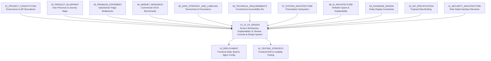
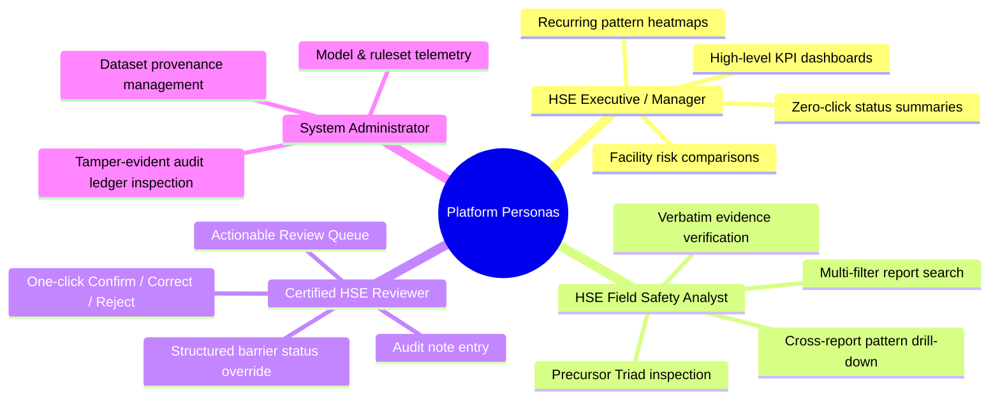
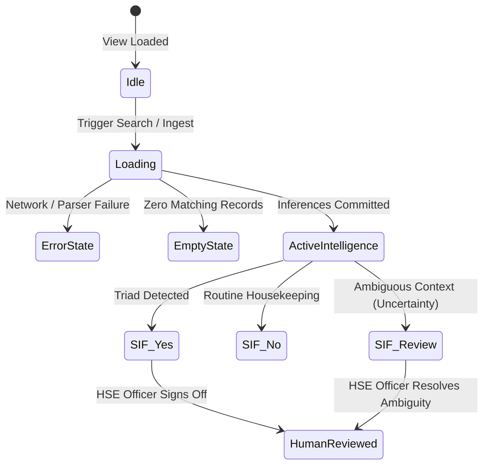

# 12_UI_UX_DESIGN

**Document Status:** Authoritative for User Experience Architecture, Screen Layouts, Design System, Interaction Flows & Explainability Interfaces  
**Governing Documents:** `01_PROJECT_CONSTITUTION.md`, `02_PRODUCT_BLUEPRINT.md`, `03_PROBLEM_STATEMENT.md`, `04_MARKET_RESEARCH.md`, `05_DATA_STRATEGY_AND_LABELING.md`, `06_TECHNICAL_REQUIREMENTS.md`, `07_SYSTEM_ARCHITECTURE.md`, `08_AI_ARCHITECTURE.md`, `09_DATABASE_DESIGN.md`, `10_API_SPECIFICATION.md`, `11_SECURITY_ARCHITECTURE.md`  
**SIH Problem Statement ID:** SIH26165  
**Organization:** Oil India Limited (OIL)  
**Category:** Software  
**Theme:** Smart Automation  
**Team:** Tech Smashers  

---

> **Architectural Tagging Discipline:**
> - `[PROPOSED DESIGN]` — UI layouts, component architectures, and visual wireframes designed by Tech Smashers.
> - `[RECOMMENDED IMPLEMENTATION]` — Pragmatic frontend implementation choices (e.g., React / Next.js with Vanilla CSS / CSS Modules, Lucide icons, accessible ARIA attributes) for the hackathon MVP.
> - `[PROTOTYPE ASSUMPTION]` — Assumptions regarding synthetic/representative test datasets and demo user sessions.
> - `[FUTURE ENHANCEMENT]` — Advanced enterprise frontend capabilities (e.g., offline PWA caching, multi-lingual Assamese/Hindi translation, mobile field apps) reserved for production.
> - `[TO BE CONFIRMED]` — Corporate branding standards, internal OIL UI guidelines, and enterprise display resolutions to be confirmed with Oil India Limited.
> - `[ILLUSTRATIVE]` — Representative wireframes, ASCII layouts, component token tables, and user journey scripts provided for conceptual clarity.

---

## 1. Purpose

This document defines the complete **User Interface & User Experience (UI/UX) Design Specification** for the **OIL Safety Intelligence Platform**. It provides an exhaustive, designer- and developer-ready contract governing visual hierarchies, screen wireframes, interaction state machines, character-level evidence highlighting, multi-dimensional pattern visualizations, and human-in-the-loop review interfaces.



---

## 2. Critical Product Language & Boundary Invariants

The interface enforces strict linguistic and conceptual discipline across all visual components:

```
+----------------------------------------------------------------------------------------------------+
| ABSOLUTE UI TERMINOLOGY INVARIANTS                                                                 |
+----------------------------------------------------------------------------------------------------+
| 1. "SIF Potential" MUST be used at all times.                                                      |
|    NEVER use "Future Fatality Prediction", "Fatal Probability", or "Accident Forecast".            |
| 2. Actual Outcome != SIF Potential.                                                                |
|    The UI visually decouples recorded harm (e.g., "No Injury") from latent potential ("YES").     |
| 3. Near Miss != Low Risk.                                                                          |
|    High-energy near-misses must render with P1-Critical visual prominence.                         |
| 4. AI Classification != Final HSE Decision.                                                        |
|    All AI badges display an explicit "PROVISIONAL" indicator until signed off by a human reviewer. |
| 5. Mentioned Control != Verified Effective Control.                                                |
|    Safeguards default to "Reported / Unverified" unless explicit verification text is present.     |
| 6. Frequency != Risk.                                                                              |
|    Charts separate raw report counts from high-consequence precursor severity tiers.               |
| 7. Synthetic Data != OIL Data.                                                                     |
|    A persistent, non-dismissible banner identifies prototype synthetic demonstration data.        |
+----------------------------------------------------------------------------------------------------+
```

---

## 3. UX Objectives & Problem Solving Focus

The central user experience objective is to eliminate the **unstructured narrative bottleneck**:

$$\text{Thousands of Unread Reports} \xrightarrow{\text{Cognitive Overload}} \text{Buried Fatal Precursors} \xrightarrow[\text{AI Explainability}]{\text{UI Intelligence}} \text{Immediate Targeted HSE Action}$$

The interface answers four critical questions within 5 seconds of loading any view:
1. **WHAT happened?** (Clean, normalized narrative with domain abbreviation tooltips).
2. **WHY does it matter?** (Causal SIF Precursor Triad: High Hazard + Exposure + Degraded Barrier).
3. **WHAT is repeatedly breaking down?** (Multi-dimensional cross-report precursor patterns).
4. **WHERE should HSE focus human attention?** (Ranked intervention priority queues).

---

## 4. User Personas & Journey Mapping

Based on `02_PRODUCT_BLUEPRINT.md`, the platform serves four primary personas `[PROPOSED DESIGN]`:



### Persona Needs & Interface Constraints

| Persona | Operational Objective | Primary Screen | Information Priority | Key Interface Feature |
|---|---|---|---|---|
| **HSE Executive / Manager** | Rapid visibility into facility precursor trends | Executive Dashboard | Critical SIF counts, recurring hotspots | Aggregated KPI cards, facility comparison charts. |
| **HSE Field Analyst** | Deep investigation of reported operational risks | Report Detail & Search | Extracted signals, barrier states, LSRs | Split-pane narrative with highlighted text spans. |
| **Certified HSE Reviewer** | Authoritative validation of AI inferences | Review Console | Original AI inference vs. human override | Append-only review modal with diff preview. |
| **System Administrator** | Governance and compliance assurance | System & Audit View | Tamper-evident ledger, pipeline runs | Monotonic cryptographic hash chain inspector. |

---

## 5. Foundational UX Design Principles

1. **Safety Intelligence First:** Visual priority is given to precursor severity and barrier integrity over administrative metadata.
2. **Explain Before Asking for Trust:** The AI engine never outputs a classification without displaying the supporting verbatim text spans.
3. **Evidence Before Conclusion:** In report detail views, the original field prose is positioned alongside analytical conclusions.
4. **Human Decision Primacy (`HIL-001`):** AI results are visually framed as assistive recommendations; human review actions are rendered as authoritative.
5. **Progressive Disclosure:** Present summary cards initially; allow analysts to expand full Subject-Verb-Object (SVO) dependency graphs and token offsets on demand.
6. **Zero Color-Only Meaning (WCAG 2.1 AA):** Every status badge pairs color with explicit text labels and iconography.
7. **Transparent Uncertainty (`NFR-003`):** Ambiguous narratives are rendered as `SIF Potential: REVIEW` with helper explanations; false certainty is prohibited.
8. **Provenance Transparency (`DATA-002`):** Users always know the origin of data being inspected via unambiguous interface tags.

---

## 6. Information Architecture & Navigation Structure

```
[ GLOBAL APPLICATION HEADER ]
  ├── Platform Brand & Logo (OIL Safety Intelligence)
  ├── Global Search Bar (?q=...)
  ├── Dataset Provenance Badge (SYNTHETIC PROTOTYPE)
  └── User Profile & Active Role Indicator (HSE_OFFICER)

[ PRIMARY SIDEBAR NAVIGATION ]
  ├── 1. Executive Dashboard        (/dashboard)       -> High-level metrics, hotspots, trends
  ├── 2. Reports Workspace          (/reports)         -> Multi-filter incident list & search
  │     └── Report Detail View      (/reports/{id})    -> Split-pane explainability console
  ├── 3. Pattern Explorer           (/patterns)        -> Recurring precursor clusters (N >= 3)
  │     └── Pattern Detail View     (/patterns/{id})   -> Member reports & root-cause breakdown
  ├── 4. Action Prioritization      (/priorities)      -> Ranked field intervention queues
  ├── 5. Human Review Console       (/reviews)         -> Pending review queue & override logs
  └── 6. Audit & Governance         (/audit)           -> Cryptographic ledger & model versions
```

---

## 7. Visual Design System & Design Tokens `[PROPOSED DESIGN]`

The interface utilizes a sleek, modern industrial safety aesthetic with a dark-mode-first palette engineered for high contrast and reduced optical fatigue in 24/7 control rooms:

```
[ COLOR PALETTE SPECIFICATION ]
  Canvas Background:       #0A0E14  (Deep Slate Black - 90% dominance)
  Surface / Card Base:     #121820  (Elevated Dark Slate)
  Card Border / Divider:   #1E2632  (Subtle High-Contrast Stroke)
  Brand Primary / Accent:  #00D2FF  (High-Energy Cyber Cyan - Interactive Focus)
  Text Primary:            #F0F4F8  (Pure High-Contrast White - 100% Legibility)
  Text Secondary:          #8B9BAC  (Muted Slate Gray - Labels & Subtitles)
```

### Semantic Status Design Tokens

| Semantic State | Token Name | Hex Code | Icon (Lucide) | Purpose / Meaning in Platform |
|---|---|---|---|---|
| **P1 - Critical SIF** | `var(--sif-critical)` | `#FF3366` | `AlertOctagon` | `SIF Potential: YES` (Lethal hazard + barrier breached). |
| **P2 - High SIF** | `var(--sif-high)` | `#FF9900` | `AlertTriangle` | `SIF Potential: YES / REVIEW` (High energy, ambiguous barrier). |
| **P3 - Standard Defect**| `var(--sif-standard)` | `#00CC88` | `CheckCircle2` | `SIF Potential: NO` (Routine defect, zero precursor risk). |
| **Barrier Degraded** | `var(--barrier-break)` | `#FF4444` | `ShieldAlert` | Incomplete, missing, failed, or bypassed safeguard. |
| **Barrier Verified** | `var(--barrier-ok)` | `#00E699` | `ShieldCheck` | Control reported present and verified effective. |
| **Review Required** | `var(--review-pending)`| `#9966FF` | `UserCheck` | Awaiting human HSE officer review or verification. |
| **Provenance Tag** | `var(--provenance-tag)`| `#00D2FF` | `Database` | Synthetic benchmark dataset indicator badge. |

---

## 8. Typography & Content Style Guide

- **Font Family:** `Inter`, `-apple-system`, `BlinkMacSystemFont`, `Segoe UI`, `sans-serif` (Universal high legibility).
- **Monospace Family (Offsets & Codes):** `JetBrains Mono`, `Fira Code`, `monospace`.
- **Heading Hierarchy:**
  - `H1`: 28px / 34px Line-height / Semi-bold (Page titles).
  - `H2`: 20px / 26px Line-height / Medium (Card section headers).
  - `H3`: 15px / 20px Line-height / Semi-bold (Entity titles & signal labels).
  - `Body`: 14px / 20px Line-height / Regular (Narrative prose & review notes).
  - `Caption`: 12px / 16px Line-height / Regular (Metadata, timestamps, tooltips).

---

## 9. Screen Specification 1: Executive Safety Dashboard (`/dashboard`)

The primary executive landing screen provides instant situational awareness across all reporting facilities `[PROPOSED DESIGN]`:

```
+----------------------------------------------------------------------------------------------------+
| [OIL LOGO] Safety Intelligence Platform   [Search reports...]  [PROTOTYPE: SYNTHETIC DATA] [User] |
+----------------------------------------------------------------------------------------------------+
| DASHBOARD | REPORTS | PATTERNS | PRIORITIES | REVIEWS | AUDIT                                      |
+----------------------------------------------------------------------------------------------------+
| [ KPI CARDS ]                                                                                      |
| ┌────────────────┐ ┌────────────────┐ ┌────────────────┐ ┌────────────────┐ ┌────────────────┐    |
| │ TOTAL REPORTS  │ │ SIF POTENTIAL  │ │ ROUTINE DEFECTS│ │ REVIEW PENDING │ │ ACTIVE HOTSPOTS│    |
| │      60        │ │   22 (36.7%)   │ │   32 (53.3%)   │ │   8 (13.3%)    │ │   3 CLUSTERS   │    |
| └────────────────┘ └────────────────┘ └────────────────┘ └────────────────┘ └────────────────┘    |
+----------------------------------------------------------------------------------------------------+
| [ MAIN WORKSPACE: 2-COLUMN LAYOUT ]                                                                |
|                                                                                                    |
| LEFT COLUMN (60% Width):                                RIGHT COLUMN (40% Width):                  |
| ┌─────────────────────────────────────────────────────┐ ┌────────────────────────────────────────┐ |
| │ CRITICAL PRECURSOR TRIAGE QUEUE (P1)   [View All]   │ │ RECURRING PRECURSOR HOTSPOTS (N >= 3)  │ |
| ├─────────────────────────────────────────────────────┤ ├────────────────────────────────────────┤ |
| │ [P1-CRIT] Confined Space Entry w/o Gas Testing      │ │ 1. Incomplete Gas Verification Prior   │ |
| │ Site: SITE-A-OILFIELD | Act: Vessel Maint | Near-Miss│ │    to Vessel Entry (4 Reports) [Site A]│ |
| │ Triad: Lethal Hazard + Barrier Bypassed + Exposure  │ │    Barrier: Gas Testing Incomplete     │ |
| │ [Review Action Required] [Open Report ->]           │ │    LSR: Confined Space Entry           │ |
| ├─────────────────────────────────────────────────────┤ ├────────────────────────────────────────┤ |
| │ [P1-CRIT] Unhooked Harness on Mud Tank Walkway      │ │ 2. Defective Fall Arrest on Drilling   │ |
| │ Site: RIG-04 | Act: Rig Maintenance | Near-Miss     │ │    Mast Ladders (3 Reports) [Rig-04]   │ |
| │ Triad: Elevation Fall + Fall Arrest Bypassed        │ │    Barrier: Harness Tie-Off Failed     │ |
| │ [Review Action Required] [Open Report ->]           │ │    LSR: Working at Height              │ |
| └─────────────────────────────────────────────────────┘ └────────────────────────────────────────┘ |
|                                                                                                    |
| LOWER SECTION:                                                                                     |
| ┌─────────────────────────────────────────────────────┐ ┌────────────────────────────────────────┐ |
| │ CRITICAL BARRIER INTEGRITY BREAKDOWN                │ │ IOGP LIFE-SAVING RULE DISTRIBUTION     │ |
| │ • Atmospheric Testing: 14 Breaches (Incomplete)     │ │ 1. Confined Space Entry: 16 Reports    │ |
| │ • Energy Isolation (LOTO): 8 Breaches (Bypassed)    │ │ 2. Working at Height: 12 Reports       │ |
| │ • Standby Attendant: 6 Breaches (Missing)           │ │ 3. Energy Isolation: 9 Reports         │ |
| └─────────────────────────────────────────────────────┘ └────────────────────────────────────────┘ |
+----------------------------------------------------------------------------------------------------+
```

---

## 10. Screen Specification 2: Multi-Filter Reports Workspace (`/reports`)

Supports exploratory filtering, sorting, and free-text search across all ingested reports (`FR-001`, `FR-006`):

```
+----------------------------------------------------------------------------------------------------+
| FILTERS: [Date: Last 30 Days v] [Facility: All v] [SIF Potential: YES v] [Barrier: Failed v] [Reset]|
| SEARCH:  [Q: "confined space"                                                         ] [Search]   |
| ACTIVE CHIPS: [SIF: YES (x)] [Barrier: INCOMPLETE (x)]                        Showing 22 of 60     |
+----------------------------------------------------------------------------------------------------+
| ID / SOURCE     | DATE       | FACILITY  | REPORT TYPE | SIF POTENTIAL | PRIMARY BARRIER | STATUS  |
+-----------------+------------+-----------+-------------+---------------+-----------------+---------+
| FLD-2026-03-8841| 2026-03-15 | SITE-A    | NEAR_MISS   | [!] P1-CRIT   | Gas Test (INC)  | UNREV   |
| FLD-2026-03-8839| 2026-03-14 | RIG-04    | NEAR_MISS   | [!] P1-CRIT   | Harness (BYP)   | CONFIRM |
| FLD-2026-03-8812| 2026-03-12 | GGS-MORAN | UNSAFE_COND | [?] REVIEW    | Guardrail (MIS) | UNREV   |
| FLD-2026-03-8790| 2026-03-10 | WORKOVER-2| UNSAFE_ACT  | [OK] P3-STD   | LOTO (VERIFIED) | CONFIRM |
+----------------------------------------------------------------------------------------------------+
| [First] [< Prev]  Page 1 of 2  [Next >] [Last]                                20 items per page    |
+----------------------------------------------------------------------------------------------------+
```

---

## 11. Screen Specification 3: Individual Report Analysis Console (`/reports/{id}`)

This is the central analytical workspace. It features a responsive **50/50 Split-Pane Layout** establishing immediate visual grounding between raw narrative text and derived AI intelligence (`AI-008`, `HIL-001`):

```
+----------------------------------------------------------------------------------------------------+
| [<- Back to Reports]   Report ID: FLD-2026-03-8841   [PROTOTYPE: SYNTHETIC DATA]   [Print / Export] |
+----------------------------------------------------------------------------------------------------+
| LEFT PANE: SOURCE PROSE & EVIDENCE HIGHLIGHTS        | RIGHT PANE: EXPLAINABLE SAFETY INTELLIGENCE |
|                                                      |                                             |
| [SOURCE NARRATIVE]                                   | [SIF POTENTIAL ASSESSMENT CARD]             |
| "During maintenance activity at Site A, a technician | ┌─────────────────────────────────────────┐ |
| <mark class="hl-exposure">entered a confined space   | │ SIF POTENTIAL: YES        [P1 - CRITICAL]│ |
| </mark> <mark class="hl-barrier-incomplete">before   | │ Model Confidence: 0.965 (Deterministic) │ |
| atmospheric testing was completed</mark>.            | ├─────────────────────────────────────────┤ |
| <mark class="hl-barrier-missing">No standby person   | │ Causal Triad Detected:                  │ |
| was present</mark>. Work was stopped after           | │ 1. High-Energy Hazard: Confined Space   │ |
| supervisor noticed. No injuries occurred."           | │ 2. Worker Exposure: Inside Danger Zone  │ |
|                                                      | │ 3. Safeguard Breached: Test Incomplete  │ |
| [EVIDENCE MAPPING LEGEND]                            | └─────────────────────────────────────────┘ |
| [■] Cyan: Worker Exposure Zone                       |                                             |
| [■] Orange: Incomplete Critical Safeguard            | [ACTUAL OUTCOME VS SIF POTENTIAL]           |
| [■] Red: Missing Critical Safeguard                  | ┌─────────────────────────────────────────┐ |
|                                                      | │ Actual Harm: NO INJURY (Near-Miss)      │ |
| [PHYSICAL SAFETY SIGNALS EXTRACTED]                  | │ Outcome Blindness Applied:              │ |
| • Activity: Vessel Maintenance                       | │ Harm was avoided solely via supervisory │ |
| • Hazard: Toxic/Asphyxiating Gas Envelope            | │ work stoppage. Fatal potential remains. │ |
| • Exposure Posture: Physical Internal Entry          | └─────────────────────────────────────────┘ |
| • Intervention: Supervisor Work Stoppage             |                                             |
|                                                      | [CRITICAL BARRIER INTEGRITY EVALUATION]     |
| [DATA PROVENANCE & PIPELINE AUDIT]                   | ┌─────────────────────────────────────────┐ |
| • Dataset Source: Hackathon MVD-60 Synthetic         | │ • Atmospheric Testing: INCOMPLETE [!]   │ |
| • Model Version: all-MiniLM-L6-v2 (v1.2.0)           | │ • Standby Attendant:   MISSING    [!]   │ |
| • Ruleset Hash: 64a8... (Causal-Heuristics-v1.0)     | │ • Supervisor Stop:     EFFECTIVE  [OK]  │ |
| • Analysis Status: VERIFIED & COMPLIANT              | └─────────────────────────────────────────┘ |
|                                                      |                                             |
|                                                      | [IOGP LIFE-SAVING RULE]                     |
|                                                      | ┌─────────────────────────────────────────┐ |
|                                                      | │ [ICON] Rule #2: CONFINED SPACE ENTRY    │ |
|                                                      | └─────────────────────────────────────────┘ |
|                                                      |                                             |
|                                                      | [HUMAN HSE REVIEW CONSOLE]                  |
|                                                      | ┌─────────────────────────────────────────┐ |
|                                                      | │ Review Status: PENDING HSE OFFICER      │ |
|                                                      | │ [ CONFIRM (YES) ]  [ CORRECT / OVERRIDE ]│ |
|                                                      | └─────────────────────────────────────────┘ |
+----------------------------------------------------------------------------------------------------+
```

---

## 12. Interactive Character-Span Highlighting UX (`AI-008`)

1. **Bijective Hover Linking:** Hovering over an analytical card on the right (e.g., `Atmospheric Testing: INCOMPLETE`) automatically activates the corresponding highlighted span in the left pane (`before atmospheric testing was completed`), pulsing with a distinct high-visibility cyan border.
2. **Click-to-Inspect:** Clicking any highlighted text span in the narrative opens an anchored popover detailing the exact character bounds (`[72, 112]`), the extraction category (`BARRIER_STATUS`), and the underlying domain heuristic rule triggered.
3. **Immutability of Source Display:** Raw text characters are strictly read-only; frontend JavaScript cannot edit, delete, or alter the rendered source prose.

---

## 13. Screen Specification 4: Cross-Report Pattern Explorer (`/patterns`)

Enables safety officers to explore recurring systemic vulnerabilities across facilities ($N \ge 3$) (`FR-006`, `AI-007`):

```
+----------------------------------------------------------------------------------------------------+
| RECURRING PRECURSOR PATTERN EXPLORER                           [Filter: Active Hotspots v] [Export]|
+----------------------------------------------------------------------------------------------------+
| ┌────────────────────────────────────────────────────────────────────────────────────────────────┐ |
| │ [HOTSPOT #1] INCOMPLETE GAS VERIFICATION PRIOR TO VESSEL ENTRY                  [TIER 1 - CRIT]│ |
| ├────────────────────────────────────────────────────────────────────────────────────────────────┤ |
| │ Primary Activity: Vessel Maintenance          │ Affected Facility: SITE-A-OILFIELD             │ |
| │ Primary Hazard:   Toxic/Flammable Gas         │ Recurrence Count:  4 Reports in Last 30 Days   │ |
| │ Safeguard Failed: Atmospheric Testing Pending │ SIF Potential:     100% (4 of 4 YES)           │ |
| ├────────────────────────────────────────────────────────────────────────────────────────────────┤ |
| │ MEMBER INCIDENT REPORTS:                                                                       │ |
| │ • FLD-2026-03-8841 (Mar 15): Tech entered separator before atmospheric test completed.         │ |
| │ • FLD-2026-03-8102 (Mar 02): Gas tester called away; worker entered vessel without clearance.  │ |
| │ • FLD-2026-02-7910 (Feb 22): Permit signed but atmospheric test cell expired; entry attempted. │ |
| │ • FLD-2026-02-7401 (Feb 10): Contractor entered tank without multi-gas monitor on site.        │ |
| ├────────────────────────────────────────────────────────────────────────────────────────────────┤ |
| │ SYSTEMIC RECOMMENDATION: Executive intervention recommended for Site A vessel entry permits.  │ |
| │ [Open Investigation Dossier]  [Assign Safety Stand-Down Audit]                                 │ |
| └────────────────────────────────────────────────────────────────────────────────────────────────┘ |
+----------------------------------------------------------------------------------------------------+
```

---

## 14. Screen Specification 5: Human Review & Override Modal (`HIL-001`)

Triggered when an authorized safety officer clicks `[CORRECT / OVERRIDE]` on any report:

```
+----------------------------------------------------------------------------------------------------+
| FORMAL HUMAN HSE REVIEW SIGN-OFF                                                               [X] |
+----------------------------------------------------------------------------------------------------+
| Target Report ID: FLD-2026-03-8841 | Officer: R. Sharma (Senior HSE Inspector)                     |
|                                                                                                    |
| 1. SIF POTENTIAL DETERMINATION:                                                                    |
|    Original AI Inference: [YES (P1-Critical)]                                                      |
|    Reviewer Action:       ( ) Confirm AI Result                                                    |
|                           (*) Correct / Override AI Result                                         |
|                           ( ) Reject as Invalid Narrative                                          |
|                           ( ) Mark Insufficient Evidence                                           |
|                                                                                                    |
| 2. ADJUST REVISED SIF STATUS:                                                                      |
|    [ Revised SIF: YES v ]      [ Revised Priority: P1-CRITICAL v ]                                 |
|                                                                                                    |
| 3. BARRIER OVERRIDE (OPTIONAL):                                                                    |
|    Safeguard: [ Atmospheric Gas Testing           v ]                                              |
|    Override:  [ BYPASSED                                                                 v ]      |
|                                                                                                    |
| 4. MANDATORY HSE REVIEWER JUSTIFICATION NOTES:                                                     |
|    +---------------------------------------------------------------------------------------------+ |
|    | Validated near-fatal scenario. While work was stopped by supervisor, entry without gas test | |
|    | constitutes an intentional bypass of Life-Saving Rule #2. Overriding barrier status from    | |
|    | INCOMPLETE to BYPASSED. Recommend immediate field stand-down.                               | |
|    +---------------------------------------------------------------------------------------------+ |
|                                                                                                    |
| [!] AUDIT NOTICE: This review will be permanently sealed in the cryptographic audit ledger.       |
|                   The original AI inference will NOT be overwritten.                               |
|                                                                                                    |
| [ Cancel ]                                                    [ Commit Authoritative Review Sign-Off]|
+----------------------------------------------------------------------------------------------------+
```

---

## 15. UI Component Library Specification

| Component Name | Technical Purpose | Visual Elements | Accessibility Attributes |
|---|---|---|---|
| `<StatusBadge>` | Renders SIF and review states. | Rounded pill, high-contrast text, icon. | `aria-label="Status: P1 Critical SIF"` |
| `<EvidenceSpan>` | Visual highlight over narrative text. | Background color tint, dotted border. | `role="mark"`, `tabIndex=0` |
| `<MetricCard>` | Top-level dashboard KPI metrics. | Large bold number, label, delta badge. | `role="region"`, `aria-live="polite"` |
| `<BarrierCard>` | Displays 6-state safeguard integrity.| Shield icon, barrier title, state pill. | `aria-label="Barrier Status"` |
| `<LSRBadge>` | IOGP Life-Saving Rule mapping. | Official IOGP rule icon, rule title. | Semantic tooltip explaining mapping. |
| `<ProvenanceTag>`| Displays dataset source type. | Cyan border, database icon, text tag. | Non-dismissible header element. |
| `<ReviewDiff>` | Compares AI output vs. Human review. | Side-by-side diff card with timestamps.| Clear labels: "AI" vs "Human". |

---

## 16. State Handling: Loading, Error, Empty & Uncertainty States



### Explicit State Implementations
1. **Uncertainty State (`SIF: REVIEW`):** Renders with an amber/purple badge accompanied by helper copy: *"Context Ambiguous: High-energy hazard reported but safeguard verification status is unclear. Manual HSE review required."*
2. **Stale Analysis Warning:** If `safety_reports.raw_narrative` was updated post-analysis, a persistent amber banner displays: *"Analysis Stale: Report text was modified after AI parsing. [Re-Run Analysis]"*.
3. **Empty Filter State:** When query filters match zero rows, the UI renders a friendly empty state: *"No incident reports match the selected filters."* (Prohibits showing *"Zero SIF Risk Detected"* to prevent complacency).

---

## 17. Responsive Design & Form Factor Matrix

| Form Factor | Primary Screen Resolution | UX Optimization Strategy | Feature Concessions |
|---|---|---|---|
| **Desktop Control Room** | $1920 \times 1080$ and above | 50/50 split-pane analysis, multi-chart dashboards, full table views. | None; full analytical capability. |
| **Field Laptop / Tablet**| $1024 \times 768$ (iPad / Toughbook)| Stacked vertical layout; narrative on top, analytical cards collapsible below. | Charts collapsed into dropdown selectors. |
| **Mobile Smartphone** | $375 \times 667$ (Field Quick View) | Single-column summary; simplified review sign-off buttons; minimal charts. | Complex pattern matrix view hidden. |

---

## 18. Accessibility Standards (WCAG 2.1 AA Compliance)

1. **Color Contrast:** All text-to-background contrast ratios strictly exceed **4.5:1** for standard body text and **3.0:1** for large headings and status badges.
2. **Full Keyboard Navigability:** All interactive components (cards, evidence spans, filters, review buttons) support full `Tab`, `Shift+Tab`, and `Enter`/`Space` activation with visible cyan focus rings (`outline: 2px solid #00D2FF`).
3. **Screen Reader Semantic Tree:** HTML5 semantic elements (`<main>`, `<nav>`, `<header>`, `<article>`, `<mark>`) ensure automated accessibility tools convey structure accurately.

---

## 19. UI Traceability to Technical Requirements (`06_TECHNICAL_REQUIREMENTS.md`)

| Technical Requirement ID | UX / UI Implementation Feature | Primary Screen Location |
|---|---|---|
| `FR-001` (Report Ingestion) | Clean multi-field intake form with length counter | `/reports/new` |
| `FR-002` (Batch & Sample Dataset Import) | `BulkUploadModal.tsx` CSV/JSON batch uploader | `/reports/new` (Bulk tab) |
| `AI-003` (NLP Signal Extraction) | Entity chips & SVO dependency viewer | `/reports/{id}` (Left Pane) |
| `AI-004` (SIF Potential Engine, incl. Outcome Blindness) | Causal Precursor Triad card with priority pills, plus dedicated "Actual Outcome vs. SIF Potential" card | `/reports/{id}` (Right Pane Top) |
| `AI-005` (Barrier Evaluation) | 6-state safeguard cards with explicit integrity pills | `/reports/{id}` (Right Pane Mid) |
| `AI-006` (IOGP LSR Mapping) | Official 9 Life-Saving Rule visual badge & rationale | `/reports/{id}` (Right Pane Mid) |
| `AI-007` (Pattern Discovery) | Multi-dimensional cluster cards ($N \ge 3$) with drill-downs | `/patterns` |
| `AI-008` (Verbatim Evidence) | Interactive character-offset narrative highlight spans | `/reports/{id}` (Left Pane Prose) |
| `DATA-002` (Provenance Display) | Persistent synthetic prototype disclosure banner | Global Header (All Views) |
| `HIL-001` (Human Review Console) | Modal review dialog with diff preview and audit notes | `/reports/{id}` & `/reviews` |
| `NFR-003` (Uncertainty Handling)| Amber `SIF: REVIEW` cards with manual triage prompts | `/reports/{id}` & Dashboard |

---

## 20. UI Traceability to REST APIs (`10_API_SPECIFICATION.md`)

| UI Screen / Action | Bound REST API Endpoint | HTTP Verb | Response Data Bound to View |
|---|---|---|---|
| Dashboard Initial Load | `GET /api/v1/dashboard/summary` | `GET` | Binds KPI counts, top barrier, top LSR. |
| Dashboard Priority List | `GET /api/v1/priorities` | `GET` | Binds ranked intervention cards. |
| Reports Search & Filter | `GET /api/v1/reports` | `GET` | Populates paginated data table. |
| Report Detail Analysis | `GET /api/v1/reports/{id}/analysis` | `GET` | Binds SIF card, signals, barriers, LSR, evidence. |
| Trigger Manual Analysis | `POST /api/v1/reports/{id}/analyze` | `POST` | Activates processing spinner; updates view on 200. |
| Pattern Explorer View | `GET /api/v1/patterns` | `GET` | Binds recurring hotspot cards ($N \ge 3$). |
| Submit Review Override | `POST /api/v1/reports/{id}/reviews` | `POST` | Disables form, emits audit confirmation toast. |

---

## 21. Step-by-Step Judge Demonstration Flow (2.5-Minute Script)

```
[ STEP 1: EXECUTIVE SITUATIONAL AWARENESS - 0:00 to 0:30 ]
  • Open Executive Dashboard (/dashboard).
  • Point to Global Provenance Banner: "Synthetic Prototype Benchmark - Zero Confused Data."
  • Highlight SIF Disconnect: 60 total reports ingested, but 22 flagged as high latent SIF potential.
  • Point to Hotspot Alert: "Incomplete Gas Verification Prior to Vessel Entry (4 Reports at Site A)".

[ STEP 2: EVIDENCE-BACKED INVESTIGATION - 0:30 to 1:15 ]
  • Click Top Priority Report: FLD-2026-03-8841 (/reports/c1f7a240...).
  • Show Split-Pane Layout: Left pane displays raw unedited frontline prose.
  • Demonstrate Outcome Blindness: Actual Harm = "NO INJURY" vs SIF Potential = "YES (P1-Critical)".
  • Explain Why: "No injury occurred, but worker entered a confined space before gas test completed."

[ STEP 3: INTERACTIVE EXPLAINABILITY - 1:15 to 1:45 ]
  • Hover over Barrier Card: "Atmospheric Testing: INCOMPLETE".
  • Watch Left Pane: The phrase "before atmospheric testing was completed" pulses in cyan.
  • Hover over Barrier Card: "Standby Attendant: MISSING".
  • Watch Left Pane: The phrase "No standby person was present" pulses in red.
  • Conclude Explainability: "Zero hallucination. Every machine assertion is physically tied to text."

[ STEP 4: SYSTEMIC PATTERN SYNTHESIS - 1:45 to 2:10 ]
  • Click "Part of Site A Vessel Entry Hotspot" link -> Navigates to /patterns/p1111111...
  • Show Aggregation: This is not an isolated worker mistake; 4 separate reports in 30 days show
    identical procedural breakdown during vessel maintenance at Site A.

[ STEP 5: HUMAN-IN-THE-LOOP CLOSING - 2:10 to 2:30 ]
  • Return to Report Detail -> Click [CONFIRM (YES)].
  • Show Audit Modal: Reviewer signs off as Senior HSE Officer.
  • Submit -> Status flips to "VERIFIED BY HUMAN REVIEW".
  • Conclude to Judges: "AI provides the explainable signals; the human HSE officer retains final authority."
```

---

## 22. Prototype vs. Production UI Roadmap

```
+----------------------------------------------------------------------------------------------------+
| UI / UX CAPABILITY             | HACKATHON PROTOTYPE (P0)            | ENTERPRISE PRODUCTION (P2)  |
+--------------------------------+-------------------------------------+-----------------------------+
| Layout Architecture            | Responsive Desktop Split-Pane       | Adaptive Desktop + Tablet   |
| Evidence Highlighting          | Exact Character-Span CSS Overlays   | Interactive Word Heatmaps   |
| Pattern Visualizations         | Structured Cards & Summary Tables   | Dynamic Graph Visualizer    |
| Human Review Workflow          | One-Stage Sign-off Modal            | Multi-Tier Approval Chains  |
| Data Provenance Badging        | Persistent Global Header Banner     | Cryptographic Source Stamps |
| Language Localization          | Standard Oilfield English           | Assamese, Hindi, Bengali    |
+----------------------------------------------------------------------------------------------------+
```

---

## 23. UI/UX Definition of Done (DoD)

The UI/UX Design Specification is declared complete and authoritative when the following criteria are satisfied:
- [x] All 4 primary user personas and detailed journey maps are documented.
- [x] Linguistic discipline strictly enforced: "SIF Potential" used; "fatality prediction" prohibited.
- [x] Complete wireframes provided for Dashboard, Reports List, Split-Pane Report Detail, Patterns, and Review.
- [x] Interactive character-offset evidence span highlighting UX is formalized.
- [x] Dedicated UI card visually decoupling actual recorded outcome from latent SIF potential.
- [x] Complete design system token catalog (colors, typography, semantic status icons) defined.
- [x] WCAG 2.1 AA accessibility guidelines (contrast, focus states, screen reader semantics) specified.
- [x] 2.5-minute step-by-step judge demonstration journey scripted.
- [x] Complete traceability matrices linking UI components to Requirements (`06`) and APIs (`10`).

---

## 24. Inter-Document Architectural Positioning

```
[01_PROJECT_CONSTITUTION]        --> Supreme safety ethics & non-predictive boundaries
[02_PRODUCT_BLUEPRINT]           --> User journeys & module concepts
[03_PROBLEM_STATEMENT]           --> Official SIH26165 scope
[04_MARKET_RESEARCH]             --> Enterprise EHS UX benchmarks
[05_DATA_STRATEGY_AND_LABELING]  --> Canonical safety taxonomies & labels
[06_TECHNICAL_REQUIREMENTS]      --> Exact Requirement IDs (FR-XXX, HIL-001)
[07_SYSTEM_ARCHITECTURE]         --> Frontend presentation tier architecture
[08_AI_ARCHITECTURE]             --> Character-offset span evidence structures
[09_DATABASE_DESIGN]             --> Relational data entities & status enums
[10_API_SPECIFICATION]           --> REST payloads bound to frontend components
[11_SECURITY_ARCHITECTURE]       --> Role-gated visibility & session controls
[12_UI_UX_DESIGN]                --> Visual wireframes, design system & user journeys
        │
        ▼ (Downstream Technical Execution)
[13_DEPLOYMENT]                  --> Static asset hosting, Nginx routing & build steps
[14_TESTING_STRATEGY]            --> Frontend component, accessibility & E2E tests
[15_ROADMAP]                     --> Phased UX delivery timeline
[16_DOCUMENT_CONSISTENCY_AUDIT]  --> Cross-specification validation audit
```

---

## 25. Final UI/UX Architecture Summary

The **OIL Safety Intelligence Platform User Experience** transforms unstandardized frontline safety narratives into trusted, actionable decision support:

$$\text{Raw Narrative} \longrightarrow \text{Interactive Highlighted Prose} \longleftrightarrow \text{Explainable Precursor Triad} \longrightarrow \text{Systemic Pattern Hotspots} \longrightarrow \text{Human Review Sign-Off}$$

By grounding every AI assertion in verbatim character spans, visually isolating actual outcomes from latent potential, displaying multi-dimensional precursor clusters, and maintaining human safety officers as the final authoritative decision-maker, the interface delivers total operational transparency, zero cognitive clutter, and uncompromising safety engineering integrity.
