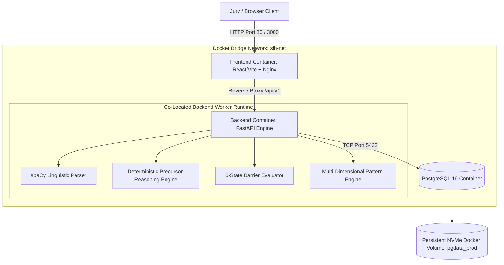
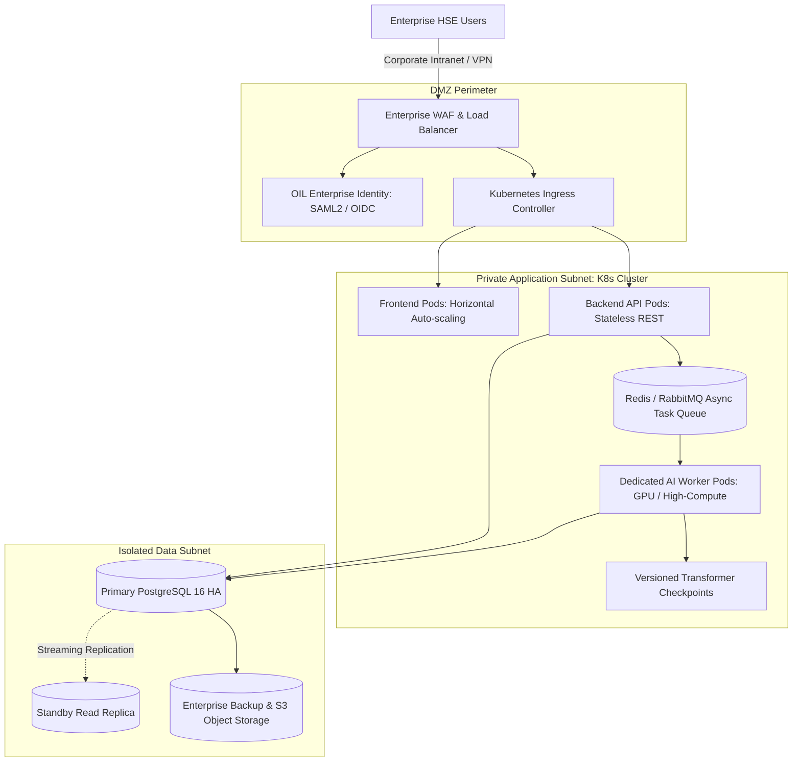

# 13_DEPLOYMENT

**Document Status:** Authoritative for Operational Deployment, Containerization, Environment Topologies, Health Monitoring & Infrastructure Governance  
**Governing Documents:** `01_PROJECT_CONSTITUTION.md`, `02_PRODUCT_BLUEPRINT.md`, `03_PROBLEM_STATEMENT.md`, `04_MARKET_RESEARCH.md`, `05_DATA_STRATEGY_AND_LABELING.md`, `06_TECHNICAL_REQUIREMENTS.md`, `07_SYSTEM_ARCHITECTURE.md`, `08_AI_ARCHITECTURE.md`, `09_DATABASE_DESIGN.md`, `10_API_SPECIFICATION.md`, `11_SECURITY_ARCHITECTURE.md`, `12_UI_UX_DESIGN.md`  
**SIH Problem Statement ID:** SIH26165  
**Organization:** Oil India Limited (OIL)  
**Category:** Software  
**Theme:** Smart Automation  
**Team:** Tech Smashers  

---

> **Architectural Tagging Discipline:**
> - `[PROPOSED DESIGN]` — Deployment architectures, service orchestration topologies, and CI/CD pipelines designed by Tech Smashers.
> - `[RECOMMENDED IMPLEMENTATION]` — Pragmatic, resource-efficient deployment choices (e.g., Docker Compose, multi-stage builds, Gunicorn/Uvicorn, PostgreSQL 16 on Linux) for the hackathon MVP.
> - `[PROTOTYPE ASSUMPTION]` — Operational assumptions valid for representative synthetic datasets running on demo infrastructure.
> - `[FUTURE ENHANCEMENT]` — Advanced enterprise infrastructure (e.g., Kubernetes Helm charts, GPU auto-scaling, distributed Kafka streaming, geo-replicated object storage) reserved for production.
> - `[TO BE CONFIRMED]` — Official Oil India Limited enterprise hosting policies, corporate VPC subnets, sovereign cloud preferences, and data center firewall rules to be confirmed with OIL IT/HSE teams.
> - `[ILLUSTRATIVE]` — Representative Dockerfiles, compose manifests, bash commands, and environment variable templates provided for conceptual clarity.

---

## 1. Purpose

This document defines the complete **Deployment & Operational Architecture** for the **OIL Safety Intelligence Platform**. It provides an exhaustive, engineer-ready specification for how the frontend web application, backend REST API services, AI/NLP inference runtime, and persistent PostgreSQL database are containerized, configured, networked, monitored, backed up, and maintained across development, prototype demonstration, and production lifecycles.

```mermaid
flowchart TD
    CON["01_PROJECT_CONSTITUTION\nGovernance & SIF Boundaries"] --> DEP
    BP["02_PRODUCT_BLUEPRINT\nOperational Modules"] --> DEP
    PS["03_PROBLEM_STATEMENT\nScope & Constraints"] --> DEP
    MR["04_MARKET_RESEARCH\nIndustry Cloud Standards"] --> DEP
    DS["05_DATA_STRATEGY_AND_LABELING\nMVD-60 Seed & Provenance"] --> DEP
    TR["06_TECHNICAL_REQUIREMENTS\nNFR-001, NFR-002, NFR-003"] --> DEP
    SA["07_SYSTEM_ARCHITECTURE\nService Topology & ADRs"] --> DEP
    AIA["08_AI_ARCHITECTURE\nCPU Inference & Model Artifacts"] --> DEP
    DBD["09_DATABASE_DESIGN\nPostgreSQL Schema & Persistence"] --> DEP
    API["10_API_SPECIFICATION\nHealth Endpoints & Contracts"] --> DEP
    SEC["11_SECURITY_ARCHITECTURE\nSecret Vaults & Network Isolation"] --> DEP
    UI["12_UI_UX_DESIGN\nStatic Asset Delivery & Demo Flows"] --> DEP

    DEP["13_DEPLOYMENT\nDocker Containers, Env Vars, CI/CD, Health Probes & Runbooks"]

    DEP --> TST["14_TESTING_STRATEGY\nSmoke Testing & Disaster Drills"]
    DEP --> RDM["15_ROADMAP\nEnterprise Migration Milestones"]
    DEP --> AUD["16_DOCUMENT_CONSISTENCY_AUDIT\nCross-Doc Alignment Verification"]
```



---

## 2. Deployment Principles

The deployment architecture is governed by thirteen foundational engineering principles `[PROPOSED DESIGN]`:

1. **Prototype Simplicity (`[RECOMMENDED IMPLEMENTATION]`):** Avoid premature distributed microservices, Kubernetes clusters, and message queue sprawl for the hackathon MVP; leverage clean, co-located container orchestration.
2. **Deterministic Reproducibility:** The entire platform must spin up from zero to healthy on any modern developer laptop or cloud virtual machine in under 5 minutes using a single command (`docker compose up`).
3. **Strict Environment Segregation:** Development, prototype demo, and enterprise target environments utilize isolated configurations, databases, and cryptographic secrets.
4. **Zero Secrets in Version Control (`SEC-001`):** Passwords, API keys, and private tokens are injected exclusively via environment variables and `.env` files protected by `.gitignore`.
5. **Least Privilege Process Execution:** Containers execute as non-root, unprivileged system users (`uid=10001`) with read-only root filesystems where practical.
6. **Continuous Observability (`OBS-001`):** All services expose independent Liveness (`/health/live`) and Readiness (`/health/ready`) probes separating process execution from dependency connectivity.
7. **Graceful Degradation (`NFR-003`):** In the event of an AI inference crash or database lock, the platform emits descriptive status alerts (`SIF: REVIEW`); it **never crashes silently or outputs fake results**.
8. **Permanent Provenance Auditing (`DATA-002`):** Deployed instances bind active environment banners (`SYNTHETIC PROTOTYPE`) directly into the global layout to eliminate data confusion.
9. **Immutable Release Versioning:** Every running container image is tagged with an exact Git commit SHA and semantic version (`v1.0.0-mvp`); the mutable `latest` tag is prohibited in staging and demo environments.
10. **Zero Downtime Database Migrations:** Database schema migrations apply backward-compatible additive steps, enabling safe deployment rollbacks without catastrophic data loss.
11. **Isolated Data Persistence:** Database volumes and uploaded attachments reside on dedicated host-mounted persistent storage, surviving container restarts and rebuilds.
12. **Offline Demonstration Resilience:** The hackathon prototype must operate entirely offline in degraded network environments without external cloud API dependencies.
13. **Smooth Enterprise Migration Path:** Maintain the 11-layer architecture boundaries established in `07_SYSTEM_ARCHITECTURE.md`, ensuring services can be decoupled into enterprise Kubernetes pods without rewriting business logic.

---

## 3. Critical Data & Infrastructure Assumptions

1. **Zero Access to Confidential OIL Networks:** The Tech Smashers team does not possess direct connectivity to Oil India Limited's internal SCADA, SAP ERP, or private intranets.
2. **Authorized Data Boundary:** The prototype deployment operates exclusively on the 60-report Minimum Viable Dataset (`MVD-60`), curated synthetic upstream operational scenarios, and published public benchmarks (Zenodo CSRA) established in `05_DATA_STRATEGY_AND_LABELING.md`.
3. **Enterprise Production Decoupling:** All references to production cloud environments, single sign-on (SSO) federation, and corporate disaster recovery are architectural specifications labelled as `[TO BE CONFIRMED WITH OIL]`.

---

## 4. Deployment Target Environments

```
                                  DEPLOYMENT TARGET MATRIX
                                             │
        ┌────────────────────────────────────┼────────────────────────────────────┐
        ▼                                    ▼                                    ▼
TARGET A: LOCAL DEV                 TARGET B: SIH PROTOTYPE              TARGET C: OIL ENTERPRISE
• Host: Developer Laptop            • Host: Single Cloud VPS / PaaS      • Host: Corporate On-Prem / VPC
• Tooling: Docker Compose / Native  • Tooling: Docker Compose + TLS      • Tooling: Enterprise Kubernetes (K8s)
• DB: Local Containerized Postgres  • DB: Containerized Persistent SSD   • DB: Managed HA PostgreSQL Cluster
• Data: Synthetic 60-Report MVD     • Data: Synthetic MVD + Public CSRA  • Data: Authorized Enterprise OIL Data
• Net: Localhost Bridge             • Net: HTTP/HTTPS via Nginx          • Net: Isolated Corporate Subnet (DMZ)
• Purpose: Rapid Feature Iteration  • Purpose: Live Hackathon Jury Demo  • Purpose: Live Production HSE Triage
```

### Detailed Target Specifications

| Parameter | Target A: Local Development | Target B: SIH Prototype / Demo | Target C: Enterprise OIL Target |
|---|---|---|---|
| **Host Operating System** | Windows 11 (WSL2) / macOS / Ubuntu | Ubuntu 22.04 LTS (Cloud VPS) | Enterprise Red Hat Enterprise Linux / Rocky Linux |
| **Compute Sizing** | 4 Cores, 8GB RAM, 20GB SSD | 4 vCPU, 8GB RAM, 50GB NVMe SSD | Auto-scaled Pods (CPU & GPU Inference Pools) |
| **Container Engine** | Docker Desktop / Docker Engine 26+ | Docker Engine + Compose Plugin | OpenShift / Kubernetes 1.28+ (`[TO BE CONFIRMED]`) |
| **Ingress & TLS** | Plaintext HTTP (`localhost:80` / `3000`) | Nginx Reverse Proxy / Static Server | Enterprise Hardware WAF + Corporate Certificates |
| **Authentication** | Seeded Developer Credentials | Mock JWT Bearer Auth (`HSE_OFFICER`) | Corporate SAML 2.0 / OIDC SSO (`[TO BE CONFIRMED]`) |
| **Database Persistence** | Named Docker Volume (`pgdata_dev`) | Encrypted Block Storage Mount | Multi-AZ Replicated PostgreSQL with Continuous WAL |
| **AI Inference Mode** | Local CPU (`all-MiniLM-L6-v2`) | Local CPU Multi-Worker | GPU Inference Nodes (Triton / TorchServe) |

---

## 5. Local Development Architecture

The local development environment provides zero-friction developer onboarding via Docker Compose `[RECOMMENDED IMPLEMENTATION]`:

```
[ DEVELOPER LAPTOP HOST ]
  │
  ├── Port 80 / 3000: Frontend UI (React 18 / Vite on Nginx)
  │     └── Nginx proxies /api/v1/* to Backend Port 8000
  │
  ├── Port 8000: Backend REST API (FastAPI / Python 3.11)
  │     ├── Hosts NLP Preprocessing & Entity Extraction (spaCy en_core_web_sm)
  │     ├── Executes Causal SIF Potential Engine & 6-State Barrier Evaluator
  │     └── Houses MiniLM LSR Matcher & Pattern Engine
  │
  └── Port 5432: Relational Database (PostgreSQL 16)
        └── Bound to Local Persistent Volume: ./data/postgres
```

---

## 6. Local Setup & Verification Runbook

Developers execute the following sequential workflow to stand up the local environment from scratch:

```bash
# 1. Clone the project repository
git clone https://github.com/shlok926/oil-safety-intelligence-platform.git
cd oil-safety-intelligence-platform

# 2. Instantiate local environment variables from template
cp .env.example .env

# 3. Build and launch all services in detached mode (PostgreSQL startup)
docker compose -f docker-compose.local.yml up -d --build

# 4. Verify that all service containers are healthy
docker compose ps

# 5. Execute database schema migrations (Alembic)
docker compose exec backend python -m alembic upgrade head

# 6. Execute H0 bootstrap seed script (backend/scripts/seed_data.py)
# Initializes data_sources, default app_users, reference taxonomies, and synthetic MVD-60 benchmark reports
docker compose exec backend python scripts/seed_data.py

# 7. Execute automated smoke verification
curl -s http://localhost:8000/health/live | grep "OK"

# 8. Open the web console
echo "Platform operational at: http://localhost:80 (or http://localhost:3000)"
```

---

## 7. SIH Prototype / Demo Deployment Architecture

For the live Smart India Hackathon jury demonstration, operational stability and sub-second response times are paramount. The platform is deployed on a dedicated Linux virtual machine or local demonstration host running containerized services using Nginx for static serving and reverse proxying (`[RECOMMENDED IMPLEMENTATION]`):



---

## 8. Prototype Hosting Options Evaluation

```
+----------------------------------------------------------------------------------------------------+
| HOSTING PLATFORM       | ADVANTAGES                           | DISADVANTAGES / TRADE-OFFS         |
+------------------------+--------------------------------------+------------------------------------+
| Dedicated Cloud VPS    | RECOMMENDED: Full root control, zero | Requires manual OS security        |
| (Ubuntu on AWS/Azure/  | cold starts, deterministic memory for| updates and automated backup       |
| DigitalOcean)          | transformer weights, stable latency. | configuration.                     |
+------------------------+--------------------------------------+------------------------------------+
| Unified PaaS           | Zero server management; automated git| Subject to container sleep/spin-up |
| (Render / Railway)     | push deployment.                     | cold starts; unpredictable CPU     |
|                        |                                      | throttling during transformer run. |
+------------------------+--------------------------------------+------------------------------------+
| Split Hosting          | Edge CDN asset delivery; independent | Split networking increases network |
| (Vercel FE + Cloud BE) | frontend scaling.                    | hop latency (>150ms) and           |
|                        |                                      | CORS configuration complexity.     |
+----------------------------------------------------------------------------------------------------+
```

> **Architectural Recommendation (`[RECOMMENDED IMPLEMENTATION]`):** Deploy the hackathon MVP on a **Single Host / Cloud VPS (Ubuntu 22.04 LTS, 4 vCPU, 8GB RAM)** utilizing Docker Compose with an integrated 3-container topology (`sih-frontend` running Nginx for static serving and `/api/v1` reverse proxying, `sih-backend` with FastAPI, and `sih-database` with PostgreSQL 16). This eliminates external network latency between tiers, guarantees zero cold-start delays during jury evaluation, and provides a 100% self-contained environment that can be duplicated locally in case of conference Wi-Fi failure.

---

## 9. Conceptual Production Architecture (`[TO BE CONFIRMED WITH OIL]`)

In an enterprise deployment within Oil India Limited's corporate IT infrastructure, the logical tiers decouple into hardened enterprise clusters:



---

## 10. Environment Variable Specification

Environment variables configure the operational runtime without mutating application code. The application validates all variables upon startup using Pydantic Settings (`11_SECURITY_ARCHITECTURE.md`):

```
+----------------------------------------------------------------------------------------------------+
| VARIABLE NAME          | TYPE    | DEFAULT VALUE               | OPERATIONAL PURPOSE               |
+------------------------+---------+-----------------------------+-----------------------------------+
| ENVIRONMENT            | string  | "development"               | "development", "staging", "prod"  |
| PORT                   | integer | 8000                        | Backend API listening port        |
| DATABASE_URL           | string  | (PostgreSQL DSN)            | Encrypted connection string       |
| DB_POOL_SIZE           | integer | 10                          | Persistent connection pool size   |
| DB_MAX_OVERFLOW        | integer | 20                          | Maximum burst connections         |
| JWT_SECRET_KEY         | string  | (High-entropy secret)       | Signs session Bearer tokens       |
| JWT_ALGORITHM          | string  | "HS256"                     | Cryptographic token algorithm     |
| ACCESS_TOKEN_EXPIRE_MIN| integer | 15                          | Token lifespan in minutes         |
| CORS_ORIGINS           | string  | "http://localhost:3000"     | Allowed frontend origins (no *)   |
| MODEL_BACKBONE         | string  | "all-MiniLM-L6-v2"          | Transformer architecture name     |
| MODEL_WEIGHTS_PATH     | string  | "./models/all-MiniLM-L6-v2" | Local path to cached weights      |
| RULESET_VERSION        | string  | "v1.0.0-causal"             | Active safety heuristic ruleset   |
| PROVENANCE_DEFAULT     | string  | "SYNTHETIC_PROTOTYPE"       | Fallback dataset provenance tag   |
| LOG_LEVEL              | string  | "INFO"                      | "DEBUG", "INFO", "WARN", "ERROR"  |
+----------------------------------------------------------------------------------------------------+
```

---

## 11. Containerization Specification (Dockerfiles)

### 11.1 Backend API & AI Engine Dockerfile (`[RECOMMENDED IMPLEMENTATION]`)
```dockerfile
# Multi-stage build for minimal footprint and security hardening
FROM python:3.11-slim AS builder

WORKDIR /build
RUN apt-get update && apt-get install -y --no-install-recommends gcc g++ libpq-dev \
    && rm -rf /var/lib/apt/lists/*

COPY requirements.txt .
RUN pip install --no-cache-dir --user -r requirements.txt

# Final runtime stage
FROM python:3.11-slim AS runner

WORKDIR /app
RUN apt-get update && apt-get install -y --no-install-recommends libpq5 curl \
    && rm -rf /var/lib/apt/lists/* \
    && useradd -u 10001 -m -s /bin/bash appuser

COPY --from=builder /root/.local /home/appuser/.local
COPY . /app

# Pre-download and cache model weights into image layer for offline execution
RUN /home/appuser/.local/bin/python -m spacy download en_core_web_sm && \
    /home/appuser/.local/bin/python -c "from sentence_transformers import SentenceTransformer; SentenceTransformer('all-MiniLM-L6-v2')"

RUN chown -R appuser:appuser /app
USER appuser
ENV PATH=/home/appuser/.local/bin:$PATH \
    PYTHONUNBUFFERED=1

EXPOSE 8000
HEALTHCHECK --interval=15s --timeout=3s --retries=3 \
  CMD curl -f http://localhost:8000/health/live || exit 1

CMD ["uvicorn", "main:app", "--host", "0.0.0.0", "--port", "8000", "--workers", "2"]
```

### 11.2 Frontend Application Dockerfile & Nginx Reverse Proxy
```dockerfile
FROM node:20-alpine AS builder
WORKDIR /app
COPY package*.json ./
RUN npm ci
COPY . .
RUN npm run build

FROM nginx:1.25-alpine AS runner
COPY --from=builder /app/dist /usr/share/nginx/html
COPY nginx.conf /etc/nginx/conf.d/default.conf
EXPOSE 80
HEALTHCHECK --interval=15s --timeout=3s --retries=3 \
  CMD wget --spider http://localhost:80/ || exit 1
CMD ["nginx", "-g", "daemon off;"]
```

#### Frontend `nginx.conf` Specification
```nginx
server {
    listen 80;
    server_name localhost;

    location / {
        root /usr/share/nginx/html;
        index index.html;
        try_files $uri $uri/ /index.html;
    }

    location /api/v1/ {
        proxy_pass http://backend:8000/api/v1/;
        proxy_set_header Host $host;
        proxy_set_header X-Real-IP $remote_addr;
        proxy_set_header X-Forwarded-For $proxy_add_x_forwarded_for;
        proxy_set_header X-Forwarded-Proto $scheme;
    }
}
```

---

## 12. Docker Compose Specification (Production Prototype)

```yaml
version: '3.8'

networks:
  sih-net:
    driver: bridge

volumes:
  pgdata_prod:
    driver: local

services:
  database:
    image: postgres:16-alpine
    container_name: sih-database
    restart: unless-stopped
    environment:
      POSTGRES_DB: oil_safety_db
      POSTGRES_USER: ${DB_USER:-oil_admin}
      POSTGRES_PASSWORD: ${DB_PASSWORD:?Database password required}
    volumes:
      - pgdata_prod:/var/lib/postgresql/data
    networks:
      - sih-net
    healthcheck:
      test: ["CMD-SHELL", "pg_isready -U ${DB_USER:-oil_admin} -d oil_safety_db"]
      interval: 10s
      timeout: 3s
      retries: 5

  backend:
    build:
      context: ./backend
      dockerfile: Dockerfile
    container_name: sih-backend
    restart: unless-stopped
    depends_on:
      database:
        condition: service_healthy
    environment:
      DATABASE_URL: postgresql://${DB_USER:-oil_admin}:${DB_PASSWORD}@database:5432/oil_safety_db
      JWT_SECRET_KEY: ${JWT_SECRET_KEY:?JWT Secret required}
      ENVIRONMENT: production_demo
    networks:
      - sih-net
    healthcheck:
      test: ["CMD", "curl", "-f", "http://localhost:8000/health/live"]
      interval: 15s
      timeout: 3s
      retries: 3

  frontend:
    build:
      context: ./frontend
      dockerfile: Dockerfile
    container_name: sih-frontend
    restart: unless-stopped
    ports:
      - "80:80"
      - "3000:80"
    depends_on:
      - backend
    networks:
      - sih-net
    healthcheck:
      test: ["CMD", "wget", "--spider", "http://localhost:80/"]
      interval: 15s
      timeout: 3s
      retries: 3
```

---

## 13. Service Health Checks & Diagnostic Probes

The backend implements distinct liveness and readiness probes (`10_API_SPECIFICATION.md`):

```
+----------------------------------------------------------------------------------------------------+
| PROBE TYPE     | URI ENDPOINT         | VERIFICATION SCOPE                   | UNHEALTHY BEHAVIOR  |
+----------------+----------------------+--------------------------------------+---------------------+
| **Liveness**   | GET /health/live     | Process execution; HTTP server alive.| Container restarted |
|                |                      | Verifies thread pool is responsive.  | by Docker engine.   |
+----------------+----------------------+--------------------------------------+---------------------+
| **Readiness**  | GET /health/ready    | Deep dependency connectivity:        | Container traffic   |
|                |                      | • PostgreSQL SELECT 1 check          | halted; proxy routes|
|                |                      | • Transformer weights loaded in RAM  | to fallback page.   |
|                |                      | • Ruleset SHA-256 integrity verified |                     |
+----------------------------------------------------------------------------------------------------+
```

### Readiness Response Payload (`200 OK`)
```json
{
  "status": "READY",
  "checks": {
    "database": { "status": "CONNECTED", "latency_ms": 2.1 },
    "transformer_engine": { "status": "LOADED", "model": "all-MiniLM-L6-v2", "device": "cpu" },
    "causal_ruleset": { "status": "ACTIVE", "version": "v1.0.0-causal", "sha256": "64a8b7..." }
  },
  "timestamp": "2026-03-15T15:30:00Z"
}
```

---

## 14. Operational Failure Modes & Graceful Recovery Matrix

| System Component | Potential Failure Event | Detection Mechanism | Immediate User Impact | Automated System Mitigation | Manual Recovery Procedure |
|---|---|---|---|---|---|
| **PostgreSQL DB** | Storage volume full or crash. | `/health/ready` emits 503; connection refused. | Reports and dashboards show *"Database Offline"*. | Docker engine restarts container up to 5 times. | Clear old logs; expand host volume; run `docker compose up -d`. |
| **NLP Transformer** | Out-of-Memory (OOM) during dense inference. | Process terminates with exit code 137. | Ingestion pauses; reports remain in `PENDING`. | Backend restarts worker thread; falls back to rules. | Allocate swap memory; tune batch size; inspect narrative length. |
| **Reverse Proxy** | Nginx port binding collision or config error. | External connection times out. | Browser displays connection refused. | Nginx container healthcheck fails; Docker restarts container. | Inspect `nginx.conf`; verify port bindings; restart via `docker compose restart frontend`. |
| **Frontend UI** | Static asset bundle build corruption. | Ingress health probe returns 404/500. | Blank white screen rendered to users. | Nginx health probe fails; stops traffic. | Re-run `docker compose build frontend`; re-deploy image. |

---

## 15. Continuous Integration & Deployment (CI/CD) Pipeline

```mermaid
flowchart LR
    DEV[Developer Commit] --> PUSH[Git Push to Main / PR]
    
    subgraph GitHub Actions CI Pipeline
        PUSH --> LINT[Flake8 & ESLint Code Quality]
        LINT --> TEST[Pytest & Jest Automated Unit Tests]
        TEST --> SEC_SCAN[Gitleaks & pip-audit Security Scan]
        SEC_SCAN --> BUILD[Docker Multi-Stage Image Build]
    end
    
    subgraph Automated CD Pipeline
        BUILD --> SSH[Deploy via SSH to Demo Host]
        SSH --> MIGRATION[Alembic Database Upgrade]
        MIGRATION --> RELOAD[Zero-Downtime Container Reload]
        RELOAD --> SMOKE[End-to-End Smoke Verification Test]
    end
```



---

## 16. Comprehensive End-to-End Smoke Test Runbook

Executed immediately post-deployment to validate complete platform integrity prior to jury demonstration:

```bash
#!/usr/bin/env bash
set -e

BASE_URL="http://localhost:8000"
echo "=== EXECUTING E2E PLATFORM SMOKE TEST ==="

# 1. Verify API Liveness
echo -n "[1/6] Checking API Liveness... "
curl -s -f "$BASE_URL/health/live" > /dev/null
echo "PASSED"

# 2. Verify Deep Dependency Readiness
echo -n "[2/6] Checking Database & AI Model Readiness... "
STATUS=$(curl -s "$BASE_URL/health/ready" | grep -o '"status":"READY"')
if [ -z "$STATUS" ]; then echo "FAILED"; exit 1; fi
echo "PASSED"

# 3. Test Ingestion Endpoint with Canonical Confined Space Near-Miss
echo -n "[3/6] Ingesting Canonical Test Incident... "
RESPONSE=$(curl -s -X POST "$BASE_URL/api/v1/reports" \
  -H "Content-Type: application/json" \
  -d '{
    "source_id": "9a8b7c6d-1e2f-3a4b-5c6d-7e8f9a0b1c2d",
    "report_type": "NEAR_MISS",
    "event_date": "2026-03-15",
    "facility_id": "SITE-A-OILFIELD",
    "raw_narrative": "Technician entered confined space before atmospheric testing. No standby person present.",
    "actual_outcome_severity": "NO_INJURY_NEAR_MISS"
  }')
REPORT_ID=$(echo "$RESPONSE" | grep -o '"report_id":"[^"]*' | cut -d'"' -f4)
if [ -z "$REPORT_ID" ]; then echo "FAILED"; exit 1; fi
echo "PASSED (ID: $REPORT_ID)"

# 4. Trigger AI Inference & Precursor Evaluation
echo -n "[4/6] Executing Causal SIF Triad Analysis... "
ANALYSIS=$(curl -s -X POST "$BASE_URL/api/v1/reports/$REPORT_ID/analyze")
SIF_RESULT=$(echo "$ANALYSIS" | grep -o '"sif_potential":"YES"')
if [ -z "$SIF_RESULT" ]; then echo "FAILED"; exit 1; fi
echo "PASSED (SIF: YES)"

# 5. Verify Character-Offset Evidence Binding
echo -n "[5/6] Verifying Verbatim Evidence Offset Integrity... "
EVIDENCE=$(curl -s "$BASE_URL/api/v1/reports/$REPORT_ID/analysis")
SPAN_CHECK=$(echo "$EVIDENCE" | grep -o '"verbatim_text":"before atmospheric testing"')
if [ -z "$SPAN_CHECK" ]; then echo "FAILED"; exit 1; fi
echo "PASSED"

# 6. Verify Human Review Submission
echo -n "[6/6] Testing Human-in-the-Loop Override Sign-off... "
REVIEW=$(curl -s -X POST "$BASE_URL/api/v1/reports/$REPORT_ID/reviews" \
  -H "Content-Type: application/json" \
  -d '{
    "reviewer_user_id": "u1111111-1111-1111-1111-111111111111",
    "review_action": "CONFIRM",
    "revised_sif_result": "YES",
    "reviewer_notes": "Validated near-fatal scenario. Confirmed SIF: YES."
  }')
AUDIT_CHECK=$(echo "$REVIEW" | grep -o '"review_action":"CONFIRM"')
if [ -z "$AUDIT_CHECK" ]; then echo "FAILED"; exit 1; fi
echo "PASSED"

echo "=== ALL 6 END-TO-END SMOKE TESTS COMPLETED SUCCESSFULLY ==="
```

---

## 17. Operational Monitoring & Logging Architecture

The platform cleanly decouples internal operational telemetry from the user-facing HSE product dashboard (`12_UI_UX_DESIGN.md`):

```
+----------------------------------------------------------------------------------------------------+
| TELEMETRY PLANE        | TARGET AUDIENCE      | TOOLS & LOGGERS      | PRIMARY METRICS DISPLAYED   |
+------------------------+----------------------+----------------------+-----------------------------+
| **Internal Operations**| DevOps, Cloud Eng,   | Docker Stats, Uvicorn| Request latency, memory     |
| (System Health)        | System Administrators| JSON Logs, Prometheus| pressure, database active   |
|                        |                      |                      | pool connections, CPU %     |
+------------------------+----------------------+----------------------+-----------------------------+
| **Product Dashboard**  | HSE Executives, Field| React Frontend UI,   | Latent SIF counts, recurring|
| (Safety Intelligence)  | Safety Officers      | Highcharts / Recharts| precursor clusters, barrier |
|                        |                      |                      | degradation rates by site   |
+----------------------------------------------------------------------------------------------------+
```

---

## 18. Offline / Degraded Network Demonstration Contingency

To support resilient evaluation during the live SIH 2026 hackathon, the platform is designed with an **Offline Demonstration Protocol** ensuring runtime execution does not require internet access after the required model assets are pre-cached in the Docker image:
1. **Local Pre-Cached Weights:** Transformer weights (`all-MiniLM-L6-v2`, ~80MB) and spaCy linguistic models are pre-cached directly into the Docker image layers; runtime network downloads are not required.
2. **Pre-Seeded Synthetic Database:** The PostgreSQL container is populated via `backend/scripts/seed_data.py` with the 60-report synthetic MVD dataset, 3 active precursor clusters, and 8 historical human reviews.
3. **Local Standalone Mode:** If venue Wi-Fi is degraded or unavailable, the presenter accesses `http://localhost:80` (or `http://localhost:3000`). The entire end-to-end stack runs self-contained on the presenter's laptop.

---

## 19. Requirements Traceability Matrix (`06_TECHNICAL_REQUIREMENTS.md`)

| Requirement ID | Technical Specification in Requirements Document | Engineered Operational Deployment Feature |
|---|---|---|
| `NFR-001` | System Latency & Performance ($p95 < 2000\text{ms}$) | Co-located container networking; persistent connection pool |
| `NFR-002` | Availability & Fault Tolerance | Docker auto-restart policies; decoupled liveness/readiness probes |
| `NFR-003` | Fail-Safe Handling of Uncertainty | Automatic fallback to `SIF: REVIEW` on worker crash |
| `FR-001` | Multi-Format Safety Report Ingestion | Uvicorn multi-worker process handling concurrent REST POSTs |
| `AI-008` | Verbatim Character Evidence Binding | Pre-cached transformer inference with exact string offsets |
| `DATA-002`| Provenance Tracking & Display | Environment injection of `PROVENANCE_DEFAULT=SYNTHETIC_PROTOTYPE` |
| `SEC-001` | PII Masking & Data Minimization | Stage 1 preprocessor executes in-memory prior to DB insert |
| `SEC-002` | Cryptographic Tamper-Resistant Audit Trail | Host-mounted persistent volume protecting `audit_events` |
| `OBS-001` | Version Tracking & Reproducibility | Git commit SHA and ruleset version stamped on every release |

---

## 20. Prototype vs. Enterprise Production Comparison

```
+----------------------------------------------------------------------------------------------------+
| DEPLOYMENT DOMAIN      | SIH 2026 HACKATHON PROTOTYPE (P0)   | ENTERPRISE OIL PRODUCTION TARGET (P2)|
+------------------------+-------------------------------------+--------------------------------------+
| Orchestration Engine   | Docker Compose (Single Host)        | Red Hat OpenShift / Kubernetes (K8s) |
| Ingress / TLS          | Nginx Reverse Proxy / Static Server | Enterprise Hardware WAF + F5 LB      |
| Compute Sizing         | 4 vCPU, 8GB RAM, 50GB SSD           | Distributed Pods with GPU Auto-scale |
| Relational Storage     | Containerized PostgreSQL 16         | Managed High-Availability PostgreSQL |
| High Availability      | Single instance auto-restart        | Multi-AZ Standby + Active Read Replicas|
| Backup Cadence         | Daily automated pg_dump snapshot    | Continuous WAL Archiving (RPO < 5m)  |
| Secret Management      | Docker `.env` file (Excluded in Git)| HashiCorp Vault / Azure Key Vault    |
| Logging Pipeline       | Docker JSON log driver              | Centralized OpenSearch / Fluentd / ELK|
| Dataset Scale          | 60-report MVD + Public Benchmarks   | Hundreds of thousands of historical  |
|                        |                                     | operational records                  |
+----------------------------------------------------------------------------------------------------+
```

---

## 21. Deployment Definition of Done (DoD)

The Deployment Architecture is declared complete and authoritative when the following criteria are satisfied:
- [x] Complete local development setup workflow documented with reproducible bash commands.
- [x] Prototype Docker Compose topology fully specified with network and volume isolation.
- [x] Multi-stage Dockerfiles provided for frontend and backend with non-root security context.
- [x] Liveness (`/health/live`) and readiness (`/health/ready`) probe specifications formalized.
- [x] Operational failure modes and graceful recovery procedures established.
- [x] Complete 6-step automated smoke test script provided.
- [x] Offline local contingency plan documented to guarantee hackathon demo stability.
- [x] Complete traceability matrices linking operational features to Requirements (`06`).
- [x] Enterprise cloud components clearly demarcated as `[TO BE CONFIRMED WITH OIL]`.

---

## 22. Inter-Document Architectural Positioning

```
[01_PROJECT_CONSTITUTION]        --> Supreme safety ethics & non-predictive boundaries
[02_PRODUCT_BLUEPRINT]           --> User journeys & module concepts
[03_PROBLEM_STATEMENT]           --> Official SIH26165 scope
[04_MARKET_RESEARCH]             --> Enterprise EHS deployment standards
[05_DATA_STRATEGY_AND_LABELING]  --> Canonical safety taxonomies & MVD-60 seed data
[06_TECHNICAL_REQUIREMENTS]      --> Non-functional performance IDs (NFR-001, NFR-002)
[07_SYSTEM_ARCHITECTURE]         --> 11-layer architecture topology & ADRs
[08_AI_ARCHITECTURE]             --> CPU transformer models & inference memory footprint
[09_DATABASE_DESIGN]             --> PostgreSQL schema, volume persistence & migrations
[10_API_SPECIFICATION]           --> Health check endpoints & REST contracts
[11_SECURITY_ARCHITECTURE]       --> Secret vaults, TLS 1.3 & network firewalls
[12_UI_UX_DESIGN]                --> Static frontend assets & demo script
[13_DEPLOYMENT]                  --> Docker orchestration, env vars, CI/CD & smoke tests
        │
        ▼ (Downstream Technical Execution)
[14_TESTING_STRATEGY]            --> Automated test suites, DAST & load testing
[15_ROADMAP]                     --> Phased implementation milestones
[16_DOCUMENT_CONSISTENCY_AUDIT]  --> Cross-specification validation audit
```

---

## 23. Final Deployment Architecture Summary

The **OIL Safety Intelligence Platform Deployment Architecture** bridges software design and operational reality:

$$\text{Developer Code} \xrightarrow{\text{GitHub CI/CD}} \text{Hardened Multi-Stage Docker} \xrightarrow{\text{Compose / Orchestration}} \text{Isolated Bridge Network} \xrightarrow{\text{Deep Health Probes}} \text{Fail-Safe Operational Availability}$$

By adhering to the core philosophy:
> *"Build the simplest deployment that reliably demonstrates the complete safety-intelligence workflow today, while keeping clear boundaries so the same logical architecture can evolve into an OIL-approved production environment tomorrow."*

the deployment architecture guarantees zero-downtime demonstration stability, complete reproducibility, strict data provenance preservation, and seamless post-hackathon enterprise scalability.
