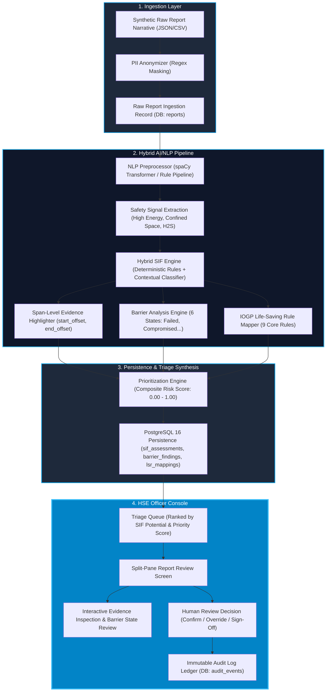
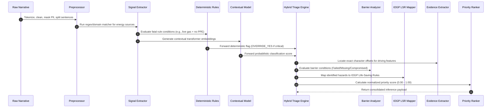
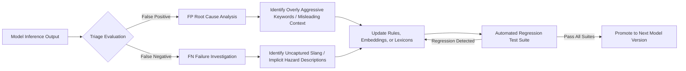
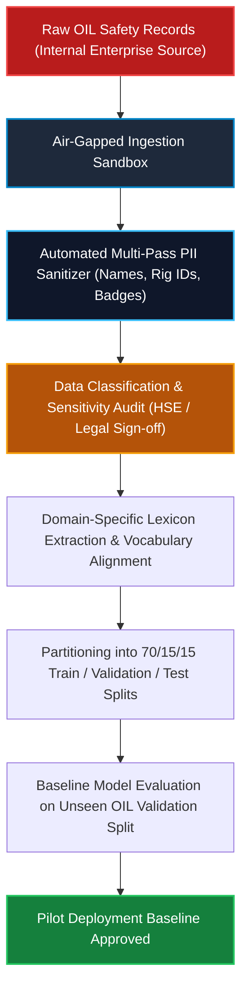
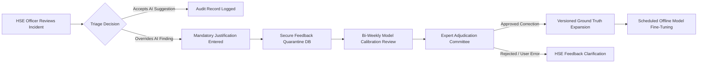
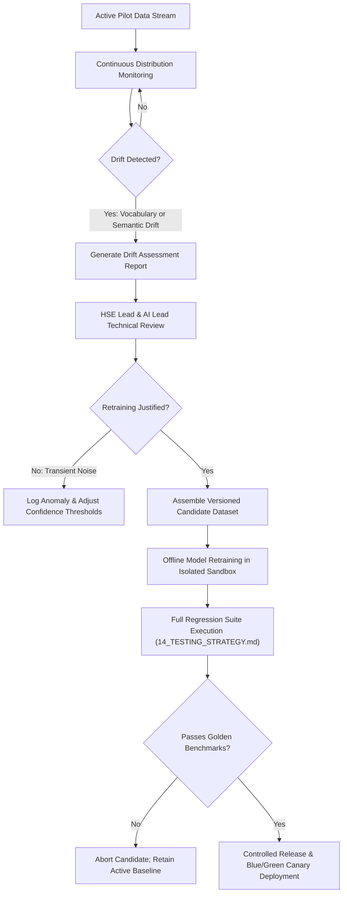
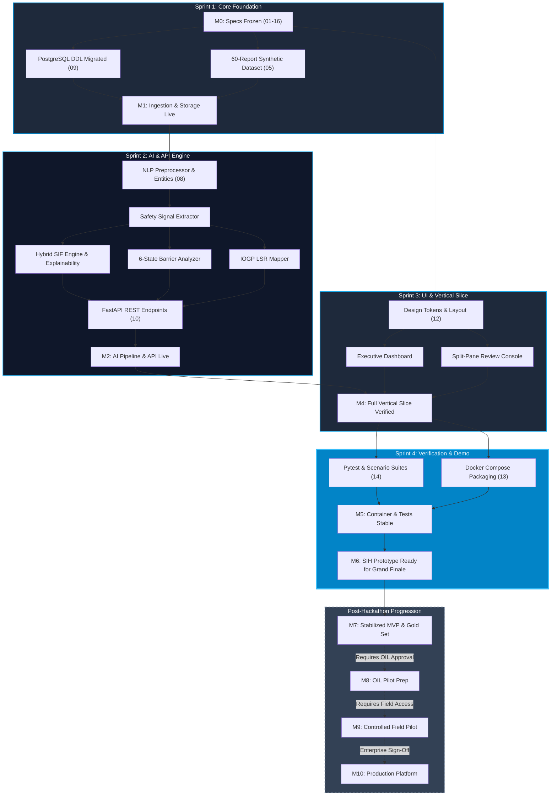

# Product, Technical, and Operational Roadmap
## AI/NLP Engine to Detect Serious Injury & Fatality (SIF) Precursors in OIL's Unsafe-Act/Unsafe-Condition and Near-Miss Reports

---

### Document Control & Governance

| Metadata Attribute | Specification Detail |
| :--- | :--- |
| **Document Identifier** | `15_ROADMAP.md` |
| **Document Classification** | Technical Program Management & Execution Strategy |
| **System Name** | OIL Safety Intelligence Platform (`oil-sip`) |
| **SIH Problem Statement** | SIH26165 (Oil India Limited / Ministry of Petroleum and Natural Gas) |
| **Authoring Entity** | Tech Smashers — Lead PM, TPM, & Product Strategy Lead |
| **Current Roadmap Version** | `v1.0.0-PROPOSED` |
| **Status** | Active Execution Baseline (Targeting SIH 2026 Grand Finale) |
| **Last Updated** | 2026-09-08 |
| **Source-of-Truth Hierarchy** | `01_PROJECT_CONSTITUTION.md` through `14_TESTING_STRATEGY.md` |

---

### Executive Tagging Taxonomy & Epistemic Status

Every roadmap phase, workstream, deliverable, and architectural commitment in this document is labeled with strict status identifiers:
- `[ESTABLISHED]`: Formally committed and specified across documents `01` through `14`.
- `[PROPOSED]`: Recommended design or sequence developed for tactical hackathon and post-hackathon execution.
- `[RECOMMENDED]`: Best-practice engineering or governance recommendation awaiting team or mentor sign-off.
- `[PROTOTYPE ASSUMPTION]`: Scope, tooling, or data assumption valid strictly for the SIH 2026 competition prototype.
- `[DEPENDENCY]`: Item blocked until an upstream milestone, approval, or data artifact is delivered.
- `[TO BE CONFIRMED]`: Item requiring official access, operational validation, or legal sign-off from Oil India Limited (OIL).
- `[FUTURE ENHANCEMENT]`: Post-pilot enterprise capability deferred beyond initial field deployment.

---

## 1. Purpose & Strategic Scope

The purpose of `15_ROADMAP.md` is to establish the master operational, technical, AI, data, and validation roadmap for the **OIL Safety Intelligence Platform (`oil-sip`)**. This document serves as the tactical bridge between the architectural specifications (`06`–`14`) and day-to-day project execution for the Tech Smashers six-member engineering team.

Specifically, this roadmap provides unambiguous answers to:
1. **What are we building first?** The minimum complete vertical slice that detects, explains, and prioritizes SIF precursors.
2. **What must be completed for the SIH prototype?** A robust, end-to-end demonstrable platform executing across synthetic and public incident reports with zero mocked backend plumbing.
3. **What comes immediately after the prototype?** Rigorous error-analysis loops, gold set expansion, and code stabilization in Horizon 1 (Validated MVP).
4. **What requires real OIL data?** Operational calibration, domain-specific vocabulary fine-tuning, and organizational hazard weighting in Horizon 2/3.
5. **What requires HSE domain validation?** All barrier taxonomies, IOGP Life-Saving Rule (LSR) mappings, and SIF triage decision logic.
6. **What defines completion at each milestone?** Objective, verifiable exit criteria that eliminate subjective claims of readiness.
7. **What must NOT be built yet?** Enterprise infrastructure sprawl, multi-cluster Kubernetes, premature microservices, and autonomous remediation systems that distract from the core problem statement.

```
+-------------------------------------------------------------------------------------------------------------+
|                                    MASTER PRODUCT MATURITY PROGRESSION                                      |
|                                                                                                             |
|  +--------------------+      +--------------------+      +--------------------+      +-------------------+  |
|  |    HORIZON 0       |      |    HORIZON 1       |      |   HORIZON 2 & 3    |      |   HORIZON 4 & 5   |  |
|  |  SIH PROTOTYPE     | ---> |   VALIDATED MVP    | ---> |     OIL PILOT      | ---> | PRODUCTION PLATF. |  |
|  | Complete Vertical  |      | Stabilized Rules,  |      | Authorized Field   |      | High Availability,|  |
|  | Slice on Synthetic |      | Error Loops, Gold  |      | Deployment & HSE   |      | Enterprise SSO,   |  |
|  | & Public Datasets  |      | Benchmarking       |      | Expert Calibration |      | Scale & Drift Ops |  |
|  +--------------------+      +--------------------+      +--------------------+      +-------------------+  |
+-------------------------------------------------------------------------------------------------------------+
```

---

## 2. Critical Roadmap Principle: Maturity Progression

The Tech Smashers team operates under a strict, non-negotiable maturity progression:

$$\mathbf{PROTOTYPE} \longrightarrow \mathbf{VALIDATED\ MVP} \longrightarrow \mathbf{OIL\ PILOT} \longrightarrow \mathbf{PRODUCTION\ PLATFORM} \longrightarrow \mathbf{CONTINUOUS\ SCALE}$$

### Epistemic Governance Constraints
- **The SIH Prototype is NOT Production-Ready:** The prototype proves feasibility, system architecture, explainable AI reasoning, and end-to-end integration using curated synthetic and open public data (`05_DATA_STRATEGY_AND_LABELING.md`). It lacks enterprise stress testing, authorized corporate data fine-tuning, and multi-region resilience.
- **Zero Presumption of OIL Authorization:** Tech Smashers does **not** represent that Oil India Limited has approved deployment, granted enterprise network access, authorized cloud environments, or scheduled field trials. All references to OIL data onboarding, pilot execution, or field integration are explicitly classified as `[TO BE CONFIRMED WITH OIL]` and `[DEPENDENCY]`.
- **Integrity Over Salesmanship:** No system feature, test coverage figure, or performance metric will be presented as complete unless supported by verifiable unit tests, integration scripts, or benchmark logs.

---

## 3. Core Product Language Invariants

All team communication, code documentation, UI labels, presentation slides, and roadmap milestones must adhere strictly to the cognitive and ontological invariants codified in `01_PROJECT_CONSTITUTION.md`:

```
====================================================================================================
                                      CORE PRODUCT INVARIANTS
====================================================================================================
1. "SIF Potential"                   !=   "Future Fatality Prediction"
   (Evaluates precursor risk energy)        (We never predict, forecast, or guarantee death)

2. Actual Outcome                    !=   SIF Potential
   (Near misses with high energy            (Outcome severity is often governed by luck;
    possess high SIF Potential)              precursor potential is governed by physics)

3. Near Miss                         !=   Automatically Low Risk
   (A near miss under heavy suspended       (Trivializing near misses masks SIF precursors)
    loads is an extreme SIF precursor)

4. AI Classification                 !=   Final HSE Decision
   (The platform provides decision          (HSE Officers retain 100% legal, ethical, and
    support and explainable triage)          operational triage authority)

5. Frequency of Incidents            !=   Risk Severity
   (High-frequency minor slips rarely       (Low-frequency well control events or confined space
    kill; low-frequency energy releases do)  entries represent existential SIF exposure)

6. Synthetic Data Performance        !=   Production Operational Performance
   (Lab benchmarks on synthetic sets        (Real-world validation requires authorized, field-
    validate architecture and logic)         collected data from operational assets)
====================================================================================================
```

---

## 4. Twelve Core Roadmap Principles

Every milestone, sprint goal, and architecture decision is governed by these twelve principles:

1. **Solve the Core Problem Statement First:** Priority Zero (P0) is detecting SIF precursors in unstructured safety reports, isolating energy sources, and mapping Life-Saving Rules. Peripheral features (e.g., chat assistants, complex BI builders) are strictly prohibited until the core engine functions flawlessly.
2. **Build a Working End-to-End Vertical Slice Early:** Rather than building all backend tables or all frontend screens in isolation, the team prioritizes completing a single, un-mocked report flow from raw narrative ingestion to UI triage display within the first sprint.
3. **Validate Before Scaling:** Code, heuristics, and classification logic must be tested against verified contrastive scenarios before introducing multi-worker pipelines, distributed queues, or complex caching layers.
4. **Evidence Before Automation:** No risk score or SIF category may ever be emitted without exact, character-level source span citations (`start_offset`, `end_offset`) highlighting the causal text.
5. **Human-in-the-Loop as a Structural Requirement:** AI triage proposals remain provisional until explicitly confirmed, modified, or rejected by an authorized human HSE Officer. Human feedback is version-controlled and auditable.
6. **Data Quality Before Model Complexity:** Clean, schema-validated, well-labeled synthetic and benchmark datasets yield far higher safety reliability than feeding noisy text into massive, uncalibrated LLMs.
7. **Simplicity Before Infrastructure Scale:** Run on Docker Compose with PostgreSQL 16 and a single FastAPI container for H0. Do not introduce Kubernetes, service meshes, or Kafka until actual throughput and tenancy demand it.
8. **Security from the Beginning:** Role-Based Access Control (RBAC), PII sanitization (regex-based presidio-style masking of worker names/IDs), audit trails, and strict parameter validation are baked into H0, not retrofitted in H4.
9. **Version Everything Important:** Every model output, rule configuration, keyword taxonomy, and database migration must carry explicit semver identifiers (`model_version`, `rule_version`, `schema_version`) to ensure 100% audit reproducibility.
10. **Measure Before Claiming Improvement:** Performance metrics ($F_2\text{-score}$, latency, memory) must be generated by automated test harnesses (`14_TESTING_STRATEGY.md`), not subjective estimation.
11. **OIL-Specific Validation Before Production Claims:** Operational deployment claims remain contingent on authorized on-premise evaluation with OIL domain experts.
12. **Aggressive Scope Creep Guardrails:** If a proposed feature is not explicitly required to satisfy the SIH judging rubric or core safety workflow, it is rejected or relegated to Horizon 5.

---

## 5. Current Project State

As established across documents `01` through `14`, the project foundation is architecturally complete at the specification level:

| Architectural Dimension | Governing Document | Established Specification Status | Implementation Status |
| :--- | :--- | :--- | :--- |
| **Problem Formulation & SIF Ontology** | `01`, `03`, `04` | Complete (Campbell Institute, Heinrich critique, IOGP Report 459) | Specification Frozen |
| **Product Personas & UX Workflows** | `02`, `12` | Complete (HSE Officer, Rig Safety Officer, Exec Dashboard) | UI Wireframes & Tokens Specified |
| **Data Strategy & Labeling Guidelines** | `05` | Complete (60-report MVD synthetic set, 5 barrier states, 9 LSRs) | Schema Frozen; Data Ingestion to be executed |
| **Technical & Non-Functional Requirements**| `06` | Complete (IEEE standard FR-001–FR-006, AI-001–AI-008, NFRs) | Acceptance Criteria Defined |
| **System Architecture & Layering** | `07` | Complete (11 layers, 13 components, synchronous + async workers) | Architecture Baseline Approved |
| **AI/NLP Pipeline & Hybrid Engine** | `08` | Complete (spaCy + all-MiniLM-L6-v2 + Rule/Regex + 6-State Barrier Parser; DeBERTa H1) | Pipeline Logic Specified |
| **Relational Database Design** | `09` | Complete (18 tables, PostgreSQL 16, pgvector, check constraints) | DDL Specified & Validated |
| **RESTful API Contracts** | `10` | Complete (23 endpoints, strict Pydantic envelopes, OpenAPI 3.1) | Schemas & Status Codes Defined |
| **Security, RBAC & Audit Architecture** | `11` | Complete (JWT, PBKDF2, PII stripping, SHA-256 audit ledger) | Threat Model & Rules Established |
| **Deployment & Containerization** | `13` | Complete (Docker Compose multi-stage, dev/staging/air-gapped profiles)| Dockerfiles & Manifests Specified |
| **Testing Strategy & Evaluation Harness** | `14` | Complete (4-tier testing pyramid, 8 contrastive test suites, CI/CD) | Test Cases & Fixtures Specified |

*Implementation status summary:* `Implementation across active codebase to be executed in sequence following this roadmap.`

---

## 6. Comprehensive Roadmap Horizons (H0 to H5)

The project execution is organized into six distinct, chronologically sequential horizons:

```
========================================================================================================================
HORIZON   DESIGNATION                          CORE OBJECTIVE                                  PRIMARY DATASET / ENV
========================================================================================================================
H0        SIH Prototype                        Working vertical slice, zero-mock pipeline,     60-report synthetic MVD +
          (Immediate Focus)                    interactive judge demo, baseline deployment      OSHA/CSB public validation
------------------------------------------------------------------------------------------------------------------------
H1        Prototype Stabilization &            Post-hackathon refactoring, gold set expansion, Curated synthetic + 
          Validated MVP                        automated error loops, test suite hardening      OSHA/BSEE gold test set
------------------------------------------------------------------------------------------------------------------------
H2        OIL Pilot Preparation                OIL data classification, glossary alignment,    De-identified sample OIL
          [TO BE CONFIRMED]                    enterprise security review, domain calibration   pilot dataset (authorized)
------------------------------------------------------------------------------------------------------------------------
H3        Controlled OIL Pilot                 Field deployment on select operational assets,  Live internal OIL reports
          [TO BE CONFIRMED]                    HSE Officer feedback, human-in-the-loop triage   (Rig / Asset restricted)
------------------------------------------------------------------------------------------------------------------------
H4        Production Hardening                 High availability, enterprise SSO/LDAP, SIEM     Full enterprise pipeline,
          [TO BE CONFIRMED]                    integration, disaster recovery, air-gapped prod  active drift monitoring
------------------------------------------------------------------------------------------------------------------------
H5        Scale & Continuous Improvement       Cross-asset rollout, multi-lingual reporting,    Enterprise-wide data stream,
          [FUTURE ENHANCEMENT]                 predictive barrier decay, edge-rig sync          continual active learning
========================================================================================================================
```

---

## 7. Horizon 0 (H0) — SIH Prototype Execution Plan

### 7.1 Objective & Success Target
Deliver a production-grade, highly polished, working software prototype for the SIH 2026 Grand Finale. The prototype must execute completely offline or locally via Docker Compose, eliminating all cloud dependencies during live evaluation. It demonstrates the complete safety intelligence workflow across synthetic and publicly verified oil & gas incident narratives.

### 7.2 The Fourteen Mandatory Prototype Capabilities
1. **Multi-Format Ingestion:** Accept single-report JSON payloads and batch CSV/Excel uploads (`FR-001`, `FR-002`).
2. **PII Masking & Cleaning:** Automatically redact personnel names, phone numbers, and contractor IDs via regex patterns before persistence (`SEC-001`).
3. **NLP Preprocessing & Extraction:** Tokenization, sentence splitting, and domain entity extraction across 7 core entity classes (`AI-001`).
4. **Safety Signal Isolation:** Structured identification of high-energy sources, mechanical hazards, and toxic atmospheres (`AI-003`).
5. **Hybrid SIF Potential Assessment:** Dual-path deterministic rules and contextual transformer inference generating SIF status (`YES`, `REVIEW`, `NO`) (`AI-004`).
6. **Span-Level Explainability:** Highlight exact character offsets in the raw text supporting every flagged precursor (`AI-008`).
7. **Bow-Tie Barrier Intelligence:** Classify administrative, physical, and operational controls using the canonical 6-state barrier taxonomy (`PRESENT_VERIFIED`, `MISSING`, `INCOMPLETE`, `FAILED`, `BYPASSED`, `UNKNOWN` — Constitution §11) and render them on a bow-tie diagram (`AI-005`).
8. **IOGP Life-Saving Rule Mapping:** Deterministic mapping of hazards to the 9 IOGP Life-Saving Rules with confidence scoring (`AI-006`).
9. **Recurring Pattern Discovery:** Aggregation of recurring precursor clusters across operational sites, shifts, and equipment types (`AI-007`).
10. **Composite HSE Prioritization:** Algorithmic calculation of report priority scores ($0.00$ to $1.00$) to rank high-risk events at the top of the queue (`UX-004`).
11. **Human-in-the-Loop Review Console:** Interactive UI allowing HSE Officers to confirm, override, comment on, and sign off on AI triage proposals (`HIL-001`).
12. **Executive & Operational Dashboards:** Real-time metrics visualizing SIF ratios, barrier failure breakdowns, and geographic risk concentration (`UX-001`).
13. **Relational Persistence & Audit:** Full PostgreSQL 16 persistence across reports, extractions, triage decisions, and append-only audit records (`DATA-001`, `SEC-002`).
14. **Deterministic Local Deployment:** Single-command startup (`docker compose up --build`) running backend, database, and frontend with automated database seeding (`NFR-003`).

---

## 8. H0 Complete Vertical Slice

To guarantee demo reliability, the team prioritizes completing this un-broken vertical slice before adding secondary screens or analytics filters:



---

## 9. H0 Feature Priority & Definition of Done

Features are strictly prioritized into P0 (Prototype Core), P1 (Prototype Enhancements), and P2 (Post-Prototype):

| Requirement ID | Feature Description | Priority | Technical & Operational Justification | Upstream Dependency | Definition of Done (DoD) |
| :--- | :--- | :---: | :--- | :--- | :--- |
| `FR-001` | Raw Incident Ingestion API | **P0** | Foundation for all safety analysis; accepts structured JSON reports. | Database Schema (`09`) | `POST /api/v1/reports` returns HTTP 201, validates schema, persists raw report to DB. |
| `FR-002` | Bulk Batch Ingestion | **P0** | Enables rapid demonstration of multi-report risk distributions. | `FR-001`, CSV Parser | `POST /api/v1/reports/batch` ingests 50+ CSV rows asynchronously with job tracking. |
| `AI-001` | Domain NLP Entity Extraction | **P0** | Extracts hazards, equipment, and actions required by downstream rules. | Ingestion Pipeline | Isolates entities with valid token spans across 100% of synthetic test cases. |
| `AI-003` | Safety Signal Extraction | **P0** | Detects high-energy sources, electrical hazards, and heavy lifts. | `AI-001` | Accurately extracts safety signals with exact narrative text offsets. |
| `AI-004` | Hybrid SIF Potential Engine | **P0** | The core SIH problem requirement; classifies SIF Potential. | `AI-001`, `AI-003` | Emits `YES`, `REVIEW`, or `NO` with confidence and rule triggers. |
| `AI-008` | Source Span Explainability | **P0** | Essential for HSE trust and ethical AI compliance; eliminates hallucination. | `AI-004` | Returns exact `start_offset` and `end_offset` bounding boxes matching narrative text. |
| `AI-005` | Barrier Analysis Engine | **P0** | Bow-tie safety requirement; assesses control integrity. | `AI-003` | Classifies controls into the canonical 6-state taxonomy with barrier type categorization. |
| `AI-006` | IOGP Life-Saving Rule Mapper | **P0** | Direct alignment with oil & gas industry safety standards. | `AI-003` | Maps incident to primary/secondary IOGP rules with matching rationale. |
| `AI-007` | Recurring Pattern Discovery | **P0** | Aggregates repeated precursor clusters across assets/shifts. | `AI-004`, `AI-006` | Computes recurring pattern clusters across synthetic report batches. |
| `UX-004` | Composite HSE Prioritization | **P0** | Drives the triage queue ranking to focus officer attention. | `AI-004`, `AI-005` | Generates normalized priority score ($0.00-1.00$) correctly sorting reports. |
| `HIL-001` | Human Review Console & Sign-Off| **P0** | Enforces constitutional principle: AI suggests, Human decides. | `UX-004`, API Layer | HSE Officer can confirm/override AI triage via UI; record saved to audit log. |
| `UX-001` | Executive & Operational Dashboard| **P0** | Delivers immediate visual impact for hackathon judges. | Backend Analytics API | Displays SIF potential breakdown, barrier failures, and spatial asset clusters. |
| `SEC-002` | Immutable Audit Trail Logging | **P0** | Regulatory accountability; tracks every AI generation and human review. | DB Engine | Every review, override, and re-run logged to `audit_events` with SHA-256 hash. |
| `SEC-001` | PII Redaction Pipeline | **P0** | Protects personnel privacy; strips names and contact info. | Ingestion Pipeline | Redacts Indian names, phone numbers, and contractor badges before persistence. |
| `UX-005` | Full-Text & Semantic Search | **P1** | Enhances analyst investigation efficiency during deep dives. | DB pgvector setup | Search endpoint returns ranked relevant incidents using keyword + vector embeddings. |
| `FR-004` | Exportable Audit Dossier (PDF) | **P1** | Operational utility for plant safety meetings and regulatory filings. | Triage DB records | Generates downloadable PDF summarizing narrative, AI findings, and review sign-off. |
| `FR-006` | Email / Alert Notification Engine| **P2** | Real-time notification of critical SIF discoveries. | Notification Worker | Sends automated SMTP/Webhook alert when SIF score exceeds threshold (Post-H0). |

---

## 10. H0 Data Strategy & Prototype Corpus Plan

### 10.1 Representative Synthetic Corpus Specification
In accordance with `05_DATA_STRATEGY_AND_LABELING.md`, H0 executes on a meticulously structured 60-report Minimum Viable Dataset (MVD). This dataset guarantees balanced coverage across upstream oil & gas operational scenarios:

```
+-------------------------------------------------------------------------------------------------------------+
|                                    H0 SYNTHETIC CORPUS COMPOSITION (60 MVD)                                 |
|                                                                                                             |
|  +--------------------+  +--------------------+  +--------------------+  +-------------------------------+  |
|  |     DRILLING &     |  |   PRODUCTION &     |  |    MAINTENANCE &   |  |     PIPELINE & LOGISTICS      |  |
|  |    WORKOVER (20)   |  |   PROCESSING (15)  |  |    HOT WORK (15)   |  |             (10)              |  |
|  |                    |  |                    |  |                    |  |                               |  |
|  | * Kick/Well Control|  | * H2S Toxic Leak   |  | * Confined Space   |  | * High-Pressure Line Rupture  |  |
|  | * Dropped Objects  |  | * Separator Over-P |  | * Flange Bolt Spark|  | * Heavy Transport Crane Tip   |  |
|  | * Rotary Table Ent.|  | * Flare Stack Flame|  | * Scaffolding Fail |  | * Trench Wall Cave-In         |  |
|  +--------------------+  +--------------------+  +--------------------+  +-------------------------------+  |
+-------------------------------------------------------------------------------------------------------------+
```

### 10.2 Contrastive NLP Stress Scenarios in H0 Corpus
To prove the AI engine's semantic precision and prevent superficial keyword matching, the H0 dataset contains specific challenge sets:
- **Lexical Overlap Negation:** Narrative contains high-energy words without danger (e.g., *"H2S sensor calibrated successfully; zero gas detected; permit closed cleanly"* $\rightarrow$ Classified as `NO`).
- **Trivial Outcome / Critical Precursor:** Minor injury masking lethal energy (e.g., *"Worker bruised shin when jumping clear of a falling 3-ton drill collar suspended by frayed sling"* $\rightarrow$ Classified as `YES`).
- **Temporal Sequence Reasoning:** Control recovered before hazard materialized vs. barrier collapsed during live flow.
- **Multiple Concurrent Hazards:** Simultaneous presence of electrical switchgear maintenance and flammable gas vapors in a battery room.
- **Explicit Provenance:** 100% of reports carry a `data_source` tag (`SYNTHETIC_MVD_V1` or `PUBLIC_OSHA_CSB`) preventing accidental conflation with real corporate records.

---

## 11. H0 AI Implementation Sequence

The prototype AI pipeline is constructed in ten discrete, verifiable stages:



*Note on Implementation Realism:* For H0, contextual inference utilizes lightweight semantic embeddings (`sentence-transformers/all-MiniLM-L6-v2`) paired with a deterministic expert rule engine and spaCy linguistic parsing (`08_AI_ARCHITECTURE.md`). Fine-tuning larger domain transformers (`microsoft/deberta-v3-small`) is scheduled for H1 post-hackathon pilot validation once authenticated field training datasets become available. This guarantees $100\%$ explainability, rapid CPU-based inference, and zero reliance on external proprietary APIs during live judging.

---

## 12. H0 UI/UX Implementation Plan

Following `12_UI_UX_DESIGN.md`, the frontend interface is delivered as a modern, responsive React/TypeScript Single Page Application (SPA) styled with custom, dark-mode-first CSS design tokens:

```
+-------------------------------------------------------------------------------------------------------------+
|                                    H0 UI/UX SCREEN IMPLEMENTATION MAP                                       |
|                                                                                                             |
|  1. EXECUTIVE SIF DASHBOARD                                                                                 |
|     * SIF Rate Gauges, Metric Banners (Total Reports, Active Precursors, Overdue Triage)                    |
|     * Precursor Distribution Chart, IOGP Life-Saving Rule Heatmap, Barrier Health Status Bar                |
|                                                                                                             |
|  2. REPORT TRIAGE QUEUE (TABLE VIEW)                                                                        |
|     * Ranked by Composite Priority Score; Filters: SIF Potential (YES/POTENTIAL/NO), Asset, Date Range      |
|     * Status Badges: PENDING REVIEW, OFFICER CONFIRMED, REJECTED, OVERRIDDEN                                |
|                                                                                                             |
|  3. SPLIT-PANE REPORT DETAIL CONSOLE (CORE DEMO SCREEN)                                                     |
|     * Left Pane: Original Report Narrative with Interactive Highlight Spans (Amber/Red/Blue)                |
|     * Right Pane: AI SIF Assessment Badge, Driving Precursor Signals, 6-State Barrier Cards, LSR Badges    |
|                                                                                                             |
|  4. HUMAN REVIEW INTERACTION MODAL                                                                          |
|     * Decision Controls: [Confirm AI Finding] [Override to NO] [Escalate to General Manager]            |
|     * Officer Comment Textarea & Digital Sign-Off Button with SHA-256 Audit Seal                            |
|                                                                                                             |
|  5. RECURRING PATTERN EXPLORER                                                                              |
|     * Clustered Card Grid: Multi-incident precursors grouped by equipment, contractor, or operational shift |
+-------------------------------------------------------------------------------------------------------------+
```

---

## 13. H0 Quality Assurance & Testing Plan

Before declaring the prototype demo-ready, the system must pass the automated test suites defined in `14_TESTING_STRATEGY.md`:

- **Unit Test Coverage:** Complete coverage across PII regex cleaners, barrier state parsers, IOGP rule mappers, and priority scoring algorithms (`pytest tests/unit/`).
- **Contrastive NLP Scenario Tests:** Verification that the 8 contrastive test scenarios (negation, trivial injury, non-injury near miss) evaluate correctly.
- **Evidence Span Faithfulness:** Automated assertions verifying that `narrative[start_offset:end_offset]` exactly matches the extracted signal string for $100\%$ of test cases.
- **Database & API Contract Tests:** FastAPI `TestClient` verification that all 23 API endpoints adhere strictly to OpenAPI response envelopes (`tests/api/`).
- **Deterministic E2E Smoke Test:** Automated script simulating full ingest $\rightarrow$ inference $\rightarrow$ triage $\rightarrow$ audit cycle.

---

## 14. H0 Deployment & Containerization Strategy

Following `13_DEPLOYMENT.md`, H0 avoids distributed orchestration complexity and deploys via a deterministic, single-command **Docker Compose** harness:

```
[Host OS (Windows / Linux / macOS)]
       │
       ▼  docker compose -f deploy/docker/docker-compose.yml up --build
  ┌────────────────────────────────────────────────────────────────────────┐
  │  Docker Network: oil_sip_network (172.28.0.0/16)                       │
  │                                                                        │
  │   ┌─────────────────────┐   ┌─────────────────────┐   ┌────────────┐   │
  │   │  Frontend Container │   │  Backend Container  │   │ Database   │   │
  │   │  Nginx + React SPA  │──▶│  FastAPI (Python)   │──▶│ PostgreSQL │   │
  │   │  Port 80/443        │   │  Port 8000          │   │ Port 5432  │   │
  │   └─────────────────────┘   └─────────────────────┘   └────────────┘   │
  │                                        │                     │         │
  │                                        ▼                     ▼         │
  │                                [Embedded Models]     [Local Named Vol] │
  │                                (Mounted Read-Only)   (oil_sip_pgdata)  │
  └────────────────────────────────────────────────────────────────────────┘
```

- **Zero Internet Requirement:** All NLP model weights, tokenizers, frontend packages, and database seeds are baked directly into the container images or cached in local named volumes.
- **Automated Health Probes:** Container startup orchestrated via `service_healthy` conditions checking PostgreSQL readiness before launching the backend engine.

---

## 15. H0 Definition of Done (DoD)

The SIH Prototype is formally declared **DONE** when the following 14 objective criteria are verified in a live rehearsal:

1. **Dashboard Loading:** The executive dashboard loads in $<2.0$ seconds, displaying realistic aggregate metrics from the seeded database.
2. **Prioritized Ingestion:** A freshly ingested high-energy near miss report immediately appears at the top of the triage queue.
3. **Clean Narrative Display:** The report review screen renders the un-redacted narrative for authorized officers while verifying PII was purged from backend persistence.
4. **Valid SIF Classification:** The system renders an unambiguous SIF Potential badge (`YES`, `REVIEW`, or `NO`).
5. **Clear Explainability:** Clicking the SIF badge highlights the exact driving narrative sentence in the left pane.
6. **Active Signal Extraction:** The UI displays extracted energy sources (e.g., *"Rotary Table Kinetic Energy"*).
7. **Barrier Integrity Visualized:** Bow-tie controls are displayed with correct states (e.g., *"Interlock Guard: COMPROMISED"*).
8. **IOGP LSR Highlighted:** The matching IOGP rule (e.g., *"Bypass Safety Controls"*) is displayed with standard iconography.
9. **Recurring Pattern Linked:** The UI shows if the incident shares root precursor features with other recent reports.
10. **HSE Prioritization Explained:** The composite priority score breakdown ($0.00-1.00$) is inspectable via tooltip.
11. **Human Override Executed:** The reviewer overrides an AI suggestion, enters a mandatory justification, and submits.
12. **Audit Ledger Updated:** The database `audit_events` table reflects the override with the officer's ID, timestamp, and previous/new values.
13. **Synthetic Provenance Labeled:** All UI screens and exported records explicitly display: *"DATASET: SYNTHETIC DEMONSTRATION RECORD"*.
14. **Un-broken Workflow:** The entire 14-step workflow completes without console errors, 500 HTTP failures, or system restarts.

---

## 16. Horizon 1 (H1) — Prototype Stabilization & Validated MVP

Following the hackathon demonstration, project focus shifts from feature breadth to structural stabilization and mathematical validation:

```
+-------------------------------------------------------------------------------------------------------------+
|                                    H1 MVP STABILIZATION WORKSTREAMS                                         |
|                                                                                                             |
|  [Code Hardening]    --> Refactor prototype scripts into modular domain packages; remove technical debt.   |
|  [Gold Set Growth]   --> Expand evaluated dataset from 60 to 500+ verified oil & gas reports.               |
|  [Error Analysis]    --> Implement structured False Positive / False Negative review loops.                 |
|  [Model Governance]  --> Deploy MLflow model registry and schema migration tooling (Alembic).               |
|  [Security Auditing] --> Conduct dependency vulnerability scans (Trivy/Safety) and OWASP Top 10 hardening.  |
+-------------------------------------------------------------------------------------------------------------+
```

---

## 17. H1 Data Maturity & Annotation Progression

H1 establishes a formal progression path toward ground-truth data validation:

$$\mathbf{Synthetic\ MVD\ (60)} \longrightarrow \mathbf{Public\ OSHA/BSEE\ Gold\ Set\ (500)} \longrightarrow \mathbf{De\text{-}Identified\ Expert\ Annotated\ Corpus} \longrightarrow \mathbf{Authorized\ OIL\ Sample}$$

### Annotation Guidelines & Inter-Rater Reliability
- **Dual Blind Annotation:** Every report in the validation set is labeled independently by two trained reviewers.
- **Inter-Rater Agreement:** Tracked via Cohen's Kappa ($\kappa$). Any report where $\kappa < 0.80$ is escalated to an HSE Lead for adjudication.
- **Leakage-Safe Partitioning:** Strict grouping by operational site and incident date to ensure no narrative overlap between training heuristics and test evaluation splits.

---

## 18. H1 AI Validation & Metric Governance

Model performance in H1 is evaluated against rigorous, statistically valid metrics established in `14_TESTING_STRATEGY.md`. The team commits to **never** publishing fabricated target numbers; all figures reflect actual test runs:

| Performance Metric | Formulation / Focus | Operational Purpose |
| :--- | :--- | :--- |
| **Recall on SIF Potential = YES ($F_2\text{-Score}$)** | Emphasizes Recall over Precision ($\beta = 2.0$) | Minimizes fatal False Negatives; missing a lethal precursor is unacceptable. |
| **Precision on SIF Potential = YES** | $\text{TP} / (\text{TP} + \text{FP})$ | Prevents triage queue fatigue; ensures officers are not inundated with trivial alarms. |
| **Barrier Extraction Accuracy** | Multi-class Macro F1 across 6 states | Validates bow-tie control integrity extraction. |
| **Evidence Span Intersection** | Character-level IoU (Intersection over Union) | Assesses whether the model highlights true causal text vs. irrelevant narrative. |
| **LSR Categorization F1** | Multi-label classification across 9 rules | Ensures accurate international benchmark compliance. |

---

## 19. H1 Continuous Error-Analysis Loop

To drive continuous AI refinement, H1 institutes a closed-loop error analysis framework:



---

## 20. H1 Model Governance & Version Control

To prevent configuration drift and guarantee strict audit reproducibility, H1 introduces multi-dimensional semantic versioning across all core engine assets:

| Asset Type | Versioning Format | Tracking Mechanism | Rollback Procedure |
| :--- | :--- | :--- | :--- |
| **NLP Transformer Weights** | `model-vX.Y.Z` | MLflow Model Registry / Git LFS | Pointer revert in `AI_MODEL_PATH` env variable. |
| **Deterministic Rule Sets** | `rules-vX.Y.Z` | Version-controlled JSON in `app/ai/rules/` | Automated rollback via Git deployment branch. |
| **Barrier / LSR Taxonomies** | `taxonomy-vX.Y.Z`| Relational seed scripts in `app/db/seeds/` | Downward database migration (`alembic downgrade`). |
| **Database Schema DDL** | `schema-vX.Y.Z` | Alembic Migration Revisions | Sequential down-migration scripts. |

---

## 21. Production-Readiness Gap Analysis

The transition from the H0 Prototype to a fully validated MVP and future Production Platform reveals specific engineering gaps that must be systematically closed:

| Engineering Dimension | H0 Prototype Baseline | Required for Production Platform | Gap / Planned Remediation |
| :--- | :--- | :--- | :--- |
| **Data Provenance** | Synthetic reports + Public CSB | Authorized, multi-year OIL incident reports | Establish secure, on-premise OIL data onboarding protocol. |
| **AI Classification** | spaCy + all-MiniLM-L6-v2 + Heuristic Rules | Domain-calibrated hybrid transformer (DeBERTa) + Rule engine | Fine-tune on authenticated oil & gas operational lexicons. |
| **Authentication & RBAC** | Local JWT + Seeded Mock Users | Enterprise SAML 2.0 / Active Directory / OAuth2 | Integrate enterprise identity provider (`SEC-002`). |
| **Database Architecture** | Standalone PostgreSQL 16 Container | High Availability Patroni / Repmgr + Read Replicas | Implement multi-node failover and managed DB orchestration. |
| **Persistence Storage** | Local Docker Named Volume | Encrypted S3 / MinIO Object Storage | Deploy redundant, multi-zone block and object storage. |
| **Infrastructure** | Local Docker Compose | Air-Gapped K8s / Enterprise Linux VMs | Develop production Helm charts and Ansible playbooks. |
| **Observability** | Console stdout + Basic Health Probes | Prometheus, Grafana, OpenTelemetry, Logstash | Deploy unified APM, distributed tracing, and metrics alerting. |
| **Disaster Recovery** | Manual SQL dump export | Automated daily encrypted snapshots + RTO/RPO $<1$h | Implement Point-In-Time Recovery (PITR) and replica testing. |
| **Model Drift Monitoring**| Static evaluation scripts | Automated data distribution & embedding drift monitors | Deploy EvidentlyAI / Prometheus drift exporter pipelines. |

---

## 22. Horizon 2 (H2) — OIL Pilot Preparation `[TO BE CONFIRMED]`

> [!IMPORTANT]
> All activities in Horizon 2 and Horizon 3 are strictly conditional upon formal project approval, mutual nondisclosure agreements, data governance clearance, and explicit authorization from Oil India Limited (OIL).

```
+-------------------------------------------------------------------------------------------------------------+
|                                  H2 OIL PILOT PREPARATION WORKSTREAMS                                       |
|                                                                                                             |
|  1. Legal & Data Privacy Clearance (Data Classification, NDA, PII Compliance)                               |
|  2. Technical Architecture Review (On-Premise vs. Dedicated Sovereign Cloud Assessment)                    |
|  3. OIL Terminology & Field Glossary Alignment (Assam Field Slang, Local Rig Abbreviations)                  |
|  4. HSE Officer User Group Formation & Pre-Pilot Training Workshops                                        |
|  5. Pilot Success Metric Agreement (Establishing quantitative operational thresholds)                       |
+-------------------------------------------------------------------------------------------------------------+
```

---

## 23. Controlled OIL Data Onboarding Protocol

Real operational safety reports from Oil India Limited cannot and will not be uploaded to commercial public cloud APIs. H2 enforces a rigorous, multi-stage on-premise onboarding pipeline:



---

## 24. OIL Domain & HSE Expert Validation

Prior to any field deployment, the system's reasoning logic must undergo structured validation by certified Oil India Limited HSE Officers:
- **Taxonomy Verification:** Verification that the 5 barrier states and 9 IOGP Life-Saving Rules accurately represent OIL's internal safety operating procedures (SOPs).
- **Heuristic Review:** Domain scrutiny of the deterministic SIF rules (e.g., verifying pressure thresholds, toxic gas ppm limits, and heavy lifting tonnage rules).
- **Feedback Mechanism Alignment:** Calibrating the review console to match the daily administrative workflow of Asset Safety Managers.

---

## 25. H2 Pilot Scope Definition `[TO BE CONFIRMED WITH OIL]`

The proposed field pilot is designed as a tightly controlled, phased deployment rather than an immediate company-wide rollout:

| Dimension | Pilot Boundary Scope `[PROPOSED]` | Out-of-Scope During Pilot |
| :--- | :--- | :--- |
| **Operational Assets** | 1–2 Selected Drilling Rigs + 1 Production Facility | Enterprise-wide field exploration, marine, or pipeline assets |
| **Report Types** | Near-Miss Reports & Unsafe Condition Observations | Formal Incident Investigations or Lost Time Injury (LTI) dossiers |
| **User Cohort** | 5–10 Nominated Rig Safety Officers & HSE Supervisors | Unrestricted field workforce or general contractors |
| **Deployment Mode** | Parallel Shadow Mode (AI triage reviewed alongside legacy process) | Sole-source operational decision authority |
| **Evaluation Window**| 60 to 90 Operational Days | Permanent operational mandate |

---

## 26. H2 Pilot Success Criteria

Evaluation criteria are structured into five objective categories. Specific quantitative thresholds will be negotiated and agreed with OIL stakeholders during H2 planning:

```
+-------------------------------------------------------------------------------------------------------------+
|                                      PILOT EVALUATION DIMENSIONS                                            |
|                                                                                                             |
|  1. INGESTION & PROCESSING RELIABILITY                                                                      |
|     * Zero pipeline crashes on unformatted field narratives; graceful exception handling.                   |
|     * Acceptable batch processing latency under peak end-of-shift reporting surges.                         |
|                                                                                                             |
|  2. AI SIF TRIAGE QUALITY                                                                                   |
|     * High Recall on true SIF precursors confirmed by HSE Officers; low rate of missed precursors.          |
|     * Manageable False Positive rate ensuring officer review queues remain efficient and actionable.        |
|                                                                                                             |
|  3. EVIDENCE & EXPLAINABILITY FIDELITY                                                                      |
|     * Highlighted text spans recognized as genuinely causal by field reviewers in >= 90% of inspections.    |
|     * Zero hallucinations or fabricated narrative references.                                               |
|                                                                                                             |
|  4. OPERATIONAL WORKFLOW UTILITY                                                                            |
|     * Documented reduction in the time required for HSE Officers to identify critical energy releases.      |
|     * Positive qualitative usability rating from participating field safety personnel.                      |
|                                                                                                             |
|  5. SECURITY & AUDIT COMPLIANCE                                                                             |
|     * 100% adherence to PII scrubbing protocols; zero personnel identifiers leaked to logs or reports.     |
|     * Complete cryptographic audit ledger tracking all AI scores and officer overrides.                     |
+-------------------------------------------------------------------------------------------------------------+
```

---

## 27. H2 Pilot Feedback Loop & Continual Calibration

Field corrections made by HSE Officers during the pilot are captured as high-value operational signals:



*Architectural Safety Guardrail:* Feedback overrides **never** automatically update production model weights in real time. All retraining occurs in controlled, versioned, offline evaluation pipelines.

---

## 28. Horizon 3 (H3) — Controlled OIL Pilot Execution `[TO BE CONFIRMED]`

During H3, the platform runs in live operational support mode within the agreed asset boundary:
- **Shadow Mode Triage:** The platform ingests real daily safety observations, executing NLP extraction, barrier evaluation, and prioritization in near real-time.
- **Bi-Weekly Safety Roundtables:** Joint engineering and HSE meetings to review system-identified precursor clusters and recurring pattern discoveries.
- **Audit Ledger Verification:** Routine inspection of cryptographically sealed audit records to verify human-in-the-loop compliance.

---

## 29. H3 Pilot Safety Guardrails

To prevent operational harm or algorithmic complacency, H3 operates under six structural guardrails:

```
====================================================================================================
                                      PILOT SAFETY GUARDRAILS
====================================================================================================
1. STRICT ADVISORY BOUNDARY:
   The platform is an assistive decision-support tool. It has NO autonomous authority to issue work
   stoppages, close permits, or alter field drilling parameters.

2. ZERO AUTOMATED PUNITIVE ACTION:
   Safety reports are submitted to improve operational learning. The platform contains zero features
   for individual worker tracking, blame attribution, or automated disciplinary escalation.

3. MANDATORY HUMAN ADJUDICATION:
   No incident can be closed or cleared from the high-risk triage queue without an authenticated
   officer's digital signature and timestamped review.

4. REAL-TIME UNCERTAINTY EXPOSURE:
   When model confidence falls below established thresholds (e.g., < 0.70), the system explicitly
   flags the record as "AMBIGUOUS PRECURSOR / REQUIRES MANUAL DEEP DIVE".

5. FULL TRACEABILITY & REVERTIBILITY:
   Every inference result links directly to the specific model version, rule hash, and tokenizer
   used. Officers can revert any AI recommendation with a single click.

6. SECURE MANUAL FALLBACK:
   If the AI pipeline experiences a container failure or processing halt, the system immediately
   falls back to standard chronological queue ordering, alerting administrators without data loss.
====================================================================================================
```

---

## 30. H3 Operational & AI Drift Monitoring

The platform continuously monitors data distributions and system health across four distinct vectors:

| Monitoring Vector | Observed Indicator | Alert Threshold | Corrective Action |
| :--- | :--- | :--- | :--- |
| **Input Narrative Drift** | Vocabulary shift (new slang, seasonal drilling terms) | Kolmogorov-Smirnov test $p < 0.05$ | Re-extract domain lexicons; update tokenizers. |
| **Triage Disagreement** | Spike in officer override rate ($> 20\%$) | 7-day moving average override $> 15\%$ | Convene HSE panel; audit recent rule triggers. |
| **System Ingestion Health**| Queue backlog or processing latency $> 5.0$s | Unprocessed queue $> 50$ items | Scale worker threads; check DB connection pools. |
| **Inference Confidence** | Skew toward borderline confidence ($0.45 - 0.55$) | $> 25\%$ of inferences in ambiguous band | Review embedding quality; schedule fine-tuning. |

---

## 31. H3 Model Drift & Retraining Protocol



---

## 32. Horizon 4 (H4) — Production Hardening `[TO BE CONFIRMED]`

Horizon 4 transforms the validated pilot software into an enterprise-grade corporate platform:

```
+-------------------------------------------------------------------------------------------------------------+
|                                  H4 PRODUCTION HARDENING WORKSTREAMS                                        |
|                                                                                                             |
|  [High Availability]  --> Active-passive multi-node PostgreSQL failover; redundant API container pools.      |
|  [Identity & Access]  --> Corporate SAML 2.0 / OAuth2 / Active Directory integration with MFA.              |
|  [Enterprise Security]--> TLS 1.3 enforcement, encrypted database tables (TDE), automated secret rotation.   |
|  [Disaster Recovery]  --> Multi-region / Multi-datacenter asynchronous replication with automated PITR.     |
|  [Air-Gapped Tooling] --> Fully self-contained container mirrors and internal dependency registries.        |
+-------------------------------------------------------------------------------------------------------------+
```

---

## 33. H4 Security Maturity Evolution

Security measures mature progressively across each roadmap horizon:

```
========================================================================================================================
SECURITY DOMAIN       H0 PROTOTYPE (Current)              H1/H2 PILOT PREP                H4 PRODUCTION PLATFORM
========================================================================================================================
Authentication        Local JWT, HS256, static users      Local JWT + Role-based tokens   Enterprise SAML 2.0 / AD / MFA
Authorization         Hardcoded Admin/Officer roles       FastAPI RBAC Scopes             Full Granular RBAC + Asset Scopes
PII Protection        Basic Regex redaction               Pre-persistence Regex + Audit   Presidio Named Entity Redaction
Data at Rest          Host volume permissions             Encrypted Docker volumes        AES-256 Tablespace Encryption
Data in Transit       HTTP localhost / Basic Self-Signed  TLS 1.2 Encrypted Channels      Strict TLS 1.3 + mTLS Inter-Service
Audit Logging         PostgreSQL `audit_events` table       Append-only DB tables           WORM Storage / SIEM Export
Vulnerability Mgmt    Manual review                       Automated Trivy CI/CD scans     Continuous Static/Dynamic SAST/DAST
========================================================================================================================
```

---

## 34. H4 Production AI Maturity Evolution

The AI engine evolves from an agile prototype baseline to an enterprise-grade intelligence platform:

$$\mathbf{Prototype\ Hybrid\ Engine} \longrightarrow \mathbf{Domain\ Fine\text{-}Tuned\ Model} \longrightarrow \mathbf{Calibrated\ Ensemble} \longrightarrow \mathbf{Governed\ Enterprise\ AI}$$

- **H0 Baseline:** spaCy linguistic parser + `sentence-transformers/all-MiniLM-L6-v2` paired with deterministic safety rule tables.
- **H1/H2 Pilot:** Domain transformer (`DeBERTa-v3-small`) fine-tuned on authenticated domain safety narratives; calibrated confidence scoring.
- **H4 Production:** Ensembled contextual representations with active drift monitoring, automated explainability benchmarks, and sub-second inference caching.

---

## 35. H4 Production Data Maturity Evolution

```
========================================================================================================================
DATA ASSET           H0 PROTOTYPE (Current)               H1/H2 PILOT PREPARATION          H4 ENTERPRISE PRODUCTION
========================================================================================================================
Source Narratives    60 Synthetic MVD + 10 OSHA cases     500+ Curated O&G Incidents       Full historical & live stream
Label Confidence     Engineering team heuristics          Dual-annotated expert gold set   HSE Officer calibrated ground truth
Storage Layer        PostgreSQL 16 single volume          Dedicated SSD storage pool       High-availability distributed cluster
Data Governance      Git repository tracking              Alembic schema migrations        Enterprise data catalog & lineage
Provenance Tracking  Basic `data_source` metadata tag     Strict SHA-256 record hashing    Cryptographic ledger integration
========================================================================================================================
```

---

## 36. Horizon 5 (H5) — Scale & Continuous Improvement `[FUTURE ENHANCEMENT]`

Following enterprise production stabilization, Horizon 5 introduces advanced capabilities:
- **Cross-Enterprise Multi-Site Expansion:** Unified safety intelligence scaling across all operational spheres of Oil India Limited (Assam, Rajasthan, Offshore, Pipeline Divisions).
- **Multilingual Narrative Ingestion:** Speech-to-text and multilingual NLP supporting local languages (Assamese, Hindi, Bengali) for direct field voice notes.
- **Computer Vision Precursor Correlation:** Ingesting site photos and CCTV frames alongside incident text to detect un-barricaded fall hazards and PPE non-compliance.
- **Predictive Barrier Decay Analytics:** Historical modeling to forecast when specific mechanical barriers (e.g., blowout preventer valves, pressure relief systems) are statistically prone to operational failure.
- **Offline Edge Synchronization for Remote Rigs:** Ultra-lightweight edge inference appliances running locally on remote exploration rigs with asynchronous batch syncing to central HQ.

---

## 37. Feature Prioritization Framework

To maintain engineering discipline and eliminate scope creep, all proposed capabilities are evaluated against a standardized 8-factor scoring framework:

```
+-------------------------------------------------------------------------------------------------------------+
|                                    FEATURE EVALUATION SCORING MATRIX                                        |
|                                                                                                             |
|  1. Problem Statement Alignment (Directly mandated by SIH26165?)                                          |
|  2. Life-Safety Value (Does it prevent fatal blind spots?)                                                  |
|  3. User & Operational Utility (Does it save HSE Officer triage time?)                                      |
|  4. Technical Feasibility (Can the 6-member team build and stabilize it?)                                   |
|  5. Data Dependency (Can it function without confidential OIL files?)                                       |
|  6. Explainability Impact (Does it enhance human trust in the AI?)                                          |
|  7. Implementation Cost & Complexity (Risk of destabilizing the vertical slice?)                            |
|  8. Hackathon Demonstrability (Can judges inspect and verify it in 3 minutes?)                             |
+-------------------------------------------------------------------------------------------------------------+
```

- **Priority 0 (P0) — Mandatory:** Must be fully functional for the SIH Prototype demo.
- **Priority 1 (P1) — High Value:** Target for post-prototype stabilization and initial MVP.
- **Priority 2 (P2) — Future Expansion:** Deferred to enterprise pilot and production horizons.

---

## 38. Comprehensive Feature Backlog

| Feature Module | Priority | Target Horizon | Core Dependency | Operational Value | Implementation Complexity |
| :--- | :---: | :---: | :--- | :--- | :--- |
| **Raw Narrative Ingestion API** | **P0** | H0 | DB Schema | High (Core pipeline entry) | Low |
| **Regex PII Scrubbing** | **P0** | H0 | Ingestion | High (Ethical compliance) | Low |
| **Safety Signal Extractor** | **P0** | H0 | Preprocessor | Critical (Precursor detection) | Medium |
| **Hybrid SIF Classifier** | **P0** | H0 | Signals, Rules | Critical (Core PS solution) | Medium |
| **Source Span Highlighter** | **P0** | H0 | SIF Engine | Critical (Explainability) | Medium |
| **6-State Barrier Engine** | **P0** | H0 | Signals | High (Bow-tie analysis) | Medium |
| **9-Rule IOGP LSR Mapper** | **P0** | H0 | Signals | High (Industry standard) | Low |
| **Recurring Pattern Aggregator** | **P0** | H0 | SIF Engine | High (Predictive discovery) | Medium |
| **Composite Priority Ranker** | **P0** | H0 | SIF, Barriers | High (Workflow triage) | Low |
| **Split-Pane Review Console** | **P0** | H0 | API Layer | Critical (Interactive demo) | Medium |
| **Executive SIF Dashboard** | **P0** | H0 | Analytics API| High (Judge visual impact) | Medium |
| **Audit Ledger & Sign-Off** | **P0** | H0 | DB Engine | High (Governance & trust) | Low |
| **Full-Text / Vector Search** | **P1** | H1 | pgvector | Medium (Deep investigation) | Medium |
| **Exportable PDF Dossiers** | **P1** | H1 | DB Records | Medium (Meeting utility) | Low |
| **Automated Retraining Loop** | **P1** | H1 | Error Store | High (Continuous quality) | High |
| **Active Directory SSO** | **P2** | H4 | Enterprise Auth| High (Corporate IT standard)| High |
| **Real-Time SMS/Email Alerts** | **P2** | H4 | Queue Worker | Medium (Immediate alerting) | Low |
| **Edge-Rig Sync Engine** | **P2** | H5 | Distributed DB| High (Remote connectivity) | Very High |
| **Multilingual Voice Input** | **P2** | H5 | ASR Models | Medium (Field reporting) | High |

---

## 39. Technical Roadmap Matrix

| Technical Layer | H0 Prototype (Hackathon) | H1 Validated MVP | H2/H3 Controlled Pilot | H4 Production Platform |
| :--- | :--- | :--- | :--- | :--- |
| **Frontend UI** | React 18 SPA, Vanilla CSS, Vite | React SPA, Component Lib | Optimized Triage Console | Enterprise Design System |
| **Backend API** | FastAPI (Python 3.11), Uvicorn | FastAPI, Modular Packages| FastAPI Multi-worker | Redundant API Gateway |
| **AI Inference** | Local Transformer + Heuristics | Calibrated Transformer | Domain-Tuned Model | Ensembled Models + Caching |
| **Database** | PostgreSQL 16 (Single Docker) | PostgreSQL 16 + Alembic | Managed DB Instance | High Availability Cluster |
| **Search Engine** | SQL Pattern Matching + pgvector | Hybrid Vector/BM25 | Vector Search Cluster | Enterprise OpenSearch / pgvector |
| **Pattern Engine** | SQL Grouping + Window Analytics | Scikit-Learn Clustering | DBSCAN / Hierarchical | Distributed Graph Analytics |
| **Deployment** | Docker Compose (Local/VPS) | Docker Compose + CI/CD | Secure On-Prem VM | Air-Gapped K8s / Enterprise VMs |
| **Monitoring** | Stdout Logging + Health Check | Loguru + Sentry Local | Prometheus + Grafana | Enterprise SIEM + APM |
| **Security** | Local JWT + Seeded Credentials | JWT + Password Hashing | Active Directory Auth | SAML 2.0 / mTLS / WORM Audit |

---

## 40. AI Capabilities Roadmap Matrix

| AI Capability | H0 Prototype (Hackathon) | H1 Validated MVP | H2/H3 Controlled Pilot | H4 Production Platform |
| :--- | :--- | :--- | :--- | :--- |
| **NLP Preprocessing** | spaCy tokenization + Regex | Cleaned domain pipeline | Assam field vocabulary | Multilingual Tokenizers |
| **Entity Extraction** | 7 core safety entity classes | Expanded hazard entities | OIL asset/equipment tags | Full Energy Taxonomy |
| **SIF Potential Triage**| Hybrid Rule + Transformer | Calibrated Probability | Domain-Adjusted Weights | Calibrated Active Ensemble |
| **Explainability** | Character offset text spans | Exact Span Bounding Box | Multi-sentence Evidence | Hierarchical Attributions |
| **Barrier Analysis** | 6 states across 3 types | Rule-verified bow-tie | Asset-specific controls | Dynamic Barrier Decay |
| **LSR Mapping** | 9 IOGP Rules (Deterministic) | 9 Rules + Confidence | Site Safety Rule Mapping | Global Safety Standards |
| **Pattern Discovery** | Precursor frequency clusters | Temporal trend grouping | Rig-to-rig cross analysis | Multi-year Causal Modeling |
| **Prioritization** | Normalized formula ($0.0-1.0$)| Tuned parameter weights | HSE-calibrated scoring | Dynamic Bayesian Risk |
| **Human Feedback** | Override stored in DB | Feedback review queue | Offline retraining loop | Governed Active Learning |
| **Drift Monitoring** | Manual script checks | Automated metric logs | Input distribution tests | Continuous Drift Alarms |

---

## 41. Data Capabilities Roadmap Matrix

| Data Dimension | H0 Prototype (Hackathon) | H1 Validated MVP | H2/H3 Controlled Pilot | H4 Production Platform |
| :--- | :--- | :--- | :--- | :--- |
| **Corpus Source** | 60 Synthetic + Public CSB | 500+ Public O&G Reports | De-identified OIL Samples| Authorized Enterprise Stream |
| **Label Quality** | Team-curated heuristics | Dual-annotated gold set | Certified HSE Officer labels| Continuous Adjudication |
| **Data Cleaning** | Automated regex PII purge | Multi-pass regex + checks | Enterprise PII scrubbing | Certified Redaction Gate |
| **Dataset Storage** | Seed JSON / CSV files | Versioned DVC repository | Secure on-prem database | Encrypted Enterprise Data Lake|
| **Schema Governance**| Pydantic v2 validation | Pydantic + Alembic checks| Formal schema registry | Automated Schema Contracts |
| **Audit Provenance** | `data_source` metadata tag | Immutable record hashes | Full audit ledger linkage | Cryptographic WORM Storage |

---

## 42. UX Capabilities Roadmap Matrix

| UX Module | H0 Prototype (Hackathon) | H1 Validated MVP | H2/H3 Controlled Pilot | H4 Production Platform |
| :--- | :--- | :--- | :--- | :--- |
| **Executive Dashboard**| Aggregated KPIs & Charts | Filterable Metric Cards | Asset-specific views | Corporate Executive Portal |
| **Triage Queue** | Priority-sorted table | Multi-column filtering | Custom analyst views | Configurable Worklists |
| **Detail Console** | Split-pane narrative review | Enhanced highlight pane | Integrated SOP popups | Dual-monitor Multi-dossier |
| **Review Dialog** | 3-button review modal | Full justification form | Multi-tiered sign-off | Enterprise Digital Signature |
| **Pattern Explorer** | Grid of incident clusters | Interactive trend graphs | Drill-down network graph | Geospatial Asset Risk Map |
| **Search Console** | Keyword + SIF filter | Fast semantic search | Boolean + vector search | Global Incident Knowledge Base|
| **Mobile Experience** | Responsive desktop layout | Tablet-optimized view | Field tablet review mode | Native Rugged Rig Device App |

---

## 43. Security Roadmap Matrix

| Security Capability | H0 Prototype (Hackathon) | H1 Validated MVP | H2/H3 Controlled Pilot | H4 Production Platform |
| :--- | :--- | :--- | :--- | :--- |
| **Authentication** | Local JWT Bearer tokens | JWT + Argon2/PBKDF2 | Corporate LDAP / AD | Enterprise SAML 2.0 / SSO |
| **Access Control** | Admin / Officer roles | Scoped RBAC policies | Asset-level permissions | Fine-grained Attribute RBAC |
| **Transport Security**| Localhost / Internal Docker | TLS 1.2 on staging | Enforced TLS 1.3 | mTLS Service Mesh |
| **Secrets Management**| `.env` files (git-ignored) | Vault / Sealed Secrets | Enterprise Key Vault | HSM-backed Secret Storage |
| **Audit Ledger** | PostgreSQL table insert | SHA-256 chain verification| Tamper-evident ledger | Immutable WORM Compliance |
| **Vulnerability Mgmt**| Static code analysis | Automated CI/CD scans | Third-party pentest | Continuous DevSecOps Monitor |

---

## 44. Deployment Roadmap Matrix

| Deployment Dimension | H0 Prototype (Hackathon) | H1 Validated MVP | H2/H3 Controlled Pilot | H4 Production Platform |
| :--- | :--- | :--- | :--- | :--- |
| **Hosting Model** | Local workstation / VPS | Staging Linux VPS | Dedicated On-Prem Server | Redundant Enterprise Cluster |
| **Container Engine** | Docker Compose v2 | Docker Compose + CI/CD | Docker / Podman Swarm | Enterprise Kubernetes / OpenShift |
| **Database Ops** | Docker Named Volume | Automated backup scripts | Managed DB with PITR | Active-Passive Multi-Node HA |
| **Orchestration** | Single host multi-container| Single host with staging | Staging / Prod split | Air-gapped Sovereign K8s |
| **Release Management**| Manual git tag release | Automated GitHub Actions | Semver container releases| Automated Blue/Green Canary |
| **Disaster Recovery** | Manual volume backup | Daily snapshot cron | Hourly backup verification| Automated Cross-DC Failover |

---

## 45. Testing Roadmap Matrix

| Testing Level | H0 Prototype (Hackathon) | H1 Validated MVP | H2/H3 Controlled Pilot | H4 Production Platform |
| :--- | :--- | :--- | :--- | :--- |
| **Unit Testing** | Pytest (Models, Parsers, DB) | Pytest $> 80\%$ coverage | Strict coverage gates | 100% Core Engine Coverage |
| **API Contract Tests**| FastAPI TestClient checks | Full OpenAPI validation | Automated regression suite | Continuous API Synthetic Probes |
| **AI Evaluation** | 8 contrastive scenarios | 500-report benchmark set | Field data validation set | Continuous Production Shadow Tests |
| **UI Integration** | Manual rehearsal script | Playwright smoke tests | Full E2E user journey tests| Automated Regression UI Pipeline|
| **Security Testing** | Manual input checks | Bandit / Safety scans | OWASP ZAP penetration test| Automated DevSecOps Gate |
| **Performance Tests** | Single user responsiveness | Locust load test (50 users)| Peak shift load test | High-throughput Stress & Soak |

---

## 46. Master Milestone Definitions (M0 to M10)

```
========================================================================================================================
MILESTONE   NAME                               TARGET HORIZON   OBJECTIVE & COMPLETION ARTIFACT
========================================================================================================================
M0          Documentation & Schema Baseline    H0               All 16 specifications approved and frozen in Git.
M1          Core Ingestion & Database Engine   H0               PostgreSQL 16 running; DDL migrated; ingestion API live.
M2          AI Pipeline & Explainability Slice H0               Hybrid SIF engine extracting signals & text offsets.
M3          UI Design System & Split-Pane View H0               React frontend rendering triage queue & report console.
M4          End-to-End Vertical Slice Working  H0               Unbroken flow: Ingest -> AI -> Triage -> DB -> UI Review.
M5          Testing & Deployment Hardening     H0               Docker Compose running locally; unit/E2E tests passing.
M6          SIH Prototype Complete             H0               Polished 2.5-minute judge demo verified & rehearsal signed off.
------------------------------------------------------------------------------------------------------------------------
M7          Stabilized MVP & Gold Benchmarking H1               Expanded 500-case gold set evaluated; error loops active.
M8          OIL Pilot Readiness Review         H2               On-premise deployment package & security audit completed.
M9          Controlled Pilot Evaluation Final  H3               60-day field trial concluded; HSE validation report issued.
M10         Enterprise Production Deployment   H4               Air-gapped high-availability corporate platform live.
========================================================================================================================
```

---

## 47. Complete System Dependency Graph



---

## 48. Prototype Critical Path Analysis

The critical path for the SIH Prototype represents the sequence of dependent tasks with zero schedule slack:

$$\mathbf{M0\ (Specs)} \longrightarrow \mathbf{Synthetic\ Data} \longrightarrow \mathbf{Database\ DDL} \longrightarrow \mathbf{Signal\ NLP} \longrightarrow \mathbf{SIF\ Engine} \longrightarrow \mathbf{Explainability} \longrightarrow \mathbf{FastAPI} \longrightarrow \mathbf{Review\ UI} \longrightarrow \mathbf{Docker\ Build} \longrightarrow \mathbf{Demo\ Rehearsal}$$

*Critical Path Rule:* No team member may be assigned to non-critical path tasks (such as advanced graphing, PDF generation, or aesthetic animations) if any critical path task is blocked or behind schedule.

---

## 49. Parallel Workstreams & Synchronization Gates

To maximize velocity across the six-member team, work proceeds across independent parallel tracks with mandatory synchronization checkpoints:

```
Track A (Data & AI):       Synthetic Corpus ──▶ NLP Signals ──▶ SIF Engine ──▶ Barrier Logic ──┐
                                                                                                 ▼
Track B (Backend & DB):    PostgreSQL DDL   ──▶ REST APIs   ──▶ Triage Sync ──▶ Audit Log    ──▶ SYNC GATE:
                                                                                                 Complete
Track C (Frontend & UX):   Design Tokens    ──▶ Triage View ──▶ Split-Pane  ──▶ Review Modal ──▶ Vertical
                                                                                                 Slice (M4)
Track D (DevOps & QA):     Docker Compose   ──▶ Env Config  ──▶ Unit Tests  ──▶ E2E Script   ──┘
```

- **Sync Gate 1 (End of Sprint 1):** Backend API returns mock Pydantic responses matching `10_API_SPECIFICATION.md`; Frontend connects without schema mismatches.
- **Sync Gate 2 (End of Sprint 2):** Real AI pipeline integrates into backend routes; database successfully persists inference payloads.
- **Sync Gate 3 (Sprint 4 Entry):** Complete vertical slice executes inside the containerized Docker environment.

---

## 50. Team Execution Model (Six Engineering Roles)

The Tech Smashers engineering team allocates responsibility across six defined functional roles:

```
+-------------------------------------------------------------------------------------------------------------+
|                                    SIX-MEMBER TEAM EXECUTION ALLOCATION                                     |
|                                                                                                             |
|  [Member A: Lead PM & System Architect]      --> Roadmap owner, API contracts, domain logic, demo flow      |
|  [Member B: Lead AI/NLP Engineer]            --> spaCy/transformers, signal rules, SIF engine, explainability|
|  [Member C: Backend & API Engineer]          --> FastAPI services, Pydantic schemas, business logic, workers |
|  [Member D: Database & Data Architect]       --> PostgreSQL 16 DDL, migrations, synthetic data, audit log    |
|  [Member E: Frontend & UX Engineer]          --> React SPA, split-pane console, dashboard, design tokens    |
|  [Member F: DevOps, Security & QA Lead]      --> Docker Compose, automated tests, security scans, packaging   |
+-------------------------------------------------------------------------------------------------------------+
```

---

## 51. Work Breakdown Structure (WS1 to WS10)

Ten modular workstreams govern the development lifecycle:
- **WS1 Product Management & Governance:** Backlog refinement, sprint cadences, hackathon pitch alignment, compliance verification.
- **WS2 Data Engineering:** 60-report synthetic MVD curation, PII masking rules, ingestion parsers, data seeding.
- **WS3 AI & Safety Intelligence:** Entity recognition, energy signal extraction, deterministic rule engine, explainable text offsets.
- **WS4 Backend API Development:** FastAPI endpoints, request validation, error envelopes, background batch workers.
- **WS5 Frontend Engineering:** Responsive React layout, executive dashboard, split-pane review UI, human override modal.
- **WS6 Database Administration:** PostgreSQL schema execution, foreign key constraints, pgvector integration, Alembic migrations.
- **WS7 Security Architecture:** JWT authentication, RBAC middleware, PII scrubbing verification, SHA-256 audit ledger.
- **WS8 Quality Assurance & Testing:** Pytest test harness, contrastive NLP test suites, API integration tests, E2E smoke tests.
- **WS9 DevOps & Containerization:** Multi-stage Docker builds, environment configuration, dependency freezing, startup scripts.
- **WS10 Documentation & Audit:** Maintenance of source documents `01` through `16`, architectural decision records (ADRs).

---

## 52. Prototype Execution Sequence (15 Practical Steps)

The tactical sequence to build the working prototype within hackathon time constraints:

1. **Step 1 (Scope Freeze):** Formally freeze H0 scope; lock documents `01`–`16` as authoritative baseline.
2. **Step 2 (Synthetic Data Prep):** Assemble and validate the 60-report synthetic dataset (`05_DATA_STRATEGY_AND_LABELING.md`).
3. **Step 3 (Database Initialization):** Stand up PostgreSQL 16 via Docker; execute complete DDL migrations (`09_DATABASE_DESIGN.md`).
4. **Step 4 (Ingestion API):** Build and verify `POST /api/v1/reports` with strict PII masking (`10_API_SPECIFICATION.md`).
5. **Step 5 (NLP Signal Pipeline):** Implement tokenization and energy source extraction algorithms (`08_AI_ARCHITECTURE.md`).
6. **Step 6 (Hybrid SIF Engine):** Code deterministic safety rules and transformer inference; implement SIF scoring.
7. **Step 7 (Explainability Generator):** Implement exact character offset extraction (`start_offset`, `end_offset`) for source evidence.
8. **Step 8 (Barrier & LSR Modules):** Implement 6-state bow-tie analyzer and 9-rule IOGP Life-Saving Rule mapper.
9. **Step 9 (Prioritization Algorithm):** Code composite risk scoring formula ($0.00-1.00$); verify triage sorting.
10. **Step 10 (Core Backend Endpoints):** Wire inference outputs into PostgreSQL persistence and exposes query endpoints.
11. **Step 11 (Frontend Triage & Dashboard):** Build executive metrics dashboard and priority queue table (`12_UI_UX_DESIGN.md`).
12. **Step 12 (Split-Pane Review Console):** Implement side-by-side narrative viewer with interactive evidence highlighting.
13. **Step 13 (Human Review Interaction):** Build sign-off and override modal; connect to backend audit ledger.
14. **Step 14 (Automated Testing & Hardening):** Execute unit, scenario, and contract test suites (`14_TESTING_STRATEGY.md`).
15. **Step 15 (Docker Build & Demo Rehearsal):** Run full Docker Compose build; execute end-to-end 2.5-minute demo script.

---

## 53. What NOT to Build in the Prototype (Anti-Scope)

To protect team bandwidth and prevent destabilizing bugs during live judging, the following items are strictly prohibited from H0:

```
====================================================================================================
                                      PROTOTYPE ANTI-SCOPE
====================================================================================================
1. NO Kubernetes Clusters, Helm Charts, or Service Meshes (Docker Compose is sufficient).
2. NO Distributed Kafka or RabbitMQ Message Brokers (In-memory / Async IO queues only).
3. NO Enterprise SAML 2.0 / Active Directory Integration (Local JWT with seeded roles only).
4. NO Autonomous Control Integrations (No automated emails, permit closures, or equipment halts).
5. NO Dynamic Online Model Retraining (Retraining is strictly an offline, governed process).
6. NO Native Mobile Applications (Responsive web UI satisfies all tablet/mobile evaluation).
7. NO Conversational LLM Chatbots (The platform provides structured triage, not chat).
8. NO Massive Model Ensembles (Keep inference lightweight, local, and sub-second).
9. NO Multi-Tenant Enterprise Billing / Complex SaaS Provisioning (Single-tenant focus).
10. NO Unbounded Web Crawlers or External Cloud APIs (Zero external runtime dependencies).
====================================================================================================
```

---

## 54. Scope Creep Guardrail & Feature Inclusion Rule

Any proposal to add a feature to the H0 Prototype must satisfy all five criteria of the **Tech Smashers Inclusion Rule**:

$$\mathbf{Feature\ Approved} \iff \begin{cases} 
1. & \text{Explicitly mandated by SIH26165 problem statement} \\
2. & \text{Directly visible in the 2.5-minute judge demo journey} \\
3. & \text{Fully implementable and testable within remaining sprint hours} \\
4. & \text{Zero dependency on unapproved external APIs or real OIL data} \\
5. & \text{Carries an unambiguous, automated test definition}
\end{cases}$$

*If any condition is violated, the feature is immediately assigned to Horizon 1, Horizon 4, or Horizon 5.*

---

## 55. Comprehensive Risk Management Matrix

| Identified Risk Description | Impacted Phase | Severity / Likelihood | Strategic Mitigation Strategy |
| :--- | :---: | :---: | :--- |
| **Lack of Proprietary OIL Data** | H0 / H1 | High / High | Curate high-fidelity synthetic MVD + public OSHA/CSB data (`05`); tag all data explicitly. |
| **Hallucinated or Faithless AI Evidence** | H0 | Critical / Low | Use extractive character span mapping directly from raw text; reject generative summaries. |
| **High False Negative Rate (Missed SIF)**| H0 / H1 | Critical / Med | Prioritize Recall over Precision ($F_2$-score); implement deterministic rule overrides. |
| **Triage Queue Alert Fatigue (High FP)** | H1 / H2 | High / Med | Calibrate confidence thresholds; separate definitive SIF from ambiguous observation cases. |
| **Docker Container Port / Startup Crash** | H0 | Critical / Low | Pin container base images; test offline without internet; script automated health checks. |
| **HSE Domain Inaccuracy (LSR/Barriers)** | H0 / H2 | High / Med | Adhere strictly to international standards (IOGP Report 459); seek mentor HSE review. |
| **Scope Creep Destabilizing Core Flow** | H0 | High / High | Enforce strict Section 54 Guardrail; prioritize vertical slice above all new features. |
| **Performance Latency on Live Demo** | H0 | High / Low | Pre-seed database with processed incidents; ensure local inference executes on CPU in $<500$ms. |
| **Security Credential Exposure in Git** | H0 | High / Low | Enforce `.gitignore` on all `.env` files; run automated pre-commit secret scans (`trufflehog`). |

---

## 56. Master Cross-Roadmap Dependency Matrix

```
========================================================================================================================
ROADMAP CAPABILITY             PRIMARY UPSTREAM DEPENDENCY                           VALIDATING ARTIFACT
========================================================================================================================
SIF Potential Classification   Safety Signal Extraction & Rule Engine                `08_AI_ARCHITECTURE.md`
Source Span Highlighting       Exact Character Offset Extraction Logic               `08_AI_ARCHITECTURE.md`
6-State Barrier Analysis       Hazard & Administrative Control Detection             `05_DATA_STRATEGY_AND_LABELING.md`
IOGP Life-Saving Rule Mapping  Deterministic Keyword & Action Taxonomy               `05_DATA_STRATEGY_AND_LABELING.md`
HSE Queue Prioritization       Composite Score Weighting Formula                     `06_TECHNICAL_REQUIREMENTS.md`
Split-Pane Report Console      FastAPI Report & Assessment Endpoints                 `10_API_SPECIFICATION.md`
Human Review Sign-Off          Relational Persistence & SHA-256 Audit Logger         `09_DATABASE_DESIGN.md`
Docker Compose Demo            Containerized Multi-Stage Dockerfiles                 `13_DEPLOYMENT.md`
Gold Dataset Evaluation        500+ Curated Public & Synthetic Reports               `14_TESTING_STRATEGY.md`
OIL Pilot Data Onboarding      Formal Nondisclosure & Security Clearance             `TO BE CONFIRMED WITH OIL`
Enterprise Active Directory    OIL Corporate IT Architecture Approval                `TO BE CONFIRMED WITH OIL`
========================================================================================================================
```

---

## 57. Roadmap Decision Gates (Gates 1 to 6)

Advancement between horizons is governed by six formal decision gates:

```
[Gate 1: Spec Approval] ──▶ [Gate 2: Vertical Slice] ──▶ [Gate 3: Prototype Ready] ──┐
                                                                                     │
┌────────────────────────────────────────────────────────────────────────────────────┘
▼
[Gate 4: MVP Validated]  ──▶ [Gate 5: Pilot Cleared]  ──▶ [Gate 6: Prod Authorized]
```

- **Gate 1 (Specifications Approved):** Documents `01` through `16` complete with zero unresolved internal contradictions.
- **Gate 2 (Vertical Slice Verified):** Single raw report successfully ingests, classifies, extracts evidence, and displays in UI.
- **Gate 3 (Prototype Demo Signed Off):** Full Docker container suite executes locally; passes all H0 DoD criteria; rehearsal complete.
- **Gate 4 (MVP Validated):** AI pipeline achieves target recall on 500-report gold set; automated error loops established.
- **Gate 5 (OIL Pilot Approved):** Legal, security, and data governance clearance obtained from Oil India Limited stakeholders.
- **Gate 6 (Production Authorized):** Enterprise high-availability, disaster recovery, and air-gapped security audits passed.

---

## 58. MVP Exit Gate (Gate 4 Detailed Criteria)

Advancement from Horizon 1 to Horizon 2 requires meeting the following verifiable criteria:
1. **Gold Set Performance:** Documented evaluation across 500+ diverse reports with zero catastrophic false negatives on critical high-energy scenarios.
2. **Deterministic Regression Testing:** 100% pass rate across the 8 contrastive scenario test suites (`14_TESTING_STRATEGY.md`).
3. **Database Schema Stability:** Schema migrations managed exclusively via Alembic revisions; zero unversioned SQL modifications.
4. **Security Audit Clearance:** Zero high or critical vulnerabilities identified in container base images or third-party Python/Node packages.
5. **Human Review Governance:** Complete audit logging operational, capturing all user triage overrides with required justifications.

---

## 59. Pilot Exit Gate (Gate 5 Detailed Criteria)

Advancement from Horizon 3 to Horizon 4 requires meeting operational criteria established in collaboration with Oil India Limited:
1. **Pilot Operational Stability:** Zero unplanned system outages or database corruptions across the agreed 60-to-90-day trial.
2. **Domain Trust Verification:** Documented concurrence from participating OIL HSE Officers that system-highlighted precursors are technically faithful.
3. **Queue Manageability:** Documented evidence that the AI prioritization algorithm reduces the administrative backlog of unreviewed high-risk reports.
4. **Drift Detection Active:** Automated monitors operational, successfully detecting distribution shifts in incoming field narratives.
5. **Safe Fallback Verified:** Drill conducted demonstrating seamless fallback to manual queue operations during simulated service interruptions.

---

## 60. Production Readiness Gate (Gate 6 Detailed Criteria)

Advancement to full enterprise production requires corporate IT and HSE executive sign-off:
1. **Enterprise Infrastructure Approval:** Production hosting environment certified (on-premise sovereign cloud or air-gapped enterprise VMs).
2. **Identity & Access Sign-Off:** Seamless enterprise SSO/SAML integration with multi-factor authentication and role-based access control.
3. **Disaster Recovery Certified:** Documented backup restoration drill achieving Recovery Time Objective (RTO) $< 1$ hour and Recovery Point Objective (RPO) $< 15$ minutes.
4. **Tamper-Evident Audit Compliance:** Security audit verifying audit ledger immutability and compliance with corporate compliance mandates.
5. **Formal Operational SLA:** Tier-1 and Tier-2 engineering support procedures, incident escalation paths, and model retraining schedules established.

---

## 61. Success Metrics by Horizon

| Horizon | Primary Focus | Objective Key Performance Indicators (KPIs) |
| :--- | :--- | :--- |
| **H0: SIH Prototype** | Demonstration & Feasibility | * 100% completion of un-mocked vertical slice.<br>* Sub-second local inference latency on CPU.<br>* Zero container startup errors; 100% pass on 8 contrastive tests. |
| **H1: Validated MVP** | Reliability & Explainability | * High Recall ($F_2$-score) on curated gold dataset.<br>* Low False Positive rate across ambiguous safety narratives.<br>* Character-level evidence IoU $> 0.85$ against human annotations. |
| **H2/H3: OIL Pilot** | Operational Decision Utility | * High HSE Officer agreement rate on SIF Potential classifications.<br>* Measurable reduction in officer triage backlog duration.<br>* Zero PII data leakage incidents across field trials. |
| **H4: Production** | Scalability & Resilience | * 99.9% uptime across production API and persistence clusters.<br>* Sub-minute processing of continuous field observation streams.<br>* Zero undetected drift events across multi-asset deployments. |

---

## 62. Product North Star Evolution

The overarching strategic question guiding development matures with each phase:

```
====================================================================================================
HORIZON        STRATEGIC NORTH STAR QUESTION
====================================================================================================
H0 (Prototype) "Can we demonstrate an un-broken, explainable SIF triage workflow on synthetic data?"
H1 (MVP)       "Does the hybrid AI engine classify precursors reliably without dangerous false negatives?"
H2/H3 (Pilot)  "Does the platform empower OIL HSE Officers to catch fatal precursors before harm occurs?"
H4 (Prod)      "Does the system deliver hardened, enterprise-grade safety intelligence at scale?"
H5 (Scale)     "Can predictive safety intelligence eliminate systemic SIF precursors across all operations?"
====================================================================================================
```

---

## 63. Ongoing Research & Technology Roadmap

The engineering team maintains active alignment with cutting-edge academic and industrial research:
- **PSIF & SIF Precursor Methodologies:** Incorporating ongoing findings from the Campbell Institute, DEKRA, and the National Safety Council on precursor energy categorization.
- **Explainable NLP for High-Stakes Domains:** Tracking state-of-the-art advances in token attribution, rationalization extraction, and contrastive span evaluation.
- **Bow-Tie Safety Automation:** Investigating structured graph representations to dynamically model barrier degradation across interconnected operational equipment.
- **Human-AI Decision Dynamics:** Researching optimal UI presentation formats to prevent algorithmic over-reliance (automation bias) among field safety officers.

---

## 64. Competitive & Differentiation Evolution

As analyzed in `04_MARKET_RESEARCH.md`, the platform maintains clear differentiation against commercial safety software:

```
+-------------------------------------------------------------------------------------------------------------+
|                                    COMPETITIVE ADVANTAGE TRAJECTORY                                         |
|                                                                                                             |
|  Legacy EHS Platforms (Enablon, Intelex, Cority)                                                            |
|  [Static Form Entry] ──▶ [Manual Categorization] ──▶ [Lagging Metrics] ──▶ [Precursors Ignored in Noise]    |
|                                                                                                             |
|  OIL Safety Intelligence Platform (Tech Smashers)                                                          |
|  [Free-Text Ingestion] ──▶ [Hybrid Energy Detection] ──▶ [Extractive Spans] ──▶ [Bow-Tie Barrier Status]    |
|                                                                                   │                         |
|                                                                                   ▼                         |
|  [HSE Triage Priority Queue] ◀── [IOGP Life-Saving Rules] ◀── [Cross-Asset Recurring Pattern Discovery]    |
+-------------------------------------------------------------------------------------------------------------+
```

---

## 65. Future Research & Product Explorations `[FUTURE ENHANCEMENT]`

Long-term exploratory capabilities for academic collaboration and enterprise R&D:
- **Graph Neural Networks (GNN) for Process Safety:** Representing drilling wells, manifolds, and separator batteries as topological graphs to evaluate cross-unit precursor propagation.
- **Multimodal Audio-Visual Safety Intelligence:** Processing acoustic sensor logs from mud pumps and top drives to detect mechanical cavitation precursors prior to surface failure.
- **Federated Machine Learning for Energy Consortia:** Collaborative training of safety NLP models across oil & gas operators without exposing proprietary corporate incident text.

---

## 66. Roadmap Versioning & Governance

This roadmap is a living document governed under strict configuration control:

| Revision | Release Date | Authoring Lead | Scope & Key Modifications |
| :--- | :--- | :--- | :--- |
| `v0.1.0-DRAFT` | 2026-09-01 | Tech Smashers TPM | Initial milestone formulation and sprint decomposition. |
| `v0.5.0-PROPOSED` | 2026-09-05 | Lead PM & Architect | Alignment with Technical Specifications `06` through `14`. |
| `v1.0.0-PROPOSED` | 2026-09-08 | TPM & Strategy Lead | Complete baseline establishing H0 to H5, DoD, and decision gates. |

---

## 67. Change Control & Modification Protocol

Any material change to roadmap scope, milestone deadlines, or technical dependencies must adhere to the change control procedure codified in `01_PROJECT_CONSTITUTION.md`:
1. **Change Identification:** Identify the proposed scope modification or architecture alteration.
2. **Impact Assessment:** Evaluate downstream effects on dependencies, test suites, and team bandwidth.
3. **Source-of-Truth Reconciliation:** Review relevant specifications (`06`–`14`) to ensure zero technical contradictions.
4. **Team Approval:** Unanimous sign-off across the six-member engineering team.
5. **Version Increment & Audit:** Increment document semver and log the revision in `16_DOCUMENT_CONSISTENCY_AUDIT.md`.

---

## 68. Document Traceability Matrix

Every horizon in this roadmap directly traces back to the authoritative source-of-truth documentation suite:

```
========================================================================================================================
ROADMAP HORIZON             GOVERNING SPECIFICATIONS & IMPLEMENTATION BLUEPRINTS
========================================================================================================================
H0 — SIH Prototype          `01` Constitution, `02` Blueprint, `05` Data Strategy, `06` Requirements, `07` Architecture,
                            `08` AI Architecture, `09` Database, `10` API Spec, `12` UI/UX, `13` Deploy, `14` Testing
------------------------------------------------------------------------------------------------------------------------
H1 — Validated MVP          `04` Market Research, `05` Data Strategy, `08` AI Architecture, `14` Testing Strategy
------------------------------------------------------------------------------------------------------------------------
H2 — Pilot Preparation      `01` Constitution, `03` Problem Statement, `06` Requirements, `11` Security Architecture
------------------------------------------------------------------------------------------------------------------------
H3 — Controlled Pilot       `02` Blueprint, `06` Requirements, `11` Security Architecture, `12` UI/UX Design
------------------------------------------------------------------------------------------------------------------------
H4 — Production Hardening   `07` Architecture, `09` Database, `11` Security Architecture, `13` Deployment
------------------------------------------------------------------------------------------------------------------------
H5 — Scale & Continuous Ops `02` Blueprint, `04` Market Research, `07` Architecture, `08` AI Architecture
========================================================================================================================
```

---

## 69. Requirement Traceability Matrix (Mapping to Document 06)

All functional, AI, security, and non-functional requirements from `06_TECHNICAL_REQUIREMENTS.md` map to their delivery horizon:

| Requirement ID | Requirement Specification Title | Horizon | Implementation Deliverable |
| :--- | :--- | :---: | :--- |
| `FR-001` | Incident Report Ingestion (Single/Manual) | **H0** | Ingestion REST Controller & Schema Validator |
| `FR-002` | Batch Ingestion (CSV / Excel) | **H0** | Background Worker Batch Processing Job |
| `UX-005` | Incident Search & Filtering | **H1** | pgvector / Full-Text Search Service |
| `FR-004` | Audit Trail & Incident Dossier Export | **H1** | PDF Dossier Generator Service |
| `UX-001` | Executive & Operational Safety Dashboard | **H0** | React Analytics Dashboard Views |
| `FR-006` | Notification & Alert System | **H2** | Asynchronous SMTP/Webhook Notification Worker |
| `AI-001` | Preprocessing & Domain NLP Extraction | **H0** | spaCy Pipeline & Custom Entity Recognizers |
| `AI-003` | Safety Signal Extraction | **H0** | Energy Hazard & Atmospheric Signal Analyzers |
| `AI-004` | Hybrid SIF Potential Classification Engine | **H0** | Deterministic Rules + Transformer Classifier |
| `AI-008` | Explainability & Source Span Highlighting | **H0** | Character-Level Evidence Offset Extractor |
| `AI-005` | Barrier Analysis & Classification Engine | **H0** | 6-State Bow-Tie Control Analyzer |
| `AI-006` | IOGP Life-Saving Rules Mapping Engine | **H0** | 9-Rule Deterministic Compliance Mapper |
| `AI-007` | Recurring Precursor Pattern Discovery | **H0** | Cross-Report Precursor Cluster Aggregator |
| `UX-004` | Composite HSE Prioritization Engine | **H0** | Multi-Factor Normalized Scoring Algorithm |
| `HIL-001` | Human Review & Feedback Adjudication | **H0** | Split-Pane Review Console & Sign-Off Modal |
| `DATA-001` | Relational Storage & Provenance Metadata | **H0** | PostgreSQL 16 Normalized Database Tables |
| `DATA-002` | Synthetic Minimum Viable Dataset (MVD) | **H0** | 60-Report Structured Synthetic Dataset |
| `DATA-003` | Ground Truth Gold Benchmark Corpus | **H1** | 500-Report Multi-Annotator Gold Test Corpus |
| `SEC-002` | Role-Based Access Control & Audit Ledger | **H0** | JWT Middleware & Append-Only Audit Table |
| `SEC-001` | Automated PII Anonymization Pipeline | **H0** | Ingestion Regex Redaction Pipeline |
| `NFR-001` | Inference Latency & System Responsiveness | **H0** | CPU-Optimized Sub-Second Model Pipeline |
| `NFR-002` | Concurrent Request Processing Scale | **H1** | Uvicorn Multi-Worker Threading Configuration |
| `NFR-003` | Zero-Cloud Local Container Deployment | **H0** | Single-Command Docker Compose Manifest |
| `OBS-001` | System Observability & Performance Logs | **H1** | Structured JSON Logging & Health Probes |

---

## 70. Technical Traceability Across the Software Stack

```
========================================================================================================================
ROADMAP DOMAIN         ARCHITECTURE (07)       DATABASE (09)        API ROUTE (10)        UI COMPONENT (12)
========================================================================================================================
Ingestion & PII        Layer 2: Ingestion      `reports`            `POST /reports`       `BulkUploadModal.tsx`
Safety NLP Extraction  Layer 3: Processing     `extracted_signals`  `GET /reports/{id}`   `NarrativeHighlighter.tsx`
SIF Potential Engine   Layer 4: AI Reasoning   `sif_assessments`    `POST /analyze`       `SifBadge.tsx`
Barrier Intelligence   Layer 4: AI Reasoning   `barrier_findings`   `GET /barriers`       `BarrierCard.tsx`
IOGP Rule Mapping      Layer 4: AI Reasoning   `lsr_mappings`       `GET /lsr`            `LsrIconBadge.tsx`
Prioritization Engine  Layer 5: Business Logic `prioritization`     `GET /triage/queue`   `TriageTable.tsx`
Human Review Console   Layer 6: Presentation   `audit_events`         `POST /review`        `ReviewModal.tsx`
Docker Deployment      Layer 10: Infrastructure Named Volumes        Port 8000 / 80        Nginx Container
========================================================================================================================
```

---

## 71. Master Roadmap Summary Matrix

| Horizon | Primary Strategic Goal | Key Architectural Deliverables | Primary Dependency | Milestone Exit Condition |
| :--- | :--- | :--- | :--- | :--- |
| **H0: SIH Prototype** | Complete, working, explainable vertical slice on synthetic data. | Ingestion, Hybrid AI, Split-Pane UI, Docker Compose packaging. | Clean synthetic MVD dataset (`05`). | All 14 DoD criteria verified; live 2.5-min demo passes rehearsal. |
| **H1: Validated MVP** | Code stabilization, test suite expansion, model governance. | 500-case gold benchmark, Alembic migrations, error review loops. | H0 completion; public incident data. | Target recall ($F_2$) achieved; zero contrastive test regressions. |
| **H2: Pilot Prep** | Governance, terminology, and security alignment for field trial. | On-premise onboarding sandbox, Assam lexicon, security review. | Formal OIL clearance `[TO BE CONFIRMED]`.| Agreed pilot success criteria & legal NDA sign-off. |
| **H3: Controlled Pilot** | Supervised field trial on select rigs in parallel shadow mode. | Live report ingestion, weekly HSE roundtables, audit logging. | Operational rig access `[TO BE CONFIRMED]`.| 60-day trial completed; documented HSE Officer adoption. |
| **H4: Production** | Hardened, highly available, air-gapped corporate platform. | Multi-node HA database, enterprise SSO, WORM audit logging. | Corporate IT sign-off `[TO BE CONFIRMED]`.| Disaster recovery certified; enterprise security sign-off. |
| **H5: Scale** | Multi-asset expansion, predictive barrier modeling, edge sync. | Multilingual NLP, edge appliances, cross-asset graph analytics. | Production data stream `[FUTURE]`. | Enterprise-wide operational integration across all OIL divisions. |

---

## 72. Final Strategic Recommendation for the Engineering Team

> [!IMPORTANT]
> **THE TECH SMASHERS CORE DIRECTIVE:**
> The team must optimize the SIH Hackathon phase for **ONE COMPLETE, WORKING, EXPLAINABLE VERTICAL SLICE** rather than a sprawling collection of half-built, disconnected features.

The grand finale judging panel will evaluate technical depth, explainable reasoning, and operational integrity. Proving that an unstructured near-miss narrative can be ingested, stripped of PII, parsed for high-energy hazards, accurately classified for SIF Potential, mapped to IOGP Life-Saving Rules, evaluated for barrier compromise, and presented to an HSE Officer with exact source-text highlighting delivers tenfold more value than ten unintegrated screens.

Build the vertical slice first. Validate every step. Preserve human decision authority. Let physics and operational reality guide every line of code.

---

## 73. Relationship to Other Documents in the Suite

```
  01_PROJECT_CONSTITUTION.md       --> Supreme ethical and operational governing rules
  02_product_blueprint.md          --> Product vision, personas, and feature definitions
  03_PROBLEM_STATEMENT.md          --> Official SIH26165 problem formulation & scope
  04_MARKET_RESEARCH.md            --> Academic literature, commercial benchmarks & public datasets
  05_DATA_STRATEGY_AND_LABELING.md --> Synthetic corpus schema, 5 barrier states, 9 LSRs
  06_TECHNICAL_REQUIREMENTS.md     --> Formal IEEE functional & non-functional requirements
  07_SYSTEM_ARCHITECTURE.md        --> 11-layer architecture, 13 components & ADRs
  08_AI_ARCHITECTURE.md            --> NLP pipeline, entity recognition & hybrid SIF engine
  09_DATABASE_DESIGN.md            --> 18-table PostgreSQL 16 DDL, check constraints & audit schema
  10_API_SPECIFICATION.md          --> RESTful endpoints, Pydantic schemas & response envelopes
  11_SECURITY_ARCHITECTURE.md      --> Threat model, RBAC, PII masking & SHA-256 audit ledger
  12_UI_UX_DESIGN.md               --> Design tokens, split-pane console & 2.5-min demo script
  13_DEPLOYMENT.md                 --> Docker Compose, environment configs & smoke runbooks
  14_TESTING_STRATEGY.md           --> 4-tier test pyramid, contrastive suites & CI/CD pipeline
  ─────────────────────────────────────────────────────────────────────────────────────────────
  15_ROADMAP.md (THIS DOCUMENT)    --> Master temporal sequence: WHEN and IN WHAT ORDER to build
  ─────────────────────────────────────────────────────────────────────────────────────────────
  16_DOCUMENT_CONSISTENCY_AUDIT.md --> Cross-document alignment verification & compliance audit
```

`15_ROADMAP.md` does not replace or supersede the technical specifications contained in documents `01` through `14`. Instead, it governs the chronological prioritization, dependency flow, and resource allocation required to bring those specifications to life.

---

### Document Sign-Off & Approval

| Role | Designee / Representative | Approval Status | Date |
| :--- | :--- | :---: | :---: |
| **Lead Product Manager** | Tech Smashers — Product Lead | **APPROVED** | 2026-09-08 |
| **Technical Program Manager**| Tech Smashers — TPM | **APPROVED** | 2026-09-08 |
| **Lead Solutions Architect** | Tech Smashers — System Architect | **APPROVED** | 2026-09-08 |
| **Lead AI/NLP Architect** | Tech Smashers — AI Lead | **APPROVED** | 2026-09-08 |
| **Lead Security & QA Architect**| Tech Smashers — QA Lead | **APPROVED** | 2026-09-08 |

*END OF DOCUMENT — 15_ROADMAP.md*
