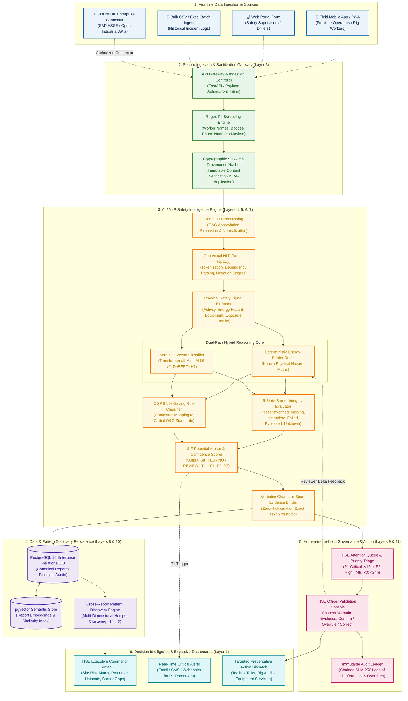
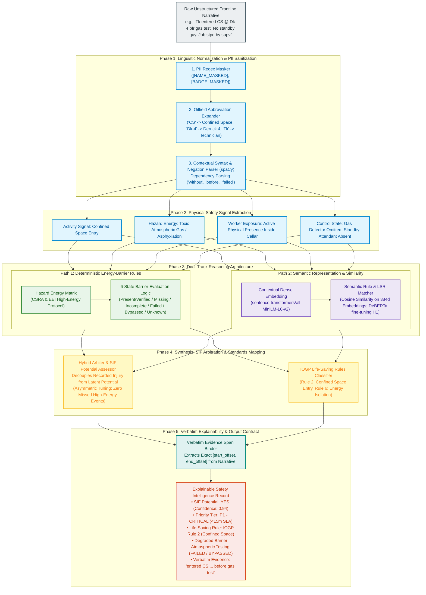
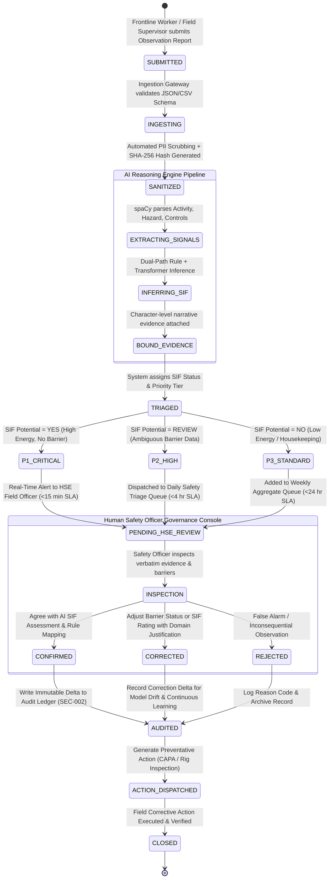
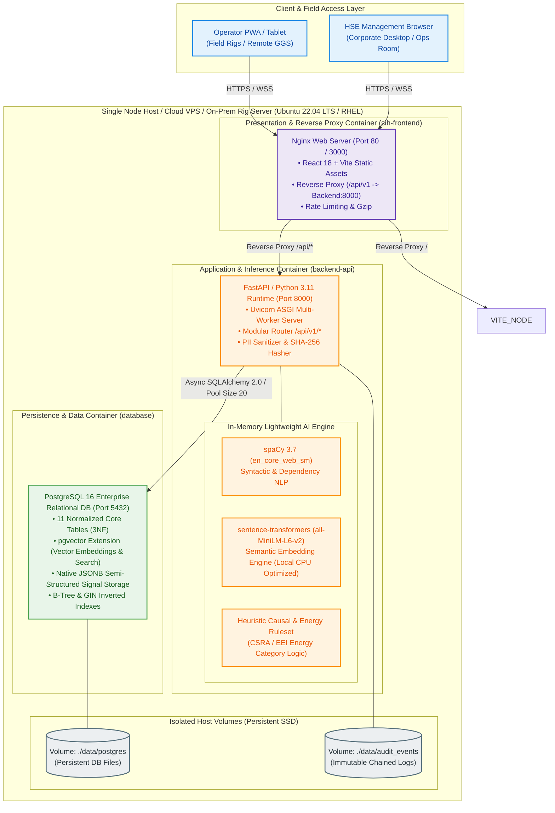
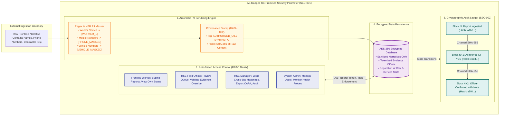

# End-to-End System & AI Architecture Diagrams (Mermaid)
**Project:** AI/NLP Engine to Detect Serious Injury & Fatality (SIF) Precursors  
**Problem Statement ID:** SIH26165 (Oil India Limited - OIL)  
**Team:** Tech Smashers  
**Target Usage:** SIH 2026 Presentation Slides (PowerPoint / Keynote), Technical Defense & Evaluation

---

## Quick Presentation Guide (How to use in PowerPoint)
1. **Option A (Instant High-Res Image for Slides):** Copy any diagram block below, paste it into [mermaid.live](https://mermaid.live), and click **Download PNG (High Res)** or **Download SVG**. Insert directly into your PowerPoint slide!
2. **Option B (Native PowerPoint Add-in):** If you use the *Mermaid Previewer* add-in or Office 365 Mermaid extension, you can paste the Mermaid code directly into PowerPoint.
3. **Option C (Markdown Presentation Tools):** If using Marp, Slidev, or Obsidian Slides, these diagrams render natively with full vector clarity.

---

## Slide Diagram Index
- **Diagram 1:** [Master End-to-End System & Dataflow Architecture](#diagram-1-master-end-to-end-system--dataflow-architecture)
- **Diagram 2:** [Deep-Dive AI/NLP Dual-Track Safety Intelligence Engine](#diagram-2-deep-dive-ainlp-dual-track-safety-intelligence-engine)
- **Diagram 3:** [Incident Report Lifecycle & Human-in-the-Loop (HIL) Governance](#diagram-3-incident-report-lifecycle--human-in-the-loop-hil-governance)
- **Diagram 4:** [Physical Deployment & Container Infrastructure Topology](#diagram-4-physical-deployment--container-infrastructure-topology)
- **Diagram 5:** [Zero-Trust Security, PII Masking & Audit Trail Boundary](#diagram-5-zero-trust-security-pii-masking--audit-trail-boundary)
- **Diagram 6:** [Cross-Report Precursor Pattern Clustering & Hotspot Synthesis](#diagram-6-cross-report-precursor-pattern-clustering--hotspot-synthesis)

---

### Diagram 1: Master End-to-End System & Dataflow Architecture
> **Slide Title:** End-to-End Platform Architecture: From Field Observation to Explainable SIF Prevention  
> **Key Message:** Demonstrates how raw, messy field prose transitions through sanitization, 11 logical processing layers, dual-path reasoning, and human verification into actionable frontline alerts.

---

### Diagram 2: Deep-Dive AI/NLP Dual-Track Safety Intelligence Engine
> **Slide Title:** Dual-Path AI Engine: Hybrid Deterministic & Semantic SIF Reasoning  
> **Key Message:** Solves the black-box AI problem. High-risk petroleum engineering decisions cannot rely on unexplainable neural networks alone; our dual-path architecture marries deterministic physics-based barrier rules with contextual deep NLP.

---

### Diagram 3: Incident Report Lifecycle & Human-in-the-Loop (HIL) Governance
> **Slide Title:** Report Lifecycle & Human-in-the-Loop Governance Workflow  
> **Key Message:** No AI recommendation is final without human oversight. This workflow demonstrates how reports move through triage, human verification, corrective action, and immutable audit logging.

---

### Diagram 4: Physical Deployment & Container Infrastructure Topology
> **Slide Title:** Production-Grade Deployment Architecture: 3-Container Containerized Topology  
> **Key Message:** Designed for zero-downtime, local air-gapped field capability, and seamless enterprise migration. One single command `docker compose up` spins up the entire isolated stack.

---

### Diagram 5: Zero-Trust Security, PII Masking & Audit Trail Boundary
> **Slide Title:** Defense-in-Depth Security & Data Sovereignty Architecture  
> **Key Message:** Guarantees 100% data sovereignty. All AI inference is performed locally on-premise without external public cloud leaks, protected by cryptographic audit chains and strict Role-Based Access Control (RBAC).

---

### Diagram 6: Cross-Report Precursor Pattern Clustering & Hotspot Synthesis
> **Slide Title:** Cross-Report Pattern Intelligence: Uncovering Latent Systemic Risk  
> **Key Message:** Single incident reporting misses the big picture. Our multi-dimensional clustering algorithm analyzes recurring precursor combinations across rigs and time windows to identify systemic organizational vulnerabilities before an incident occurs.

```mermaid
flowchart TD
    classDef input fill:#EFEBE9,stroke:#4E342E,stroke-width:2px,color:#3E2723;
    classDef cluster fill:#E1F5FE,stroke:#0277BD,stroke-width:2px,color:#01579B;
    classDef metric fill:#FFF3E0,stroke:#EF6C00,stroke-width:2px,color:#E65100;
    classDef action fill:#E8F5E9,stroke:#2E7D32,stroke-width:2px,color:#1B5E20;

    subgraph REPORT_STREAM ["Individual Analyzed Safety Reports (Last 90 Days)"]
        R1["Report #104: Rig-07 | Winch Cable Frayed | Mechanical Energy | Barrier: Failed Inspection"]:::input
        R2["Report #189: Rig-07 | Slings Overloaded | Heavy Lifting | Barrier: Incomplete Rigging Plan"]:::input
        R3["Report #245: Rig-07 | Dropped Object from Mast | Gravity Energy | Barrier: Missing Tether"]:::input
        RN["Reports #...: Other Facilities across OIL Operations"]:::input
    end

    subgraph MULTI_DIM_CLUSTER ["Multi-Dimensional Clustering Engine (Layer 8 - AI-007)"]
        direction TB
        TUPLE["4-Tuple Aggregator:\n⟨ Installation, Activity, Hazard Energy, Degraded Barrier ⟩"]:::cluster
        WINDOW["Sliding Temporal Window:\nRolling 90-Day Operational Time Horizon"]:::cluster
        THRESHOLD["Precursor Hotspot Threshold Gate:\nCluster Occurrence Count N >= 3 Reports"]:::cluster
        TUPLE --> WINDOW --> THRESHOLD
    end

    REPORT_STREAM --> TUPLE

    subgraph PATTERN_SYNTHESIS ["Precursor Pattern & Risk Metric Computation"]
        direction TB
        HOTSPOT["🔥 Identified Precursor Cluster:\n'Rig-07 Lifting & Mechanical Energy Barrier Degradation'"]:::metric
        METRICS["Cluster Risk Metrics:\n• Frequency: 3 Near-Misses in 42 Days\n• Latent Consequence: High Potential SIF (P1)\n• Common Root Barrier: Pre-Use Inspection Bypass"]:::metric
        HOTSPOT --> METRICS
    end

    THRESHOLD -->|Condition Met: N >= 3| HOTSPOT

    subgraph PREVENTATIVE_ACTIONS ["Automated Decision-Support Interventions (CAPA)"]
        direction TB
        ACT1["1. Immediate Action:\nDispatch Rig-07 Hoisting & Rigging Third-Party Safety Audit"]:::action
        ACT2["2. Targeted Engineering Control:\nMandate Digital Pre-Use Checklists for all Crane Winch Lines"]:::action
        ACT3["3. Workforce Intervention:\nStand-Down & Targeted Toolbox Talk on IOGP Life-Saving Rule #5"]:::action
        ACT1 --- ACT2 --- ACT3
    end

    METRICS --> PREVENTATIVE_ACTIONS
```

---

## PPT Presentation Alignment & Speaking Points

| Slide / Diagram | Primary Objective | Suggested Hackathon Jury Speaking Pitch |
|---|---|---|
| **Diagram 1: Master Architecture** | Establish technical depth and end-to-end viability. | *"Judges, our architecture covers the full journey: from field ingestion to real-time PII scrubbing, through an 11-layer intelligence engine, down to verifiable database persistence and executive alerting."* |
| **Diagram 2: Dual-Path AI Engine** | Prove explainability & safety rigor. | *"In high-risk oilfield operations, black-box deep learning is unacceptable. We use a dual-track engine: deterministic energy-barrier rules guarantee physical safety boundaries, while dense semantic models handle dirty frontline phrasing—grounded by verbatim text spans."* |
| **Diagram 3: Report Lifecycle & HIL** | Showcase ethical AI & governance. | *"We enforce strict Human-in-the-Loop governance: the AI is an assistive decision-support engine, not an autonomous field officer. High-consequence SIF cases are triaged to human experts under strict SLAs with an immutable audit trail."* |
| **Diagram 4: Deployment Topology** | Demonstrate feasibility & lightweight deployment. | *"The prototype runs completely containerized via Docker Compose. It is local, air-gapped, and runs on CPU without expensive cloud GPUs, making it 100% compliant with OIL's on-premises security policy."* |
| **Diagram 5: Security & Provenance** | Address data sovereignty & enterprise security. | *"We ensure zero data leakage. Automatic PII scrubbing strips personal identities at the gateway, cryptographic SHA-256 hashes link all inferences, and strict RBAC controls govern visibility."* |
| **Diagram 6: Cross-Report Patterns** | Highlight proactive prevention vs. reactive reporting. | *"We don't just classify single reports—our system clusters recurring failures across 4-tuple operational dimensions. When 3 or more near-misses hit the same barrier within 90 days, it automatically sounds the alarm to prevent a catastrophic blowout or fatality."* |

---
*Created by Team Tech Smashers for Smart India Hackathon (SIH 2026) | Problem Statement SIH26165 (Oil India Limited)*
